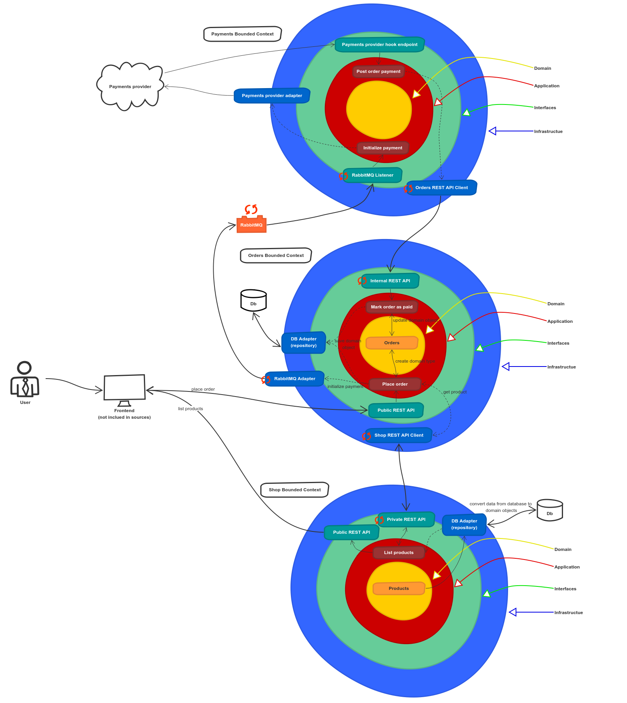
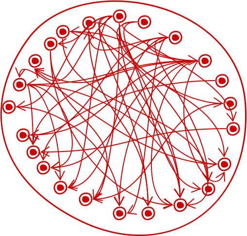
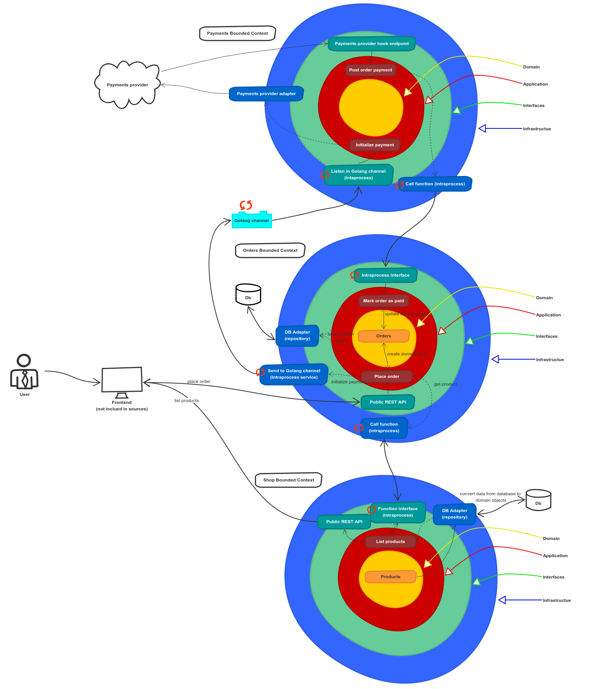
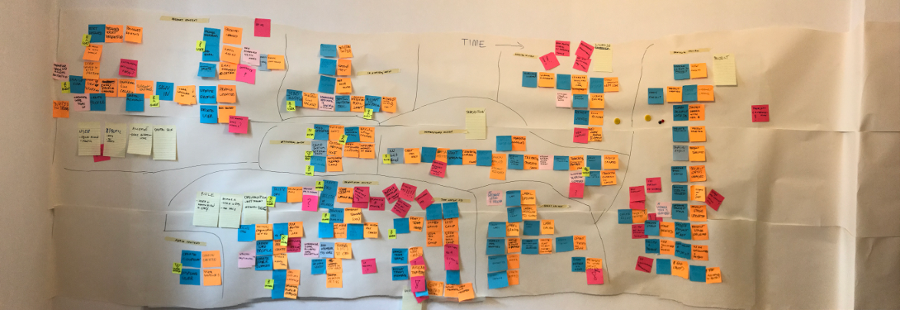

# Почему использование микросервисов или монолита может быть лишь незначительной деталью

Роберт Лащак. Главный инженер [Karhoo](https://www.karhoo.com/). Соучредитель
[Three Dots Labs](https://threedotslabs.com/). Создатель [Watermill](https://github.com/ThreeDotsLabs/watermill).

В настоящее время мы часто слышим, что монолитная архитектура устарела и 
является причиной всех бед в IT. Мы часто слышим, что микросервисная архитектура 
— это серебряная пуля, которая помогает убить все это монолитное зло. **Но вы, 
наверное, знаете, что в IT почти нет серебряных пуль и каждое решение влечет 
за собой компромиссы.**

Одним из наиболее популярных преимуществ микросервисной архитектуры является 
хорошее разделение на модули. Каждый сервис можно развернуть независимо, и их 
легче масштабировать. Кроме того, у каждой команда разработчиков может быть 
собственный репозиторий и использовать любую технологию на свой выбор. Мы можем 
легко переписать весь сервис очень быстро. Взамен мы получаем возможные 
проблемы с сетью, задержки, ограниченную пропускную способность. Вы должны 
уметь бороться с потенциальными ошибками на коммуникационном уровне.
Её гораздо сложнее отлаживать и поддерживать с точки зрения разработчика и 
DevOps. Мы должны поддерживать контракты API сервисов в актуальном состоянии и 
бороться с проблемами совместимости. Мы также не можем забывать о потенциальных 
недостатках производительности. Общая сложность больше во многих областях, 
начиная с разработки и заканчивая администрированием.

Таким образом, несмотря на все преимущества, построить **хорошую** архитектуру 
микросервисов сложно. Если вы не доверяете моему мнению, вы можете довериться
[этому парню](https://en.wikipedia.org/wiki/Martin_Fowler):

> Почти во всех случаях, когда я слышал о системе, созданной как 
> микросервисная система с нуля, она заканчивалась серьезными проблемами.
> 
> **Мартин Фаулер** [martinfowler.com](https://martinfowler.com/bliki/MonolithFirst.html)

> Почти все успешные истории микросервисов начинались с монолита, который стал 
> слишком большим и распался.
> 
> **Мартин Фаулер** [martinfowler.com](https://martinfowler.com/bliki/MonolithFirst.html)

Давайте рассмотрим бредовую идея, которая не будет следовать актуальным тенденциям — мы 
разрабатываем новое приложение и хотим начать с монолита. Значит ли это, что мы
должны смириться со всеми недостатками монолита?

Вовсе нет. Правда в том, что многие из этих проблем обычно возникают не из-за 
монолитной архитектуры, а из-за отсутствия хороших методик программирования и 
хорошей архитектуры.

Давайте посмотрим, как будет выглядеть пример хорошо спроектированного 
монолитного приложения по сравнению с версией, использующей микросервисную 
архитектуру.

В этой статье мы назовем его **Чистый Монолит**. Оба созданы, используя принципы 
чистой архитектуры.

## Чистая архитектура

В двух словах, чистая архитектура предполагает, что ваш сервис должен быть 
разделен на 4 слоя:

* Предметная область — логика нашей предметной области и сущности
* Приложение — своего рода клей для слоя предметной области. Например, получить 
  сущность из репозитория, вызвать какой-либо метод для этой сущности, сохранить 
  сущность в репозиторий. Кроме того, он должен взять на себя ответственность 
  за все операции, которые сложно выделать в отдельный модуль, такие как 
  логирование, транзакции, вспомогательный инструментарий и т. д. Он также 
  отвечает за выдачу представлений (моделей чтения).
* Интерфейсы — тонкий слой, который позволяет нам использовать приложение, например, 
  REST API, CLI интерфейс, очередь и т.д.
* инфраструктура — адаптеры базы данных, REST клиенты, в общем случае реализация 
  интерфейсов из слоя предметной области/приложения.


Основано на рисунке из "Чистой архитектуры"

> Чистая архитектура очень похожа на понятие Гексагональной архитектуры/Архитектуры
> Портов и адаптеров/Луковой архитектуры, о которой вы уже возможно слышали.

Ключевая концепция чистой архитектуры заключается в том, что ни один слой 
не может ничего знать о внешнем слое. Например, предметная область не должна 
знать о слое приложения или инфраструктуры (поэтому она не знает, например, 
что объекты предметной области сохраняются в MySQL). Кроме того, слой приложения 
не должен знать, как он вызывается (REST API, CLI, используя механизм очереди и т. д.).

Но как этого добиться? Ответ: инверсия управления. Короче говоря: спрячьте 
реализацию за интерфейсами.

Дядя Боб уже довольно хорошо это описал. Внизу статьи я предоставлю ссылку с 
полным объяснением Чистой Архитектуры.

## Что выбрать монолит или микросервис

В качестве примера рассмотрим простой магазин. Этот магазин позволит нам: 
просматривать список товаров, оформлять заказ, инициировать платеж в провайдере 
удаленных платежей, получать уведомления о платежах и помечать заказ как 
оплаченный. Давайте посмотрим на архитектурную схему.

Я создал диаграммы как для микросервисного, так и монолитного примера. Оба 
используют чистую архитектуру.



_Диаграмма микросервисной архитектуры_

Обычно диаграмма монолитной архитектуры выглядит как **большой запутанный клубок**:



_Большой запутанный клубок_

Но когда мы проектируем архитектуру, используя чистую архитектуру, она будет 
выглядеть так:



_Диаграмма монолитной архитектуры_

Вы видите отличия в этом примере? Если присмотреться, то можно увидеть, что 
они есть только в слоях интерфейсов/инфраструктуры. Слои предметной области 
и приложения в основном одинаковы (что ожидается, когда мы используем DDD).
Я отметил различия оранжевыми стрелками, чтобы они были более заметны ;)

В микросервисах можно избежать запутанности, потому что существует естественный
барьер между сервисами (например, из-за разделенных репозиториев), поэтому мы 
принудительно разделяем модули как этого требует проект. Но мы можем добиться 
некоторого разделения для монолитного приложения, и здесь очень помогает чистая 
архитектура, поскольку мы ограничены во взаимодействии и оно происходит через слои
инфраструктуры и интерфейсов. Например, нам не разрешено использовать что-либо 
из предметной области/приложения/инфраструктуры другого ограниченного контекста 
в нашем ограниченном контексте.

**Крайне важно не нарушить это правило. Лучший способ обеспечить его соблюдение — 
иметь инструмент, который может его проверить и подключить к CI.**

> Я разработал инструмент, который поможет в этом для Golang: [go-cleanarch](https://github.com/roblaszczak/go-cleanarch).
> 
> Когда-то я находил аналогичный инструмент для PHP, но не могу его найти 
> сейчас. Есть вероятность, что подобные инструменты существуют и для других 
> языков. Если вы знаете какой-либо подобный инструмент, пришлите его мне в 
> Twitter: [@roblaszczak](https://twitter.com/roblaszczak), и я добавлю его сюда :)

К сожалению, тот факт, что у нас есть модули, не означает, что наша архитектура 
хороша. Хорошее разделение модулей имеет решающее значение для правильной 
работы монолита и микросервисов. Чтобы сделать это хорошо, мы должны использовать
принцип **ограниченных контекстов (описан в конце статьи). Еще один отличный 
инструмент, который покажет (физически!), где находятся ваши ограниченные 
контексты, и покажет вам, как работает ваша предметная область, — это Event 
Storming.**



Проводим Event Storming в [Futuramo](https://futuramo.com/).

Многие люди утверждают, что хранилище — это просто [деталь реализации](https://8thlight.com/blog/uncle-bob/2012/08/13/the-clean-architecture.html)
(часть _фреймворков и драйверов_). Они также говорят, что слой хранилища должен 
быть реализован таким образом, чтобы можно было заменить драйвер без какого-либо
влияния на любой другой слой, кроме инфраструктуры.

**Давайте посмотрим на общую диаграмму и сделаем еще один шаг: скажем, что 
является ли приложение микросервисом или монолитом — это деталь реализации.**

Если это действительно так, мы можем начать разрабатывать наше приложение как
чистый монолит и когда наступит подходящий момент перенести его на микросервисы 
без особых усилий и не затрагивая другие уровни, кроме интерфейсов/инфраструктуры.
Аналогичным образом сначала реализуется драйвер базы данных в файловой системе или
памяти, чтобы отложить решение о выборе базы данных настолько долго, насколько 
это возможно.

Конечно, при переходе на микросервисы (или в обратном направлении, почему бы и 
нет?) все еще могут потребоваться некоторые оптимизации, но это будет довольно 
простая операция по сравнению с классическим рефакторингом монолита (или, что 
еще хуже, реализации всей системы с нуля).

Я хочу привести некоторые доказательства моей правоты. Вот несколько фрагментов 
исходного кода приложения, представленного на схеме.

## Покажите мне код, пожалуйста!

В этом примере используется простая последовательность действий, характерная для
интернет-магазина: размещение заказа, инициализация платежа и смоделированное 
получение асинхронного платежа.

Размещение заказа должно быть синхронным, инициализация и приём платежей — 
асинхронными.

## Размещение заказа

В слое интерфейсов ничего особенного. Просто анализируем HTTP-запрос и выполняем
команды на уровне приложения.

> В верхней части каждого фрагмента указано по какому пути расположен файл с ним в 
> репозитории.
> 
> Из него Вы можете узнать ограниченный контекст и слой. Например, 
> `pkg/orders/interfaces/public/http/something.go` находится в слое `interfaces` 
> и ограниченном контексте `orders`.

```go
func (o ordersResource) Post(w http.ResponseWriter, r *http.Request) {
    req := PostOrderRequest{}
    if err := render.Decode(r, &req); err != nil {
        _ = render.Render(w, r, common_http.ErrBadRequest(err))
        return
    }
  
    cmd := application.PlaceOrderCommand{
        OrderID:   orders.ID(uuid.NewV1().String()),
        ProductID: req.ProductID,
        Address:   application.PlaceOrderCommandAddress(req.Address),
    }
    if err := o.service.PlaceOrder(cmd); err != nil {
        _ = render.Render(w, r, common_http.ErrInternal(err))
        return
    }
  
    w.WriteHeader(http.StatusOK)
    render.JSON(w, r, PostOrdersResponse{
        OrderID: string(cmd.OrderID),
    })
}
```

> Для людей, не знакомых с Golang: в Go не нужно явно указывать, что вы 
> реализуете интерфейс. Вам просто нужно реализовать методы интерфейса.
> 
> Хорошим примером является интерфейс `io.Reader`.
> 
> ```go
> type Reader interface {
>     Read(p []byte) (n int, err error)
> }
> ```
> 
> например:
> 
> ```go
> // не нужно писать, что Foo реализует io.Reader
> type Foo struct {}
> 
> func (f Foo) Read(b []byte) (int, error) {
>     // ...
> }
> 
> func SomeFunc(r io.Reader) {
>     buf := make([]byte, 10)
>     // ...
>     
>     r.Read(buf)
> 
>     // ...
> }
> 
> // ...
> 
> SomeFunc(Foo{})
> ```

Более интересный код в сервисе приложения в `pkg/orders/application/orders.go`.
Прежде всего на интерфейсы сервиса товаров (чтобы получить данные товара из 
ограниченного контекста `Shop`) и сервис проведения оплат (для инициализации 
проведения оплаты в ограниченном контексте `Payments`):

```go
// pkg/orders/application/orders.go

type productService interface {
    ProductByID(id orders.ProductID) (orders.Product, error)
}

type paymentsService interface {
    InitializeOrderPayment(id orders.ID, price price.Price) error
}
```

И наконец сервис `Application`. Он одинаков для монолита и микросервисов. Мы 
просто внедряем в него различные реализации `productsService` и 
`paymentsService`.

Мы также используем здесь объекты предметной области и репозиторий, чтобы 
сохранять `Order` в базе данных (в нашем случае мы используем реализацию в памяти,
но это детали реализации и её можно заменить на любое хранилище).

```go
// pkg/orders/application/orders.go

type OrdersService struct {
    productService  productService
    paymentsService paymentsService
    
    ordersRepository orders.Repository
}

func (s OrdersService) PlaceOrder(cmd PlaceOrderCommand) error {
    address, err := orders.NewAddress(
        cmd.Address.Name,
        cmd.Address.Street,
        cmd.Address.City,
        cmd.Address.PostCode,
        cmd.Address.Country,
    )
    if err != nil {
        return errors.Wrap(err, "invalid address")
    }
    
    product, err := s.productService.ProductByID(cmd.ProductID)
    if err != nil {
        return errors.Wrap(err, "cannot get product")
    }
    
    newOrder, err := orders.NewOrder(cmd.OrderID, product, address)
    if err != nil {
        return errors.Wrap(err, "cannot create order")
    }
    
    if err := s.ordersRepository.Save(newOrder); err != nil {
        return errors.Wrap(err, "cannot save order")
    }
    
    if err := s.paymentsService.InitializeOrderPayment(newOrder.ID(), newOrder.Product().Price()); err != nil {
        return errors.Wrap(err, "cannot initialize payment")
    }
    
    log.Printf("order %s placed", cmd.OrderID)
    
    return nil
}
```

## Реализация `productsService`

### Микросервис
В микросервисной версии мы используем HTTP (REST) интерфейс, чтобы получить 
информацио о товаре. Я разделил REST API на приватный (внутренний) и публичный (например, 
доступен из фронтенда).

```go
import (
	// ...
	http_interface "github.com/MaksimDzhangirov/three-dots/code/monolith-microservice-shop/pkg/shop/interfaces/private/http"
	// ...
)

func (h HTTPClient) ProductByID(id orders.ProductID) (orders.Product, error) {
    resp, err := http.Get(fmt.Sprintf("%s/products/%s", h.address, id))
    if err != nil {
        return orders.Product{}, errors.Wrap(err, "request to shop failed")
    }

    // ...
    productView := http_interface.ProductView{}
    if err := json.Unmarshal(b, &productView); err != nil {
        return orders.Product{}, errors.Wrapf(err, "cannot decode response: %s", b)
    }

    return OrderProductFromHTTP(productView)
}
```

Конечная точка REST в ограниченном контексте Shop выглядит следующим образом:

```go
// pkg/shop/interfaces/private/http/products.go

type productsResource struct {
    repo products_domain.Repository
}

// ...

func (p productsResource) Get(w http.ResponseWriter, r *http.Request) {
    product, err := p.repo.ByID(products_domain.ID(chi.URLParam(r, "id")))

    if err != nil {
        _ = render.Render(w, r, common_http.ErrInternal(err))
        return
    }

    render.Respond(w, r, ProductView{
        string(product.ID()),
        product.Name(),
        product.Description(),
        priceViewFromPrice(product.Price()),
    })
}
```

У нас также существует простой тип, который используется в HTTP ответе. Теоретически 
мы можем сделать предметную область, сериализуемую в JSON, но если мы сделаем 
так, каждое изменение предметной области будет изменять наш контракт API, и каждый запрос 
на изменение контракта API будет менять предметную область. Звучит не очень 
хорошо и не имеет ничего общего с DDD и чистой архитектурой.

```go
// pkg/shop/interfaces/private/http/products.go

type ProductView struct {
    ID string `json:"id"`

    Name        string `json:"name"`
    Description string `json:"description"`

    Price PriceView `json:"price"`
}

type PriceView struct {
    Cents    uint   `json:"cents"`
    Currency string `json:"currency"`
}
```

Возможно вы заметили, что `ProductView` импортируется в 
`pkg/orders/infrastructure/shop/http.go` (смотри код выше), поскольку, как я 
говорил ранее, импортировать из интерфейсов в инфраструктуру между ограниченными
контекстами абсолютно нормально.

### Монолит
В монолитной версии всё очень просто: в ограниченном контексте `Order` мы просто 
вызываем функцию из ограниченного контекста `Shop` (`intraprocess.ProductInterface:ProductByID`) 
вместо вызова через REST API.

```go
// pkg/orders/infrastructure/shop/intraprocess.go

```

И в ограниченном контексте `Shop`:

```go
// pkg/shop/interfaces/private/intraprocess/products.go

```

Возможно вы заметили, что в ограниченном контексте `Order` мы не импортируем ничего
из ограниченного контекста `Shop` (как предполагает Чистая Архитектура).

Итак, нам нужен какой-то _транспортный тип_, который можно было бы импортировать
в ограниченный контекст `Shop`.

```go
type Product struct {
    ID          string
    Name        string
    Description string
    Price       price.Price
}
```

Этот фрагмент может выглядеть как избыточный и дублирующийся, но на практике он 
помогает сохранять неизменным контракт между ограниченными контекстами. Например,
мы можем полностью заменить слой приложения и предметной области, не затрагивая этот
типа. Вам нужно помнить, что **цена с помощью которой удастся избежать дублирования
будет расти по мере роста приложения.** Кроме того, дублирование данных — это 
не то же самое, что дублирование поведения.

Заметили некоторую аналогию с ProductView в микросервисной версии?

## Инициализируем проведение платежа

В предыдущем примере мы заменили вызов HTTP вызовом функции, который был 
синхронным. Но как быть с асинхронными операциями? По-разному. В Go их легко
реализовать благодаря concurrency примитивам. Если это сложно сделать на вашем 
языке, вы можете просто использовать Rabbit в монолите.

Как в предыдущем примере, обе версии выглядят одинаково в слоях приложения и 
предметной области.

```go
// pkg/orders/application/orders.go

type paymentsService interface {
    InitializeOrderPayment(id orders.ID, price price.Price) error
}

func (s OrdersService) PlaceOrder(cmd PlaceOrderCommand) error {
    // ...

    if err := s.paymentsService.InitializeOrderPayment(newOrder.ID(), newOrder.Product().Price()); err != nil {
        return errors.Wrap(err, "cannot initialize payment")
    }

    // ...
}
```

### Микросервисы

В микросервисах мы используем RabbitMQ, чтобы послать сообщение:

```go
// pkg/orders/infrastructure/payments/amqp.go

// ...

func (i AMQPService) InitializeOrderPayment(id orders.ID, price price.Price) error {
    order := payments_amqp_interface.OrderToProcessView{
        ID: string(id),
        Price: payments_amqp_interface.PriceView{
            Cents:    price.Cents(),
            Currency: price.Currency(),
        },
    }

    b, err := json.Marshal(order)
    if err != nil {
        return errors.Wrap(err, "cannot marshal order for amqp")
    }

    err = i.channel.Publish(
        "",
        i.queue.Name,
        false,
        false,
        amqp.Publishing{
            ContentType: "application/json",
            Body:        b,
        })
    if err != nil {
        return errors.Wrap(err, "cannot send order to amqp")
    }

    log.Printf("sent order %s to amqp", id)

    return nil
}
```

и получить сообщения

```go
// pkg/payments/interfaces/amqp/orders.go

type PaymentsInterface struct {
	conn    *amqp.Connection
	queue   amqp.Queue
	channel *amqp.Channel

	service application.PaymentsService
}

// ...

func (o PaymentsInterface) Run(ctx context.Context) error {
    // ...

    for {
        select {
        case msg := <-msgs:
            err := o.processMsg(msg)
            if err != nil {
                log.Printf("cannot process msg: %s, err: %s", msg.Body, err)
            }
        case <-done:
            return nil
        }
    }
}

func (o PaymentsInterface) processMsg(msg amqp.Delivery) error {
    orderView := OrderToProcessView{}
    err := json.Unmarshal(msg.Body, &orderView)
    if err != nil {
        log.Printf("cannot decode msg: %s, error: %s", string(msg.Body), err)
    }

    orderPrice, err := price.NewPrice(orderView.Price.Cents, orderView.Price.Currency)
    if err != nil {
        log.Printf("cannot decode price for msg %s: %s", string(msg.Body), err)
    }

    return o.service.InitializeOrderPayment(orderView.ID, orderPrice)
}

```

### Монолит

В монолитной версии очень просто отправить сообщение в канал

```go
// pkg/orders/infrastructure/payments/intraprocess.go

type IntraprocessService struct {
    orders chan<- intraprocess.OrderToProcess
}

func NewIntraprocessService(ordersChannel chan<- intraprocess.OrderToProcess) IntraprocessService {
    return IntraprocessService{ordersChannel}
}

func (i IntraprocessService) InitializeOrderPayment(id orders.ID, price price.Price) error {
    i.orders <- intraprocess.OrderToProcess{ID: string(id), Price: price}
    return nil
}
```

и принять (_я убрал только вспомогательный код закрытия канал, что не усложнять_):

```go
// pkg/payments/interfaces/intraprocess/orders.go

type PaymentsInterface struct {
    orders            <-chan OrderToProcess
    service           application.PaymentsService
    orderProcessingWg *sync.WaitGroup
    runEnded          chan struct{}
}

// ...

func (o PaymentsInterface) Run() {
    // ...
    for order := range o.orders {
        go func(orderToPay OrderToProcess) {
            // ...

            if err := o.service.InitializeOrderPayment(orderToPay.ID, orderToPay.Price); err != nil {
                log.Print("Cannot initialize payment:", err)
            }
        }(order)
    }
}
```

## И на последок...

Пометить заказ как оплаченный работает почти так же, как и размещение заказа 
(вызов REST API/функции). Если вам интересно, как это работает, пожалуйста, 
просмотрите весь исходный код.

Весь исходный код находится здесь: [https://github.com/ThreeDotsLabs/monolith-microservice-shop](https://github.com/ThreeDotsLabs/monolith-microservice-shop)

Я реализовал несколько приемочных тестов, которые проверят, что 
вся последовательность действий работает одинаково как для монолита, так и для 
микросервисов. Тесты можно найти в папке `tests/acceptance_test.go`.

Больше информации о том, как запустить проект и тесты можно найти в `README.md`.

Существует ещё кое-какой код, который здесь не рассматривается. Если вы хотите 
глубже понять этот код, подпишитесь на меня в [Твиттере (@roblaszczak)](https://twitter.com/roblaszczak) или 
подпишитесь на нашу рассылку — вы будете уведомлены, когда статья будет готова.
Вы изучите некоторые основные концепции Golang, если вы этого их не знаете. Я 
также сделаю этот код более близким для запуска на продакшене.

Мы также планируем написать несколько статей о DevOps (Packer, Terraform, 
Ansible).

## Заключение

А как насчет еще одного преимущества микросервисов? Это будет не так гибко, но 
вы все равно можете развернуть монолит независимо, хотя вы должны использовать 
другую последовательность действий. Например, вы можете использовать ветки с функционалом, где главная 
ветвь будет рабочей, а коммиты для невыпущенных изменений должны быть 
сливаться в эти ветки с функционалом. Эти ветки следует использовать в
стейдж среде. Действительно монолит сложнее масштабировать, потому что вы 
должны масштабировать все приложение, а не отдельный модуль. Но во многих 
случаях этого достаточно. В этом случае мы не можем назначить одну команду разработчиков
на репозиторий, но, к счастью, конфликтов будет мало, если модули хорошо разделены. 
Конфликты будут возникать только в слоях, отвечающих за связь между модулями, 
но такие же конфликты будут возникать в REST API/API, использующим сообщения. 
Однако в монолите будет проверка во время компиляции, в отличие от микросервисов, 
где вы должны проверять контракты, что требует дополнительной работы. Кроме того, 
с монолитом вы получите проверку путём компиляции общих типов. Быстрое переписывание 
модуля (микросервис в архитектуре микросервисов) — это вопрос хорошего разделения 
модулей — если модуль правильно разделен и спроектирован, вы можете заменить 
его, не касаясь ничего вне его.

> И я повторю еще раз: серебряной пули не существует. **Все зависит от проекта.**
> Но, наверное, в большинстве случаев для начала будет достаточно _Чистого 
> Монолита_. Если он будет хорошо спроектирован, решение о переходе на 
> микросервисную архитектуру не будет проблемой.
> 
> В некоторых случаях (например, в небольших проектах) писать весь этот 
> дополнительный код для интерфейсов/инфраструктурного уровня может быть 
> излишним. Но что такое небольшой проект? Смотря как посмотреть...

Планируйте, прежде чем приступить к реализации. Не бывает «отсутствия 
архитектуры», есть только хорошая архитектура и плохая архитектура. Event 
storming — хорошая идея, когда вы начинаете разрабатывать новый проект.

Если вы хотите получать уведомления о следующей статье, вы можете подписаться 
на нашу рассылку или подписаться на меня в Твиттере: @roblaszczak

Я знаю, что рассказал о различных методиках, большая часть которых может быть 
для вас чем-то новым. Хорошая новость заключается в том, что для создания 
хорошей архитектуры вам не нужно изучать все эти приемы одновременно.
Также трудно правильно понимать эти методы одновременно. Я бы порекомендовал 
начать с чистой архитектуры, затем уделить внимание некоторые основы CQRS, 
а затем уже можно применять DDD. В конце статьи я приведу несколько полезных 
ресурсов, которыми я пользовался, когда изучал эти методики.

Если у Вас есть такие-то вопросы, пожалуйста, напиши мне их в Twitter.

## Что ещё почитать?

### Чистая архитектура

Статьи Дяди Боба:

* [https://8thlight.com/blog/uncle-bob/2011/11/22/Clean-Architecture.html](https://8thlight.com/blog/uncle-bob/2011/11/22/Clean-Architecture.html)
* [https://8thlight.com/blog/uncle-bob/2012/08/13/the-clean-architecture.html](https://8thlight.com/blog/uncle-bob/2012/08/13/the-clean-architecture.html)

### Event Storming

* отличная электронная книга создателя этой методики, еще не законченная, но 
  написанного достаточно, чтобы понять эту методику и использовать ее на практике:
[https://leanpub.com/introducing_eventstorming](https://leanpub.com/introducing_eventstorming)

### Предметно-ориентированное проектирование

* хорошая лекция для понимания основ DDD, а также хорошая отправная точка для 
  людей нетехнических профессий: [https://www.amazon.com/Domain-Driven-Design-Distilled-Vaughn-Vernon/dp/0134434420](https://www.amazon.com/Domain-Driven-Design-Distilled-Vaughn-Vernon/dp/0134434420)

* если вы знаете теоретические основы предметно-ориентированного проектирования, вы 
  можете увидеть практические примеры того, как его реализовать: [https://www.amazon.com/Implementing-Domain-Driven-Design-Vaughn-Vernon/dp/0321834577](https://www.amazon.com/Implementing-Domain-Driven-Design-Vaughn-Vernon/dp/0321834577)

## Golang

* Go — очень простой язык, могу порекомендовать учить его на примерах: 
  [https://gobyexample.com/](https://gobyexample.com/). И поверьте мне или нет, 
  но одной ночи может быть достаточно, чтобы довольно хорошо понять Golang.
  
## И ещё несколько ссылок

* некоторые мысли о важной (и часто забываемой) части микросервисов (и монолита 
  тоже) — данных: [http://blog.christianposta.com/microservices/the-hardest-part-about-microservices-data/](http://blog.christianposta.com/microservices/the-hardest-part-about-microservices-data/)
  
* отличная статья, которая помогает понять, как DDD, чистая архитектура и CQRS 
  должны работать вместе: [https://herbertograca.com/2017/11/16/explicit-architecture-01-ddd-hexagonal-onion-clean-cqrs-how-i-put-it-all-together/](https://herbertograca.com/2017/11/16/explicit-architecture-01-ddd-hexagonal-onion-clean-cqrs-how-i-put-it-all-together/)
  
* Стефан Тилков аргументирует, почему мы не должны начинать с монолита, он 
  показывает, почему сильная связанность плоха, даже если мы хотим построить 
  монолит: [https://martinfowler.com/articles/dont-start-monolith.html](https://martinfowler.com/articles/dont-start-monolith.html)

Спасибо за вдохновение для этой статьи: [@unclebobmartin](https://twitter.com/unclebobmartin), 
[@vaughnvernon](https://twitter.com/vaughnvernon), [@martinfowler](https://twitter.com/martinfowler) 
и [@mariuszgil](https://twitter.com/mariuszgil).