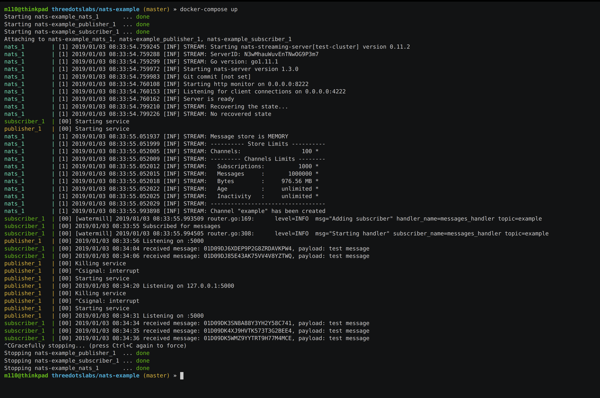

# Среда разработки Go в Docker с Go модулями и перезагрузкой кода в реальном времени

Милош Смолка. Технический руководитель [Karhoo](https://www.karhoo.com/). Соучредитель
[Three Dots Labs](https://threedotslabs.com/). Создатель [Watermill](https://github.com/ThreeDotsLabs/watermill).

Эта статья — краткое руководство по запуску нового проекта в Go. Особенности:

* перезагрузка кода налету
* запуск нескольких Docker контейнеров с помощью Docker Compose
* Использование Go модулей для управления зависимостями

Лучше всего показать вышеописанное в работе на примере проекта. Мы собираемся 
настроить две отдельных сервиса для обмена сообщениями через NATS. Первый будет 
получать сообщения на конечной точке HTTP, а затем публиковать их в разделе 
NATS. Другой подпишется на эту тему и выведет входящие сообщения на стандартный
вывод.


Довольно простая архитектура, верно? Чтобы примеры были короткими и для 
упрощения обработки сообщений, мы собираемся использовать [библиотеку Watermill](https://watermill.io/).

Я не буду рассматривать здесь весь код на Go, но вы можете клонировать
[репозиторий с примером](https://github.com/ThreeDotsLabs/nats-example).

## Требования

Вам понадобятся Go 1.11+, [Docker](https://www.docker.com/) и 
[Docker Compose](https://docs.docker.com/compose/), установленные на вашем
локальном компьютере.

## Go модули

Go модули были введены в Go 1.11 и являются (надеюсь) окончательным решением 
для управления зависимостями.

Я рекомендую хранить репозиторий вне GOPATH, если вы собираетесь их использовать.
Если вы все равно предпочитаете использовать GOPATH, убедитесь, что вы 
установили переменную GO111MODULE=on.

Давайте инициализируем модули для каждого из наших пакетов (внутри каталогов 
`subscriber` и `publisher`).

```shell
go mod init github.com/ThreeDotsLabs/nats-example/subscriber
go mod init github.com/ThreeDotsLabs/nats-example/publisher
```

Загрузим зависимости:

```shell
go get github.com/ThreeDotsLabs/watermill
go get github.com/nats-io/go-nats-streaming
```

Добавьте дополнительную библиотеку ULID только для `publisher`:

```shell
go get github.com/oklog/ulid
```

## Dockerfile

Следующий шаг — создание Docker образа для контейнеров, в которых будут запущены
оба приложения. Dockerfile достаточно прост:

```dockerfile
FROM golang:1.13.4-buster
RUN go get github.com/cespare/reflex
COPY reflex.conf /
ENTRYPOINT ["reflex", "-c", "/reflex.conf"]
```

Образ основан на официальном Go образе. Обычно вы предпочитаете версию alpine
из-за её маленького размера, но, поскольку в ней отсутствуют некоторые 
зависимости для компиляции рефлекса, здесь я использую более расширенную версию.

В ней устанавливается и запускается [reflex](https://github.com/cespare/reflex), который будет использоваться для 
горячей перекомпиляции кода. Это может быть очень полезно для быстрого тестирования
ваших изменений.

Reflex настраивается с помощью `reflex.conf`, который в нашем случае представляет 
собой всего одну строку:

```shell
-r '(\.go$|go\.mod)' -s go run .
```

Эта команда означает: отслеживай изменения в `go.mod` и всех файлах заканчивающихся 
на `.go` и запускай `go run .`, когда они происходят. Флаг `-s` сокращение от
`service` и заставляет reflex завершать ранее запущенную команду перед повторным
запуском, а это именно то, что нам нужно.

> Reflex - это не обычная зависимость. Она устанавливается и используется только в 
> docker образе и не будет развертываться вместе с вашим приложением. Спасибо
> пользователю [/u/habarnam](https://www.reddit.com/user/habarnam), за то, что
> указал на это.

## Docker Compose

Мы будем использовать Docker Compose для запуска нескольких сервисов в общей 
сети. Это позволяет вам запускать контейнеры с сервисами или базами данных, не 
захламляя локальный компьютер. Также другие разработчики могут настроить проект,
клонировав репозиторий и выполнив одну команду, вместо ручной установки 
зависимостей и компиляции приложения.

Добавьте файл `docker-compose.yml` в репозиторий:

```yml
version: '3'
services:
  publisher:
    build: .
    volumes:
      - ./publisher:/app
      - $GOPATH/pkg/mod/cache:/go/pkg/mod/cache
    working_dir: /app
    env_file:
      - .env
    ports:
      - 5000:5000

  subscriber:
    build: .
    volumes:
      - ./subscriber:/app
      - $GOPATH/pkg/mod/cache:/go/pkg/mod/cache
    working_dir: /app
    env_file:
      - .env

  nats:
    image: nats-streaming:0.11.2
    restart: on-failure
```

В нём определено три сервиса. И издатель, и подписчик используют Dockerfile, 
который мы создали ранее (это делается опцией build: .). Код каждого приложения 
монтируется в рабочий каталог, так что `go run .` запустит правильный пакет. 
`ports` в сервисе `publisher` свяжет порт 5000 в вашей локальной системе и 
сопоставит его с портом внутри контейнера.

Я также смонтировал каталог `$GOPATH/pkg/mod/cache`, чтобы использовать 
существующий кеш для зависимостей, ускоряя загрузку.

Сервисы настраиваются переменными среды, хранящимися в отдельном файле:

```
PORT=5000
NATS_TOPIC=example
NATS_CLUSTER_ID=test-cluster
NATS_URL=nats://nats:4222
```

Обратите внимание на имя хоста `nats` в переменной `NATS_URL` — это имя сервиса, 
определенного в файле `docker-compose.yml`.

## Запуск

Чтобы запустить окружение, выполните:

```shell
docker-compose up
```

Вы увидите вывод всех трёх сервисов. В другом терминале попробуйте отправить 
пример запроса в сервис издателя с помощью `curl`:

```shell
$ curl -X POST http://localhost:5000 --data "this is my message"
Sent message: this is my message with ID 01D09P02SBW5D0QPWP14QQZJWH
```

Вы должны увидеть доставленное сообщение в логах подписчика:

```shell
subscriber_1  | [00] 2019/01/03 11:01:27 received message: 01D09P02SBW5D0QPWP14QQZJWH, payload: this is my message
```

Теперь попробуйте отредактировать любой из файлов `main.go` в редакторе. После 
сохранения файла соответствующий сервис должен быть перекомпилирован и перезапущен.



Когда закончите, вы можете закрыть рабочую среду с помощью `Ctrl-C` в терминале, 
в котором он запущен. Вы также можете удалить все контейнеры, запустив 
`docker-compose down`.

## Что дальше?

Теперь, когда вы создали Docker-образы сервисов, это первый шаг к их 
развертыванию. Мы рассмотрим это в следующей статье.

Если вы хотите изучить различные примеры docker-compose файлов, 
их можно найти в разделе [Watermill Getting Started](https://watermill.io/docs/getting-started/) 
для Kafka и Google Cloud Pub/Sub.