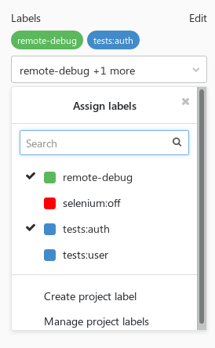
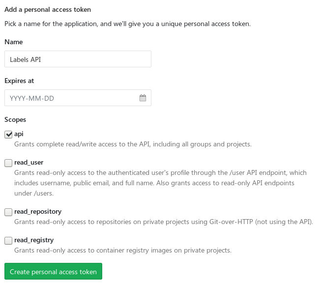
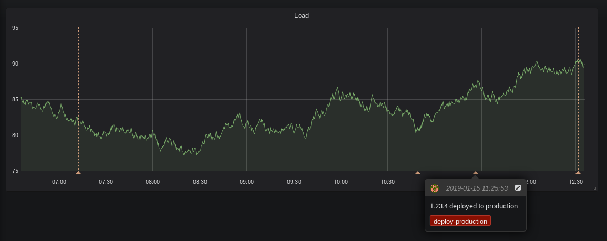
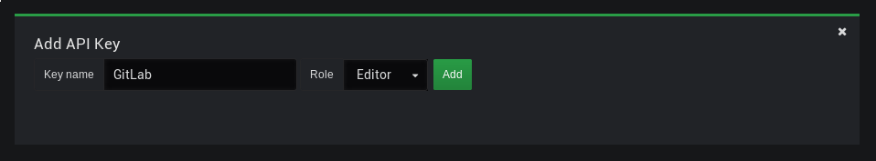

# Советы GitLab CI по созданию пользовательских рабочих процессов

Милош Смолка. Технический руководитель [Karhoo](https://www.karhoo.com/). Соучредитель
[Three Dots Labs](https://threedotslabs.com/). Создатель [Watermill](https://github.com/ThreeDotsLabs/watermill).

На этот раз я хотел бы затронуть несколько более сложных тем, связанных с 
GitLab CI. Рассматриваемой темой здесь является реализация различного пользовательского функционала в 
вашем конвейере. Опять же, большинство советов относятся только к GitLab, но 
некоторые из них можно легко применить и в других системах непрерывной 
интеграции.

## Запуск интеграционных тестов

Проверку вашего кода с помощью unit теста обычно можно легко встроить в любую 
CI систему. Часто это так же просто, как запустить одну команду, встроенную в
набор инструментов вашего языка. В этих тестах вы, скорее всего, будете 
использовать различные макеты и заглушки, чтобы скрыть детали реализации и 
сосредоточиться на тестировании конкретной логики. Например, вы можете 
использовать базу данных в памяти в качестве хранилища или написать 
HTTP-клиенты-заглушки, которые всегда возвращают некоторые заранее подготовленные 
полезные данные.

Однако в конечном итоге вам нужно будет запустить **интеграционные тесты**, 
чтобы охватить более необычные тестовые случаи. Я не хочу начинать здесь 
обсуждение всех возможных типов тестов, поэтому позвольте мне сказать 
следующее: под _интеграционными тестами_ я подразумеваю тесты, которые используют
какой-то внешний ресурс. Это может быть настоящий сервер базы данных, HTTP сервис, 
подключаемое хранилище и так далее.

GitLab упрощает запуск подключенных ресурсов в виде Docker контейнеров, 
связанных с контейнером, в котором выполняются ваши скрипты. Вы можете 
использовать ключевое слово [services](https://docs.gitlab.com/ee/ci/docker/using_docker_images.html#what-is-a-service) для определения этих зависимостей.
Они будут доступны по имени образа или выбранному вами имени, если вы укажете 
его в поле `alias`.

Это простой пример использования подключенного контейнера MySQL:

```yml
integration_tests:
  stage: tests
  services:
    - name: mysql:8
      alias: db
  script:
    - ./run_tests.sh db:3306
```

В этом случае вы должны подключиться к базе с помощью псевдонима `db` в своих тестовых 
сценариях. Использование псевдонима обычно является хорошей идеей, так как вы 
можете переключать образы без изменения тестового кода. Например, вы 
можете изменить образ `mysql` на `mariadb`, и скрипт все равно будет работать 
правильно.

> Ожидание контейнеров
> 
> Поскольку для запуска подключенных контейнеров может потребоваться некоторое 
> время, вам, вероятно, придется подождать, прежде чем отправлять какие-либо 
> запросы. Простой способ сделать это — использовать скрипт wait-for-it.sh с 
> заданным временем ожидания.

## Используем Docker Compose

Использование сервисов должно быть достаточно для большинства ваших случаев, с
которыми вы столкнётесь. Однако иногда вам нужны внешние сервисы для взаимодействия
друг с другом. Одним из примеров может быть запуск Kafka и ZooKeeper в двух 
отдельных контейнерах (таким образом строятся официальные образы). Другим примером
может быть запуск тестов с динамическим количеством узлов, например, Selenium.
Для запуска подобных сервисов лучшим решением является использование [Docker 
Compose](https://docs.docker.com/compose/).

```yml
version: '3'
services:
  zookeeper:
    image: confluentinc/cp-zookeeper
    environment:
      ZOOKEEPER_CLIENT_PORT: 2181

  kafka:
    image: confluentinc/cp-kafka
    environment:
      KAFKA_ZOOKEEPER_CONNECT: zookeeper:2181
      KAFKA_ADVERTISED_LISTENERS: PLAINTEXT://kafka:9092
    ports:
      - 9092:9092
```

Если вы запускаете свои собственные версии GitLab на доверенном сервере,
вы можете использовать [Shell executor](https://docs.gitlab.com/runner/executors/shell.html) для запуска Docker Compose.

Другим вариантом может быть использование [Docker в контейнере Docker](https://hub.docker.com/_/docker) (`dind`). 
Впрочем, [сначала прочитайте это](https://jpetazzo.github.io/2015/09/03/do-not-use-docker-in-docker-for-ci/).

Один из способов использования Compose — настроить среду, запустить тесты и 
уничтожить её. Простой bash-скрипт будет выглядеть так:

```shell
docker-compose up -d
./run_tests.sh localhost:9092
docker-compose down
```

Это решение подходит, если ваши тесты могут выполняться в минимальной среде.
Однако может случиться так, что вам потребуются некоторые установленные 
зависимости. Существует еще один способ запуска тестов в Docker Compose, 
который позволяет вам создать собственный образ Docker с тестовой средой. Один из
контейнеров может запускать тесты и завершаться с соответствующим кодом.

```yml
version: '3'
services:
  zookeeper:
    image: confluentinc/cp-zookeeper
    environment:
      ZOOKEEPER_CLIENT_PORT: 2181

  kafka:
    image: confluentinc/cp-kafka
    environment:
      KAFKA_ZOOKEEPER_CONNECT: zookeeper:2181
      KAFKA_ADVERTISED_LISTENERS: PLAINTEXT://kafka:9092

  tests:
    image: registry.example.com/some-image
    command: ./run_tests.sh kafka:9092
```

Обратите внимание, что мы избавились от сопоставления портов. В этом примере 
тесты могут напрямую взаимодействовать со всеми сервисами.

Тесты теперь можно запускать одной командой:

```shell
docker-compose up --exit-code-from tests
```

Ключ `--exit-code-from` подразумевает `--abort-on-container-exit`, что означает, что
вся среда, запущенная `docker-compose up`, будет остановлена после выхода одного 
из контейнеров. Код выхода этой команды будет равен коду выхода выбранного 
сервиса (`tests` в приведенном выше примере). Таким образом, если команда, 
выполняющая ваши тесты, завершается с ненулевым кодом, вся команда 
`docker-compose up` завершается с этим кодом.

## Использование меток в качестве CI тегов

Предупреждение: это довольно необычная идея, но я считаю её очень полезной и 
гибкой. Как вы, наверное, знаете, в GitLab существует функционал меток ([Labels](https://docs.gitlab.com/ee/user/project/labels.html)) на 
уровне проекта и группы. Метки могут быть прикреплены к проблемам и запросам на 
слияние. Однако они не имеют никакого отношения к конвейерам.



Приложив немного усилий, вы можете получить доступ к меткам мерж-реквестов в 
сценариях задач. Начиная с GitLab 11.6, это стало еще проще, так как есть 
переменная среды `CI_MERGE_REQUEST_IID` (да, `IID`, а не `ID`), доступная, если ваш
конвейер использует только: `merge_requests`.

> Если вы не используете `only: merge_requests` или используете более старую 
> версию GitLab, вы все равно можете получить MR с помощью вызова API.
> 
> ```shell
> curl "$CI_API_V4_URL/projects/$CI_PROJECT_ID/repository/commits/$CI_COMMIT_SHA/merge_requests?private_token=$GITLAB_TOKEN"
> ```
> 
> `iid` — поле, которое вам нужно. Просто имейте в виду, что это может вернуть 
> несколько MR для данного коммита.

Когда вы получите MR IID, вам останется только вызвать [API мерж-реквестов](https://docs.gitlab.com/ee/api/merge_requests.html) и 
использовать поле `labels` из ответа.

### Авторизация

К сожалению, использование $CI_JOB_TOKEN для доступа к API проекта [в настоящее 
время невозможно](https://gitlab.com/gitlab-org/gitlab-ce/issues/29566) (по 
крайней мере, если проект не является общедоступным). Если ваш проект имеет 
ограниченный доступ (внутренний или приватный), вам потребуется сгенерировать 
персональный токен API для авторизации с помощью GitLab API.



Однако это не самое безопасное решение, поэтому будьте осторожны. В случае 
утечки этого токена кто-то может получить доступ на запись ко всем вашим 
проектам. Одним из способов снижения риска является создание отдельной учетной 
записи с доступом только для чтения к хранилищу и создание персонального токена 
для этой учетной записи.

> ### Насколько безопасны ваши переменные?
> 
> В предыдущих версиях раздел «Переменные» назывался «Секретные переменные», и
> из названия может показаться, что они предназначены для безопасного хранения 
> учетных данных и конфиденциальных данных. На самом деле переменные просто 
> скрыты от пользователей, у которых нет прав Maintainer. Они не зашифрованы 
> на диске и могут легко оказаться в ваших скриптах как переменные окружения.

> Помните об этом при добавлении любых переменных и рассмотрите возможность 
> хранения ваших секретных данных в более безопасных решениях (например, в 
> [HashiCorp Vault](https://www.vaultproject.io/)).

### Случаи использования

Теперь вам решать, что делать со списком меток. Некоторые идеи:

* используйте их для разделения тестов.
* введите семантику ключ-значение с помощью двоеточия (например, метки вида
  `tests:auth`, `tests:user`)
* включение некоторых специальных функции для задач.
* разрешить отладку определенных задач при наличии метки.

## Вызов внешних API

Хотя GitLab поставляется с набором встроенных функций, весьма вероятно, что вы 
все еще используете другие инструменты, которые можно интегрировать с вашими 
конвейерами. Самый простой способ сделать это, конечно, с помощью старых добрых 
вызовов `curl`.

Если вы пишете свои собственные инструменты, вы также можете заставить их 
прослушивать [веб-хуки GitLab](https://docs.gitlab.com/ee/user/project/integrations/webhooks.html) 
(найдите вкладку **«Интеграции»** в настройках проекта). Однако, если вы будете 
использовать его с некоторыми критически важными системами, убедитесь, что они
доступны большую часть времени.

## Пример: аннотации Grafana

Если вы используете [Grafana](https://grafana.com/), [аннотации](http://docs.grafana.org/reference/annotations/) — это хороший способ отметить на 
графиках событие, которое произошло во времени. Хотя их можно добавить, 
щелкнув в графическом интерфейсе, их также можно добавить с помощью [Grafana 
REST API](http://docs.grafana.org/http_api/annotations/).



Вам нужно будет сгенерировать ключ API для доступа к API. Рассмотрите 
возможность создания отдельного пользователя с ограниченным доступом.



Задайте две переменные в настройках вашего проекта:

* `GRAFANA_URL` - URL вашего экземпляра Grafana (например, 
  `https://grafana.example.com`)
* `GRAFANA_APIKEY` - сгенерированный API ключ

Чтобы сохранить возможность повторного использования, вы можете поместить 
скрипт в [общий репозиторий скриптов](https://threedots.tech/post/keeping-common-scripts-in-gitlab-ci/):

```shell
#!/bin/bash
set -e

if [ $# -lt 2 ]; then
    echo "Usage: $0 <text> <tag>"
    exit 1
fi

readonly text="$1"
readonly tag="$2"
readonly time="$(date +%s)000"

cat >./payload.json <<EOF
{
    "text": "$text",
    "tags": ["$tag"],
    "time": $time,
    "timeEnd": $time
}
EOF

curl -X POST "$GRAFANA_URL/api/annotations" \
     -H "Authorization: Bearer $GRAFANA_APIKEY" \
     -H "content-type: application/json" \
     -d @./payload.json
```

Теперь вызовите его с соответствующими параметрами в определении CI:

```yml
deploy:
    stage: deploy
    script:
      - $SCRIPTS_DIR/deploy.sh production
      - $SCRIPTS_DIR/grafana-annotation.sh "$VERSION deployed to production" deploy-production
```

Вы также можете поместить его в скрипт `deploy.sh`, чтобы сделать определение CI 
еще проще.

## Бонусные советы

В GitLab есть [отличная документация](https://docs.gitlab.com/ee/ci/yaml) по всем возможным ключевым словам в 
определении CI. Я не хочу дублировать её здесь, но я хотел бы указать на 
несколько полезных вариантов использования. Нажмите на заголовки приведенные 
ниже, чтобы просмотреть документацию.

### [Расширенные возможности использования only/except](https://docs.gitlab.com/ee/ci/yaml/#only-and-except-simplified)

Используйте совпадение по шаблону для переменных, чтобы включить 
пользовательские сборки для некоторых ветвей. Не нужно злоупотреблять этим, но
если вам нужно быстро выкатить исправление, это может помочь.

```yml
only:
  refs:
    - branches
  variables:
    - $CI_COMMIT_REF_NAME =~ /^hotfix/
```

GitLab добавляет множество [предопределенных переменных](https://docs.gitlab.com/ee/ci/variables/#predefined-variables-environment-variables) в каждую CI задачу,
используйте их.

### [YAML привязки](https://docs.gitlab.com/ee/ci/yaml/#anchors)

Используйте их, чтобы избежать дублирования.

Начиная с версии 11.3 вы также можете использовать ключевое слово [extends](https://docs.gitlab.com/ee/ci/yaml/#extends).

```yml
.common_before_script: &common_before_script
  before_script:
    - ...
    - ...

deploy:
  <<: *common_before_script
```

### [Пропуск зависимостей](https://docs.gitlab.com/ee/ci/yaml/#dependencies)

По умолчанию все артефакты, созданные в конвейере, будут переданы всем 
последующим задачам. Вы можете сэкономить время и место на диске, явно 
перечислив артефакты, от которых зависят задачи:

```yml
dependencies:
  - build
```

В качестве альтернативы, пропустите их полностью, если они не требуются:

```yml
dependencies: []
```

### [Git-стратегия](https://docs.gitlab.com/ee/ci/yaml/#git-strategy)

Пропустите этап клонирования репозитория, если задача не будет использовать его
файлы.

```yml
variables:
  GIT_STRATEGY: none
```

## На этом всё!

Спасибо за чтение! Пишите мне отзывы или вопросы в [Twitter](https://twitter.com/m1_10sz) или [Reddit](https://www.reddit.com/user/mi_losz).

Чтобы узнать больше о GitLab, ознакомьтесь с моими предыдущими сообщениями:

* [Хранение общих скриптов в GitLab CI](https://threedots.tech/post/keeping-common-scripts-in-gitlab-ci/)
* [Автоматическое семантическое управление версиями в GitLab CI](https://threedots.tech/post/automatic-semantic-versioning-in-gitlab-ci/)