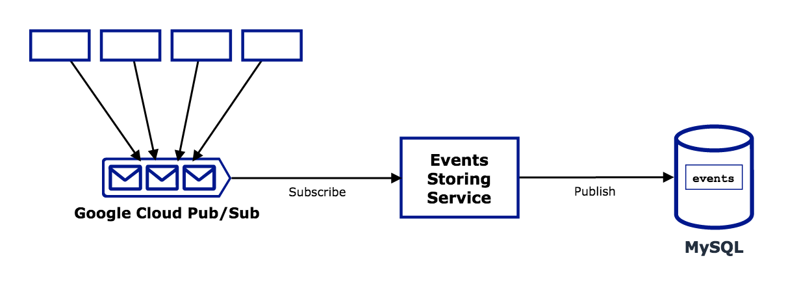
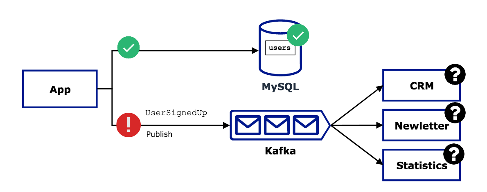
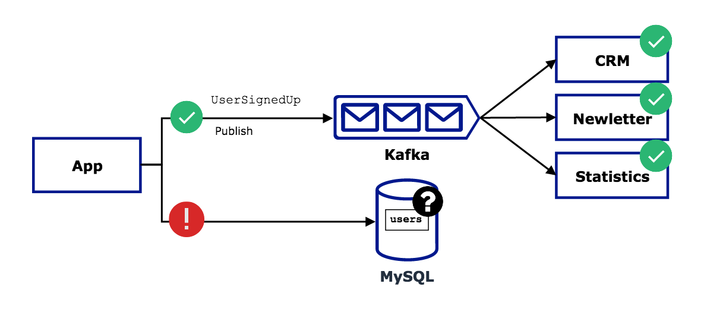
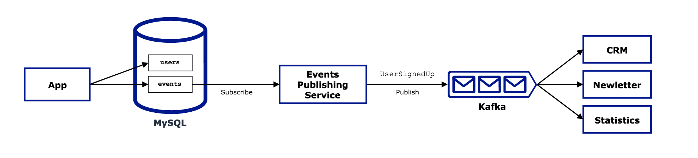
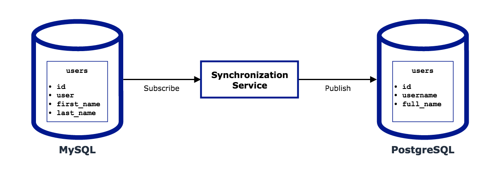

# Когда SQL база данных может использоваться как отличный шаблон издатель/подписчик

Милош Смолка. Технический руководитель [Karhoo](https://www.karhoo.com/). Соучредитель
[Three Dots Labs](https://threedotslabs.com/). Создатель [Watermill](https://github.com/ThreeDotsLabs/watermill).

Если сравнить MySQL или PostgreSQL с Kafka или RabbitMQ, сначала может 
показаться, что это совершенно разные программы. Обычно так и есть, поскольку 
вы будете использовать их для совсем других задач. Что у них общего, так это 
обработка потоков данных, и они специализируются на конкретных способах 
выполнения этой задачи.

Хотя Kafka и RabbitMQ являются популярными примерами шаблона издатель/подписчик (также
известными как очереди сообщений или платформы потоковой обработки), я также 
хотел бы поделиться некоторыми шаблонами использования баз данных SQL в качестве
издателя/подписчика. Но разве мы не должны выбрать правильный инструмент для 
работы? Верно. Однако базы данных SQL легко доступны, если у вас нет доступа к 
выделенной инфраструктуре обмена сообщениями. У них также есть некоторые 
уникальные функции, которые оказываются полезными при работе с приложениями, 
управляемыми сообщениями.

Я собираюсь показать три примера таких случаев с решениями на основе 
[библиотеки Watermill](https://github.com/ThreeDotsLabs/watermill) для Go, хотя 
шаблоны остаются одинаковыми независимо от языка. Но сначала зададимся 
принципиальным вопросом.

## Что такое шаблон издатель/подписчик

Если вы достаточно обобщаете, вы можете определить любой клиент издателя/подписчика
с помощью всего двух методов (как следует из названия): один для **издания** 
нового сообщения в разделе, а другой для **подписки** на сообщения из раздела.

```
Publish(topic, message)
Subscribe(topic) stream<message>
```

Так как же реализовать этот интерфейс для SQL базы данных? Самый простой 
способ — использовать операторы `INSERT` для издания и `SELECT` для 
извлечения сообщений. Более продвинутые шаблоны подписки можно реализовать с 
помощью таких механизмов, как `binlog` MySQL или команд `LISTEN` и `NOTIFY` 
PostgreSQL. Но для большинства случаев использования простого подхода должно 
быть достаточно.

## Использование Watermill

Приведенный выше псевдокод с двумя методами также является базовой идеей 
интерфейсов `Publisher` (издатель) и `Subscriber` (подписчик) Watermill.
Оказывается, за этой абстракцией можно скрыть довольно много сложностей.
Чтобы реализовать любой издателя/подписчика, все, что вам нужно сделать, это 
реализовать эти два метода. Одним из поддерживаемых издателей/подписчиков 
является [SQL издатель/подписчик](https://watermill.io/pubsubs/sql/).

Все приведенные ниже примеры включают небольшой фрагмент кода **обработчика** 
Watermill, который представляет собой функцию, получающую сообщение и 
возвращающую новые сообщения для публикации.

```go
func(msg *message.Message) ([]*message.Message, error)
```

Дополнительные сведения смотри в разделе [Getting started guide](https://watermill.io/docs/getting-started/).

## Пример 1: Хранение журнала событий

Очереди сообщений предлагают различный функционал в зависимости от способа их 
создания. Вот почему нет универсального варианта.

Одной из таких функций является постоянное хранилище. Например, Apache Kafka 
поддерживает хранение сообщений в разделах столько времени, сколько вам нужно.
Другие, такие как Google Cloud Pub/Sub*,* рассматривают сообщения как 
эфемерные и удаляют их после того, как они использованы или через 
несколько дней без подтверждения.

Вам не всегда нужно хранить сообщения, но это полезно при работе с 
[событиями предметной области](https://martinfowler.com/eaaDev/DomainEvent.html). Это позволяет снова обрабатывать события из 
прошлого, что-то вроде «возврата назад во времени» (подход похожий на 
генерацию событий, хотя и значительно упрощенный).

Если вы хотите менять свое текущее программное обеспечение для обмена 
сообщениями, но вам нужно постоянное хранилище для событий, SQL база данных 
может быть правильным выбором.



## Реализация

[Обработчик Watermill](https://watermill.io/docs/messages-router/#handler) для этого 
шаблона самый простой. Он работает как прозрачный прокси, перемещая сообщения 
из одной системы в другую. Компонент [Router](https://watermill.io/docs/messages-router) 
выполняет всю работу в фоновом режиме. Все, что вам нужно сделать, это определить 
подписчика, издателя и соответствующие разделы.

```go
router.AddHandler(
    "googlecloud-to-mysql", // уникальное название обработчика
    googleCloudTopic,       // раздел подписчика
    googleCloudSubscriber,  // подписчик
    mysqlTable,             // раздел издателя
    mysqlPublisher,         // издатель
    func(msg *message.Message) ([]*message.Message, error) {
        return []*message.Message{msg}, nil
    },
)
```

Смотри весь исходный код: [пример хранения журнала событий](https://github.com/ThreeDotsLabs/watermill/tree/master/_examples/real-world-examples/persistent-event-log).

## Пример 2: Транзакционные события

Рассмотрим регистрацию пользователя, классический задачу в каждом веб-приложении.
Требования понятны. Вам нужно хранить информацию о пользователе в SQL таблице 
и публиковать событие `UserSignedUp`, чтобы другие службы в вашей системе 
использовали его и выполняли какие-либо действия (например, отправляли 
письмо, обновляли статистический отчет, заполняли личные 
данные в CRM).

Проблема в том, что вы не можете одновременно выполнять SQL операторы и 
публиковать события. У вас есть два варианта:

* **Сначала сохранить пользователя, а затем опубликовать событие** - если публикация 
  не удалась, таблица SQL актуальна, но остальная часть системы не согласована с 
  ней. Пользователь может войти в систему, но не получает рассылку, ежемесячный 
  статистический отчет неверен, а ваш отдел продаж не знает, кому звонить. Другие 
  команды, зависящие от события, никогда его не получат.
  


* **Сначала опубликовать событие, а затем сохранить пользователя** - если сохранить 
  пользователя не удалось, система согласована, но SQL таблица содержит устаревшую
  информацию. Пользователь не может войти в систему, но получает рассылку. Ваши
  отчёты показывают, что пользователей существует больше, чем использует ваш
  продукт, а ваш отдел продаж донимает разочарованного пользователя звонками. 
  Будем надеяться, что ваша кнопка «отписаться» все еще работает.
  


Вы можете придумать сложные решения этой проблемы, такие как двухэтапные 
коммиты или периодическая синхронизация всех систем. Существует также более 
простой шаблон с использованием базы данных SQL.

Идея состоит в том, чтобы вставлять событие в отдельную таблицу, а не 
публиковать его напрямую. Важная часть заключается в том, что это осуществляется
в той же транзакции, что и сохранение пользователя. Это гарантирует, что 
сохраняются оба или ни один из них. В фоновом режиме отдельный процесс 
_подписывается_ на таблицу с событиями и _публикует_ все входящие строки в какую-то 
очередь сообщений.



> Следует иметь в виду, что согласованности по событиям должно быть достаточно
> в вашей системе. Возможно, фоновый процесс по какой-то причине перестает 
> работать и когда-то в будущем опубликует события. Но если вы уже работаете с
> событиями, надеюсь, вы это учли.

## Реализация

При использовании Watermill функция обработчика очень похожа на предыдущий 
пример. В конце концов, это тот же прокси событий, но на этот раз точкой 
входа является база данных.

```go
router.AddHandler(
    "mysql-to-kafka",
    mysqlTable,
    mysqlSubscriber,
    kafkaTopic,
    kafkaPublisher,
    func(msg *message.Message) ([]*message.Message, error) {
        return []*message.Message{msg}, nil
    },
)
```

Смотри весь исходный код: [пример транзакционных событий](https://github.com/ThreeDotsLabs/watermill/tree/master/_examples/real-world-examples/transactional-events).

## Пример 3: Синхронизация баз данных

Синхронизация двух баз данных не является новой проблемой. Так репликация уже
работает десятилетиями. Она использует низкоуровневые механизмы (например, 
двоичный журнал) но идея очень близка к шаблону издатель/подписчик: одна база 
данных публикует изменения, а другая подписывается на них.

Немного более сложной задачей является перемещение данных между двумя 
различными базами данных, каждый из которых имеет свою схему таблиц. Если 
репликация использует интерфейс, аналогичный издателю/подписчику, можем ли мы 
использовать те же принципы для миграции?

Давайте рассмотрим миграцию MySQL таблицы на PostgreSQL. Это будет выглядеть 
примерно так:

1. Приложение вставляет новую строку в MySQL таблицу.
2. Сервис синхронизации получает это в виде обновления (поскольку он **подписался** на эту таблицу).
3. Сервис **преобразует** строку в формат конечной таблицы (только если схемы различаются, поэтому этот шаг необязателен).
4. Сервис вставляет новую строку в таблицу PostgreSQL (**публикует**).

> Самое сложное в реализации этого обработчика — убедиться, что мы соблюдаем 
> правильный порядок событий, не пропускаем ни одной строки и не дублируем их. 
> Первые два решает за вас Watermill из коробки, но вам нужно позаботиться об отсутствии 
> дупликации событий самостоятельно. Простой подход — убедиться, что ваши 
> обработчики событий являются идемпотентными.



## Реализация

Если схемы таблиц в обеих БД одинаковые, обработчик может быть таким же 
коротким, как и в первых двух случаях. В этом примере мы имеем дело с 
отдельными таблицами, поэтому нам также необходимо реализовать часть 
преобразования.

Прежде всего нужно переименовать столбец `user` в `username`. Во-вторых, объединить 
столбцы `first_name` и `last_name` в `full_name`.

Как видите, для кодирования и декодирования данных используется библиотека [gob](https://golang.org/pkg/encoding/gob/),
но вы можете использовать все, что захотите, если происходит сериализация в 
срез байтов.

> По умолчанию подписчик SQL использует все существующие записи в таблице и 
> прослушивает любые новые входящие строки. Таким образом, вы можете начать с 
> переноса текущих данных, а затем поддерживать работу сервиса, чтобы обе 
> базы данных были в актуальном состоянии. Синхронизация будет работать до тех 
> пор, пока ваши таблицы доступны только для добавления — подробности смотри в 
> разделе Ограничения ниже.

```go
type mysqlUser struct {
    ID        int
    User      string
    FirstName string
    LastName  string
    CreatedAt time.Time
}
    
type postgresUser struct {
    ID        int
    Username  string
    FullName  string
    CreatedAt time.Time
}

router.AddHandler(
    "mysql-to-postgres",
    mysqlTable,
    mysqlSubscriber,
    postgresTable,
    postgresPublisher,
    func(msg *message.Message) ([]*message.Message, error) {
        // Декодируем строку поступающую из MySQL таблицы
        decoder := gob.NewDecoder(bytes.NewBuffer(msg.Payload))
        originUser := mysqlUser{}
        err := decoder.Decode(&originUser)
        if err != nil {
            return nil, err
        }

        // Преобразование MySQL схемы в PostgreSQL схему
        newUser := postgresUser{
            ID:        originUser.ID,
            Username:  originUser.User,
            FullName:  fmt.Sprintf("%s %s", originUser.FirstName, originUser.LastName),
            CreatedAt: originUser.CreatedAt,
        }

        // Кодируем строку, чтобы сохранить в PostgreSQL таблице
        var payload bytes.Buffer
        encoder := gob.NewEncoder(&payload)
        err = encoder.Encode(newUser)
        if err != nil {
            return nil, err
        }

        newMessage := message.NewMessage(watermill.NewULID(), payload.Bytes())

        return []*message.Message{newMessage}, nil
    },
)
```

Этот пример достаточно сложен, чтобы ввести новый [Schema Adapter](https://github.com/ThreeDotsLabs/watermill-sql/blob/master/pkg/sql/schema_adapter_mysql.go#L11).
Обратитесь к полному исходному коду, чтобы увидеть реализацию: [пример 
синхронизации баз данных](https://github.com/ThreeDotsLabs/watermill/tree/master/_examples/real-world-examples/synchronizing-databases).

## Ограничения

Хотя вы можете реализовать все вышеперечисленные шаблоны с помощью SQL 
издателя/подписчика от Watermill, у него есть некоторые ограничения.

В настоящее время только оператор INSERT инициирует отправку новых сообщений 
подписчику. Хорошей новостью является запланированная поддержка подписчиков 
[MySQL binlog](https://github.com/ThreeDotsLabs/watermill/issues/5) и 
[PostgreSQL LISTEN/NOTIFY](https://github.com/ThreeDotsLabs/watermill/issues/126), которые 
также позволяют прослушивать обновления и удаления.

SQL издатель/подписчик также менее эффективен по сравнению с другими. Текущий 
подписчик MySQL может обрабатывать около 150 сообщений в секунду. Это почти 
13 миллионов сообщений в день, так что существует вероятность, что этого более 
чем достаточно для ваших нужд.

Обновление: На [Hacker News](https://news.ycombinator.com/item?id=21834152) есть 
интересное обсуждение использования баз данных в качестве издателя/подписчика
и связанных с этим тем.