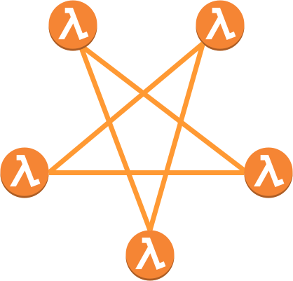
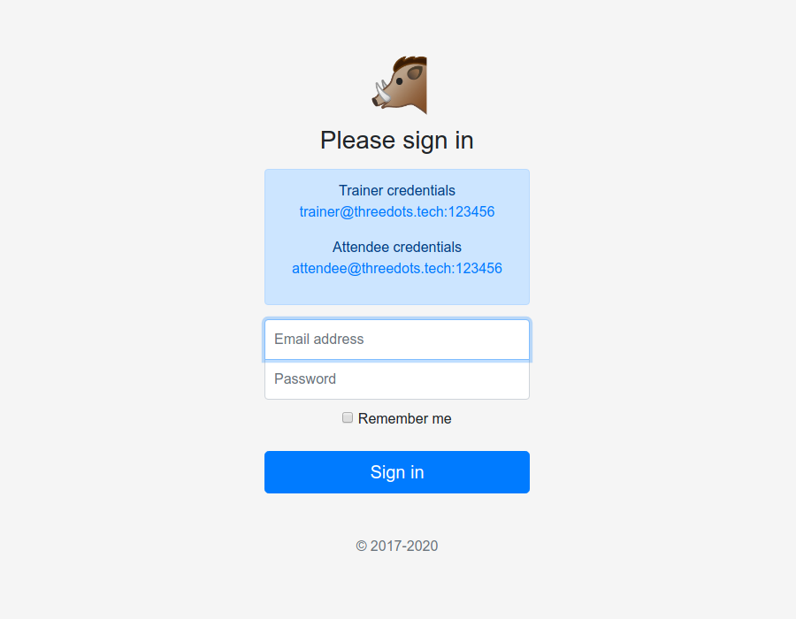
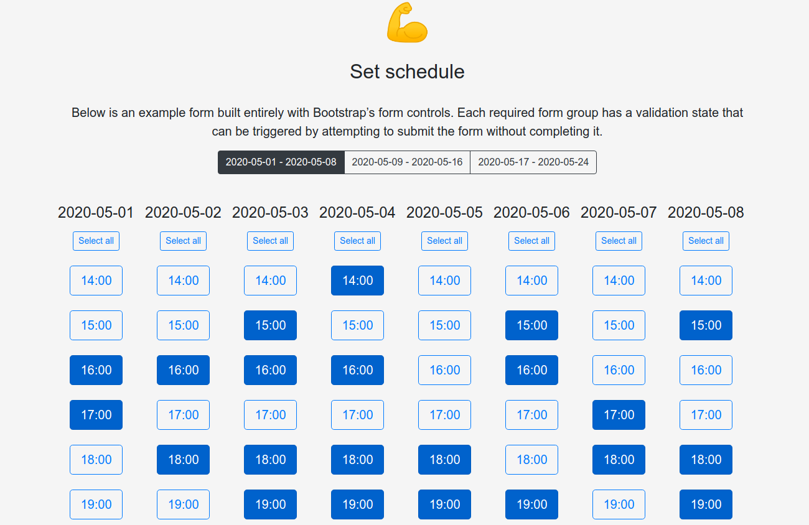
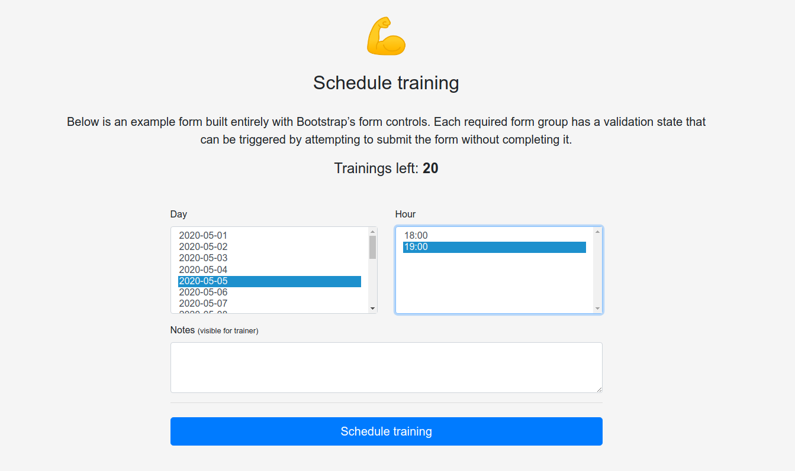
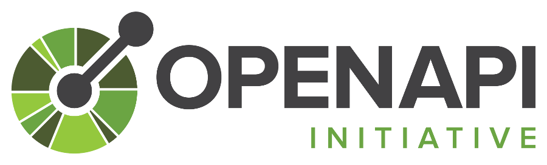
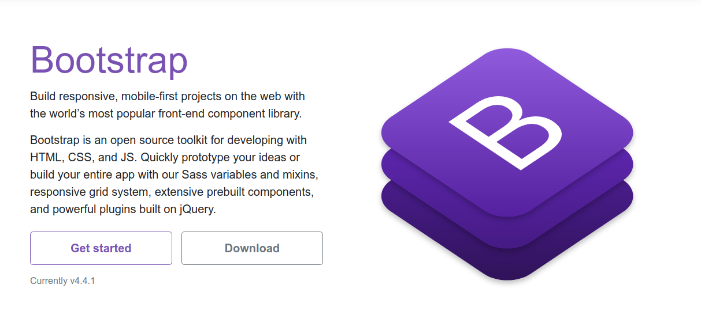
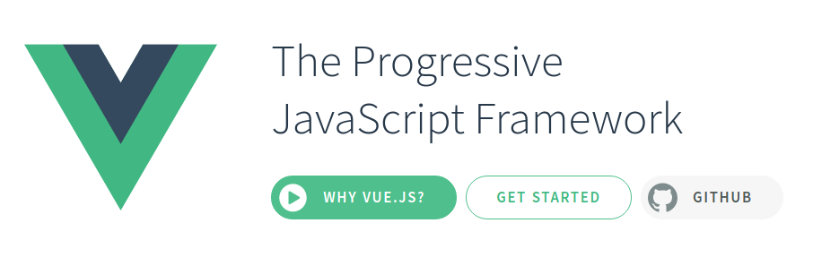
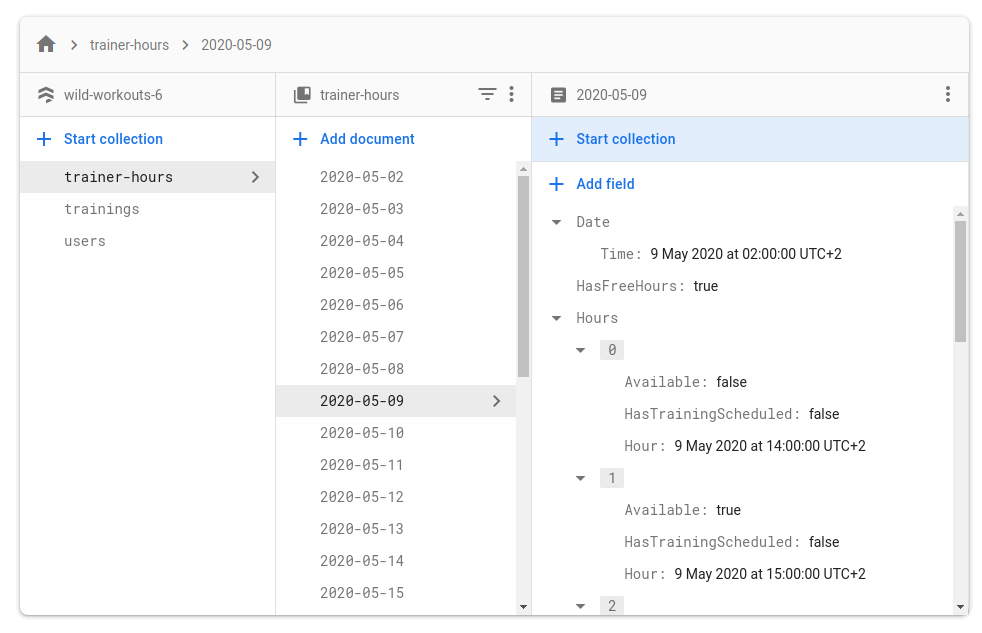

# Слишком современное приложение на Go? Создание бессерверного приложения с помощью Google Cloud Run и Firebase

Роберт Лащак. Главный инженер [Karhoo](https://www.karhoo.com/). Соучредитель
[Three Dots Labs](https://threedotslabs.com/). Создатель [Watermill](https://github.com/ThreeDotsLabs/watermill).

Добро пожаловать в первую статью из цикла о том, как создавать бизнес-приложения
на Go! В этом цикле статей мы хотим показать вам, как создавать приложения, 
которые легко разрабатывать, поддерживать и приятно работать в долгосрочной 
перспективе.

Идея этого цикла статей состоит в том, чтобы не уделять слишком много внимания 
инфраструктуре и деталям реализации. Но нам нужна некая база, используя которую 
мы сможем развивать проект позднее. В этой статье мы начнем с рассмотрения 
некоторых основных инструментов Google Cloud, которые могут помочь нам в этом.

> Это не просто очередная статья со случайными фрагментами кода.
> 
> Этот пост является частью большого цикла, показывающий как создавать приложения на
> **Go, которые легко разрабатывать, поддерживать и с ними интересно работать в 
> долгосрочной перспективе**. Мы делаем это, делясь проверенными методами, основанными 
> на многих экспериментах, проведёнными с возглавляемыми нами с командами, 
> и [научных исследованиях](https://threedots.tech/post/ddd-lite-in-go-introduction/#thats-great-but-do-you-have-any-evidence-it-works).
> 
> Вы можете изучить эти методы, создав с нами [полнофункциональный](https://threedots.tech/post/serverless-cloud-run-firebase-modern-go-application/#what-wild-workouts-can-do) пример 
> веб-приложения на Go - **Wild Workouts**.
> 
> Мы поступили не совсем обычно — **добавили некоторые не сразу заметные проблемы
> в первоначальную реализацию Wild Workouts**. Неужели мы сошли с ума? Пока нет. 😉
> Эти проблемы характерны для многих проектов Go. **В долгосрочной перспективе эти 
> небольшие проблемы становятся критичными и не позволяют добавлять новые функционал.**
> 
> **Это один из важнейших навыков старшего или ведущего разработчика; всегда нужно 
> помнить о долгосрочных последствиях.**
> 
> Мы исправим их путем **рефакторинга** Wild Workouts. Таким образом, вы быстро поймёте 
> методики, которыми мы делимся.
> 
> Знаете ли вы это чувство, когда прочитали статью о какой-то методике и попытались 
> реализовать её, но не смогли из-за упущений и пропуска деталей в руководстве. 
> Пропуск деталей делает статьи короче и увеличивает просмотры страниц, но это
> не наша цель. Наша цель - создать материал, который даст достаточно знаний для 
> применения представленных методик. Если вы еще не читали [предыдущие статьи из 
> этого цикла](https://threedots.tech/series/modern-business-software-in-go/), 
> мы настоятельно рекомендуем это сделать.
> 
> Мы считаем, что в некоторых областях знаний нельзя пропускать детали. Если вы
> хотите быстро и эффективно создавать сложные приложения, вам нужно потратить 
> некоторое время, чтобы узнать как это сделать. Если бы всё было так просто,
> у нас бы не было такого большого количества устрашающего устаревшего кода.
> 
> Вот [полный список из 14 опубликованных на данный момент статей](https://threedots.tech/series/modern-business-software-in-go/).
> 
> Весь код Wild Workouts доступен на [GitHub](https://github.com/ThreeDotsLabs/wild-workouts-go-ddd-example). Не забудьте поставить звезду 
> нашему проекту! ⭐

Почему бессерверное?

Для запуска Kubernetes кластера требуется серьезная поддержка со стороны "DevOps
команд". Давайте опустим тот факт, что DevOps - это пока не должность. 


DevOps - это **культура и образ мышления**.
Слайд из ["Гордиев узел"](https://www.youtube.com/watch?v=hNZZZyNrpiI) - выступления Альберто Брандолини

Небольшие приложения, которые можно легко запустить на одной виртуальной машине, 
теперь развертываются на сверхсложных кластерах Kubernetes. Все эти кластеры 
требуют серьезного обслуживания.

С другой стороны, перенос приложений в контейнеры дал нам большую гибкость в их 
создании и развертывании. Это позволило нам быстро разворачивать сотни микросервисов 
с большой автономией. Но цена за это высока.

Разве не было бы замечательно, если бы существовало какое-либо решение, которым 
бы можно было полностью управлять? 🤔

Возможно, ваша компания уже использует управляемый кластер Kubernetes. Если да, 
то вы, вероятно, уже знаете, что даже ваш управляемый кластер по-прежнему 
требует постоянной поддержки DevOps.

Может использовать бессерверное приложение? Что ж, разделение большого 
приложения на несколько независимых лямбда-сервисов (облачных функций) - 
отличный способ к неустранимому катаклизму.


Вам, вероятно, следует переосмыслить свою архитектуру, если ее можно использовать для призыва демонов.

Но разве это единственный способ создания бессерверных приложений? Нет!

## Google Cloud Run

Идея Google Cloud Run довольно проста — вы **просто предоставляете Docker контейнер, а 
Google Cloud его запускает**. Внутри этого контейнера может работать ваше 
приложение, написанное на любом языке с открытым портом к HTTP или gRPC API.

Вы не ограничены синхронной обработкой — вы можете обрабатывать сообщения, 
используя шаблон издатель/подписчик внутри этого контейнера.

**И это все, что вам нужно с точки зрения инфраструктуры. Google Cloud творит 
всю магию.** В зависимости от трафика контейнер будет автоматически масштабироваться.
Похоже на идеальное решение?

На практике не всё так просто. Существует множество статей, показывающих как 
использовать Google Cloud Run, но в них обычно рассказывают о **небольших элементах, 
которые можно использовать для создания приложения.**

**Трудно объединить все эти элементы из разных мест, чтобы создать полностью 
рабочий проект** (не в первый раз с этим сталкиваюсь).

В большинстве случаев в этих статьях не упоминается проблема о жесткой привязки к
поставщику услуг. Способ развертывания должен быть просто деталью реализации. Я 
уже затронул эту тему в статье ["_Почему использование микросервисов или монолита 
может быть лишь незначительной деталью?_"](https://threedots.tech/post/microservices-or-monolith-its-detail/) в 2018 году.

Но самое главное — использование всех новейших и самых последних технологий не 
означает, что ваше приложение не станет устаревшим, которое все ненавидят, через
3 месяца.

**Бессерверная версия решает только инфраструктурные задачи. Это не мешает 
создать приложение, которое сложно поддерживать.** У меня даже сложилось впечатление, 
что все наоборот — все эти причудливые приложения рано или поздно становится 
всё труднее всего поддерживать.

**Для этого цикла статей мы создали полнофункциональное реальное приложение. Вы 
можете развернуть это приложение с помощью одной команды в Google Cloud с помощью 
Terraform. Вы можете запустить локальную версию с помощью одной команды 
docker-compose.**

Ещё кое-что мы сделали не так как обычно. **Мы добавили некоторые не сразу 
заметные проблемы, которые, по нашим наблюдениям, часто встречаются в проектах 
на Go.** В долгосрочной перспективе эти небольшие проблемы становятся критичными 
и не позволяют добавлять новые функционал.

Неужели мы сошли с ума? Пока нет. 😉 **Такой подход поможет вам понять как решить 
такие проблемы и какие методики для этого использовать.** Это также своего рода 
вызов для практик, которые мы используем. Если что-то не является проблемой, 
почему мы должны использовать какие-либо методики для ее решения?

## План

В следующих нескольких статьях мы рассмотрим все темы, связанные с запуском 
приложения в Google Cloud. В эту часть мы не добавляли каких-либо проблем или
недопустимых практик. 😉 **Первые статьи могут показаться немного простыми, если 
у вас уже есть некоторый опыт в Go. Мы хотим быть уверены, что если вы только 
начинаете работать с Go, то поймёте более сложные теми, которые мы будем 
рассматривать позднее.**

Затем мы проведём рефакторинг частей приложения, связанных с бизнес-логикой. **Эта
часть цикла будет намного сложнее.**

## Запускаем проект локально

Возможность запускать проект локально имеет **решающее значение для эффективной 
разработки**. Когда вы не можете проверить сделанные изменения простым и быстрым 
способом, это очень раздражает.

Гораздо сложнее добиться этого для проектов, построенных на сотнях микросервисов.
К счастью, в нашем проекте всего 5 сервисов. 😉 **В Wild Workouts мы создали Docker Compose
с перезагрузкой кода в реальном времени как для фронтенда, так и для бекенда.**
Для фронтенда мы используем контейнер с инструментарием `vue-cli-service serve`.
Для бэкенда ситуация немного сложнее. Во всех контейнерах мы запускаем `reflex`.
`reflex` отслеживает любые изменения кода, которые вызывают перекомпиляцию 
сервиса. Если вас интересуют подробности, вы можете прочитать о них в нашем блоге,
пост [_Локальная среда для dev разработки на Go в Docker, используя Go модули и
перезагрузку кода в реальном времени_](https://threedots.tech/post/go-docker-dev-environment-with-go-modules-and-live-code-reloading).

## Требования

Единственные требования, необходимые для запуска проекта, - это [Docker](https://www.docker.com/)
и [Docker Compose](https://docs.docker.com/compose/).

## Запуск

```shell
git clone https://github.com/ThreeDotsLabs/wild-workouts-go-ddd-example.git && cd wild-workouts-go-ddd-example
```

и выполняем в терминале:

```shell
docker-compose up
```

После загрузки всех JS и Go зависимостей, вы должны увидеть сообщение с адресом,
по которому расположено фронтенд-приложение:

```shell
web_1             | $ vue-cli-service serve
web_1             |  INFO  Starting development server...
web_1             |  DONE  Compiled successfully in 6315ms11:18:26 AM
web_1             |
web_1             |
web_1             |   App running at:
web_1             |   - Local:   http://localhost:8080/
web_1             |
web_1             |   It seems you are running Vue CLI inside a container.
web_1             |   Access the dev server via http://localhost:<your container's external mapped port>/
web_1             |
web_1             |   Note that the development build is not optimized.
web_1             |   To create a production build, run yarn build.
```

Поздравляем! Ваша локальная версия приложения Wild Workouts доступна по адресу 
[http://localhost:8080/](http://localhost:8080/).

Существует также версия, доступная в Интернете, по адресу 
[https://threedotslabs-wildworkouts.web.app](https://threedotslabs-wildworkouts.web.app/).

## Что можно сделать с помощью Wild Workouts?

Вы часто встречали код, приводимый в обучающих статьях, который не работал на 
самом деле? Часто ли методики из этих обучающих пособий не работали в реальных 
проектах? Наверное, слишком часто. 😉 **Реальная жизнь не так проста, как в 
обучающих пособиях.**

Чтобы избежать этой проблемы, мы создали приложение Wild Workouts как 
полнофункциональный проект. Гораздо сложнее что-то упустить или пропустить 
какой-то важный момент, когда приложение должно быть полностью работоспособным.
Это приводит к увеличению объёма материала статьи, но мы ничего не упускаем. **Если
вы не захотите потратить достаточно времени в начале, то вам потребуется гораздо 
больше времени позднее, во время реализации. Или, что ещё хуже, вы будете в спешке 
решать проблемы с приложением, уже запушенным в продакшен среде.**

## Проще говоря

**Wild Workouts** - это приложение для персональных тренеров и посетителей 
тренажерного зала.



Тренеры выбирают время, когда они доступны для обучения.



Посетители могут запланировать обучение на указанную дату и время.



Другими функциями нашего приложения являются:

* управление "кредитами" (сколько тренировок может запланировать посетитель).
* отмена
    * если тренировка отменена меньше чем за 24 часа до её начала, то посетителю 
      не возвращаются кредиты.
* перенос тренировок
    * если кто-то хочет перенести тренировку меньше чем за 24 часа до её начала, то
    это должно быть одобрено вторым участником (тренером или посетителем).
* просмотр календаря.

Звучит просто. Что может пойти не так? 🤔

## Фронтенд

_Если вас не интересует фронтенд часть, можете сразу перейти в раздел Бекенд._

Я скорее бэкэнд-инженер и, честно говоря, не лучший специалист по JavaScript и 
фронтенду. 😉 **Но нельзя создать полноценное веб-приложение без фронтенда!**

В этом цикле статей мы сосредоточимся на бэкэнд-части. Я в общем рассмотрю технологии,
которые использовал во фронтенде. Вы не узнаете ничего нового, если имеете базовые 
знания о фронтенд-разработке. Для получения дополнительной информации, рекомендую
просмотреть исходный код в [папке web/](https://github.com/ThreeDotsLabs/wild-workouts-go-ddd-example/tree/a0a41253db96d46d75e7ff4c7e7f95848f47dcc3/web).

Если вы хотите узнать больше о том, как создавался фронтенд, сообщите нам об 
этом в комментариях!

## OpenAPI (Swagger) клиент

Никто не любит обновлять API-контракты вручную. Постоянно обновлять несколько
больших JSON-файлов раздражает и непродуктивно. OpenAPI решает эту проблему с 
помощью JavaScript HTTP-клиента и HTTP-сервера на Go, созданного на основе 
предоставленной [спецификации](https://github.com/ThreeDotsLabs/wild-workouts-go-ddd-example/tree/a0a41253db96d46d75e7ff4c7e7f95848f47dcc3/api/openapi). Мы подробно рассмотрим этот вопрос в разделе 
Backend.



## Bootstrap

Вы наверное уже знакомы с Bootstrap, лучшим другом любого бекенд-инженера, как я. 😉
Работа с HTML и CSS - это часть фронтенд-разработки, которая мне больше всего не 
нравится. Bootstrap предоставил мне почти все строительные блоки, необходимые 
для создания HTML приложения.



## Vue.js

Просмотрев пару самых популярных фронтенд фреймворков, я решил использовать 
Vue.js. Мне очень понравилась простота этого решения.



Я начинал свой путь в качестве fullstack-разработчика еще до появления jQuery.
Инструменты фронтенд-разработки добились огромного прогресса..., но я пока останусь 
бекенд-разработчиком.😉

## Бекенд

Бекенд Wild Workouts состоит из 3 сервисов.
* `trainer` - предоставляет [публичные HTTP](https://github.com/ThreeDotsLabs/wild-workouts-go-ddd-example/blob/a0a41253db96d46d75e7ff4c7e7f95848f47dcc3/internal/trainer/http.go) и [недоступные посторонним gRPC](https://github.com/ThreeDotsLabs/wild-workouts-go-ddd-example/blob/a0a41253db96d46d75e7ff4c7e7f95848f47dcc3/internal/trainer/grpc.go) конечные 
  точки для управления расписанием тренера.
* `trainings` - предоставляет [публичные HTTP](https://github.com/ThreeDotsLabs/wild-workouts-go-ddd-example/blob/a0a41253db96d46d75e7ff4c7e7f95848f47dcc3/internal/trainings/http.go) конечные точки для управления тренировками 
  посетителя.
* `users` - предоставляет [публичные HTTP](https://github.com/ThreeDotsLabs/wild-workouts-go-ddd-example/blob/a0a41253db96d46d75e7ff4c7e7f95848f47dcc3/internal/users/http.go) и [недоступные посторонним gRPC](https://github.com/ThreeDotsLabs/wild-workouts-go-ddd-example/blob/a0a41253db96d46d75e7ff4c7e7f95848f47dcc3/internal/users/grpc.go) конечные
  точки для управления кредитами и данными пользователя.
  
Если сервис предоставляет 2 типа API интерфейсов, каждый из них находится в отдельном 
процессе.

## Публичное HTTP API

Большинство операций, выполняемых приложениями, запускаются публичным HTTP API.
Я много раз слышал вопрос от новичков в Go, какой фреймворк им следует использовать 
для создания HTTP сервисов. **Я всегда не рекомендую использовать в Go какие-либо 
HTTP-фреймворки. Простого роутера вроде [chi](https://github.com/go-chi/chi) более чем достаточно.**
`chi` позволяет легковесно связать URL и методы, поддерживаемые нашим API. Под капотом 
он использует HTTP-пакет стандартной библиотеки Go, поэтому все связанные с этим 
пакетом инструменты, например middleware, совместимы на 100%.

Может быть немного странно не использовать фреймворк, если вы работали с любым 
другим языком, где Spring, Symfony, Django или Express могут быть очевидным выбором.
Для меня это тоже было странно. Использование любого фреймворка в Go добавляет 
ненужной сложности и свяжет ваш проект с этим фреймворком. Используйте [KISS принцип
проектирования](https://en.wikipedia.org/wiki/KISS_principle). 😉

Все три сервиса одинаково используют HTTP сервер. Поэтому не стоит копировать 
код запуска сервера 3 раза.

```go
func RunHTTPServer(createHandler func(router chi.Router) http.Handler) {
    apiRouter := chi.NewRouter()
    setMiddlewares(apiRouter)
  
    rootRouter := chi.NewRouter()
    // мы монтируем все API по пути /api
    rootRouter.Mount("/api", createHandler(apiRouter))
  
    logrus.Info("Starting HTTP server")
  
    http.ListenAndServe(":"+os.Getenv("PORT"), rootRouter)
}
```
Весь исходный код: [github.com/ThreeDotsLabs/wild-workouts-go-ddd-example/internal/common/server/http.go](https://github.com/ThreeDotsLabs/wild-workouts-go-ddd-example/blob/a0a41253db96d46d75e7ff4c7e7f95848f47dcc3/internal/common/server/http.go#L20)

`chi` предоставляет набор полезных встроенных HTTP middleware, но мы не 
ограничены только ими. Будут работать все middleware, совместимые со стандартной
библиотекой.

> Короче говоря, middleware позволяет нам делать что угодно до и после выполнения 
> запроса (предоставляя доступ к `http.Request`). Использование HTTP middleware 
> дает нам большую гибкость при создании нашего собственного HTTP-сервера. Мы 
> создаём наш сервер из нескольких отдельных компонентов, которые вы можете 
> настроить для своих целей.

```go
func setMiddlewares(router *chi.Mux) {
    router.Use(middleware.RequestID)
    router.Use(middleware.RealIP)
    router.Use(logs.NewStructuredLogger(logrus.StandardLogger()))
    router.Use(middleware.Recoverer)
  
    addCorsMiddleware(router)
    addAuthMiddleware(router)
  
    router.Use(
        middleware.SetHeader("X-Content-Type-Options", "nosniff"),
        middleware.SetHeader("X-Frame-Options", "deny"),
    )
  
    router.Use(middleware.NoCache)
}
```
Весь исходный код: [github.com/ThreeDotsLabs/wild-workouts-go-ddd-example/internal/common/server/http.go](https://github.com/ThreeDotsLabs/wild-workouts-go-ddd-example/blob/a0a41253db96d46d75e7ff4c7e7f95848f47dcc3/internal/common/server/http.go#L33)

Наш фреймворк почти готов :) Пришло время его использовать. Мы можем вызвать
`server.RunHTTPServer` в сервисе `trainings`.

```go
package main
// ...
func main() {
    // ...
    server.RunHTTPServer(func(router chi.Router) http.Handler {
        return HandlerFromMux(HttpServer{firebaseDB, trainerClient, usersClient}, router)
    })
}
```
Весь исходный код: [github.com/ThreeDotsLabs/wild-workouts-go-ddd-example/internal/trainings/main.go](https://github.com/ThreeDotsLabs/wild-workouts-go-ddd-example/blob/a0a41253db96d46d75e7ff4c7e7f95848f47dcc3/internal/trainings/main.go#L38)

`createHandler` должен возвращать `http.Handler`. В нашем случае его возвращает
`HandlerFromMux`, генерируемый [oapi-codegen](https://github.com/deepmap/oapi-codegen).

Он выдаёт нам все пути и параметры запроса из OpenAPI спецификаций.

```go
// HandlerFromMux создает http.Handler с маршрутизацией, соответствующей спецификации OpenAPI, на основе предоставленного мультиплексора.
func HandlerFromMux(si ServerInterface, r chi.Router) http.Handler {
	return HandlerWithOptions(si, ChiServerOptions{
		BaseRouter: r,
	})
}
```
Весь исходный код: [https://github.com/ThreeDotsLabs/wild-workouts-go-ddd-example/blob/a0a41253db96d46d75e7ff4c7e7f95848f47dcc3/internal/trainings/openapi_api.gen.go](https://github.com/ThreeDotsLabs/wild-workouts-go-ddd-example/blob/a0a41253db96d46d75e7ff4c7e7f95848f47dcc3/internal/trainings/openapi_api.gen.go#L153)

```yaml
# ...
paths:
  /trainings:
    get:
      operationId: getTrainings
      responses:
        '200':
          description: todo
          content:
            application/json:
              schema:
                $ref: '#/components/schemas/Trainings'
        default:
          description: unexpected error
          content:
            application/json:
              schema:
                $ref: '#/components/schemas/Error'

# ...
```
Весь исходный код: [github.com/ThreeDotsLabs/wild-workouts-go-ddd-example/api/openapi/trainings.yml](https://github.com/ThreeDotsLabs/wild-workouts-go-ddd-example/blob/a0a41253db96d46d75e7ff4c7e7f95848f47dcc3/api/openapi/trainings.yml#L16)

Если вы хотите внести какие-либо изменения в OpenAPI спецификацию, вам 
необходимо повторно сгенерировать сервер Go и JavaScript клиенты после этого. 
Запустите:

```shell
make openapi
```

Часть сгенерированного кода — это `ServerInterface`. Он содержит все методы, 
которые должны поддерживаться API. Работа сервера осуществляется путем реализации 
этого интерфейса.

```go
type ServerInterface interface {
  
    // (GET /trainings)
    GetTrainings(w http.ResponseWriter, r *http.Request)
  
    // (POST /trainings)
    CreateTraining(w http.ResponseWriter, r *http.Request)
  
    // ...
}
```
Весь исходный код: [github.com/ThreeDotsLabs/wild-workouts-go-ddd-example/internal/trainings/openapi_api.gen.go](https://github.com/ThreeDotsLabs/wild-workouts-go-ddd-example/blob/a0a41253db96d46d75e7ff4c7e7f95848f47dcc3/internal/trainings/openapi_api.gen.go#L14)

Здесь показан пример как реализован `trainings.HttpServer`:

```go
package main

import (
    "net/http"
    
    "github.com/go-chi/render"
    "github.com/MaksimDzhangirov/three-dots/internal/common/auth"
    "github.com/MaksimDzhangirov/three-dots/internal/common/genproto/trainer"
    "github.com/MaksimDzhangirov/three-dots/internal/common/genproto/users"
    "github.com/MaksimDzhangirov/three-dots/internal/common/server/httperr"
)

type HttpServer struct {
    db            db
    trainerClient trainer.TrainerServiceClient
    usersClient   users.UsersServiceClient
}

func (h HttpServer) GetTrainings(w http.ResponseWriter, r *http.Request) {
    user, err := auth.UserFromCtx(r.Context())
    if err != nil {
        httperr.Unauthorised("no-user-found", err, w, r)
        return
    }
  
    trainings, err := h.db.GetTrainings(r.Context(), user)
    if err != nil {
        httperr.InternalError("cannot-get-trainings", err, w, r)
        return
    }
  
    trainingsResp := Trainings{trainings}
  
    render.Respond(w, r, trainingsResp)
}

// ...
```
Весь исходный код:[github.com/ThreeDotsLabs/wild-workouts-go-ddd-example/internal/trainings/http.go](https://github.com/ThreeDotsLabs/wild-workouts-go-ddd-example/blob/a0a41253db96d46d75e7ff4c7e7f95848f47dcc3/internal/trainings/http.go#L1)

Но HTTP пути — не единственное, что генерируется OpenAPI спецификацией. Что ещё более важно,
она также предоставляет нам модели для ответов и запросов. В большинстве 
случаев модели намного сложнее, чем API пути и методы. Их создание может 
сэкономить время, время и избавить от проблем при любых изменениях API 
контракта.

```yaml
# ...
  schemas:
    Training:
      type: object
      required: [uuid, user, userUuid, notes, time, canBeCancelled, moveRequiresAccept]
      properties:
        uuid:
          type: string
          format: uuid
        user:
          type: string
          example: Mariusz Pudzianowski
        userUuid:
          type: string
          format: uuid
        notes:
          type: string
          example: "let's do a leg day!"
        time:
          type: string
          format: date-time
        canBeCancelled:
          type: boolean
        moveRequiresAccept:
          type: boolean
        proposedTime:
          type: string
          format: date-time
        moveProposedBy:
          type: string

    Trainings:
      type: object
      required: [trainings]
      properties:
        trainings:
          type: array
          items:
            $ref: '#/components/schemas/Training'
# ...
```
Весь исходный код: [github.com/ThreeDotsLabs/wild-workouts-go-ddd-example/api/openapi/trainings.yml](https://github.com/ThreeDotsLabs/wild-workouts-go-ddd-example/blob/a0a41253db96d46d75e7ff4c7e7f95848f47dcc3/api/openapi/trainings.yml#L151)

```go
// Training определяет модель для тренировки.
type Training struct {
    CanBeCancelled     bool       `json:"canBeCancelled"`
    MoveProposedBy     *string    `json:"moveProposedBy,omitempty"`
    MoveRequiresAccept bool       `json:"moveRequiresAccept"`
    Notes              string     `json:"notes"`
    ProposedTime       *time.Time `json:"proposedTime,omitempty"`
    Time               time.Time  `json:"time"`
    User               string     `json:"user"`
    UserUuid           string     `json:"userUuid"`
    Uuid               string     `json:"uuid"`
}

// Trainings определяет модель для тренировок.
type Trainings struct {
    Trainings []Training `json:"trainings"`
}
```
Весь исходный код: [github.com/ThreeDotsLabs/wild-workouts-go-ddd-example/internal/trainings/openapi_types.gen.go](https://github.com/ThreeDotsLabs/wild-workouts-go-ddd-example/blob/a0a41253db96d46d75e7ff4c7e7f95848f47dcc3/internal/trainings/openapi_types.gen.go#L23)

## База данных Cloud Firestore

Итак, мы создали HTTP API. Но даже идеальный API без данных и без возможности 
что-либо сохранять бесполезен.

Если мы хотим создать приложение **наиболее современным, масштабируемым и 
действительно бессерверным способом, Firestore - естественный выбор.** В нашем
случае (при использовании Google Cloud) он будет доступен сразу. Посмотрим 
сколько стоит его использование.


Если мы говорим о финансовых затратах для случая [нескольких регионов в 
Европе](https://firebase.google.com/docs/firestore/pricing#europe), мы должны заплатить:

* 0,06$ за 100 000 прочитанных документов
* 0,18$ за 100 000 записанных документов
* 0,02$ за 100 000 удаленных документов
* 0,18$/ГБ хранимых данных в месяц

Звучит довольно дешево, не так ли?

Для сравнения возьмем в качестве эталона самый дешевый экземпляр [Cloud SQL 
MySQL](https://cloud.google.com/sql/pricing#2nd-gen-pricing) `db-f1-micro` с разделяемым виртуальным ЦПУ и `3 Гб` хранилища — он стоит 
15,33$ в месяц. Самый дешевый экземпляр с высокой доступностью и 1 неразделяемым 
виртуальным ЦПУ стоит 128,21$ в месяц.

Что еще лучше, в [бесплатном тарифе](https://firebase.google.com/pricing) вы можете хранить до 1 Гб данных и осуществлять
20 000 записей в день.

Firestore - это NoSQL база данных, поэтому не следует ожидать построения реляционных 
моделей в SQL стиле. Вместо этого у нас есть система [иерархических коллекций](https://firebase.google.com/docs/firestore/data-model). В 
нашем случае модель данных довольно проста, поэтому у нас есть только один 
уровень коллекций.



В отличие от многих NoSQL баз данных, **Firestore поддерживает ACID транзакции для 
любой операции.** Это касается и обновления нескольких документов.

### Ограничения Firestore

Важным ограничением может быть ограничение в _1 обновление в секунду на один 
документ_. **Это по-прежнему означает, что вы можете обновлять множество независимых 
документов параллельно.** Это важный фактор, который вы должны учитывать при 
проектировании базы данных. В некоторых случаях вам следует рассмотреть 
возможность пакетных операций, другого способа создания документов или 
использования другой базы данных. Если данные часто меняются, может быть, база 
данных «ключ-значение» будет хорошим выбором?

**По моему опыту, ограничение в 1 обновление в секунду на документ не является 
серьезной проблемой.** В большинстве случаев, когда я использовал Firestore, мы 
обновляли множество независимых документов. Это также верно при использовании 
Firestore для **работы с событиями** - вы будете использовать только операции 
добавления. В Wild Workouts у нас также не должно быть проблем с этим 
пределом. 😉

> Я также заметил, что Firestore нужно некоторое время для выхода на рабочий режим. 
> Другими словами, если вы хотите вставить 10 миллионов документов в течение 
> одной минуты после того, как только что создали новый проект, у вас может не 
> получиться сделать это. Я предполагаю, что это связано с какой-то внутренней 
> магией, которая управляет масштабируемостью.
> 
> К счастью, в реальном мире скачки трафика от 0 до 10 млн операций записи в 
> минуту встречаются редко.

### Запускаем Firestore локально

К сожалению, эмулятор Firestore не идеален. 😉 У меня были случаи, когда эмулятор 
не был на 100% совместим с реальной версией. Также были случаи, когда я выполнял
обновление и чтение одного и того же документа в транзакции — это привело к взаимной
блокировке. На мой взгляд, функционала эмулятора достаточно для локальной 
разработки.

В качестве альтернативы можно использовать отдельный проект Google Cloud для
локальной разработки. Я предпочитаю иметь действительно локальную среду, 
которая не зависит от каких-либо внешних сервисов. Её также проще настроить, 
и можно будет использовать позже при непрерывной интеграции.

**С конца мая 2020 эмулятор Firestore предоставляет пользовательский интерфейс.**
Он добавлен в Docker Compose и доступен по адресу [http://localhost:4000/](http://localhost:4000/). Когда
я пишу эти строки, вложенные коллекции [не отображаются должным образом](https://github.com/firebase/firebase-tools-ui/issues/273) в 
пользовательском интерфейсе эмулятора. Но в Wild Workouts они не используются, 
поэтому для нас это не проблема. 😉

### Используем Firestore

Не зависимо от реализации Firestore, код работает одинаково как локально, так и 
в продакшен среде. Когда мы используем эмулятор локально, нам нужно запустить наше
приложение с переменной среды `FIRESTORE_EMULATOR_HOST` равным имени хоста 
эмулятора (в нашем случае `firestore: 8787`). Это настраивается в `.env` файле.

В продакшен среде все волшебство выполняется Google Cloud под капотом и никаких
дополнительных настроек не требуется.

```go
client, err := firestore.NewClient(ctx, os.Getenv("GCP_PROJECT"))
if err != nil {
    panic(err)
}
```
Весь исходный код:[github.com/ThreeDotsLabs/wild-workouts-go-ddd-example/internal/trainings/main.go](https://github.com/ThreeDotsLabs/wild-workouts-go-ddd-example/blob/a0a41253db96d46d75e7ff4c7e7f95848f47dcc3/internal/trainings/main.go#L19)

Ниже показан пример как я использовал Firestore клиент для запроса расписания 
тренера. Вы можете увидеть, как я использовал [функционал запросов](https://firebase.google.com/docs/firestore/query-data/queries#simple_queries), чтобы получить 
только даты из запрошенного интервала дат.

```go
package main

import (
	// ...
    "cloud.google.com/go/firestore"
    // ...
)

// ...

type db struct {
    firestoreClient *firestore.Client
}

func (d db) TrainerHoursCollection() *firestore.CollectionRef {
    return d.firestoreClient.Collection("trainer-hours")
}

// ...

func (d db) QueryDates(params *GetTrainerAvailableHoursParams, ctx context.Context) ([]Date, error) {
    iter := d.
        TrainerHoursCollection().
        Where("Date.Time", ">=", params.DateFrom).
        Where("Date.Time", "<=", params.DateTo).
        Documents(ctx)
  
    var dates []Date
  
    for {
        doc, err := iter.Next()
        if err == iterator.Done {
            break
        }
        if err != nil {
            return nil, err
        }
  
        date := Date{}
        if err := doc.DataTo(&date); err != nil {
            return nil, err
        }
        date = setDefaultAvailability(date)
        dates = append(dates, date)
    }
  
    return dates, nil
}
```
Весь исходный код:[github.com/ThreeDotsLabs/wild-workouts-go-ddd-example/internal/trainer/firestore.go](https://github.com/ThreeDotsLabs/wild-workouts-go-ddd-example/blob/a0a41253db96d46d75e7ff4c7e7f95848f47dcc3/internal/trainer/firestore.go#L69)

Также не требуется дополнительного отображения данных. Библиотека Firestore может
преобразовать JSON в любую структуру с публичными полями или `map[]interface`. Пока
не встретит какие-то странные поля. 😉 Полную описание того, как выполняется 
преобразование, можно найти по адресу [cloud.google.com/go/firestore GoDoc](https://godoc.org/cloud.google.com/go/firestore#DocumentSnapshot.DataTo).

```go
type Date struct {
    Date         openapi_types.Date `json:"date"`
    HasFreeHours bool               `json:"hasFreeHours"`
    Hours        []Hour             `json:"hours"`
}
```
Весь исходный код:[github.com/ThreeDotsLabs/wild-workouts-go-ddd-example/internal/trainer/openapi_types.gen.go](https://github.com/ThreeDotsLabs/wild-workouts-go-ddd-example/blob/a0a41253db96d46d75e7ff4c7e7f95848f47dcc3/internal/trainer/openapi_types.gen.go#L12)

```go
date := Date{}
if err := doc.DataTo(&date); err != nil {
    return nil, err
}
```
Весь исходный код:[github.com/ThreeDotsLabs/wild-workouts-go-ddd-example/internal/trainer/firestore.go](https://github.com/ThreeDotsLabs/wild-workouts-go-ddd-example/blob/a0a41253db96d46d75e7ff4c7e7f95848f47dcc3/internal/trainer/firestore.go#L88)

## Коротко о развертывании продакшен среды

Вы можете развернуть собственную версию Wild Workouts с помощью одной команды:

```shell
> cd terraform/
> make

Fill all required parameters:
    project [current: wild-workouts project]:       # <----- put your Wild Workouts Google Cloud project name here (it will be created) 
    user [current: email@gmail.com]:                # <----- put your Google (Gmail, G-suite etc.) e-mail here
    billing_account [current: My billing account]:  # <----- your billing account name, can be found here https://console.cloud.google.com/billing
    region [current: europe-west1]: 
    firebase_location [current: europe-west]: 

# it may take a couple of minutes...

The setup is almost done!

Now you need to enable Email/Password provider in the Firebase console.
To do this, visit https://console.firebase.google.com/u/0/project/[your-project]/authentication/providers

You can also downgrade the subscription plan to Spark (it's set to Blaze by default).
The Spark plan is completely free and has all features needed for running this project.

Congratulations! Your project should be available at: https://[your-project].web.app

If it's not, check if the build finished successfully: https://console.cloud.google.com/cloud-build/builds?project=[your-project]

If you need help, feel free to contact us at https://threedots.tech
```

Мы подробно опишем как развернуть приложение в следующих статьях.

## Что дальше?

Это все на сегодня. В следующей статье я расскажу о **внутренней gRPC взаимодействии между
сервисами**. После этого я расскажу об **HTTP аутентификации с помощью Firebase**.

Код gRPC взаимодействия и аутентификации уже доступен на нашем GitHub. Вы можете
ознакомиться с ним, запустить и экспериментировать с ним.

## Развертывание и инфраструктура

Параллельно [Милош](https://twitter.com/m1_10sz) работает над статьями, описывающими развертывание и 
инфраструктурную часть. Он подробно расскажет о:

* Terraform
* Cloud Run
* CI/CD
* Firebase хостинге

## Что не так с этим приложением?!

После завершения всех статей, описывающих текущее приложение, мы приступим к 
части, связанной с рефакторингом и добавлением новых функций в Wild Workouts.

**Мы не хотим использовать какие-то модные приёмы только для того, чтобы наши
резюме выглядели лучше. Наша цель — решить проблемы, существующие в приложении,
с помощью** предметно-ориентированного проектирования, чистой архитектуры, CQRS,
Event Storming и моделирования событий.

Сделаем это путем рефакторинга. Тогда должно быть видно, **какие проблемы решены 
и как это делает реализацию более чистой**. Возможно, во время этого мы даже 
увидим, что некоторые из этих техник бесполезны в Go, кто знает. 😉

**Видите ли вы какие-либо из проблем, которые мы добавили в это приложение? 
Пожалуйста, напишите свои догадки в комментариях. :)**

Увидимся на следующей неделе.