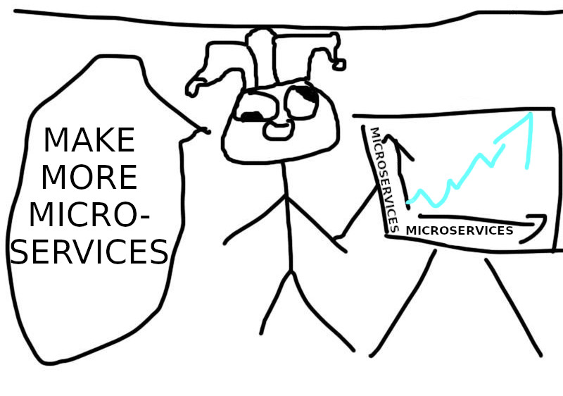
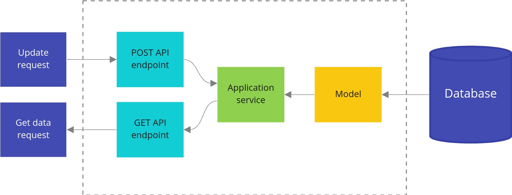
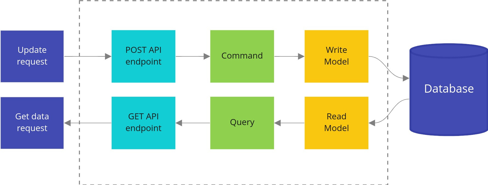
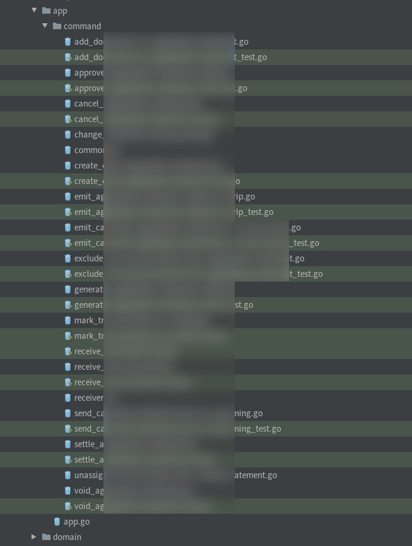
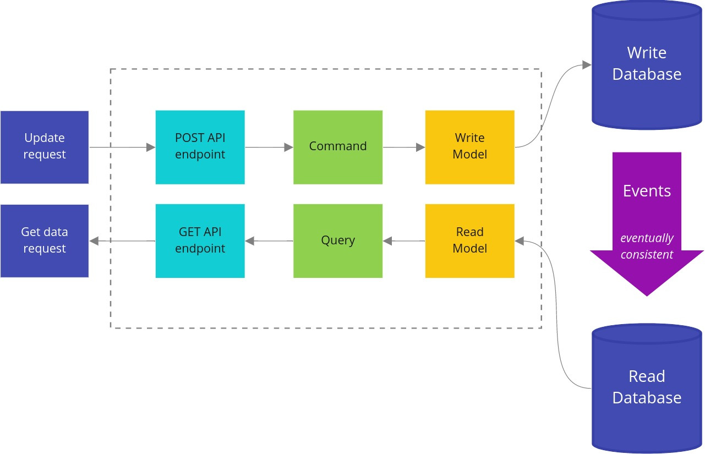

## Введение в базовый CQRS путем рефакторинга Go проекта

Роберт Лащак. Главный инженер [Karhoo](https://www.karhoo.com/). Соучредитель
[Three Dots Labs](https://threedotslabs.com/).
Создатель [Watermill](https://github.com/ThreeDotsLabs/watermill).

Скорее всего, вы знаете хотя бы один сервис, в котором:

* существует одна большая, неподдерживаемая модель, которую трудно понять и изменить,
* или где параллельная работа над новыми функциями ограничена,
* или он не может быть оптимально масштабирован.

Но часто беда не приходит одна. Нередко можно увидеть сервисы со всеми этими 
проблемами.

Какая идея приходит в голову в первую очередь для решения этих проблем? 
Давайте разделим его на несколько микросервисов!

К сожалению, без надлежащего исследования и планирования ситуация после 
слепого рефакторинга может быть на самом деле хуже, чем раньше:

* **бизнес-логику и последовательность действий может стать еще труднее понять** — 
  сложную логику часто легче понять, если она собрана в одном месте,
* **распределенные транзакции** — иногда что-то совмещают по какой-то причине; 
  большая транзакция в одной базе данных выполняется намного быстрее и менее 
  сложна, чем распределенная транзакция между несколькими сервисами,
* **добавление новых изменений может потребовать дополнительной координации**, 
  если один из сервисов относится к другой команде разработчиков.
  

Микросервисы полезны, но они не решат всех ваших проблем...

Для полной ясности - я не враг микросервисов. **Я просто против того, чтобы слепо 
применять микросервисы таким образом, чтобы они вносили ненужную сложность и 
неразбериху вместо того, чтобы облегчить нашу жизнь.**

Другой подход заключается в использовании CQRS (разделение команд и запросов) с
ранее описанной [чистой архитектурой](https://threedots.tech/post/introducing-clean-architecture/) и
[упрощенным DDD](https://threedots.tech/post/ddd-lite-in-go-introduction/). **Это
может намного проще решить упомянутые проблемы.**

## Разве CQRS не сложная методика?

Разве CQRS не является одним из этих корпоративных шаблонов C#/Java/über, 
которые сложно реализовать и которые создают большой беспорядок в коде? Во 
многих книгах, презентациях и статьях CQRS описывается как очень сложный шаблон
проектирования. Но это не так.

**На практике CQRS - это очень простой шаблон, не требующий больших вложений. Его 
можно легко расширить с помощью более сложных методов, таких как архитектура, 
управляемая событиями, event-sourcing или размещения данных в нескольких хранилищах.**
Но они нужны не всегда. Даже без применения каких-либо дополнительных шаблонов 
CQRS можно использовать для уменьшения связанности и более простой для понимания 
структуре кода.

Когда не стоит использовать CQRS в Go? Как получить все преимущества от CQRS?
Обо всем этом вы узнаете из сегодняшней статьи. 😉

Как обычно, я буду показывать всё на примере, путём рефакторинга приложения 
[Wild Workouts](https://github.com/ThreeDotsLabs/wild-workouts-go-ddd-example).

> Это не просто очередная статья со случайными фрагментами кода.
>
> Этот пост является частью большого цикла, показывающий как создавать приложения на
> **Go, которые легко разрабатывать, поддерживать и с ними интересно работать в
> долгосрочной перспективе**. Мы делаем это, делясь проверенными методами, основанными
> на многих экспериментах, проведёнными с возглавляемыми нами с командами,
> и [научных исследованиях](https://threedots.tech/post/ddd-lite-in-go-introduction/#thats-great-but-do-you-have-any-evidence-it-works).
> Вы можете изучить эти методы, создав с нами [полнофункциональный](https://threedots.tech/post/serverless-cloud-run-firebase-modern-go-application/#what-wild-workouts-can-do) пример
> веб-приложения на Go - **Wild Workouts**.
>
> Мы поступили не совсем обычно — **добавили некоторые не сразу заметные проблемы
> в первоначальную реализацию Wild Workouts**. Неужели мы сошли с ума? Пока нет. 😉
> Эти проблемы характерны для многих проектов Go. **В долгосрочной перспективе эти
> небольшие проблемы становятся критичными и не позволяют добавлять новые функционал.**
>
> **Это один из важнейших навыков старшего или ведущего разработчика; всегда нужно
> помнить о долгосрочных последствиях.**
>
> Мы исправим их путем **рефакторинга** Wild Workouts. Таким образом, вы быстро поймёте
> методики, которыми мы делимся.
> Знаете ли вы это чувство, когда прочитали статью о какой-то методике и попытались
> реализовать её, но не смогли из-за упущений и пропуска деталей в руководстве.
> Пропуск деталей делает статьи короче и увеличивает просмотры страниц, но это
> не наша цель. Наша цель — создать материал, который даст достаточно знаний для
> применения представленных методик. Если вы еще не читали [предыдущие статьи из
> этого цикла](https://threedots.tech/series/modern-business-software-in-go/),
> мы настоятельно рекомендуем это сделать.
>
> Мы считаем, что в некоторых областях знаний нельзя пропускать детали. Если вы
> хотите быстро и эффективно создавать сложные приложения, вам нужно потратить
> некоторое время, чтобы узнать как это сделать. Если бы всё было так просто,
> у нас бы не было такого большого количества устрашающего устаревшего кода.
>
> Вот [полный список из 14 опубликованных на данный момент статей](https://threedots.tech/series/modern-business-software-in-go/).
>
> Весь код Wild Workouts доступен на [GitHub](https://github.com/ThreeDotsLabs/wild-workouts-go-ddd-example). Не забудьте поставить звезду
> нашему проекту! ⭐

## Как реализовать базовый CQRS в Go

CQRS (разделение ответственности при выполнении команд и запросов) было 
первоначально [описано Грегом Янгом](https://cqrs.files.wordpress.com/2010/11/cqrs_documents.pdf). **Оно 
основывается на одно простом утверждении: вместо одной большой модели для чтения 
и записи у вас должны быть две отдельные модели. Одна для записи и одна для 
чтения.** Оно также знакомит с понятиями _команд_ и _запросов_ и приводит к 
разделению сервисов приложения на два отдельных типа: обработчики команд и 
запросов.


Стандартная, не CQRS архитектура


CQRS архитектура

## Отличие команды от запроса

Проще говоря: **запрос не должен ничего изменять, просто возвращает данные. Команда
напротив: она должна вносить изменения в систему, но не возвращать никаких данных.**
Благодаря этому наши запросы можно кэшировать более эффективно, и мы снижаем 
сложность команд.

Это может показаться серьезным ограничением, но на практике это не так. Большинство 
выполняемых нами операций — это чтение или запись. Очень редко и то, и другое.

Конечно, при запросе мы не рассматриваем побочные эффекты, например, логирование 
или метрики, как изменяющие что-то. Для команд также совершенно нормально возвращать 
ошибку.

> Как и в случае с большинством правил, их можно нарушить… до тех пор, пока вы 
> прекрасно **понимаете, почему они были введены и какие компромиссы** вы идете.
> На практике вам редко придётся нарушать эти правила. Поделюсь примерами в 
> конце статьи.

Как на практике выглядит самая простая реализация? В [предыдущей статье](https://threedots.tech/post/introducing-clean-architecture/) Милош 
ввёл сервис приложения, который используется для выполнения различных действий.
Давайте начнём с разделения этого сервиса на отдельные обработчики команд и 
запросов.

## Команда ApproveTrainingReschedule

Ранее изменение расписания тренировки подтверждалось из сервиса приложения
`TrainingService`.

```shell
- func (c TrainingService) ApproveTrainingReschedule(ctx context.Context, user auth.User, trainingUUID string) error {
-  return c.repo.ApproveTrainingReschedule(ctx, trainingUUID, func(training Training) (Training, error) {
-     if training.ProposedTime == nil {
-        return Training{}, errors.New("training has no proposed time")
-     }
-     if training.MoveProposedBy == nil {
-        return Training{}, errors.New("training has no MoveProposedBy")
-     }
-     if *training.MoveProposedBy == "trainer" && training.UserUUID != user.UUID {
-        return Training{}, errors.Errorf("user '%s' cannot approve reschedule of user '%s'", user.UUID, training.UserUUID)
-     }
-     if *training.MoveProposedBy == user.Role {
-        return Training{}, errors.New("reschedule cannot be accepted by requesting person")
-     }
-
-     training.Time = *training.ProposedTime
-     training.ProposedTime = nil
-
-     return training, nil
-  })
- }
```
Весь исходный код: [github.com/ThreeDotsLabs/wild-workouts-go-ddd-example/commit/8d9274811559399461aa9f6bf3829316b8ddfb63#diff-ddf06fa26668dd91e829c7bfbd68feaeL127](https://github.com/ThreeDotsLabs/wild-workouts-go-ddd-example/commit/8d9274811559399461aa9f6bf3829316b8ddfb63#diff-ddf06fa26668dd91e829c7bfbd68feaeL127)

Там происходили какие-то магические проверки. Теперь они выполняются на уровне
предметной области. Я также обнаружил, что мы забыли вызвать внешний сервис 
trainer, чтобы перенести тренировку. Ой. 😉 Давайте отрефактирим это до внедрения 
CQRS.

Поскольку CQRS лучше всего работает с приложениями, следующими принципу предметно-ориентированного
проектирования, во время рефакторинга с переходом к CQRS я также отрефакторил 
существующие модели, чтобы они соответствовали упрощенному DDD. Подробнее упрощенный 
DDD описан в [предыдущей статье](https://threedots.tech/post/ddd-lite-in-go-introduction/).

Мы начинаем реализацию _команды_ с определения структуры команды. Эта структура 
предоставляет все данные, необходимые для выполнения этой команды. Если команда
содержит только одно поле, можно не использовать структуру и просто передать его
как параметр.

Рекомендуется использовать в команде типы, определенные в предметной области, 
например, `training.User` в этом случае. Нам не нужно выполнять приведение 
типов позже, и у нас есть гарантия согласования типов. **Это может избавить нас 
от множества проблем, связанных с передачей строковых параметров в 
неправильном порядке.**

```go
package command

// ...

type ApproveTrainingReschedule struct {
    TrainingUUID string
    User         training.User
}
```
Весь исходный код: [github.com/ThreeDotsLabs/wild-workouts-go-ddd-example/internal/trainings/app/command/approve_training_reschedule.go](https://github.com/ThreeDotsLabs/wild-workouts-go-ddd-example/blob/22c0a25b67c4669d612a2fa4a434ffae8e35e65a/internal/trainings/app/command/approve_training_reschedule.go#L10)

Вторая составляющая — это _обработчик команды_, который знает, как выполнять 
команду.

```go
package command

// ...

func (h ApproveTrainingRescheduleHandler) Handle(ctx context.Context, cmd ApproveTrainingReschedule) (err error) {
    defer func() {
        logs.LogCommandExecution("ApproveTrainingReschedule", cmd, err)
    }()

    return h.repo.UpdateTraining(
        ctx,
        cmd.TrainingUUID,
        cmd.User,
        func(ctx context.Context, tr *training.Training) (*training.Training, error) {
            originalTrainingTime := tr.Time()
    
            if err := tr.ApproveReschedule(cmd.User.Type()); err != nil {
                return nil, err
            }
    
            err := h.trainerService.MoveTraining(ctx, tr.Time(), originalTrainingTime)
            if err != nil {
                return nil, err
            }
    
            return tr, nil
        },
    )
}
```
Весь исходный код: [github.com/ThreeDotsLabs/wild-workouts-go-ddd-example/internal/trainings/app/command/approve_training_reschedule.go](https://github.com/ThreeDotsLabs/wild-workouts-go-ddd-example/blob/22c0a25b67c4669d612a2fa4a434ffae8e35e65a/internal/trainings/app/command/approve_training_reschedule.go#L39)

Теперь понять последовательность действий стало намного проще. Вы четко видите, что
мы подтверждаем изменение запланированной сохраненной тренировки `*training.Training`
и если подтверждение проходит без ошибок, вызываем внешний сервис `trainer`. Благодаря
методикам, описанным в [статье с упрощенным DDD](https://threedots.tech/post/ddd-lite-in-go-introduction/),
обработчику команд не нужно знать, когда он может выполнить эту операцию.
Всем этим занимается наш слой предметной области.

Эта четкая последовательность ещё более заметна в более сложных командах. К 
счастью, текущая реализация действительно проста. Это хорошо. **Наша цель — 
создавать не сложное, а простое программное обеспечение.**

Если CQRS - стандартный способ создания приложений в вашей команде, он также
ускоряет изучение сервиса вашими товарищами по команде, которые его не знают.
Вам просто нужен список доступных команд и запросов, чтобы быстро посмотреть, 
как происходит их выполнение. Искать как сумасшедший в случайных местах кода
не нужно.

Вот как это выглядит в одном из самых сложных сервисов моей команды:


Пример слоя приложения одного сервиса в [Karhoo](https://www.karhoo.com/).

Вы можете спросить - не стоит ли разделить это на несколько сервисов?
**На практике это было бы ужасной идеей.** Многие операции здесь должны быть согласованы 
по времени. Разделение на отдельные сервисы потребует нескольких 
распределенных транзакций (_Саг_). Это сделало бы эту последовательность намного более сложной,
трудной в поддержке и отладке. Это не лучшая идея.

Также стоит отметить, что все эти операции не очень сложные. **Сложность здесь 
отлично масштабируется горизонтально.** Вскоре мы рассмотрим чрезвычайно важную 
тему разделения микросервисов более подробно. Я уже упоминал, что мы специально 
реализовали неправильно их разделение в Wild Workouts? 😉

Но вернемся к нашей команде. Пришло время использовать его в нашем HTTP-порту.
Он доступен в `HttpServer` через внедренную структуру `Application`, которая 
содержит все наши команды и обработчики запросов.

```go
package app

import (
    "github.com/MaksimDzhangirov/three-dots/part10/internal/trainings/app/command"
    "github.com/MaksimDzhangirov/three-dots/part10/internal/trainings/app/query"
)

type Application struct {
    Commands Commands
    Queries  Queries
}

type Commands struct {
    ApproveTrainingReschedule command.ApproveTrainingRescheduleHandler
    CancelTraining            command.CancelTrainingHandler
    // ...
}
```
Весь исходный код: [github.com/ThreeDotsLabs/wild-workouts-go-ddd-example/internal/trainings/app/app.go](https://github.com/ThreeDotsLabs/wild-workouts-go-ddd-example/blob/22c0a25b67c4669d612a2fa4a434ffae8e35e65a/internal/trainings/app/app.go#L8)

```go
type HttpServer struct {
    app app.Application
}

// ...

func (h HttpServer) ApproveRescheduleTraining(w http.ResponseWriter, r *http.Request, trainingUUID string) {
    trainingUUID = chi.URLParam(r, "trainingUUID")

    user, err := newDomainUserFromAuthUser(r.Context())
    if err != nil {
        httperr.RespondWithSlugError(err, w, r)
        return
    }

    err = h.app.Commands.ApproveTrainingReschedule.Handle(r.Context(), command.ApproveTrainingReschedule{
        User:         user,
        TrainingUUID: trainingUUID,
    })
    if err != nil {
        httperr.RespondWithSlugError(err, w, r)
        return
    }
}
```
Весь исходный код: [github.com/ThreeDotsLabs/wild-workouts-go-ddd-example/internal/trainings/ports/http.go](https://github.com/ThreeDotsLabs/wild-workouts-go-ddd-example/blob/22c0a25b67c4669d612a2fa4a434ffae8e35e65a/internal/trainings/ports/http.go#L160)

Таким образом можно вызвать обработчик команд из любого порта: HTTP, gRPC или 
CLI. Это также может пригодиться для выполнения миграций и [загрузки фикстур](https://github.com/ThreeDotsLabs/wild-workouts-go-ddd-example/blob/22c0a25b67c4669d612a2fa4a434ffae8e35e65a/internal/trainer/fixtures.go#L62) (мы уже 
делаем это в Wild Workouts).

### Команда RequestTrainingReschedule

Некоторые обработчики команд могут быть очень простыми.

```go
func (h RequestTrainingRescheduleHandler) Handle(ctx context.Context, cmd RequestTrainingReschedule) (err error) {
    defer func() {
        logs.LogCommandExecution("RequestTrainingReschedule", cmd, err)
    }()
  
    return h.repo.UpdateTraining(
        ctx,
        cmd.TrainingUUID,
        cmd.User,
        func(ctx context.Context, tr *training.Training) (*training.Training, error) {
            if err := tr.UpdateNotes(cmd.NewNotes); err != nil {
                return nil, err
            }
  
            tr.ProposeReschedule(cmd.NewTime, cmd.User.Type())
  
            return tr, nil
        },
    )
}
```
Весь исходный код: [github.com/ThreeDotsLabs/wild-workouts-go-ddd-example/internal/trainings/app/command/request_training_reschedule.go](https://github.com/ThreeDotsLabs/wild-workouts-go-ddd-example/blob/22c0a25b67c4669d612a2fa4a434ffae8e35e65a/internal/trainings/app/command/request_training_reschedule.go#L32)

Может возникнуть соблазн пропустить этот слой для таких простых случаев, чтобы
не писать повторяющийся код. Дублирование действительно присутствует, но нужно помнить,
что **написание кода всегда намного дешевле, чем его поддержка. Добавление этого 
простого типа - 3 минуты работы. Люди, которые позже будут читать и вносить изменения 
в этот код, оценят эти усилия.**

### Запрос AvailableHoursHandler

Запросы в слое приложения обычно довольно простые. В самом общем случае нам 
нужно написать _интерфейс модели чтения_ (`AvailableHoursReadModel`), который 
определяет, как мы можем запрашивать данные.

Команды и запросы также являются отличным местом для [функционала, который сложно 
куда-то выделить](https://en.wikipedia.org/wiki/Cross-cutting_concern), например,
логирование и вспомогательный инструментарий. Благодаря тому, что они размещены 
здесь, мы уверены, что производительность измеряется одинаково, независимо от 
того, вызывается ли они из порта HTTP или gRPC.

```go
package query

// ...

type AvailableHoursHandler struct {
    readModel AvailableHoursReadModel
}

type AvailableHoursReadModel interface {
    AvailableHours(ctx context.Context, from time.Time, to time.Time) ([]Date, error)
}

// ...

type AvailableHours struct {
    From time.Time
    To   time.Time
}

func (h AvailableHoursHandler) Handle(ctx context.Context, query AvailableHours) (d []Date, err error) {
    start := time.Now()
    defer func() {
        logrus.
            WithError(err).
            WithField("duration", time.Since(start)).
            Debug("AvailableHoursHandler executed")
    }()
  
    if query.From.After(query.To) {
        return nil, errors.NewIncorrectInputError("date-from-after-date-to", "Date from after date to")
    }
  
    return h.readModel.AvailableHours(ctx, query.From, query.To)
}

```
Весь исходный код: [github.com/ThreeDotsLabs/wild-workouts-go-ddd-example/internal/trainer/app/query/available_hours.go](https://github.com/ThreeDotsLabs/wild-workouts-go-ddd-example/blob/22c0a25b67c4669d612a2fa4a434ffae8e35e65a/internal/trainer/app/query/available_hours.go#L11)

Нам также необходимо определить типы данных, возвращаемые запросом. В нашем 
случае это `query.Date`.

```go
package query

type Date struct {
    Date         time.Time
    HasFreeHours bool
    Hours        []Hour
}

type Hour struct {
    Available            bool
    HasTrainingScheduled bool
    Hour                 time.Time
}
```
Весь исходный код: [github.com/ThreeDotsLabs/wild-workouts-go-ddd-example/internal/trainer/app/query/types.go](https://github.com/ThreeDotsLabs/wild-workouts-go-ddd-example/blob/22c0a25b67c4669d612a2fa4a434ffae8e35e65a/internal/trainer/app/query/types.go)

Наша модель запроса сложнее, чем тип предметной области `hour.Hour`. Это 
типичный случай. Часто это определяется пользовательским интерфейсом веб-сайта,
и более эффективно генерировать наиболее оптимальные ответы на стороне бекенда.

По мере роста приложения различия между моделями предметной области и запросов
могут увеличиваться. **Благодаря разделению и отсутствию связывания мы можем 
независимо вносить изменения в них.** Это очень важно для обеспечения быстрой 
разработки в долгосрочной перспективе.

```go
package hour

type Hour struct {
    hour time.Time
  
    availability Availability
}
```
Весь исходный код: [github.com/ThreeDotsLabs/wild-workouts-go-ddd-example/internal/trainer/domain/hour/hour.go](https://github.com/ThreeDotsLabs/wild-workouts-go-ddd-example/blob/22c0a25b67c4669d612a2fa4a434ffae8e35e65a/internal/trainer/domain/hour/hour.go#L11)

Но откуда `AvailableHoursReadModel` берёт данные? Для слоя приложения он полностью
прозрачен и не имеет значения. Это позволяет нам оптимизировать 
производительности в будущем, затрагивая только одну часть приложения.

> Если вы не знакомы с понятиями _порты_ и _адаптеры_, я настоятельно рекомендую 
> прочитать нашу [статью о чистой архитектуре в Go](https://threedots.tech/post/introducing-clean-architecture/).

На практике текущая реализация получает данные **из нашей базы данных, той же, куда
они сохраняются с помощью моделей записи.** Вы можете найти [реализацию](https://github.com/ThreeDotsLabs/wild-workouts-go-ddd-example/blob/22c0a25b67c4669d612a2fa4a434ffae8e35e65a/internal/trainings/adapters/trainings_firestore_repository.go#L170) модели 
чтения [AllTrainings](https://github.com/ThreeDotsLabs/wild-workouts-go-ddd-example/blob/22c0a25b67c4669d612a2fa4a434ffae8e35e65a/internal/trainings/app/query/all_trainings.go#L19)
и [тесты](https://github.com/ThreeDotsLabs/wild-workouts-go-ddd-example/blob/22c0a25b67c4669d612a2fa4a434ffae8e35e65a/internal/trainings/adapters/trainings_firestore_repository_test.go#L152) для `DatesFirestoreRepository` в слое адаптеров.


Данные для наших запросов в настоящее время запрашиваются из той же базы данных, где хранятся модели записи.

Если вы читали о CQRS ранее, часто рекомендуется использовать для запросов 
отдельную базу данных, построенную на основе событий. Это может быть хорошей 
идеей, но в очень специфических случаях. Я опишу это в разделе _«Будущие 
оптимизации»_. В нашем случае достаточно просто получить данные из базы данных 
куда происходит запись с помощью моделей записи.

## Запрос HourAvailabilityHandler

Нам не нужно добавлять интерфейс _модели чтения_ для каждого запроса. Также 
можно использовать репозиторий предметной области и выбирать нужные нам данные.

```go
import (
    "context"
    "time"
  
    "github.com/MaksimDzhangirov/three-dots/part10/internal/trainer/domain/hour"
)

type HourAvailabilityHandler struct {
      hourRepo hour.Repository
}

func (h HourAvailabilityHandler) Handle(ctx context.Context, time time.Time) (bool, error) {
    hour, err := h.hourRepo.GetOrCreateHour(ctx, time)
    if err != nil {
        return false, err
    }
  
    return hour.IsAvailable(), nil
}
```
Весь исходный код: [github.com/ThreeDotsLabs/wild-workouts-go-ddd-example/internal/trainer/app/query/hour_availability.go](https://github.com/ThreeDotsLabs/wild-workouts-go-ddd-example/blob/22c0a25b67c4669d612a2fa4a434ffae8e35e65a/internal/trainer/app/query/hour_availability.go#L22)

## Наименование

Выбор названий переменных - одна из самых сложных и наиболее важных частей
разработки программного обеспечения. В статье [Введение в упрощенное DDD](https://threedots.tech/post/ddd-lite-in-go-introduction/)
согласно которому вы должны придерживаться языка, максимально приближенного к 
тому, как разговаривают люди, не являющиеся техническими специалистами (а отвечающие 
за бизнес). Это также относится к именам команд и запросов.

Следует избегать таких названий, как «Создать тренировку» или «Удалить 
тренировку». **Это не то, как бизнес и пользователи понимают вашу предметную 
область. Вместо этого следует использовать «Запланировать тренировку» и 
«Отменить тренировку».**


[Все команды и запросы сервиса trainings](https://github.com/ThreeDotsLabs/wild-workouts-go-ddd-example/tree/8d9274811559399461aa9f6bf3829316b8ddfb63/internal/trainings/app)

Мы рассмотрим эту тему глубже в статье о Едином Языке. А пока просто подойдите к
людям, отвечающим за бизнес, и послушайте, как они называют операции. Подумайте дважды,
действительно ли название ваших команд должно начинаться со слов «Создать/Удалить/Обновить».

## Будущие оптимизации

Базовый CQRS дает некоторые преимущества, такие как **лучшая организация кода, 
разделение и упрощение моделей.** Есть и одно, еще более важное преимущество. Это 
**возможность расширить CQRS более мощными и сложными** шаблонами.

### Асинхронные команды

Некоторые команды выполняются медленно по своей природе. Они могут выполнять 
какие-то внешние вызовы или тяжелые вычисления. В этом случае мы можем ввести 
Асинхронную Командную Шину, которая выполняет команду в фоновом режиме.

Использование асинхронных команд накладывает некоторые дополнительные 
требования к инфраструктуре, такие как наличие очереди или шаблона проектирования 
издатель/подписчик. К счастью, библиотека [Watermill](https://github.com/ThreeDotsLabs/watermill) может помочь вам с этим в Go.
Вы можете найти более подробную информацию в [документации Watermill по CQRS](https://watermill.io/docs/cqrs/). (Кстати,
мы также являемся авторами Watermill 😉 Не стесняйтесь обращаться к нам, если 
что-то там непонятно!).

### Отдельная база данных для запросов

Наша текущая реализация использует одну и ту же базу данных для чтения 
(запросов) и записи (команд). Если бы у нас были более сложные запросы или 
нам нужно было бы быстро считывать данные, мы могли бы использовать методику 
_размещения данных в нескольких хранилищах_. Идея состоит в том, чтобы дублировать 
запрошенные данные в более оптимальном формате в другой базе данных. Например, 
мы могли бы использовать Elastic для индексации некоторых данных, которые можно 
было бы легче искать и фильтровать.

Синхронизация данных в этом случае может осуществляться через _события_. Одним из 
наиболее важных следствий этого подхода является событийная согласованность.
Вы должны выяснить, является ли это приемлемым компромиссом в вашей системе.
Если вы не уверены, вы можете просто начать без размещения данных в нескольких 
хранилищах и перейти к этой модели позже. Такие ключевые решения, как это, 
лучше отложить.

Пример реализации также описан в [документации Watermill по CQRS](https://watermill.io/docs/cqrs/?utm_source=cqrs-art#building-a-read-model-with-the-event-handler). Может быть, 
со временем мы добавим его и в Wild Workouts, кто знает?


CQRS с размещения данных в нескольких хранилищах

### Event-Sourcing

Если вы работаете в области со строгими требованиями к аудиту, вам обязательно
стоит обратить внимание на методику _генерации событий_. Например, в настоящее
время я работаю в финансовой сфере, _генерация событий_ - методика, которая 
используется для сохранения данных по умолчанию. Он обеспечивает готовый 
аудит и помогает исправить последствия некоторых ошибок.

CQRS часто описывается вместе с _генерацией событий_. Причина в том, что по
замыслу в системах, где генерируются события, мы храним модель не в формате,
готовом для чтения (запросов), а просто в виде списка событий, используемых 
для записи (команд). Другими словами, сложнее выдавать какие-либо API ответы.

Благодаря разделению моделей _команд_ и _запросов_ это не является большой проблемой.
Наши модели чтения для запросов можно использовать независимо с учётом того как они 
спроектированы.

Есть также гораздо больше преимуществ использования генерации событий, которые 
видны в финансовых системах. Но рассмотрим их для какой-то другой статьи. 😉 А 
пока вы можете ознакомиться с электронной книгой Грега Янга - [Управление 
версиями в системе, основанной на событиях](https://leanpub.com/esversioning). Тот 
самый Грег Янг, который описал CQRS.

## Когда не использовать CQRS?

CQRS — это не серебряная пуля, которая идеально подходит везде. Хороший пример 
— авторизация. Вы указываете логин и пароль, а взамен получаете подтверждение, 
если все получилось и, возможно, какой-то токен.

Если ваше приложение представляет собой простой CRUD, который получает и 
возвращает одни и те же данные, это тоже не лучший вариант для CQRS. Вот почему 
микросервис `users` в Wild Workouts не использует чистую архитектуру и CQRS.
В простых сервисах, ориентированных на данные, эти шаблоны обычно не имеют 
смысла. С другой стороны, вы должны следить за такими сервисами. Если вы 
заметили, что логика разрастается, а разработка становится болезненной, может 
быть, пришло время для рефакторинга?

### Возврат созданной сущности через API с CQRS

Я знаю, что у некоторых людей возникают проблемы с использованием CQRS для REST 
API, который возвращает созданную сущность в качестве ответа на POST запрос. Разве это
не противоречит CQRS? Не совсем! Вы можете решить ее двумя способами:

1. Вызовите команду через HTTP порт и после её успешного выполнения, вызовите 
   запрос, чтобы получить возвращаемые данные,
2. Вместо того, чтобы возвращать созданную сущность, верните HTTP-код `204` с 
   заголовком `content-location` равным URL созданного ресурса. 

Второй способ на мой взгляд лучше, потому что он не требует всегда запрашивать 
созданную сущность (даже если клиенту не нужны эти данные). При втором подходе
клиент будет переходить по ссылке только в случае необходимости. Он также может
быть кэширован при этом вызове.

Вопрос только в том, как получить ID созданной сущности? Обычной практикой 
является предоставление UUID объекта, который будет создан в команде.

Преимущество этого подхода в том, что он по-прежнему будет работать должным 
образом, если обработчик команд будет асинхронным. Если вы не хотите работать 
с UUID, в крайнем случае можете вернуть ID из обработчика — это не конец 
света. 😉

```go
cmd := command.ScheduleTraining{
    TrainingUUID: uuid.New().String(),
    UserUUID:     user.UUID,
    UserName:     user.DisplayName,
    TrainingTime: postTraining.Time,
    Notes:        postTraining.Notes,
}
err = h.app.Commands.ScheduleTraining.Handle(r.Context(), cmd)
if err != nil {
    httperr.RespondWithSlugError(err, w, r)
    return
}

w.Header().Set("content-location", "/trainings/"+cmd.TrainingUUID)
w.WriteHeader(http.StatusNoContent)
```
Весь исходный код: [github.com/ThreeDotsLabs/wild-workouts-go-ddd-example/internal/trainings/ports/http.go](https://github.com/ThreeDotsLabs/wild-workouts-go-ddd-example/blob/22c0a25b67c4669d612a2fa4a434ffae8e35e65a/internal/trainings/ports/http.go#L70)

## Теперь вы можете добавить CQRS в свое резюме!

Мы это сделали — у нас есть базовая реализация CQRS в Wild Workouts. Вы также 
должны иметь представление о том, как вы можете расширить приложение в будущем.

При подготовке кода для этой статьи я также переделал сервис trainer в 
соответствии с DDD. Я расскажу об этом в следующей статье. Хотя весь код уже
доступен в нашем [GitHub репозитории](https://github.com/ThreeDotsLabs/wild-workouts-go-ddd-example/commit/8d9274811559399461aa9f6bf3829316b8ddfb63).

Наличие обработчика команд в виде отдельного типа также помогает при 
тестировании, поскольку для них проще создавать зависимости. Эта часть описана 
Милошем в статье [Архитектура тестирования микросервисов](https://threedots.tech/post/microservices-test-architecture/).

Используете ли вы CQRS с какими-либо расширениями? У вас есть проект, в 
котором вы не знаете, как применять эти шаблоны? Не стесняйтесь делиться и 
спрашивать в комментариях!