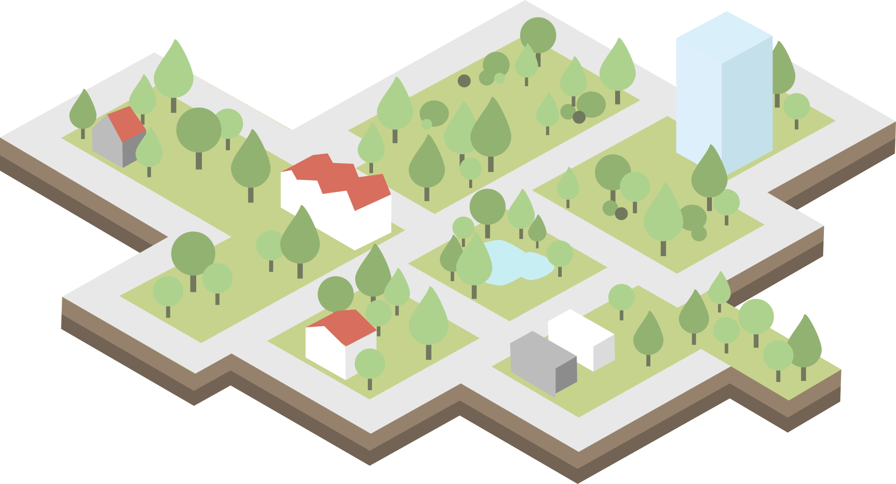
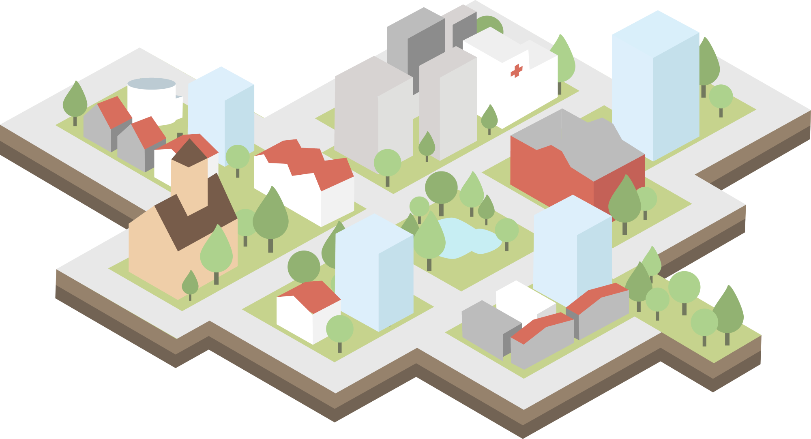
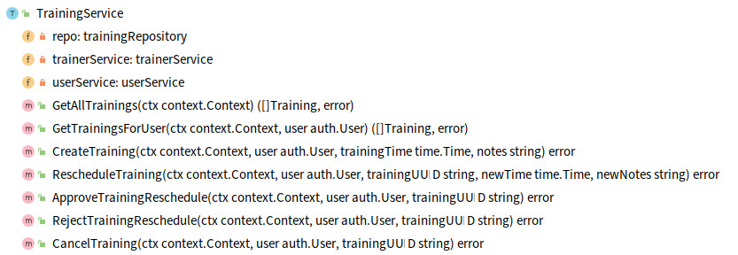

# Объединение DDD, CQRS и чистой архитектуры путем рефакторинга Go проекта

Роберт Лащак. Главный инженер [Karhoo](https://www.karhoo.com/). Соучредитель
[Three Dots Labs](https://threedotslabs.com/).
Создатель [Watermill](https://github.com/ThreeDotsLabs/watermill).

В [предыдущих статьях](https://threedots.tech/series/modern-business-software-in-go/), мы 
представили такие методики, как упрощенное DDD, CQRS и чистая (гексогональная) 
архитектура. Даже если их использование по отдельности приносит пользу, лучше 
всего они работают вместе. Как Могучие рейнджеры. К сожалению, использовать их 
вместе в реальном проекте непросто. **В этой статье я покажу вам, как объединить 
упрощенное DDD, CQRS и чистую архитектуру наиболее прагматичным и эффективным 
способом.**

## Почему это важно?

Работа над программным проектом аналогична планированию и строительству жилого 
района. Если вы знаете, что в ближайшем будущем район будет расширяться, вам 
нужно оставить место для будущих улучшений. Даже если вначале это может 
показаться пустой тратой места. Вы должны оставить место для будущих объектов, 
таких как жилые дома, больницы и храмы. **В противном случае вы будете вынуждены 
разрушать здания и улицы, чтобы освободить место для новых зданий.** Об этом 
лучше подумать заранее.



Такая же ситуация с кодом. Если вы знаете, что проект будет разрабатываться 
более 1 месяца, вы должны с самого начала рассматривать долгосрочную перспективу.
**Вам нужно создать свой код таким образом, чтобы он не блокировал вашу будущую 
работу. Даже если поначалу это может выглядеть слишком усложнённое проектирование
и наличие повторяющегося кода, вам нужно помнить о долгосрочной перспективе.**

Это не значит, что вам нужно планировать каждый функционал, которую вы будете 
реализовывать в будущем — как раз наоборот. Такой подход помогает адаптироваться 
к новым требованиям или меняющемуся пониманию нашей области. Большого преждевременного
планирования здесь не нужно. Это очень важно в наше время, когда мир очень 
быстро меняется, и кто не может адаптироваться к этим изменениям, может просто 
уйти из бизнеса.



**Именно это и дают вам эти шаблоны при их объединении — возможность сохранять 
постоянную скорость разработки. Не разрушая и не затрагивая слишком много 
существующего кода.**

Требует ли это больше размышлений и планирования? Это более сложный путь? Нужно 
ли для этого иметь дополнительные знания? Конечно! **Но долгосрочный результат 
того стоит!** К счастью, вы находитесь в правильном месте, чтобы научиться 
этому. 😉

Но хватит о теории. Перейдем к коду. В этой статье не будем рассуждать почему
были выбраны такие методики. Мы уже делали это в [предыдущих статьях](https://threedots.tech/series/modern-business-software-in-go/).
Если вы их еще не читали, рекомендую это сделать — вы лучше поймете эту статью.

Как и в предыдущих статьях, мы будем осуществлять рефакторинг реального проекта 
с открытым исходным кодом. Это должно сделать примеры более реалистичными и 
применимыми к вашим проектам.

Вы готовы?

> Это не просто очередная статья со случайными фрагментами кода.
>
> Этот пост является частью большого цикла, показывающий как создавать приложения на
> **Go, которые легко разрабатывать, поддерживать и с ними интересно работать в
> долгосрочной перспективе**. Мы делаем это, делясь проверенными методами, основанными
> на многих экспериментах, проведёнными с возглавляемыми нами с командами,
> и [научных исследованиях](https://threedots.tech/post/ddd-lite-in-go-introduction/#thats-great-but-do-you-have-any-evidence-it-works).
> Вы можете изучить эти методы, создав с нами [полнофункциональный](https://threedots.tech/post/serverless-cloud-run-firebase-modern-go-application/#what-wild-workouts-can-do) пример
> веб-приложения на Go - **Wild Workouts**.
>
> Мы поступили не совсем обычно — **добавили некоторые не сразу заметные проблемы
> в первоначальную реализацию Wild Workouts**. Неужели мы сошли с ума? Пока нет. 😉
> Эти проблемы характерны для многих проектов Go. **В долгосрочной перспективе эти
> небольшие проблемы становятся критичными и не позволяют добавлять новые функционал.**
>
> **Это один из важнейших навыков старшего или ведущего разработчика; всегда нужно
> помнить о долгосрочных последствиях.**
>
> Мы исправим их путем **рефакторинга** Wild Workouts. Таким образом, вы быстро поймёте
> методики, которыми мы делимся.
> Знаете ли вы это чувство, когда прочитали статью о какой-то методике и попытались
> реализовать её, но не смогли из-за упущений и пропуска деталей в руководстве.
> Пропуск деталей делает статьи короче и увеличивает просмотры страниц, но это
> не наша цель. Наша цель — создать материал, который даст достаточно знаний для
> применения представленных методик. Если вы еще не читали [предыдущие статьи из
> этого цикла](https://threedots.tech/series/modern-business-software-in-go/),
> мы настоятельно рекомендуем это сделать.
>
> Мы считаем, что в некоторых областях знаний нельзя пропускать детали. Если вы
> хотите быстро и эффективно создавать сложные приложения, вам нужно потратить
> некоторое время, чтобы узнать как это сделать. Если бы всё было так просто,
> у нас бы не было такого большого количества устрашающего устаревшего кода.
>
> Вот [полный список из 14 опубликованных на данный момент статей](https://threedots.tech/series/modern-business-software-in-go/).
>
> Весь код Wild Workouts доступен на [GitHub](https://github.com/ThreeDotsLabs/wild-workouts-go-ddd-example). Не забудьте поставить звезду
> нашему проекту! ⭐

## Давайте начнём рефакторинг

Давайте начнем наш рефакторинг с подхода [Domain-First](https://threedots.tech/post/ddd-lite-in-go-introduction/#domain-first-approach). Добавим [слой предметной 
области](https://threedots.tech/post/introducing-clean-architecture/#the-dependency-inversion-principle). Благодаря этому мы будем уверены, что детали реализации не повлияют 
на код нашей предметной области. **Мы также можем приложить все наши усилия для 
понимания бизнес-проблемы. Не писать скучные запросы к базе данных и конечные 
точки API.**

Подход Domain-First хорошо работает как для спасения (рефакторинг 😉), так и 
для новых проектов.

Чтобы приступить к созданию слоя предметной области, мне нужно было определить, 
что на самом деле делает приложение. В этой статье речь пойдет о рефакторинге
[trainings](https://github.com/ThreeDotsLabs/wild-workouts-go-ddd-example/tree/v2.5/internal/trainings)
микросервиса Wild Workouts. Я начал с определения различных случаев, 
которые обрабатывает приложение. После предыдущего [рефакторинга в чистую 
архитектуру](https://threedots.tech/post/introducing-clean-architecture/) мы 
можем найти их в [TrainingService](https://github.com/ThreeDotsLabs/wild-workouts-go-ddd-example/blob/v2.4/internal/trainings/app/training_service.go#L32). Когда я работаю с запутанным 
приложением, я просматриваю конечные точки RPC и HTTP, чтобы найти используемые
варианты использования.

Одной из функций, которые я определил, является **подтверждение переноса графика 
тренировки.** В Wild Workouts требуется подтверждение переноса тренировки, если 
оно было запрошено менее чем за 24 часа до ее даты. Если посетитель запрашивает 
изменение расписания, его должен одобрить тренер. Когда об этом просит тренер, 
оно должен быть подтверждено посетителем.

```shell
- func (c TrainingService) ApproveTrainingReschedule(ctx context.Context, user auth.User, trainingUUID string) error {
-  return c.repo.ApproveTrainingReschedule(ctx, trainingUUID, func(training Training) (Training, error) {
-     if training.ProposedTime == nil {
-        return Training{}, errors.New("training has no proposed time")
-     }
-     if training.MoveProposedBy == nil {
-        return Training{}, errors.New("training has no MoveProposedBy")
-     }
-     if *training.MoveProposedBy == "trainer" && training.UserUUID != user.UUID {
-        return Training{}, errors.Errorf("user '%s' cannot approve reschedule of user '%s'", user.UUID, training.UserUUID)
-     }
-     if *training.MoveProposedBy == user.Role {
-        return Training{}, errors.New("reschedule cannot be accepted by requesting person")
-     }
-
-     training.Time = *training.ProposedTime
-     training.ProposedTime = nil
-
-     return training, nil
-  })
- }
```
Весь исходный код: [github.com/ThreeDotsLabs/wild-workouts-go-ddd-example/commit/8d9274811559399461aa9f6bf3829316b8ddfb63](https://github.com/ThreeDotsLabs/wild-workouts-go-ddd-example/commit/8d9274811559399461aa9f6bf3829316b8ddfb63)

## Начнём с предметной области

Даже если это не выглядит как худший код, который вы видели в своей жизни, 
такие функции, как `ApproveTrainingReschedule`, со временем усложняются.
Более сложные функции означают больше потенциальных ошибок во время будущей 
разработки.

Еще более вероятно, если мы новички в проекте и не обладаем «шаманскими знаниями» 
о нем. **Вы всегда должны учитывать всех людей, которые будут работать над проектом 
после вас, и делать его устойчивым к случайному нарушению ими. Это поможет 
вашему проекту не стать устаревшим, к которому все боятся прикасаться.** Вы, 
наверное, ненавидите это чувство, когда вы новичок в проекте, и боитесь что-либо 
трогать, чтобы не сломать систему.

Нередко люди меняют работу чаще, чем раз в 2 года. Таким образом, это ещё более
важно для долгосрочной разработки проекта.

Если вы не верите, что этот код может стать сложным, рекомендую проверить 
историю Git в худшем месте в проекте, над которым вы работаете. В большинстве 
случаев этот наихудший код начинался с _«всего пары простых if»_. 😉 Чем сложнее 
будет код, тем сложнее будет потом его упростить в последствии. **Мы должны всегда
учитывать возникающую сложность и стараться упростить ее, как только сможем.**

## Сущность предметной области `Training`

При анализе текущих случаев использования, обрабатываемых микросервисом 
`trainings`, я обнаружил, что все они связаны с тренировкой. Вполне естественно 
создать тип `Training` для обработки этих операций.



Методы [TrainingService](https://github.com/ThreeDotsLabs/wild-workouts-go-ddd-example/blob/v2.4/internal/trainings/app/training_service.go#L32) после рефакторинга

> существительное == сущность
> 
> Можно ли использовать такой подход для выявления сущностей? Ну не совсем.
> 
> DDD предоставляет инструменты, которые помогают нам моделировать сложные 
> предметные области без угадывания (_стратегические шаблоны DDD, агрегаты_). Мы 
> не хотим угадывать, как выглядят наши агрегаты — мы хотим иметь инструменты 
> для их обнаружения. Техника Event Storming здесь крайне полезна… но это тема 
> для отдельной статьи.
> 
> Тема достаточно сложная, чтобы об этом написать пару статей. И этим мы 
> займёмся в ближайшее время. 😉
> 
> Означает ли это, что вы не должны использовать эти методики без 
> стратегических шаблонов DDD? Конечно, нет! Текущий подход может быть 
> достаточно хорош для более простых проектов. К сожалению (или к счастью 😉), 
> не все проекты простые.


```go
package training

// ...

type Training struct {
   uuid string

   userUUID string
   userName string

   time  time.Time
   notes string

   proposedNewTime time.Time
   moveProposedBy  UserType

   canceled bool
}
```
Весь исходный код: [github.com/ThreeDotsLabs/wild-workouts-go-ddd-example/internal/trainings/domain/training/training.go](https://github.com/ThreeDotsLabs/wild-workouts-go-ddd-example/blob/8d9274811559399461aa9f6bf3829316b8ddfb63/internal/trainings/domain/training/training.go#L10)

Все поля приватные, чтобы обеспечить инкапсуляцию. Это очень важно для 
соблюдения правила [«всегда сохранять правильное состояние в памяти»](https://threedots.tech/post/ddd-lite-in-go-introduction/#the-second-rule-always-keep-a-valid-state-in-the-memory) из статьи об 
упрощенном DDD.

Благодаря проверке в конструкторе и инкапсулированным полям мы уверены, что
`Training` всегда находится в правильном состоянии. **Теперь человек, не имеющий 
никаких знаний о проекте, не сможет использовать его неправильно.**

Это же правило распространяется на любые методы, находящиеся в `Training`.

```go
package training

func NewTraining(uuid string, userUUID string, userName string, trainingTime time.Time) (*Training, error) {
    if uuid == "" {
        return nil, errors.New("empty training uuid")
    }
    if userUUID == "" {
        return nil, errors.New("empty UUID")
    }
    if userName == "" {
        return nil, errors.New("empty userName")
    }
    if trainingTime.IsZero() {
        return nil, errors.New("zero training time")
    }
    
    return &Training{
        uuid:     uuid,
        userUUID: userUUID,
        userName: userName,
        time:     trainingTime,
    }, nil
}
```
Весь исходный код: [github.com/ThreeDotsLabs/wild-workouts-go-ddd-example/internal/trainings/domain/training/training.go](https://github.com/ThreeDotsLabs/wild-workouts-go-ddd-example/blob/8d9274811559399461aa9f6bf3829316b8ddfb63/internal/trainings/domain/training/training.go#L25)

### Подтверждаем перенос в слое предметной области

Как описано во [введении в упрощенное DDD](https://threedots.tech/post/ddd-lite-in-go-introduction/#the-first-rule---reflect-your-business-logic-literally),
мы создаём нашу предметную область с помощью методов, ориентированных на поведение.
Не на основе данных. Давайте смоделируем `ApproveReschedule`, используя сущность
нашей предметной области.

```go
package training

// ...

func (t *Training) IsRescheduleProposed() bool {
    return !t.moveProposedBy.IsZero() && !t.proposedNewTime.IsZero()
}

var ErrNoRescheduleRequested = errors.New("no training reschedule was requested yet")

func (t *Training) ApproveReschedule(userType UserType) error {
    if !t.IsRescheduleProposed() {
        return errors.WithStack(ErrNoRescheduleRequested)
    }
    
    if t.moveProposedBy == userType {
        return errors.Errorf(
            "trying to approve reschedule by the same user type which proposed reschedule (%s)",
            userType.String(),
        )
    }
    
    t.time = t.proposedNewTime
    
    t.proposedNewTime = time.Time{}
    t.moveProposedBy = UserType{}
    
    return nil
}

func (t *Training) RejectReschedule() error {
    if !t.IsRescheduleProposed() {
        return errors.WithStack(ErrNoRescheduleRequested)
    }
    
    t.proposedNewTime = time.Time{}
    t.moveProposedBy = UserType{}
    
    return nil
}
```
Весь исходный код: [github.com/ThreeDotsLabs/wild-workouts-go-ddd-example/internal/trainings/domain/training/reschedule.go](https://github.com/ThreeDotsLabs/wild-workouts-go-ddd-example/blob/8d9274811559399461aa9f6bf3829316b8ddfb63/internal/trainings/domain/training/reschedule.go#L47)

Если у вас не было возможности прочитать:

* [Введение в упрощенное DDD](https://threedots.tech/post/ddd-lite-in-go-introduction/),
* [Введение в чистую архитектуру](https://threedots.tech/post/introducing-clean-architecture/),
* [Введение в базовый CQRS](https://threedots.tech/post/basic-cqrs-in-go/),
* [Шаблон проектирования репозиторий](https://threedots.tech/post/repository-pattern-in-go/).

я настоятельно рекомендую ознакомиться с ними. Это поможет вам лучше понять 
эту статью. Они объясняют решения и методики, которые мы объединяем в этой статье.

## Управляем с помощью команд

Теперь слой приложения уровень отвечает только за управление последовательностью
действий. В нём нет логики предметной области. **Мы скрываем всю бизнес-логику в слое
предметной области. Это и было нашей целью.**

Для получения и сохранения тренировки, мы используем [шаблон проектирования 
репозиторий](https://threedots.tech/post/repository-pattern-in-go/).

```go
package command

// ...

func (h ApproveTrainingRescheduleHandler) Handle(ctx context.Context, cmd ApproveTrainingReschedule) (err error) {
    defer func() {
        logs.LogCommandExecution("ApproveTrainingReschedule", cmd, err)
    }()
    
    return h.repo.UpdateTraining(
        ctx,
        cmd.TrainingUUID,
        cmd.User,
        func(ctx context.Context, tr *training.Training) (*training.Training, error) {
            originalTrainingTime := tr.Time()
    
            if err := tr.ApproveReschedule(cmd.User.Type()); err != nil {
                return nil, err
            }
    
            err := h.trainerService.MoveTraining(ctx, tr.Time(), originalTrainingTime)
            if err != nil {
                return nil, err
            }
    
            return tr, nil
        },
    )
}
```
Весь исходный код: [github.com/ThreeDotsLabs/wild-workouts-go-ddd-example/internal/trainings/app/command/approve_training_reschedule.go](https://github.com/ThreeDotsLabs/wild-workouts-go-ddd-example/blob/8d9274811559399461aa9f6bf3829316b8ddfb63/internal/trainings/app/command/approve_training_reschedule.go#L39)

## Рефакторинг отмены тренировки

Давайте теперь посмотрим на `CancelTraining` в `TrainingService`.

Логика предметной области там проста: отменить тренировку можно не позднее, чем
за 24 часа до ее даты. Если до тренировки осталось менее 24 часов, а вы все 
равно хотите ее отменить:

* если вы тренер, посетителю «вернут» его тренировку плюс одно дополнительное 
  занятие (никто не любит менять планы в один и тот же день!)
* если вы посетитель, вы потеряете эту тренировку

Вот как выглядит текущая реализация:

```shell
- func (c TrainingService) CancelTraining(ctx context.Context, user auth.User, trainingUUID string) error {
-  return c.repo.CancelTraining(ctx, trainingUUID, func(training Training) error {
-     if user.Role != "trainer" && training.UserUUID != user.UUID {
-        return errors.Errorf("user '%s' is trying to cancel training of user '%s'", user.UUID, training.UserUUID)
-     }
-
-     var trainingBalanceDelta int
-     if training.CanBeCancelled() {
-        // just give training back
-        trainingBalanceDelta = 1
-     } else {
-        if user.Role == "trainer" {
-           // 1 for cancelled training +1 fine for cancelling by trainer less than 24h before training
-           trainingBalanceDelta = 2
-        } else {
-           // fine for cancelling less than 24h before training
-           trainingBalanceDelta = 0
-        }
-     }
-
-     if trainingBalanceDelta != 0 {
-        err := c.userService.UpdateTrainingBalance(ctx, training.UserUUID, trainingBalanceDelta)
-        if err != nil {
-           return errors.Wrap(err, "unable to change trainings balance")
-        }
-     }
-
-     err := c.trainerService.CancelTraining(ctx, training.Time)
-     if err != nil {
-        return errors.Wrap(err, "unable to cancel training")
-     }
-
-     return nil
-  })
- }
```

Тут можно увидеть некий «алгоритм» расчёта дельты баланса тренировки при отмене. 
Это плохой знак для слоя приложения.

Такая логика должна находится в нашем слое предметной области. **Если вы начинаете
замечать какие-то «если», связанные с логикой вашего приложения в слое приложения, 
вам следует подумать о том, как переместить их в слой предметной области.** Так будет 
проще тестировать и повторно использовать в других местах.

Это может зависеть от проекта, но часто **логика предметной области довольно 
стабильна после первоначальной разработки и может оставаться неизменной долгое 
время.** Она может пережить перемещение между службами, изменения структуры, 
изменения библиотек и изменения API. Благодаря этому разделению мы можем 
делать все эти изменения гораздо безопаснее и быстрее.

Давайте разобьем метод `CancelTraining` на несколько отдельных частей. Это 
позволит нам тестировать и изменять их самостоятельно.

Прежде всего, нам нужно обработать логику отмены и пометить `Training` как 
отмененную.

```go
package training

func (t Training) CanBeCanceledForFree() bool {
    return t.time.Sub(time.Now()) >= time.Hour*24
}

var ErrTrainingAlreadyCanceled = errors.New("training is already canceled")

func (t *Training) Cancel() error {
	if t.IsCanceled() {
		return ErrTrainingAlreadyCanceled
	}

	t.canceled = true
	return nil
}
```
Весь исходный код: [github.com/ThreeDotsLabs/wild-workouts-go-ddd-example/internal/trainings/domain/training/cancel.go](https://github.com/ThreeDotsLabs/wild-workouts-go-ddd-example/blob/8d9274811559399461aa9f6bf3829316b8ddfb63/internal/trainings/domain/training/cancel.go#L14)

Ничего сложного здесь. Это хорошо!

Вторая часть, требующая переноса, — это «алгоритм» расчета баланса тренировок 
после отмены. Теоретически мы могли бы добавить его к методу `Cancel()`, но мне
кажется это нарушит [принцип единой ответственности](https://en.wikipedia.org/wiki/Single-responsibility_principle) 
и [CQS](https://en.wikipedia.org/wiki/Command%E2%80%93query_separation). И я люблю маленькие функции.

Но где её разместить? В каком-то объекте? В сервисе предметной области? В 
некоторых языках, например, которые начинаются с _J_ и заканчивается на _ava_,
это имеет смысл. Но в Go достаточно просто создать простую функцию.

```go
package training

import "fmt"

// CancelBalanceDelta возвращает дельту изменения баланса тренировок, который должен быть изменен после отмены тренировки.
func CancelBalanceDelta(tr Training, cancelingUserType UserType) int {
	if tr.CanBeCanceledForFree() {
		// просто возвращаем кредит потраченный на тренировку
		return 1
	}

	switch cancelingUserType {
	case Trainer:
		// 1 за отмену тренировки, + 1 - пеня за отмену тренером менее, чем за 24 часа до тренировки
		return 2
	case Attendee:
		// пеня за отмену тренировки менее, чем за 24 часа
		return 0
	default:
		panic(fmt.Sprintf("not supported user type %s", cancelingUserType))
	}
}
```
Весь исходный код: [github.com/ThreeDotsLabs/wild-workouts-go-ddd-example/internal/trainings/domain/training/cancel_balance.go](https://github.com/ThreeDotsLabs/wild-workouts-go-ddd-example/blob/8d9274811559399461aa9f6bf3829316b8ddfb63/internal/trainings/domain/training/cancel_balance.go#L6)

Код достаточно прост. **Я мог бы представить ситуацию, когда я бы сидел с любым
человеком не знакомым с технической частью работы приложения и просматривал бы 
этот код, чтобы объяснить, как он работает.**

Что насчёт тестов? Это может быть немного спорным, но тесты на мой взгляд здесь 
излишни. Тестовый код будет повторять реализацию функции. Любое изменение 
алгоритма расчета потребует копирования логики в тесты. Я бы не стал писать для
этого случая, но если Вы по ночам от этого спите лучше — почему бы и нет!

### Перенос CancelTraining в команду

Наша предметная область готова, поэтому давайте теперь использовать её. Сделаем 
так же, как и раньше:

1. получим сущность из репозитория,
2. организуем работу с предметной областью,
3. вызовем внешний сервис `trainer`, чтобы отменить тренировку (этот сервис 
   единственный источник истины для "календаря тренера"),
4. возвращённую сущность сохранить в базе данных.

```go
package command

// ...

func (h CancelTrainingHandler) Handle(ctx context.Context, cmd CancelTraining) (err error) {
    defer func() {
        logs.LogCommandExecution("CancelTrainingHandler", cmd, err)
    }()
    
    return h.repo.UpdateTraining(
        ctx,
        cmd.TrainingUUID,
        cmd.User,
        func(ctx context.Context, tr *training.Training) (*training.Training, error) {
            if err := tr.Cancel(); err != nil {
                return nil, err
            }
    
            if balanceDelta := training.CancelBalanceDelta(*tr, cmd.User.Type()); balanceDelta != 0 {
                err := h.userService.UpdateTrainingBalance(ctx, tr.UserUUID(), balanceDelta)
                if err != nil {
                    return nil, errors.Wrap(err, "unable to change trainings balance")
                }
            }
    
            if err := h.trainerService.CancelTraining(ctx, tr.Time()); err != nil {
                return nil, errors.Wrap(err, "unable to cancel training")
            }
    
            return tr, nil
        },
    )
}
```
Весь исходный код: [github.com/ThreeDotsLabs/wild-workouts-go-ddd-example/internal/trainings/app/command/cancel_training.go](https://github.com/ThreeDotsLabs/wild-workouts-go-ddd-example/blob/8d9274811559399461aa9f6bf3829316b8ddfb63/internal/trainings/app/command/cancel_training.go#L36)

## Рефакторинг репозитория

Первоначальная реализация репозитория была довольно сложной из-за необходимости 
реализации пользовательского метода для каждого случая использования.

```go
- type trainingRepository interface {
-  FindTrainingsForUser(ctx context.Context, user auth.User) ([]Training, error)
-  AllTrainings(ctx context.Context) ([]Training, error)
-  CreateTraining(ctx context.Context, training Training, createFn func() error) error
-  CancelTraining(ctx context.Context, trainingUUID string, deleteFn func(Training) error) error
-  RescheduleTraining(ctx context.Context, trainingUUID string, newTime time.Time, updateFn func(Training) (Training, error)) error
-  ApproveTrainingReschedule(ctx context.Context, trainingUUID string, updateFn func(Training) (Training, error)) error
-  RejectTrainingReschedule(ctx context.Context, trainingUUID string, updateFn func(Training) (Training, error)) error
- }
```

Благодаря добавлению объекта `training.Training` у нас может быть гораздо более 
простая версия с одним методом для добавления новой тренировки и одним для обновления.

```go
package training

// ...

type Repository interface {
	AddTraining(ctx context.Context, tr *Training) error

	GetTraining(ctx context.Context, trainingUUID string, user User) (*Training, error)

	UpdateTraining(
		ctx context.Context,
		trainingUUID string,
		user User,
		updateFn func(ctx context.Context, tr *Training) (*Training, error),
	) error
}
```
Весь исходный код: [github.com/ThreeDotsLabs/wild-workouts-go-ddd-example/internal/trainings/domain/training/repository.go](https://github.com/ThreeDotsLabs/wild-workouts-go-ddd-example/blob/8d9274811559399461aa9f6bf3829316b8ddfb63/internal/trainings/domain/training/repository.go#L16)

Как и в [предыдущей статье](https://threedots.tech/post/repository-pattern-in-go/), мы реализовали наш репозиторий с помощью Firestore. 
Мы также будем использовать Firestore в текущей реализации. Пожалуйста, имейте 
в виду, что это детали реализации — вы можете использовать любую базу данных, 
которую захотите. В предыдущей статье мы показали примеры реализации с 
использованием разных баз данных.

```go
package adapters

// ...

func (r TrainingsFirestoreRepository) UpdateTraining(
    ctx context.Context,
    trainingUUID string,
    user training.User,
    updateFn func(ctx context.Context, tr *training.Training) (*training.Training, error),
) error {
    trainingsCollection := r.trainingsCollection()
    
    return r.firestoreClient.RunTransaction(ctx, func(ctx context.Context, tx *firestore.Transaction) error {
        documentRef := trainingsCollection.Doc(trainingUUID)
    
        firestoreTraining, err := tx.Get(documentRef)
        if err != nil {
            return errors.Wrap(err, "unable to get actual docs")
        }
    
        tr, err := r.unmarshalTraining(firestoreTraining)
        if err != nil {
            return err
        }
    
        if err := training.CanUserSeeTraining(user, *tr); err != nil {
            return err
        }
    
        updateTraining, err := updateFn(ctx, tr)
        if err != nil {
            return err
        }
    
        return tx.Set(documentRef, r.marshalTraining(updateTraining))
    })
}
```
Весь исходный код: [github.com/ThreeDotsLabs/wild-workouts-go-ddd-example/internal/trainings/adapters/trainings_firestore_repository.go](https://github.com/ThreeDotsLabs/wild-workouts-go-ddd-example/blob/8d9274811559399461aa9f6bf3829316b8ddfb63/internal/trainings/adapters/trainings_firestore_repository.go#L83)

## Объединяем всё вместе

Как теперь использовать наш код? Что насчёт слоя портов? Благодаря рефакторингу, 
который Милош провел в статье о рефакторинге для чистой архитектуры, наш слой
портов отдёлен от других. Поэтому после такого рефакторинга он не требует почти 
никаких существенных изменений. Мы просто вызываем команду приложения вместо 
сервиса приложения.


Слои чистой/гексогональной архитектуры

```go
package ports

// ...

type HttpServer struct {
    app app.Application
}

// ...

func (h HttpServer) CancelTraining(w http.ResponseWriter, r *http.Request, trainingUUID string) {
    trainingUUID = r.Context().Value("trainingUUID").(string)
    
    user, err := newDomainUserFromAuthUser(r.Context())
    if err != nil {
        httperr.RespondWithSlugError(err, w, r)
        return
    }
    
    err = h.app.Commands.CancelTraining.Handle(r.Context(), command.CancelTraining{
        TrainingUUID: trainingUUID,
        User:         user,
    })
    if err != nil {
        httperr.RespondWithSlugError(err, w, r)
        return
    }
}
```
Весь исходный код: [github.com/ThreeDotsLabs/wild-workouts-go-ddd-example/internal/trainings/ports/http.go](https://github.com/ThreeDotsLabs/wild-workouts-go-ddd-example/blob/8d9274811559399461aa9f6bf3829316b8ddfb63/internal/trainings/ports/http.go#L87)

## Как достичь такого рефакторинга в реальном проекте?

Может быть неочевидно, как сделать такой рефакторинг в реальном проекте. 
Трудно провести код ревью и договориться на уровне команды о направлении 
рефакторинга.

По моему опыту, лучший подход — [парное](https://en.wikipedia.org/wiki/Pair_programming)
или [групповое](https://en.wikipedia.org/wiki/Mob_programming) программирование.
Даже если вначале вам может показаться, что это пустая трата времени, обмен знаниями
и мгновенный ревью сэкономят много времени в будущем. Благодаря отличному обмену 
знаниями вы можете работать намного быстрее после фазы первоначального проекта 
или рефакторинга.

В этом случае не стоит учитывать потери времени на групповое/парное программирование.
Вы должны учитывать время, которое вы можете потерять из-за того, что этого не делаете.
Это также поможет вам закончить рефакторинг намного быстрее, потому что вам не 
нужно будет ждать результатов ревью. Вы можете согласиться с ними сразу же.

Групповое и парное программирование также отлично работают при реализации сложных
проектов с нуля. В этом случае обмен знаниями является особенно важной инвестицией.
Я несколько раз видел, как этот подход позволял очень быстро работать над 
проектом в долгосрочной перспективе.

Когда вы проводите рефакторинг, также важно договориться о разумных временных рамках.
**И придерживаться их.** Вы можете быстро потерять доверие владельцев бизнеса, когда
потратите на рефакторинг целый месяц, а улучшения не видно. Также очень важно 
как можно быстрее интегрировать и развертывать рефакторинг. Идеально, ежедневно
(если вы осуществляете его для работ не связанных с рефакторингом, я уверен, что
можете сделать это и для рефакторинга!). Если ваши изменения не будут объединены 
и развернуты в течение более длительного времени, это повысит вероятность 
нарушения работы приложения. Это также заблокирует любую работу в отрефакторенном
сервисе или затруднит слияние изменений (не всегда возможно остановить всю 
остальную разработку).

Но как узнать достаточно ли сложен проект, чтобы использовать групповое 
программирование? К сожалению, для этого нет волшебной формулы. Но есть вопросы, 
которые вы должны задать себе:

* понимаем ли мы предметную область?
* знаем ли мы как реализовать её?
* приведёт ли это к громадному пул-реквесту, который никто не сможет просмотреть?
* можем ли мы рисковать худшим обменом знаниями, не занимаясь групповым/парным 
  программированием?
  
## Заключение

И мы подходим к концу. 😄

Все изменения в коде доступны на [GitHub странице Wild Workouts](https://github.com/ThreeDotsLabs/wild-workouts-go-ddd-example/commit/8d9274811559399461aa9f6bf3829316b8ddfb63) (не пугайтесь, их
очень много).

Если у вас еще не было возможности прочитать [предыдущие статьи](https://threedots.tech/post/ddd-cqrs-clean-architecture-combined/series/modern-business-software-in-go/), вы знаете, что
делать! Даже если некоторые из используемых подходов упрощены, вы уже должны 
иметь возможность использовать их в своем проекте и получать от них пользу.

Я надеюсь, что после этой статьи вы также увидите, как все представленные 
методики прекрасно работают вместе. Если ещё нет, не переживайте. **Мне потребовалось 
3 года, чтобы поставить всё точки над i.** Но это стоило потраченного времени.
После того, как я понял, как все связано, я стал совершенно по-другому смотреть 
на новые проекты. Это позволило мне и моей команде работать более эффективно в 
долгосрочной перспективе.

Также важно отметить, что, как и все методики, эта комбинация не панацея.
Если вы создаете не сложный проект, который не будет изменяться после первого
месяца разработки, вероятно, достаточно собрать все в один пакет `main`. 😉 Помните
об этом, когда этот 1 месяц разработки превратиться в один год!

Мы также продолжим обсуждать эти темы в следующих статьях. Вскоре мы перейдём к
стратегическим DDD шаблонам, которые также должны помочь вам получить более 
общее представление о ваших проектах.

Помогла ли вам эта статья понять, как объединить DDD, чистую архитектуру и
CQRS? Что-то ещё не ясно? Пожалуйста, дайте нам знать в комментариях! Мы будем рады 
обсудить всё, в чём вы сомневаетесь!