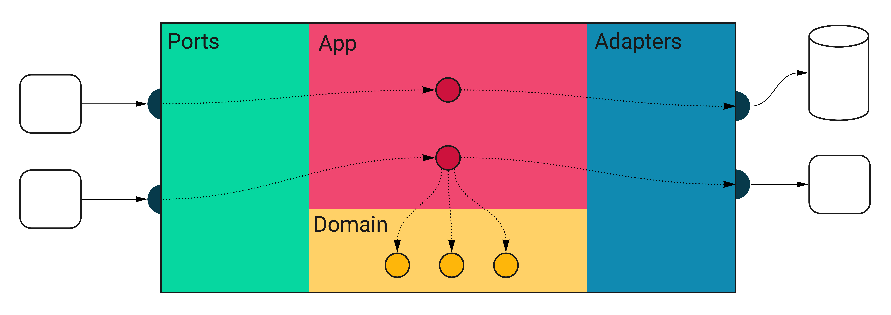
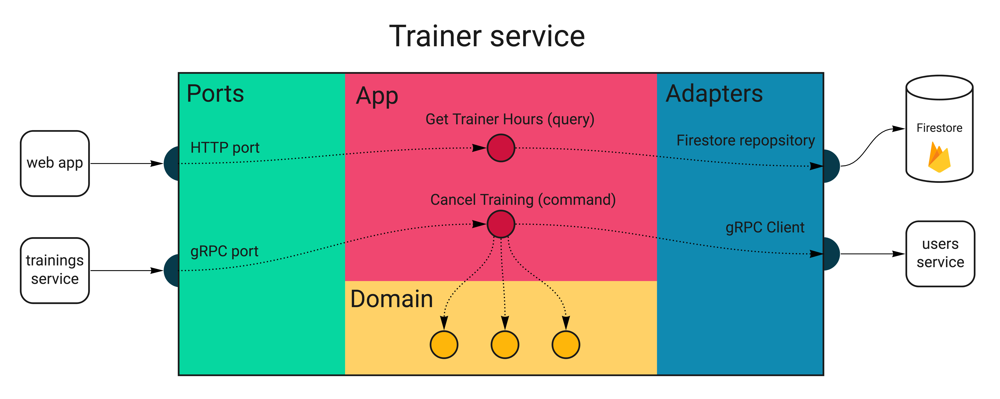
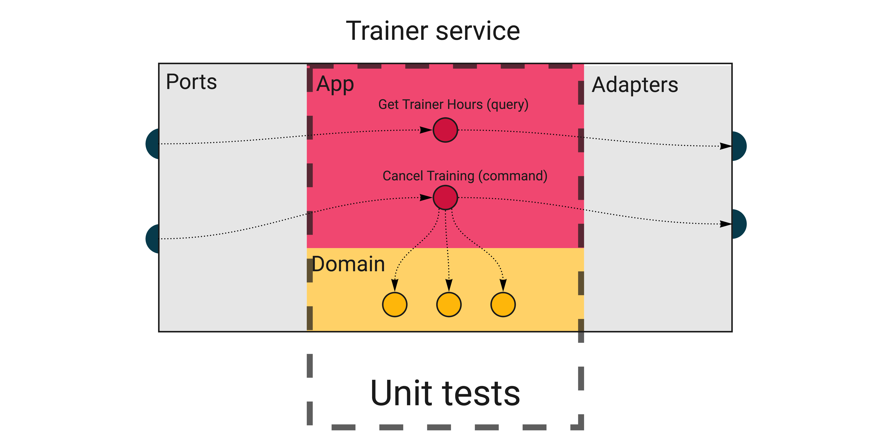
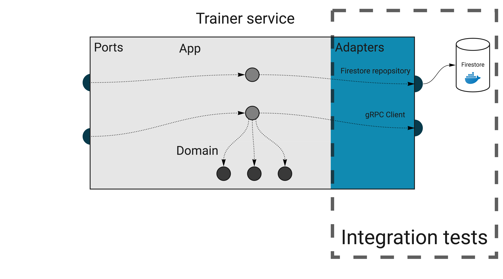
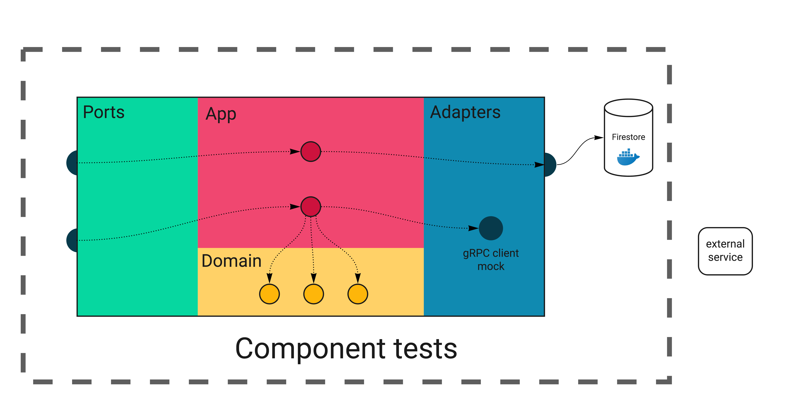
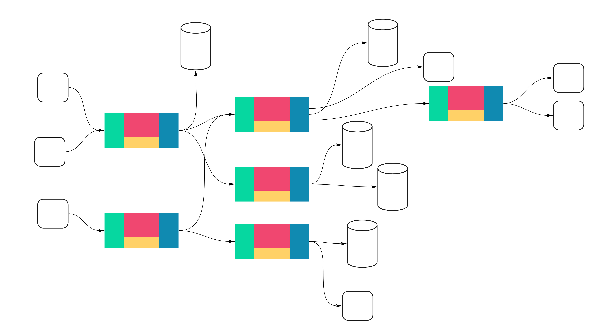
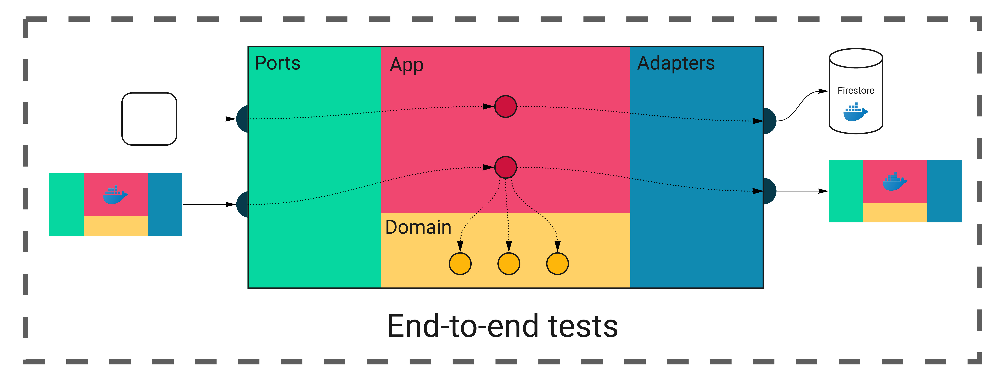
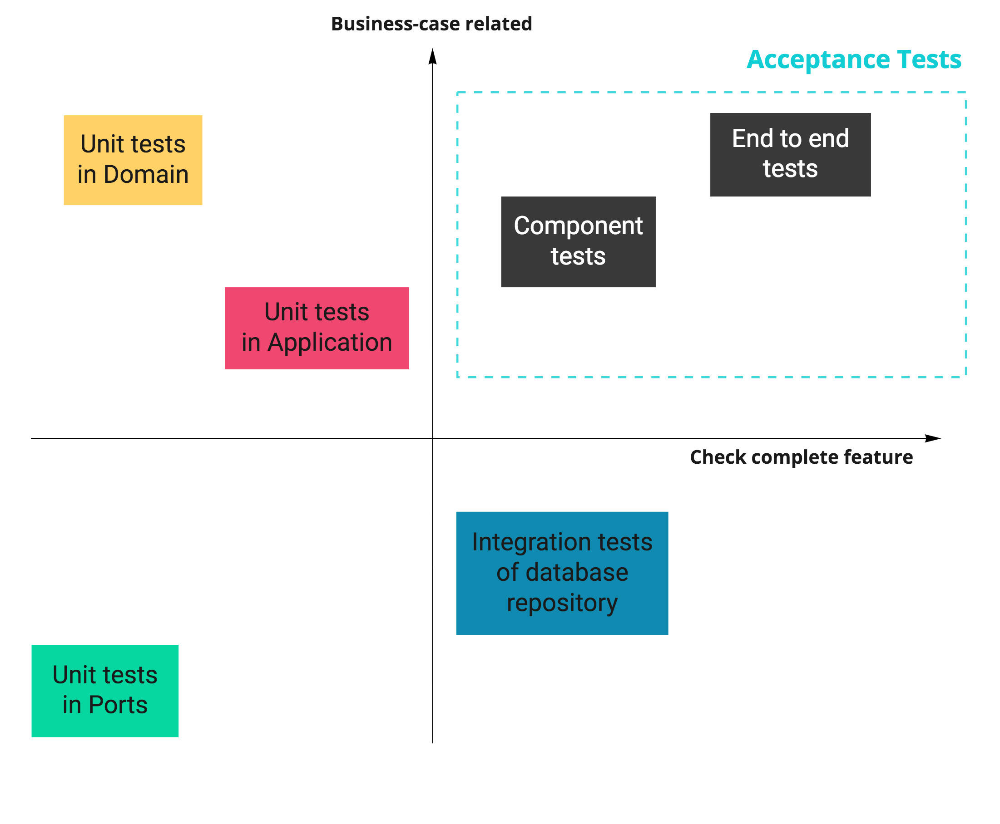

# Тестовая архитектура микросервисов. Можно ли спать спокойно без сквозных тестов? 

Милош Смолка. Технический руководитель [Karhoo](https://www.karhoo.com/). Соучредитель
[Three Dots Labs](https://threedotslabs.com/). Создатель [Watermill](https://github.com/ThreeDotsLabs/watermill).

Вам знакомо редкое чувство, когда вы разрабатываете новое приложение с нуля и 
можете покрыть все строчки надлежащими тестами?

Я сказал "редкое", потому что большую часть времени вы будете работать с 
программным обеспечением с большой историей коммитов, написанным группой 
программистов и не столь очевидным подходом к тестированию. Даже если в коде 
используются правильные шаблоны проектирования, набор тестов не всегда им 
соответствует.

В некоторых проектах не настроена современная среда разработки, поэтому есть 
только модульные тесты для вещей, которые легко тестировать. Например, они 
тестируют функции по отдельности, потому что общедоступный API сложно 
протестировать. Команде разработчиков необходимо вручную проверить все 
изменения, возможно, в какой-то промежуточном сервере (стейдже). Вы знаете, что 
происходит, когда кто-то вносит изменения и не знает, что нужно тестировать их
вручную.

В других проектах нет тестов с самого начала. Это позволяет ускорить разработку,
используя упрощения, например, сохраняя зависимости в глобальном состоянии.
Когда команда разработчиков понимает, что отсутствие тестов вызывает ошибки и 
замедляет их, они решают добавить их. Но сейчас это невозможно сделать правильно.
Поэтому команда пишет сквозной набор тестов с соответствующей инфраструктурой.

Сквозные тесты могут дать вам некоторую уверенность, но **вы не хотите 
поддерживать такой набор тестов.** Его сложно отлаживать, требуется много 
времени для тестирования даже самого простого изменения, а релиз приложения 
занимает часы. Внедрение новых тестов также не является тривиальной задачей в 
этом случае, поэтому разработчики избегают этого, если могут.

Я хочу поделиться некоторыми идеями, которые до сих пор работали для нас и 
должны помочь вам избежать описанных выше случаев.

Эта статья не о том, какая библиотека для тестирования лучше или какие приёмы можно
использовать (хотя я приведу несколько советов). Это ближе к тому, что я бы 
назвал «тестовой архитектурой». Она касается не только вопроса «как», но и 
«где», «что» и «почему».

Существует много дискуссий о различных типах тестов, например, о [«пирамиде 
тестов»](https://martinfowler.com/bliki/TestPyramid.html) (Роберт упомянул 
её в [этом разделе о тестовых случаях](https://threedots.tech/post/database-integration-testing/#2-testing-enough-scenarios-on-all-levels)).
Это полезная модель, о которой стоит помнить. Однако она также абстрактна, и 
его нелегко прощупать. Я хочу применить более практичный подход и показать, 
как ввести несколько видов тестов в проект на Go.

## Зачем заморачиваться с тестами?

Но разве тестовый код также важен, как и остальная часть приложения? Разве мы 
не можем просто признать, что поддерживать тесты в актуальном состоянии сложно, 
и отказаться от них? Не ускорит ли это развитие?

Если вы следили за этим циклом статей, то знаете, что все публикации основаны 
на приложении [Wild Workouts](https://github.com/ThreeDotsLabs/wild-workouts-go-ddd-example).

Когда я начал писать эту статью, локальный запуск тестов у меня даже не 
работал корректно, а это относительно новый проект. Это произошло по одной 
причине: мы не запускаем тесты в CI конвейере.

Это шокирующее заявление, но **даже бессерверное облачное приложение, использующее
самые популярные передовые технологии, может быть замаскированным спагетти-кодом.**

Мы знаем, что теперь мы должны добавить тесты в конвейер. Общеизвестно, что 
это дает вам уверенность в безопасном развертывании изменений в продакшен среде.
Однако за всё приходится платить.

Выполнение тестов, вероятно, займет значительную по времени часть вашего 
конвейера. Если вы не подходите к их разработке и реализации с тем же качеством,
что и к коду приложения, вы можете понять это слишком поздно, когда конвейер будет
работать около часа пока завершиться и случайным образом сбоить. **Даже если код 
вашего приложения хорошо разработан, тесты могут стать узким местом для 
внесения изменений.**

> Это не просто очередная статья со случайными фрагментами кода.
>
> Этот пост является частью большого цикла, показывающий как создавать приложения на
> **Go, которые легко разрабатывать, поддерживать и с ними интересно работать в
> долгосрочной перспективе**. Мы делаем это, делясь проверенными методами, основанными
> на многих экспериментах, проведёнными с возглавляемыми нами с командами,
> и [научных исследованиях](https://threedots.tech/post/ddd-lite-in-go-introduction/#thats-great-but-do-you-have-any-evidence-it-works).
> Вы можете изучить эти методы, создав с нами [полнофункциональный](https://threedots.tech/post/serverless-cloud-run-firebase-modern-go-application/#what-wild-workouts-can-do) пример
> веб-приложения на Go - **Wild Workouts**.
>
> Мы поступили не совсем обычно — **добавили некоторые не сразу заметные проблемы
> в первоначальную реализацию Wild Workouts**. Неужели мы сошли с ума? Пока нет. 😉
> Эти проблемы характерны для многих проектов Go. **В долгосрочной перспективе эти
> небольшие проблемы становятся критичными и не позволяют добавлять новые функционал.**
>
> **Это один из важнейших навыков старшего или ведущего разработчика; всегда нужно
> помнить о долгосрочных последствиях.**
>
> Мы исправим их путем **рефакторинга** Wild Workouts. Таким образом, вы быстро поймёте
> методики, которыми мы делимся.
> Знаете ли вы это чувство, когда прочитали статью о какой-то методике и попытались
> реализовать её, но не смогли из-за упущений и пропуска деталей в руководстве.
> Пропуск деталей делает статьи короче и увеличивает просмотры страниц, но это
> не наша цель. Наша цель — создать материал, который даст достаточно знаний для
> применения представленных методик. Если вы еще не читали [предыдущие статьи из
> этого цикла](https://threedots.tech/series/modern-business-software-in-go/),
> мы настоятельно рекомендуем это сделать.
>
> Мы считаем, что в некоторых областях знаний нельзя пропускать детали. Если вы
> хотите быстро и эффективно создавать сложные приложения, вам нужно потратить
> некоторое время, чтобы узнать как это сделать. Если бы всё было так просто,
> у нас бы не было такого большого количества устрашающего устаревшего кода.
>
> Вот [полный список из 14 опубликованных на данный момент статей](https://threedots.tech/series/modern-business-software-in-go/).
>
> Весь код Wild Workouts доступен на [GitHub](https://github.com/ThreeDotsLabs/wild-workouts-go-ddd-example). Не забудьте поставить звезду
> нашему проекту! ⭐

## Слои

В настоящее время мы провели несколько сессий рефакторинга проекта. Мы ввели
шаблоны, такие как [Репозиторий](https://threedots.tech/post/repository-pattern-in-go/),
[Чистая Архитектура](https://threedots.tech/post/introducing-clean-architecture/) 
и [CQRS](https://threedots.tech/post/basic-cqrs-in-go/). Благодаря четкому 
разделению задач нам гораздо проще рассуждать об отдельных частях проекта.

Давайте вернемся к концепции слоев, которую мы представили в предыдущих постах.
Если у вас не было возможности прочитать их раньше, я рекомендую сделать это, 
прежде чем продолжить — это поможет вам лучше понять эту статью.

Взгляните на диаграмму, которая поможет нам понять структуру проекта. Ниже 
приведен обобщенный сервис, созданный с использованием подхода, применяемого в Wild 
Workouts.



Все внешние входные сигналы поступают слева. Единственная точка входа в 
приложение — через слой **портов** (HTTP обработчики, обработчики сообщений 
шаблона Издатель/Подписчик). Порты выполняют соответствующие обработчики в слое
**приложения**. Некоторые из них будут вызывать код **предметной области**, а некоторые будут 
использовать **адаптеры**, которые являются единственным выходом из сервиса. На 
слое адаптеров находятся ваши запросы к базе данных и HTTP-клиенты.

Диаграмма ниже показывает слои и последовательность действий в сервисе `trainer`
в Wild Workouts.



Давайте теперь посмотрим, какие типы тестов нам понадобятся, чтобы покрыть всё
это.

## Unit тесты

Мы начнём с внутренних слоёв и того, с чем все знакомы: unit тесты.



Слой предметной области — это место, где находится самая сложная логика 
вашего сервиса. Тем не менее, **тесты здесь должны быть одними из самых простых 
для написания и работать очень быстро.** В предметной области нет внешних зависимостей,
поэтому вам не нужна какая-то особая инфраструктура или mocks (кроме 
действительно сложных случаев, но пока не будем их рассматривать).

Как правило, вы должны стремиться к высокому тестовому покрытию в слое предметной
области. Убедитесь, что вы тестируете только экспортированный код 
(_тестирование методом черного ящика_). Добавление суффикса `_test` к названию пакета 
— хорошая практика, позволяющая соблюдать это правило.

Код предметной области представляет собой чистую логику и его легко тестировать, 
так что это лучшее место для проверки всех граничных случаев. Табличные тесты 
особенно хорошо подходят для этого.

```go
func TestFactoryConfig_Validate(t *testing.T) {
    testCases := []struct {
        Name        string
        Config      hour.FactoryConfig
        ExpectedErr string
    }{
        {
            Name: "valid",
            Config: hour.FactoryConfig{
                MaxWeeksInTheFutureToSet: 10,
                MinUtcHour:               10,
                MaxUtcHour:               12,
            },
            ExpectedErr: "",
        },
        {
            Name: "equal_min_and_max_hour",
            Config: hour.FactoryConfig{
                MaxWeeksInTheFutureToSet: 10,
                MinUtcHour:               12,
                MaxUtcHour:               12,
            },
            ExpectedErr: "",
        },

        // ...
    }
    
    for _, c := range testCases {
        t.Run(c.Name, func(t *testing.T) {
            err := c.Config.Validate()
    
            if c.ExpectedErr != "" {
                assert.EqualError(t, err, c.ExpectedErr)
            } else {
                assert.NoError(t, err)
            }
        })
    }
}
```
Весь исходный код: [github.com/ThreeDotsLabs/wild-workouts-go-ddd-example/internal/trainer/domain/hour/hour_test.go](https://github.com/ThreeDotsLabs/wild-workouts-go-ddd-example/blob/6954ccbd8099648fa12120632102e792ff2377ad/internal/trainer/domain/hour/hour_test.go#L137)

Заканчиваем с предметной областью и переходим в слой приложения. После [введения 
CQRS](https://threedots.tech/post/basic-cqrs-in-go/) мы разделили его на команды и запросы.

В зависимости от вашего проекта может ничего не нужно будет тестировать или
может существовать несколько сложных случаев, которые необходимо покрыть. В 
большинстве случаев, особенно в запросах, этот код просто склеивает другие 
слои. Добавление тестов сюда не представляет никакой ценности. Но если в 
командах есть какое-то сложное управление, это ещё один хороший пример для unit
тестов.

> Остерегайтесь сложной логики, находящейся в слое приложения. Если вы начнёте 
> тестировать бизнес-логику здесь, стоит подумать о введении слоя предметной
> области.
> 
> С другой стороны, это идеальное место для управления последовательностью действий - 
> вызывая адаптеры и сервисы в определенном порядке и передавая в них возвращаемые
> значения. Если вы разделите их таким образом, тесты приложения не должны 
> ломаться каждый раз, когда вы меняете код предметной области.

**В командах и запросах приложения много внешних зависимостей**, в отличие от кода
предметной области. Их будет легко имитировать, если вы будете следовать [чистой 
архитектуре](https://threedots.tech/post/introducing-clean-architecture/) и 
использовать принцип инверсии зависимостей (ваш код зависит от интерфейсов, а 
не от структур). В большинстве случаев структура с одним методом будет 
идеальной имитацией.

> Если вы предпочитаете использовать библиотеки для имитации или имитация генерируется
> кодом, то можете их использовать. Go позволяет вам определять и реализовывать 
> небольшие интерфейсы, поэтому мы решили определить mocks самостоятельно, 
> так как это самый простой способ.

Фрагмент кода ниже показывает, как создается команда приложения с внедренными 
mocks.

```go
func newDependencies() dependencies {
    repository := &repositoryMock{}
    trainerService := &trainerServiceMock{}
    userService := &userServiceMock{}
    
    return dependencies{
        repository:     repository,
        trainerService: trainerService,
        userService:    userService,
        handler:        command.NewCancelTrainingHandler(repository, userService, trainerService),
    }
}
    // ...

    deps := newDependencies()
    
    tr := tc.TrainingConstructor()
        deps.repository.Trainings = map[string]training.Training{
        trainingUUID: *tr,
    }
    
    err := deps.handler.Handle(context.Background(), command.CancelTraining{
        TrainingUUID: trainingUUID,
        User:         training.MustNewUser(requestingUserID, tc.UserType),
    })
```
Весь исходный код: [github.com/ThreeDotsLabs/wild-workouts-go-ddd-example/internal/trainings/app/command/cancel_training_test.go](https://github.com/ThreeDotsLabs/wild-workouts-go-ddd-example/blob/22c0a25b67c4669d612a2fa4a434ffae8e35e65a/internal/trainings/app/command/cancel_training_test.go#L73)

Относитесь с осторожностью к добавлению тестов, которые не проверяют ничего важного,
чтобы в конечном итоге не тестировать mocks. Сосредоточьтесь на логике, а если 
ее нет, вообще пропустите тест.

Мы покрыли тестами два внутренних слоя. Думаю, пока это не казалось чем-то 
новым, поскольку мы все знакомы с unit тестами. Однако [модель зрелости возможностей
непрерывной доставки](https://www.infoq.com/articles/Continuous-Delivery-Maturity-Model/) приводит их только на "базовом" уровне зрелости. Давайте 
теперь рассмотрим интеграционное тестирование.

## Интеграционное тестирование

Прочитав этот заголовок, вы только что представили себе долгоиграющий тест, 
который нужно повторять несколько раз, чтобы он успешно выполнился? И это 
из-за того, что кто-то добавил 30-секундную задержку, которая оказывается 
слишком короткой, когда Jenkins работает под нагрузкой?

**У интеграционных тестов нет причин быть медленными и ненадежными. И такие 
практики, как автоматические повторные попытки и увеличение времени задержки, 
должны быть исключены.**

В нашем случае **интеграционный тест — это тест, который проверяет правильность 
работы адаптера с внешней инфраструктурой.** В большинстве случаев это означает 
тестирование репозиториев баз данных.

Эти тесты предназначены не для проверки правильности работы базы данных, а для 
проверки того, правильно ли вы ее используете (правильно ли она **интегрирована**).
Это также отличный способ проверить, знаете ли вы, как использовать 
внутренние механизмы базы данных, например, обрабатывать транзакции.



Поскольку нам нужна реальная инфраструктура, **интеграционные тесты сложнее 
писать и поддерживать, чем unit тесты.** Обычно мы можем использовать 
docker-compose для запуска всех зависимостей.

> Должны ли мы тестировать наше приложение с версией базы данных в Docker? 
> Образ Docker почти всегда будет немного отличаться от того, что мы запускаем 
> в продакшен среде. В некоторых случаях, например в Firestore, доступен только 
> эмулятор, а не реальная база данных.
> 
> Действительно, Docker не отражает точную инфраструктуру, которую вы 
> используете в продакшен среде. Однако у вас гораздо больше шансов написать 
> SQL-запрос в коде, чем столкнуться с проблемами из-за незначительной разницы 
> в конфигурации.
> 
> Хорошей практикой является использование той же версии образа, которая запушена
> на проде. Использование Docker не даст вам 100%-го паритета, но оно устраняет 
> проблемы «работает на моей машине» и тестирует ваш код с надлежащей инфраструктурой.

Роберт подробно рассмотрел интеграционные тесты для баз данных в статье [Четыре
практических принципа высококачественных интеграционных тестов баз данных в Go](https://threedots.tech/post/database-integration-testing/#2-testing-enough-scenarios-on-all-levels).

## Стремитесь, чтобы интеграционные тесты были стабильными и быстрыми

При работе с сетевыми вызовами и базами данных скорость тестирования становится
очень важной. Крайне важно запускать тесты параллельно, что можно включить в Go, 
вызвав `t.Parallel()`. Это кажется очевидным, но мы должны убедиться, что наши 
тесты поддерживают такой способ запуска.

Например, рассмотрим такой простой тестовый случай:

1. Проверить пуста ли коллекция `trainings`.
2. Вызвать метод репозитория, который добавляет тренировку.
3. Проверить, что в коллекции только одна тренировка.

Если другой тест использует ту же коллекцию, вы получите случайные неудачи при 
выполнении теста из-за состояния гонки. Иногда коллекция будет содержать 
несколько тренировок, которые мы только что добавили.

Самый простой выход из этого — никогда не проверять в тестах такие вещи, как
длина списка, а проверять именно то, что мы тестируем. Например, мы могли бы 
получить все тренировки, а затем перебрать список, чтобы проверить, присутствует 
ли ожидаемый идентификатор.

Другой подход — как-то изолировать тесты, чтобы они не мешали друг другу.
Например, каждый тестовый случай может работать в уникальном пользовательском 
контексте (см. тесты компонентов ниже).

Конечно, обе методики более сложные, чем простое сравнение длины. **Когда вы 
впервые сталкиваетесь с этой проблемой, может возникнуть соблазн сдаться и 
решить, что «наши интеграционные тесты не должны выполняться параллельно».
Не делайте этого.** Иногда вам нужно будет проявить творческий подход, но в 
конце концов это не так уж много усилий. В свою очередь, ваши интеграционные 
тесты будут стабильными и будут работать так же быстро, как модульные тесты.

Если вы создаете новую базу данных перед каждым запуском, это 
ещё один признак того, что вы можете переписать тесты, чтобы они не мешали 
друг другу.

> Предупреждение! Обычная, трудно обнаруживаемая ошибка при переборе 
> тестовых случаев.
> 
> При работе с табличными тестами вы часто будете видеть такой код:
> 
> ```go
> for _, c := range testCases {
>     t.Run(c.Name, func(t *testing.T) {
>          // ...
>     })
> }
> ```
> 
> Это идиоматический способ запускать тесты, когда они находятся в срезе тестовых случаев.
> Допустим, теперь вы хотите запустить каждый тестовый пример параллельно. Решение 
> кажется тривиальным:
> ```go
> for _, c := range testCases {
>     t.Run(c.Name, func(t *testing.T) {
>         t.Parallel()
>         // ...
>     })
> }
> ``` 
> К сожалению, это не будет работать как ожидается.
> 
> На странице [Распространенные ошибки](https://github.com/golang/go/wiki/CommonMistakes) на вики-сайте Go на GitHub перечислены 
> только два пункта и оба на самом деле об одном и том же. Так что, кажется, что
> существует только одна ошибка, о которой вам следует беспокоиться в Go. 🙂
> Однако иногда его действительно трудно заметить.
> Сначала это не очевидно, но добавление `t.Parallel()` приводит к тому, что
> родительская функция не ждёт подтестов, вызываемых `t.Run`. Из-за этого вы 
> не можете безопасно использовать переменную цикла `c` внутри замыкания `func`.
> 
> Запуск подобных тестов обычно приводит к тому, что все подтесты работают с 
> последним тестовым набором, игнорируя все остальные. **Хуже всего то, что тесты 
> пройдут, и вы увидите правильные имена подтестов при запуске `go test` с 
> флагом `-v`.** Единственный способ заметить эту проблему — изменить код, 
> так, что тесты не проходились, и вместо этого увидеть, как они успешно выполнились.
> 
> Как упоминается в вики, один из способов исправить это — ввести новую 
> переменную области видимости:
> ```go
> for _, c := range testCases {
>     c := c
>     t.Run(c.Name, func(t *testing.T) {
>         t.Parallel()
>         // ...
>     }
> }
> ```
> 
> Это просто дело вкуса, но нам такой подход не нравится, 
> так как выглядит какой-то магией для тех, кто не знает, что это значит. Вместо 
> этого мы выбираем более подробный, но очевидный подход:
> ```go
> for i := range testCases {
>     c := testCases[i]
>     t.Run(c.Name, func(t *testing.T) {
>         t.Parallel()
>         // ...
>     })  
> }
> ```
> 
> Даже если вы знаете об этом поведении, опасно легко злоупотребить им. Что еще
> хуже, кажется, популярные линтеры не проверяют это по умолчанию — если 
> знаете линтер, который делает это хорошо, поделитесь, пожалуйста, в 
> комментариях.
> 
> Мы допустили эту ошибку в библиотеке [Watermill](https://github.com/ThreeDotsLabs/watermill), из-за которой некоторые 
> тесты вообще не запускались. Вы можете увидеть исправление в [этом коммите](https://github.com/ThreeDotsLabs/watermill/commit/c72e26a67cb763ab3dd93ecf57a2b298fc81dd19).

Мы покрыли репозитории баз данных тестами, но у нас также есть клиентский gRPC
адаптер. Как мы должны проверить его?

В этом смысле он похож на слой приложения. Если ваш тест будет дублировать 
проверяемый код, вероятно, нет смысла его добавлять. Это просто становится 
дополнительной работой при изменении кода.

Рассмотрим адаптер gRPC сервиса пользователей:

```go
func (s UsersGrpc) UpdateTrainingBalance(ctx context.Context, userID string, amountChange int) error {
    _, err := s.client.UpdateTrainingBalance(ctx, &users.UpdateTrainingBalanceRequest{
        UserId:       userID,
        AmountChange: int64(amountChange),
    })
    
    return err
}
```
Весь исходный код: [github.com/ThreeDotsLabs/wild-workouts-go-ddd-example/internal/trainings/adapters/users_grpc.go](https://github.com/ThreeDotsLabs/wild-workouts-go-ddd-example/blob/22c0a25b67c4669d612a2fa4a434ffae8e35e65a/internal/trainings/adapters/users_grpc.go#L17)

Здесь не происходит ничего интересного для тестирования. Мы могли бы внедрить 
фиктивный клиент (`client`) и проверить, был ли вызван правильный метод. Но так мы ничего не 
протестируем и каждое изменение в коде потребует соответствующего изменения в 
тесте.

## Тесты компонентов

До сих пор мы создавали в основном узкие, специализированные тесты для 
изолированных частей приложения. Такие тесты отлично подходят для проверки 
граничных случаев и конкретных сценариев, **но это не означает, что каждый сервис 
работает правильно.** Достаточно легко забыть вызвать обработчик приложения из 
порта. Кроме того, одни только unit тесты не помогут нам убедиться, что 
приложение все еще работает после серьезного рефакторинга.

Не пора ли провести сквозное тестирование всех наших сервисов? Еще нет.

Поскольку не существует стандарта выполнения различных типов тестов, я рекомендую 
вам последовать совету [Саймона Стюарта из его поста о размерах тестов](https://testing.googleblog.com/2010/12/test-sizes.html).
Создайте таблицу, из которой всем в команде будет понятно, чего ожидать от 
конкретного теста. Затем вы можете исключить все (непродуктивные) обсуждения по 
теме.

В нашем случае таблица может выглядеть так:

| Особенность    | Unit |    Интеграционные | Компонентов | Сквозные | 
| ----------- | ----------- | ----- | ------ | ------ |
| База данных в Docker      | Нет       | Да | Да | Да |
| Использует внешние системы  | Нет        | Нет | Нет | Нет |
| Ориентирован на бизнес-кейсы  | Зависит от тестируемого кода        | Нет | Да | Да |
| Использует mocks  | Для большинства зависимостей        | Обычно нет | Для внешних систем | Нет |
| Тестируемое API  | Go пакет        | Go пакет | HTTP и gRPC | HTTP |

Чтобы гарантировать корректную внутреннюю работу каждого сервиса, **мы вводим тесты
компоненты для проверки как все слои работают вместе.** Тест компонента покрывает 
один сервис, изолированный от других сервисов в приложении.

Мы будем вызывать настоящие обработчики портов и использовать инфраструктуру, 
предоставляемую Docker. Однако мы будем **имитировать все адаптеры, работающие с 
внешними сервисами.**



Возможно вы спросите: почему бы не протестировать и внешние сервисы? В конце 
концов, мы могли бы использовать контейнеры Docker и протестировать их все 
вместе.

Проблема заключается в сложности тестирования нескольких подключенных сервисов.
Если у вас только пара из них, это может работать достаточно хорошо. Но помните, вам
нужна надлежащая инфраструктура для каждого сервиса, который вы запускаете, 
включая все используемые базы данных и все вызываемые внешние службы. В общей сложности
это легко могут быть десятки сервисов, обычно принадлежащих нескольким командам
разработчиков.



Вы не хотите, чтобы это было вашим основным подходом к тестированию.

Мы будем использовать такой подход далее, в сквозных тестах. А пока мы добавляем 
тесты компонентов, потому что нам нужен быстрый способ узнать, правильно ли работает
сервис.

Чтобы лучше понять, почему важно иметь тесты компонентов, я предлагаю 
взглянуть на некоторые цитаты из [Accelerate](https://itrevolution.com/book/accelerate/).

> Если вы еще не слышали об Accelerate, это книга, в которой описываются 
> исследования высокопроизводительных команд разработчиков программного обеспечения.
> Я рекомендую прочитать ее, чтобы узнать, что может помочь вашей команде работать
> быстрее.

Согласно книге, это то, что лучшие команды разработчиков программного 
обеспечения говорили о тестируемости.

> Мы можем выполнять большую часть нашего тестирования, без интегрированной среды.
> Мы можем развертывать или делать релиз нашего приложения независимо от других
> приложений/сервисов, от которых оно зависит.
> 
> [Accelerate](https://itrevolution.com/book/accelerate/)

Подождите, разве микросервисы не должны были исправить зависимость команд 
разработчиков друг от друга? Если вы считаете, что добиться этого в приложении, 
над которым работаете, невозможно, скорее всего, это связано с неудачным выбором 
архитектуры. Вы можете исправить это, применив стратегические шаблоны DDD, о 
которых мы планируем рассказать в будущих статьях.

В _Accelerate_ также говорится, что:

> К сожалению, в реальной жизни многие так называемые сервис-ориентированные 
> архитектуры не позволяют тестировать и развертывать сервисы независимо друг 
> от друга и, таким образом, не позволяют командам достигать более высокой 
> производительности.
>
> [Accelerate](https://itrevolution.com/book/accelerate/)

Мы поднимаем этот вопрос в цикле: **использование микросервисов само по себе не 
делает ваше приложение и команды разработчиков менее связанными. Разделение 
требует сознательного проектирования архитектуры приложения и на системном уровне.**

**В компонентных тестах наша цель — проверить полноту отдельного сервиса 
изолированно со всей необходимой ей инфраструктурой.** Мы следим за тем, чтобы 
сервис принимал API, о котором мы договорились, и отвечал ожидаемыми результатами.

Эти тесты технически более сложны, но все же относительно просты. Мы не будем 
запускать реальный двоичный файл сервиса, потому что нам нужно имитировать 
некоторые зависимости. Мы должны изменить способ запуска сервиса, чтобы это 
было возможно.

> Еще раз, если вы следуете принципу инверсии зависимостей (просто напомню, 
> что это часть SOLID), внедрение mocks на уровне cthdbcf должно быть 
> тривиальным.

Я написал два конструктора для нашей структуры `app.Application`, которая 
содержит все команды и запросы. Первый работает так же, как и раньше, 
настраивая настоящие gRPC клиенты и внедряя их. Второй заменяет их mocks.

```go
func NewApplication(ctx context.Context) (app.Application, func()) {
	// ...
	
    trainerGrpc := adapters.NewTrainerGrpc(trainerClient)
    usersGrpc := adapters.NewUsersGrpc(usersClient)
    
    return newApplication(ctx, trainerGrpc, usersGrpc),
    // ...
}

func NewComponentTestApplication(ctx context.Context) app.Application {
    return newApplication(ctx, TrainerServiceMock{}, UserServiceMock{})
}
```
Весь исходный код: [github.com/ThreeDotsLabs/wild-workouts-go-ddd-example/internal/trainings/service/service.go](https://github.com/ThreeDotsLabs/wild-workouts-go-ddd-example/blob/0e3e9d80eb14639bc42935795f7ca3b73da36304/internal/trainings/service/service.go#L35)

Теперь мы можем просто запустить службу в отдельной горутине.

Мы хотим запускать только один экземпляр сервиса для всех тестов, поэтому 
используем функцию `TestMain`. Это простой способ настроить тесты перед 
запуском.

```go
func startService() bool {
    app := NewComponentTestApplication(context.Background())
    
    trainingsHTTPAddr := os.Getenv("TRAININGS_HTTP_ADDR")
    go server.RunHTTPServerOnAddr(trainingsHTTPAddr, func(router chi.Router) http.Handler {
        return ports.HandlerFromMux(ports.NewHttpServer(app), router)
    })
    
    ok := tests.WaitForPort(trainingsHTTPAddr)
    if !ok {
        log.Println("Timed out waiting for trainings HTTP to come up")
    }
    
    return ok
}

func TestMain(m *testing.M) {
    if !startService() {
        os.Exit(1)
    }
    
    os.Exit(m.Run())
}
```
Весь исходный код: [github.com/ThreeDotsLabs/wild-workouts-go-ddd-example/internal/trainings/service/component_test.go](https://github.com/ThreeDotsLabs/wild-workouts-go-ddd-example/blob/0e3e9d80eb14639bc42935795f7ca3b73da36304/internal/trainings/service/component_test.go#L58)

Я создал вспомогательную функцию `WaitForPort`, которая ожидает, пока указанный 
порт не откроется или не истечет время ожидания. Это очень важно, так как вам 
нужно убедиться, что сервис запущен правильно. **Не заменяйте её задержкой.** 
Вы либо добавите слишком большую задержку и сделаете тест медленным, либо 
сделаете её слишком коротким, и он случайно не пройдет.

Что тестировать в компонентных тестах? **Обычно успешного случая должно быть 
достаточно. Не проверяйте там граничные случаи. Модульные и интеграционные 
тесты уже должны охватывать их.** Убедитесь, что обрабатываются правильные 
полезные данные, работает хранилище и верны ответы.

## Вызываем порты

Я использую HTTP-клиенты, сгенерированные openapi-codegen. Как и в случае с 
серверной частью, это значительно упрощает написание тестов. Например, вам не 
нужно указывать весь REST путь и каждый раз беспокоиться о преобразовании в 
JSON.

Несмотря на то, что сгенерированные клиенты избавили нас от большого количества
дублированного кода, я всё же добавил я все же добавил файл `test/client.go` с
клиентскими обертками для целей тестирования.

```go
func (c TrainingsHTTPClient) CreateTraining(t *testing.T, note string, hour time.Time) string {
	response, err := c.client.CreateTrainingWithResponse(context.Background(), trainings.CreateTrainingJSONRequestBody{
		Notes: note,
		Time:  hour,
	})
	require.NoError(t, err)
	require.Equal(t, http.StatusNoContent, response.StatusCode())

	contentLocation := response.HTTPResponse.Header.Get("content-location")

	return lastPathElement(contentLocation)
}
```
Весь исходный код: [github.com/ThreeDotsLabs/wild-workouts-go-ddd-example/internal/common/tests/clients.go](https://github.com/ThreeDotsLabs/wild-workouts-go-ddd-example/blob/0e3e9d80eb14639bc42935795f7ca3b73da36304/internal/common/tests/clients.go#L88)

Тесты становятся еще более читабельными, и легко понять, что происходит.
**Сделать так, чтобы тесты успешно выполнялись достаточно легко, но гораздо 
сложнее понять их при код ревью, читая все accert и mocks.** Это вдвойне важно 
при модификации тестов.

Вместо приведенного выше фрагмента теперь мы можем использовать одну строку, 
в которой четко указано, что происходит.

```go
trainingUUID := client.CreateTraining(t, "some note", hour)
```
Весь исходный код: [github.com/ThreeDotsLabs/wild-workouts-go-ddd-example/internal/trainings/service/component_test.go](https://github.com/ThreeDotsLabs/wild-workouts-go-ddd-example/blob/0e3e9d80eb14639bc42935795f7ca3b73da36304/internal/trainings/service/component_test.go#L25)

Другими вспомогательными методами являются `FakeAttendeeJWT` и `FakeTrainerJWT`. 
Они генерируют валидные токены авторизации с выбранной ролью.

Поскольку gRPC использует структуры, сгенерированные из protobuf, клиенты уже 
просты в использовании.

## Сквозные тесты

Наконец, мы подошли к самой страшной части нашего набора тестов. Теперь мы 
не будем использовать mocks.

**Сквозные тесты проверяют совместную работу всей вашей системы. Они медленные, 
подвержены ошибкам и их сложно поддерживать.** Они вам все еще нужны, но 
убедитесь, что они созданы хорошо.

В Wild Workouts это будет похоже на запуск тестов компонентов, за исключением 
того, что мы собираемся запустить все сервисы внутри docker-compose. Затем мы 
проверим несколько критических путей, вызывающих только конечные точки HTTP, 
поскольку это то, что мы предоставляем внешнему миру.

> Если вы не можете запустить всю платформу на docker-compose, вам нужно найти 
> аналогичный подход. Это может быть отдельный кластер Kubernetes или 
> пространство имен, если вы его уже используете, или какая-то stage среда.



Теперь наступает та часть, где у вас будет больше вопросов, чем ответов. 
Где хранить сквозные тесты? Какая команда должна им содержать? Где их 
запустить? Как часто? Должны ли они быть частью конвейера CI/CD или запускаться
отдельно по cronjob?

Я не могу дать вам четких ответов, так как это сильно зависит от структуры 
вашей команды, организационной культуры и настройки CI/CD. Как и в случае с 
большинством проблем, попробуйте подход, который кажется лучшим, и повторяйте 
его, пока не будете довольны.

Нам повезло, что у всего приложения всего три сервиса, и все они используют 
одну и ту же базу данных. По мере роста количества сервисов и зависимостей ваше 
приложение будет все труднее тестировать таким образом.

Старайтесь, чтобы сквозные тесты были короткими. **Они должны проверять, 
правильно ли объединяются сервисы, а не логику внутри них.** Эти тесты работают 
как двойная проверка. Они не должны давать сбоев в большинстве случаев, а если 
они случаются, это обычно означает, что кто-то нарушил контракт.

> Я сказал, что мы будем использовать только конечные точки HTTP, поскольку 
> они открыты для всех. Есть одно исключение: мы вызываем сервис `users` с помощью
> gRPC, чтобы изменить баланс тренировок для нашего тестового посетителя. Как 
> и следовало ожидать, эта конечная точка недоступна публично.

Код очень близок к тому, что мы делали в тестах компонентов. Основное отличие 
в том, что мы больше не запускаем сервис в отдельной горутине. Вместо этого все
сервисы работают внутри docker-compose с использованием тех же двоичных файлов, 
которые мы развертываем в продакшен среде.

```go
user := usersHTTPClient.GetCurrentUser(t)
originalBalance := user.Balance

_, err = usersGrpcClient.UpdateTrainingBalance(context.Background(), &users.UpdateTrainingBalanceRequest{
    UserId:       userID,
    AmountChange: 1,
})
require.NoError(t, err)
user = usersHTTPClient.GetCurrentUser(t)
require.Equal(t, originalBalance+1, user.Balance, "Attendee's balance should be updated")

trainingUUID := trainingsHTTPClient.CreateTraining(t, "some note", hour)

trainingsResponse := trainingsHTTPClient.GetTrainings(t)
require.Len(t, trainingsResponse.Trainings, 1)
require.Equal(t, trainingUUID, trainingsResponse.Trainings[0].Uuid, "Attendee should see the training")

user = usersHTTPClient.GetCurrentUser(t)
require.Equal(t, originalBalance, user.Balance, "Attendee's balance should be updated after a training is scheduled")
```
Весь исходный код: [github.com/ThreeDotsLabs/wild-workouts-go-ddd-example/internal/common/tests/e2e_test.go](https://github.com/ThreeDotsLabs/wild-workouts-go-ddd-example/blob/0e3e9d80eb14639bc42935795f7ca3b73da36304/internal/common/tests/e2e_test.go#L49)

## Приемочные тесты

Часто приемочные тесты определяются как следующий уровень после unit и 
интеграционных тестов. Мы считаем их ортогональными по отношению к техническим 
аспектам тестов. Это тест, который фокусируется на бизнес-логике, а не 
на деталях реализации. Как говорит Мартин Фаулер:

> Вот в чем дело: в какой-то момент вы должны убедиться, что ваше программное 
> обеспечение работает правильно с точки зрения пользователя, а не только с 
> технической точки зрения. То, как вы называете эти тесты, на самом деле 
> не так важно. Тем не менее эти тесты нужны. Выберите термин, придерживайтесь 
> его и напишите эти тесты.
> 
> [Приемочные тесты — правильно ли работают ваши функции?](https://martinfowler.com/articles/practical-test-pyramid.html)

В нашем случае и компонентные, и сквозные тесты можно считать приемочными 
тестами.

Если хотите, вы можете использовать [BDD](https://en.wikipedia.org/wiki/Behavior-driven_development) стиль для некоторых из них — это 
облегчает их чтение, но добавляет некоторый дублирующийся код.



## Можем ли мы теперь спать спокойно?

> Сервис на самом деле не протестирован, пока мы не сломаем его в продакшене.
> 
> [Джесси Роббинс, из Справочника DevOps](https://itrevolution.com/the-devops-handbook/)

Надежный набор тестов выявит большинство ваших ошибок, чтобы вы могли стабильно 
выполнять поставленные задачи. Но вы всё равно хотите быть готовым к сбоям.
Теперь мы переходим к теме мониторинга, наблюдаемости и теории хаоса в 
проектировании. Однако это не входит в нашу сегодняшнюю тему.

Просто имейте в виду, что ни один набор тестов не даст вам полной уверенности. 
Также крайне важно иметь простой процесс, позволяющий быстро выполнять откаты, 
возвраты и отмену миграций.

## Что дальше?

Если вы просмотрите [полный коммит](https://github.com/ThreeDotsLabs/wild-workouts-go-ddd-example/commit/0e3e9d80eb14639bc42935795f7ca3b73da36304), то заметите, что сейчас мы 
внедряем зависимости не очень элегантно. Мы собираемся поговорить об этом в 
будущем.

У нас есть набор тестов, но мы все еще упускаем важную часть: он не работает в 
нашем конвейере непрерывной интеграции.

Кроме того, придумать правильный docker-compose и переменные окружения для 
тестов было непросто. Текущее решение работает, но его непросто понять, если вы
не знаете, что происходит. А запуск тестов в автоматизированной сборке только
усложнит задачу.

Я расскажу об этих темах в другой статье через несколько недель, уделив больше 
внимания инфраструктуре и CI/CD в целом. Мы планируем писать на более сложные
темы в 2021 году, и Роберт начнет с поста о безопасных репозиториях.

Берегите себя, и до скорой встречи! 👋