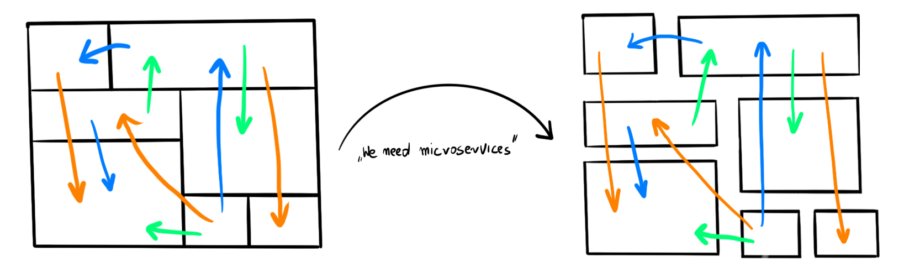
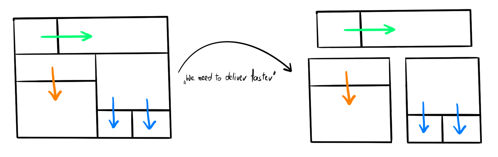
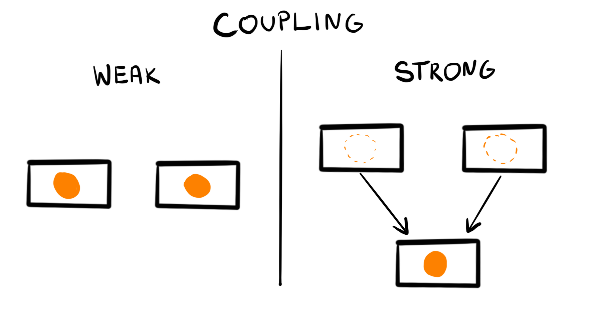
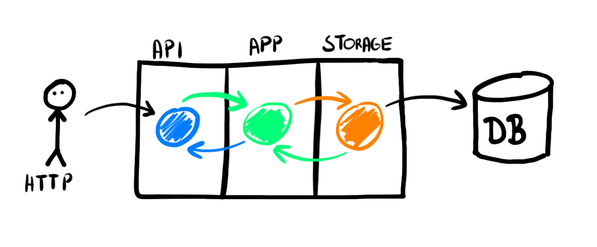
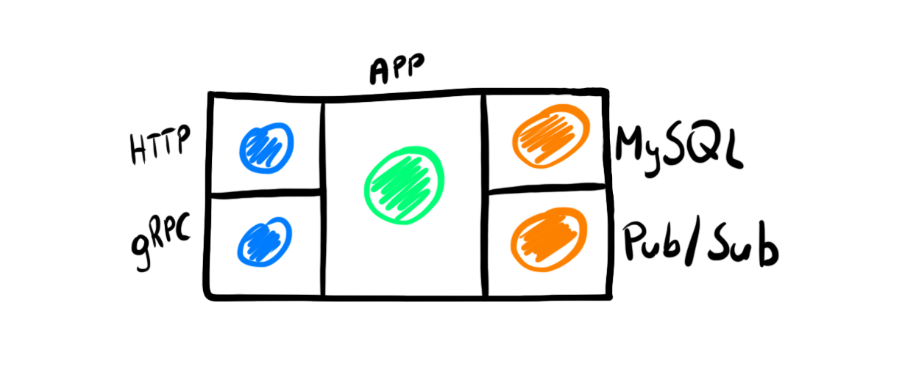
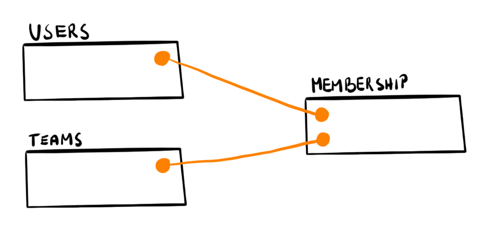
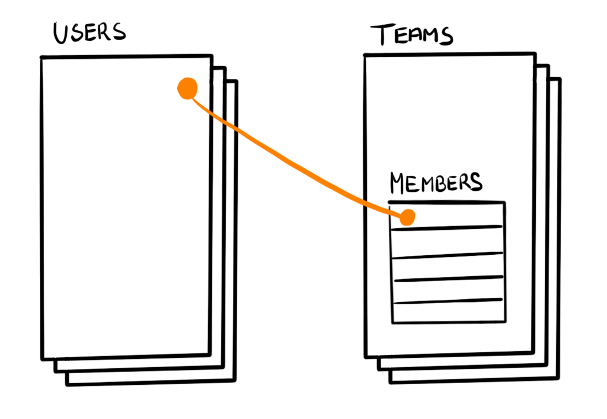

# Распространенные антипаттерны в веб-приложениях на Go

Милош Смолка. Технический руководитель [Karhoo](https://www.karhoo.com/). Соучредитель
[Three Dots Labs](https://threedotslabs.com/). Создатель [Watermill](https://github.com/ThreeDotsLabs/watermill).

В какой-то момент своей карьеры я больше не был в восторге от программного 
обеспечения, которое создавал.

Моя любимая часть работы — низкоуровневые детали и сложные алгоритмы. 
После перехода на приложения, ориентированные на пользователя, они в основном 
исчезли. Казалось, что программирование — это перемещение данных из одного 
места в другое с использованием существующих библиотек и инструментов. То, что 
я узнал до сих пор о программном обеспечении, уже не было столь полезным.

Посмотрим правде в глаза: большинство веб-приложений не решают сложных 
технических задач. Они должны правильно моделировать продукт и позволять 
улучшать его быстрее конкурентов.

Сначала это кажется скучным, но потом вы понимаете, что поддерживать эту 
цель сложнее, чем кажется. Там совсем другой набор задач. Даже если они не так
сложны в техническом смысле, их решение оказывает огромное влияние на продукт 
и приносит глубокое удовлетворение.

**Самая большая проблема, с которой сталкиваются веб-приложения, заключается в 
том, чтобы не превратиться в неуправляемый большой запутанный клубок. Это 
замедляет работу и может вывести вас из бизнеса.**

Вот почему это происходит в Go и как я научился этого избегать.

## Слабая связанность ключ к решению проблемы

Основная причина, по которой приложения трудно поддерживать, — это сильная 
связанность.

**В сильно связанных приложениях всё, к чему вы прикасаетесь, имеет неожиданные 
побочные эффекты.** Каждая попытка рефакторинга выявляет новые проблемы. В 
конце концов, вы решаете, что лучше всего переписать проект с нуля. В 
быстрорастущем продукте вы не можете позволить себе заморозить всю разработку, 
чтобы переделать то, что создали. У вас нет гарантии, что на этот раз вы все 
сделаете правильно.

Напротив, **слабосвязанные приложения сохраняют четкие границы.** Они позволяют 
заменить сломанную часть без влияния на остальную часть проекта. Их проще 
создавать и обслуживать. Так почему же они так редко встречаются?

Микросервисы обещали нам слабую связанность, но время их хайпа уже прошло, а
неподдерживаемые приложения всё ещё существуют. Иногда бывает даже хуже, и мы 
попадаем в ловушку распределенных монолитов, решая те же проблемы, что и 
раньше, с дополнительными сетевыми издержками.


От сильносвязанного монолита к распределенному монолиту.

> Антипаттерн: Распределенный монолит
> Не разбивайте свое приложение на микросервисы, пока не узнаете их границы.

Микросервисы не снижают связность, потому что **не важно, сколько раз вы 
разделяете приложение. Важно то, как вы соедините составные части.**


От модульного монолита до слабосвязанных микросервисов.

> Тактика: слабая связанность
> Стремитесь к слабо связанным модулям. То, как вы их развертываете (в виде 
> модульного монолита или микросервисов), зависит от реализации.

## Принцип DRY приводит к связанности

Сильная связь является обычным явлением, потому что нас рано учат правилу 
«Не повторяйся» (DRY).

Короткие правила легко запомнить, но трудно уловить все детали в двух словах.
В книге _Программист‑прагматик_ предложена более длинная версия:

> Каждая часть знаний должна иметь единственное, недвусмысленное, 
> авторитетное представление в системе.

"Каждая часть знаний" звучит довольно категорично. Ответ на большинство 
дилемм программирования — «это зависит от конкретной ситуации», и DRY 
не является исключением.

**Когда вы пишете код для двух объектов, использующих общую абстракцию, вы создаете связанность.
Если вы слишком строго следуете DRY, вы добавляете абстракции до того, как 
они понадобятся.**



## Использование принципа DRY в Go

По сравнению с другими современными языками Go является явным и лишенным 
некоторого функционала. В нём не так много синтаксического сахара, чтобы скрыть
сложность.

Мы привыкли к упрощениям, поэтому поначалу трудно принять многословие Go. Как 
будто у нас развился инстинкт находить «более умные» способы написания кода.

Лучший пример — обработка ошибок. Если у вас есть опыт написания Go, этот 
фрагмент покажется вам естественным:

```go
if err != nil {
    return err
}
```

Для новичков повторение этих трех строк снова и снова кажется нарушением 
правила DRY. Они часто ищут способ избежать этого шаблона, но это никогда не 
заканчивается хорошо.

В конце концов, все признают, что именно так работает Go. **Это заставляет вас 
повторяться, но это не то повторение, которого DRY советует вам избегать.**

## Единственная модель приводит к связанности вашего приложения

В Go существует одна особенность, которая приводит к сильной связанности и
заставляет вас думать, что вы следуете DRY. Язык позволяет использовать несколько
дескрипторов полей в одной структуре. Это кажется хорошей идеей, потому что мы 
часто используем _похожие_ модели для разных целей.

Вот популярный способ использования только одной модели `User`.

```go
type User struct {
    ID           int        `json:"id" gorm:"primaryKey"`
    FirstName    string     `json:"first_name" validate:"required_without=LastName"`
    LastName     string     `json:"last_name" validate:"required_without=FirstName"`
    DisplayName  string     `json:"display_name"`
    Email        string     `json:"email,omitempty" gorm:"-"`
    Emails       []Email    `json:"emails" validate:"required,dive" gorm:"constraint:OnDelete:CASCADE"`
    PasswordHash string     `json:"-"`
    LastIP       string     `json:"-"`
    CreatedAt    *time.Time `json:"-"`
    UpdatedAt    *time.Time `json:"-"`
}

type Email struct {
    ID      int    `json:"-" gorm:"primaryKey"`
    Address string `json:"address" validate:"required,email" gorm:"size:256;uniqueIndex"`
    Primary bool   `json:"primary"`
    UserID  int    `json:"-"`
}
```
Весь исходный код: [github.com/ThreeDotsLabs/go-web-app-antipatterns/01-coupling/01-tightly-coupled/internal/user.go](https://github.com/ThreeDotsLabs/go-web-app-antipatterns/blob/ab94d47350756716a7fed42b7ae546c51c11406a/01-coupling/01-tightly-coupled/internal/user.go#L9)

Этот подход требует несколько строк кода и заставляет вас поддерживать только 
одну структуру.

Однако, чтобы подогнать все под одну модель, нужно много хитростей. API не 
должен показывать некоторые поля, поэтому они скрыты с помощью `json:"-"`. 
Только одна конечная точка API использует поле `Email`, поэтому в ORM оно 
пропускается, а дескриптор `omitempty` скрывает его в обычных ответах JSON.

**Самое главное, это решение приводит к одной из самых серьезных проблем: 
сильной связи между API, хранилищем и логикой.**

Когда вы хотите что-то обновить в структуре, вы понятия не имеете, что еще 
можете изменить. Вы можете разорвать контракт API, изменив схему базы данных 
или испортить сохраненные данные при обновлении правил проверки.

Чем сложнее модель, тем больше проблем возникает.

Например, дескриптор `json` означает JSON, а не HTTP. Что происходит, когда 
вы вводите события, которые также преобразуются в JSON, но в несколько ином 
формате, чем ответ API? Вы будете продолжать добавлять хаки, чтобы заставить 
модель работать.

В конце концов ваша команда станет избегать каких-либо изменений в структуре,
потому что они не знают, что может сломаться после ваших изменений.


> Антипаттерн: Единственная модель
> 
> У модели не должно быть больше одной ответственности.
> Не используйте больше одного дескриптора для каждого поля структуры.

## Дублирование устраняет связанность

Простейший способ уменьшить связанность, использовать отдельные модели.

Мы отделили относящиеся к API части в HTTP модели:

```go
type CreateUserRequest struct {
    FirstName string `json:"first_name" validate:"required_without=LastName"`
    LastName  string `json:"last_name" validate:"required_without=FirstName"`
    Email     string `json:"email" validate:"required, email"`
}

type UpdateUserRequest struct {
    FirstName *string `json:"first_name" validate:"required_without=LastName"`
    LastName  *string `json:"last_name" validate:"required_without=FirstName"`
}

type UserResponse struct {
    ID          int             `json:"id"`
    FirstName   string          `json:"first_name"`
    LastName    string          `json:"last_name"`
    DisplayName string          `json:"display_name"`
    Emails      []EmailResponse `json:"emails"`
}

type EmailResponse struct {
    Address string `json:"address"`
    Primary bool   `json:"primary"`
}
```
Весь исходный код: [github.com/ThreeDotsLabs/go-web-app-antipatterns/01-coupling/02-loosely-coupled/internal/http.go](https://github.com/ThreeDotsLabs/go-web-app-antipatterns/blob/ab94d47350756716a7fed42b7ae546c51c11406a/01-coupling/02-loosely-coupled/internal/http.go#L15)

А относящиеся к базе данных часть в модели хранилища:

```go
type UserDBModel struct {
    ID           int            `gorm:"column:id;primaryKey"`
    FirstName    string         `gorm:"column:first_name"`
    LastName     string         `gorm:"column:last_name"`
    Emails       []EmailDBModel `gorm:"foreignKey:UserID;constraint:OnDelete:CASCADE"`
    PasswordHash string         `gorm:"column:password_hash"`
    LastIP       string         `gorm:"column:last_ip"`
    CreatedAt    *time.Time     `gorm:"column:created_at"`
    UpdatedAt    *time.Time     `gorm:"column:updated_at"`
}
type EmailDBModel struct {
    ID      int    `gorm:"column:id;primaryKey"`
    Address string `gorm:"column:address;size:256;uniqueIndex"`
    Primary bool   `gorm:"column:primary"`
    UserID  int    `gorm:"column:user_id"`
}
```
Весь исходный код: [github.com/ThreeDotsLabs/go-web-app-antipatterns/01-coupling/02-loosely-coupled/internal/db.go](https://github.com/ThreeDotsLabs/go-web-app-antipatterns/blob/ab94d47350756716a7fed42b7ae546c51c11406a/01-coupling/02-loosely-coupled/internal/db.go#L16)

Сначала казалось, что мы везде будем использовать одну и ту же модель "user".
Теперь ясно, что мы избежали дублирования слишком рано. Структуры API и 
хранилища похожи, но достаточно отличаются, чтобы использовать отдельные модели.

В веб-приложениях **представления, которые возвращает ваш API (модели чтения), — 
это не то же самое, что вы храните в базе данных (модели записи).**

Код хранилища ничего не должен знать о моделях HTTP, поэтому нам нужно 
преобразовывать структуры.


```go
func userResponseFromDBModel(u UserDBModel) UserResponse {
    var emails []EmailResponse
    for _, e := range u.Emails {
        emails = append(emails, emailResponseFromDBModel(e))
    }
    
    return UserResponse{
        ID:          u.ID,
        FirstName:   u.FirstName,
        LastName:    u.LastName,
        DisplayName: displayName(u.FirstName, u.LastName),
        Emails:      emails,
    }
}

func emailResponseFromDBModel(e EmailDBModel) EmailResponse {
    return EmailResponse{
        Address: e.Address,
        Primary: e.Primary,
    }
}

func userDBModelFromCreateRequest(r CreateUserRequest) UserDBModel {
    return UserDBModel{
        FirstName: r.FirstName,
        LastName:  r.LastName,
        Emails: []EmailDBModel{
            {
                Address: r.Email,
            },
        },
    }
}
```
Весь исходный код: [github.com/ThreeDotsLabs/go-web-app-antipatterns/01-coupling/02-loosely-coupled/internal/http.go](https://github.com/ThreeDotsLabs/go-web-app-antipatterns/blob/ab94d47350756716a7fed42b7ae546c51c11406a/01-coupling/02-loosely-coupled/internal/http.go#L210)

Вот и весь код, который вам нужен: функции, преобразующие один тип в другой.
**Написание такого банального кода может показаться скучным, но это необходимо 
для разделения.**

Заманчиво создать универсальное решение для сопоставления структур, например,
маршалинга или использования `reflect`. **Сопротивляйтесь этому. Дублирование
занимает меньше времени и требует меньше усилий при отладке граничных случаев
преобразования.**

> Тактика: Одна модель, одна ответственность
> 
> Стремитесь к слабой связанности, используя отдельные модели. Напишите простые и 
> очевидные функции для преобразования между ними.

Если вы боитесь слишком большого дублирования, рассмотрите наихудший сценарий.
Если у вас останется еще несколько структур, которые будут неизменными по 
мере роста приложения, вы можете объединить их обратно в одну. В отличие от
сильно связанного кода, исправление дублирующегося кода тривиально.

## Генерируем код, на основе шаблона

Если вас беспокоит, что вы пишите весь код вручную, существует идеоматический
способ избежать этого. **Используйте библиотеки, которые генерируют шаблон за вас.**

Вы можете генерировать такие вещи, как:

* HTTP-модели и маршруты из определения OpenAPI ([oapi-codegen](https://github.com/deepmap/oapi-codegen) и другие 
  библиотеки).
* Модели баз данных и связанный с ними код из SQL схемы ([sqlboiler](https://github.com/volatiletech/sqlboiler) и другие ORM).
* [gRPC](https://threedots.tech/post/robust-grpc-google-cloud-run) модели из файлов
  ProtoBuf.
  
Сгенерированный код предоставляет вам конкретные типы, поэтому вы больше не 
передаёте `interface{}` функциям. Вы выполняете проверки во время компиляции, 
и вам не нужно писать код вручную.

Вот как выглядят сгенерированные модели.

```go
// PostUserRequest defines model for PostUserRequest.
type PostUserRequest struct {
    // E-mail
    Email string `json:"email"`
  
    // First name
    FirstName string `json:"first_name"`
  
    // Last name
    LastName string `json:"last_name"`
}

// UserResponse defines model for UserResponse.
type UserResponse struct {
    DisplayName string          `json:"display_name"`
    Emails      []EmailResponse `json:"emails"`
    FirstName   string          `json:"first_name"`
    Id          int             `json:"id"`
    LastName    string          `json:"last_name"`
}
```
Весь исходный код: [github.com/ThreeDotsLabs/go-web-app-antipatterns/01-coupling/03-loosely-coupled-generated/internal/http_types.go](https://github.com/ThreeDotsLabs/go-web-app-antipatterns/blob/ab94d47350756716a7fed42b7ae546c51c11406a/01-coupling/03-loosely-coupled-generated/internal/http_types.go#L22)

```go
// User is an object representing the database table.
type User struct {
    ID           int64       `boil:"id" json:"id" toml:"id" yaml:"id"`
    FirstName    string      `boil:"first_name" json:"first_name" toml:"first_name" yaml:"first_name"`
    LastName     string      `boil:"last_name" json:"last_name" toml:"last_name" yaml:"last_name"`
    PasswordHash null.String `boil:"password_hash" json:"password_hash,omitempty" toml:"password_hash" yaml:"password_hash,omitempty"`
    LastIP       null.String `boil:"last_ip" json:"last_ip,omitempty" toml:"last_ip" yaml:"last_ip,omitempty"`
    CreatedAt    null.Time   `boil:"created_at" json:"created_at,omitempty" toml:"created_at" yaml:"created_at,omitempty"`
    UpdatedAt    null.Time   `boil:"updated_at" json:"updated_at,omitempty" toml:"updated_at" yaml:"updated_at,omitempty"`
  
    R *userR `boil:"-" json:"-" toml:"-" yaml:"-"`
    L userL  `boil:"-" json:"-" toml:"-" yaml:"-"`
}
```
Весь исходный код: [github.com/ThreeDotsLabs/go-web-app-antipatterns/01-coupling/03-loosely-coupled-generated/models/users.go](https://github.com/ThreeDotsLabs/go-web-app-antipatterns/blob/ab94d47350756716a7fed42b7ae546c51c11406a/01-coupling/03-loosely-coupled-generated/models/users.go#L26)

Иногда вы можете даже захотеть написать инструмент для генерации кода. Это не
так сложно, и в результате получается обычный код Go, который каждый может 
прочитать и понять. Распространенной альтернативой является `reflect`, которое 
ужасно понять и отлаживать. Конечно, сначала подумайте, стоит ли оно того. 
В большинстве случаев написать код вручную будет достаточно быстро.

> Тактика: Генерация повторяющихся частей
>
> Сгенерированный код имеет строгую типизацию и осуществляется проверка во времени
> компиляции. Используйте его вместо `reflect`.

## Не злоупотребляйте библиотеками

Используйте сгенерированный код только для того, для чего он предназначен. 
Вы хотите избежать написания дублирующегося кода вручную, но вам все же 
следует сохранить несколько специальных моделей. Не приводите всё к антипаттерну
с единственной моделью.

Легко попасть в эту ловушку, если вы хотите следовать DRY.

Например, проекты [sqlc](https://github.com/kyleconroy/sqlc) и [sqlboiler](https://github.com/volatiletech/sqlboiler) 
генерируют код из запросов SQL. `sqlc` позволяет добавлять дескрипторы JSON к сгенерированным 
моделям и даже позволяет вам выбирать между `camelCase` и `snake_case`. 
`sqlboiler` по умолчанию добавляет дескрипторы `json`, `toml` и `yaml` ко всем 
моделям. Понятно, что люди используют эти модели не только для сохранения данных.

Просматривая проблемы `sqlc`, я обнаружил, что разработчики просили еще 
больше гибкости, например переименовывать сгенерированные поля или 
полностью пропускать некоторые поля JSON. Кто-то даже упоминает, что им нужен 
какой-то способ скрыть конфиденциальные поля в REST API.

Все это побуждает придерживаться единственной модели для многих обязанностей. 
Это позволяет вам писать меньше кода, но всегда думайте, стоит ли связанность 
того.

Точно так же следите за магией, скрытой в дескрипторах структуры. Например, 
рассмотрим модель прав доступа, которую поддерживает `gorm`:

```go
type User struct {
	Name string `gorm:"<-:create"` // позволяет считывать и создавать
	Name string `gorm:"<-:update"` // позволяет считывать и обновлять
	Name string `gorm:"<-"`        // позволяет считывать и записывать (создавать и обновлять)
	Name string `gorm:"<-:false"`  // позволяет считывать, отключает право на запись
	Name string `gorm:"->"`        // только чтение (отключает право на запись, если оно не настроено дополнительно)
	Name string `gorm:"->;<-:create"` // позволяет считывать и создавать
	Name string `gorm:"->:false;<-:create"` // только создание (отключает чтение из базы данных)
	Name string `gorm:"-"`  // это поле игнорируется при записи и чтении структуры
}
```
Весь исходный код: [gorm.io/docs/models.html#Field-Level-Permission](https://gorm.io/docs/models.html#Field-Level-Permission)

Вы также можете использовать довольно сложные сравнения, используя библиотеку
`validator`, например, ссылаясь на другие поля:

```go
type User {
	FirstName    string `validate:"required_without=LastName"`
	LastName     string `validate:"required_without=FirstName"`
}
```

Это экономит вам немного времени на написание кода, но вы отказываетесь от 
проверок во время компиляции. В дескрипторах структуры легко сделать опечатку, 
и использовать его для таких важных областей, как проверка и права доступа, 
рискованно. Это также сбивает с толку тех, кто не знаком с загадочным 
синтаксисом библиотеки.

Я не имею в виду придираться к упомянутым библиотекам. Все они имеют свое 
применение, но эти примеры показывают, как мы склонны доводить DRY до 
крайности, чтобы нам не нужно было писать больше кода.

> Антипаттерн: используем магию для экономии времени при написании кода
> 
> Не злоупотребляйте библиотеками, чтобы избежать дублирования

## Избегайте неявных названий дескрипторов

Большинство библиотек не требуют наличия дескрипторов и по умолчанию 
используют имена полей.

Во время рефакторинга проекта кто-то может переименовать поле, не подозревая, 
что редактирует ответ API или модель базы данных. Если тегов нет, это может 
нарушить ваш контракт с API или даже повредить ваше хранилище.

Всегда заполняйте все дескрипторы. Даже если вам придется вводить одно и то 
же название дважды, это не против DRY.

> Антипаттерн: Пропускать дескрипторы структуры
> 
> Не пропускайте дескрипторы структуры, если библиотека использует их.
> ```go
> type Email struct {
>     ID      int    `gorm:"primaryKey"`
>     Address string `gorm:"size:256;uniqueIndex"`
>     Primary bool
>     UserID  int
> }
> ```

> Тактика: Явные теги структуры
> 
> Всегда заполняйте дескрипторы структуры, даже если они совпадают с названиями полей
> ```go
> type Email struct {
>     ID      int    `gorm:"primaryKey"`
>     Address string `gorm:"size:256;uniqueIndex"`
>     Primary bool   `gorm:"column:primary"`
>     UserID  int    `gorm:"column:user_id"`
> }

## Отделите логику от деталей реализации

Отделение API от хранилища и использование сгенерированных моделей — хорошее 
начало. Но мы по-прежнему сохраняем проверку в HTTP обработчиках.

```go
type createRequest struct {
    Email     string `validate:"required,email"`
    FirstName string `validate:"required_without=LastName"`
    LastName  string `validate:"required_without=FirstName"`
}

validate := validator.New()
err = validate.Struct(createRequest(postUserRequest))
if err != nil {
    log.Println(err)
    w.WriteHeader(http.StatusBadRequest)
    return
}
```
Весь исходный код: [github.com/ThreeDotsLabs/go-web-app-antipatterns/01-coupling/03-loosely-coupled-generated/internal/http.go](https://github.com/ThreeDotsLabs/go-web-app-antipatterns/blob/21d60c78dbd2c81800899dd9fd7169325fa6199a/01-coupling/03-loosely-coupled-generated/internal/http.go#L83)

**Валидация — это лишь часть бизнес-логики, которую можно найти в большинстве 
веб-приложений.** Часто её будет больше, например:

* показываем поля только в особых случаях,
* проверка прав доступа,
* скрытие полей в зависимости от роли,
* расчет цены,
* принятие решения в зависимости от нескольких факторов.

Смешивание логики с деталями реализации (например, сохранение ее в HTTP обработчиках) - это
быстрый способ создать MVP. Но это также приводит к наихудшему виду технического 
долга. Вот почему вы получаете привязку к реализации и почему вы продолжаете 
добавлять хаки для поддержки новых функций.

> Антипаттерн: смешивание логики и деталей реализации
> 
> Не смешивайте логику вашего приложения с деталями реализации.

Бизнес-логика заслуживает отдельного слоя. Изменение реализации (движок 
базы данных, HTTP библиотека, инфраструктура, модели издатель/подписчик и т. 
д.) должно быть возможно без каких-либо изменений в логических частях.

Вы делаете это разделение не потому, что собираетесь изменить базу данных. 
Это редко случается. **Но разделение задач упрощает понимание и модификацию 
вашего кода. Вы знаете, что меняете, и никаких побочных эффектов.** Сложнее 
внести ошибки в самые важные части.

Чтобы отделить слой приложения, нам нужно добавить дополнительные слои и 
сопоставления.



```go
type User struct {
	id        int
	firstName string
	lastName  string
	emails    []Email
}

func NewUser(firstName string, lastName string, emailAddress string) (User, error) {
	if firstName == "" && lastName == "" {
		return User{}, ErrNameRequired
	}

	email, err := NewEmail(emailAddress, true)
	if err != nil {
		return User{}, err
	}

	return User{
		firstName: firstName,
		lastName:  lastName,
		emails:    []Email{email},
	}, nil
}

type Email struct {
	address string
	primary bool
}

func NewEmail(address string, primary bool) (Email, error) {
	if address == "" {
		return Email{}, ErrEmailRequired
	}

	// Простейшая проверка, чтобы пример не был слишком длинным, но вы поняли идею
	if !strings.Contains(address, "@") {
		return Email{}, ErrInvalidEmail
	}

	return Email{
		address: address,
		primary: primary,
	}, nil
}
```
Весь исходный код: [github.com/ThreeDotsLabs/go-web-app-antipatterns/01-coupling/04-loosely-coupled-app-layer/internal/user.go](https://github.com/ThreeDotsLabs/go-web-app-antipatterns/blob/21d60c78dbd2c81800899dd9fd7169325fa6199a/01-coupling/04-loosely-coupled-app-layer/internal/user.go#L14)

Это код, с которым я хотел бы работать, когда мне нужно обновить бизнес-логику. 
Она скучная, очевидная, и я точно знаю, что изменится.

То же самое мы делаем при добавлении другого API, например gRPC, или внешней 
системы, например издателя/подписчика. Каждая часть использует отдельные 
модели, и мы применяем модели из слоя приложения для их сопоставления.

Поскольку модели приложений содержат все проверки и другие бизнес-правила, не 
имеет значения, используем ли мы их из HTTP или gRPC API. API — это просто 
точка входа в приложение.



> Тактика: слой приложения
> 
> Выделите отдельный слой для самого важного кода вашего продукта.

Приведенные выше фрагменты кода взяты из того же [репозитория](https://github.com/ThreeDotsLabs/go-web-app-antipatterns) и реализуют 
классическую предметную область «users». Все примеры предоставляют один и тот же API и 
проходят один и тот же набор тестов.

Вот как они сравниваются:

|     | Сильно связанная |    Слабо связанная | Слабо связанная с генерированным кодом | Слабо связанная со слоем приложения | 
| ----------- | ----------- | ----- | ------ | ------ |
| Связанность     | Сильная       | Средняя | Средняя | Слабая |
| Дублирующийся код  | Создаётся вручную        | Создаётся вручную | Сгенерирован | Сгенерирован |
| Строк кода  | 292       | 345 | 298 | 408 |
| Сгенерированный код  | 0  | 0 | 2154 | 2154 |

## Стандартная структура Go проекта

Если вы видели [репозиторий](https://github.com/ThreeDotsLabs/go-web-app-antipatterns), вы могли быть удивлены тем, что в каждом примере
только один пакет.

В Go нет официальной структуры каталогов. Вы можете встретить множество 
репозиториев «примеров микросервисов» или «шаблонов REST», которые предлагают, 
как разделить пакеты. Обычно они имеют хорошо продуманную структуру 
каталогов. Некоторые даже упоминают, что следуют «Чистой архитектуре» или
«Гексагональной архитектуре».

Первое, что я проверяю, это то, как пример хранит модели. Чаще всего он 
использует структуры с комбинированными тегами JSON и базы данных.

Это иллюзия: **снаружи пакеты выглядят красиво разделенными, но на самом деле 
их связывает одна модель.** Это характерно даже для популярных примеров, 
которые новички используют для обучения.

По иронии судьбы, обсуждение «Стандартной структуры Go проекта» в сообществе 
продолжается, в то время как антипаттерн единственной модели широко 
распространен. **Если типы связывают ваше приложение, никакая структура 
каталогов не изменит его.**

Пока вы смотрите на примеры структур, имейте в виду, что они могли быть 
разработаны для другого типа приложений. Ни один подход не работает одинаково 
хорошо для инфраструктурных инструментов с открытым исходным кодом, серверной 
части веб-приложения и стандартной библиотеки.

Проблема с иерархией пакетов аналогична разделению микросервисов. Важно не то, 
как вы их разделяете, а то, как они связаны.

**Когда вы фокусируетесь на слабой связи, структура становится очевидной. Вы 
отделяете детали реализации от бизнес-логики. Вы группируете вещи, которые 
относятся друг к другу, и разделяете вещи, которые не связаны друг с другом.**

В подготовленных мной примерах я мог легко перенести код, связанный с HTTP и 
базой данных, в отдельные пакеты. Это сделало бы пространство имен менее 
загрязненным. Связи между моделями уже нет, так что это просто деталь.

> Антипаттерн: слишком большое внимание к структуре каталогов
> 
> Не начинайте проект с разделения каталогов. Как бы вы это ни делали, это 
> условность.
> 
> Вы вряд ли сделаете это правильно, пока не напишете код.

> Тактика: Слабосвязанный код
> 
> Важной частью является не структура каталогов, а то, как пакеты и структуры 
> ссылаются друг на друга.

## Не усложняйте

Допустим, вы хотите создать пользователя с полем ID. Самый простой подход может 
выглядеть так:

```go
type User struct {
	ID string `validate:"required,len=32"`
}

func (u User) Validate() error {
	return validate.Struct(u)
}
```

Этот код работает. Однако вы не можете сказать, корректна ли структура в 
какой-либо момент. Вы полагаетесь на что-то, что вызовет проверку и 
правильно обработает ошибку.

Другой подход следует старой доброй инкапсуляции.

```go
type User struct {
	id UserID
}

type UserID struct {
	id string
}

func NewUserID(id string) (UserID, error) {
    if id == "" {
        return UserID{}, ErrEmptyID		
    }
    
    if len(id) != 32 {
        return UserID{}, ErrInvalidLength    	
    }
    
    return UserID{
        id: id,    	
    }, nil
}

func (u UserID) String() string {
	return u.id
}
```

Этот фрагмент является более явным и подробным. Если вы создаете новый 
`UserID` и не получаете никаких ошибок, вы уверены, что он 
корректен. В противном случае вы можете легко сопоставить ошибку с правильным 
ответом, специфичным для вашего API.

Какой бы подход вы ни выбрали, вам необходимо смоделировать существующую 
сложность идентификатора пользователя. С точки зрения реализации 
сохранение идентификатора в строке является самым простым решением.

Go должен быть простым, но это не значит, что вы должны использовать только 
примитивные типы. Для сложного поведения используйте код, отражающий принцип 
работы продукта. В противном случае вы получите упрощенную модель.

> Антипаттерн: чрезмерное упрощение
> 
> Не моделируйте сложное поведение с помощью простого кода.

> Тактика: Пишите очевидный код
> 
> Будьте ясны, даже если это требует написания больших строк кода.
> 
> Используйте инкапсуляцию, чтобы убедиться, что ваши структуры всегда 
> находятся в корректном состоянии.

> Можно создать пустую структуру вне пакета, даже если все поля не 
> экспортированы. Это единственное, что вы должны проверить, принимая `UserID` 
> в качестве параметра.
> 
> Вы можете либо использовать if id == UserID{}, либо написать специальный 
> метод IsZero(), который делает это.

## Начинаем со схемы базы данных

Давайте рассмотрим возможность добавления команд, которые пользователи 
создают и к которым присоединяются.

Следуя реляционному подходу, мы бы добавили таблицу `teams` и еще одну, которая 
объединяет ее с `users`. Назовем это `membership`.



У нас уже есть `UserStorage`, поэтому естественно добавить еще две структуры: 
`TeamStorage` и `MembershipStorage`. Они предоставляют CRUD методы для каждой 
таблицы.

Фрагмент кода для добавления новой команды может выглядеть так:

```go
func CreateTeam(teamName string, ownerID int) error {
    teamID, err := teamStorage.Create(teamName)
    if err != nil {
        return err
    }
    
    return membershipStorage.Create(teamID, ownerID, MemberRoleOwner)
}
```

У этого подхода существует одна проблема: мы не создаём сущность team и 
membership внутри транзакции. Если что-то пойдет не так, у нас может остаться 
команда без назначенного владельца.

Первое решение, которое приходит на ум, — это передача объекта транзакции 
между методами.

```go
func CreateTeam(teamName string, ownerID int) error {
	tx, err := db.Begin()
	if err != nil {
        return err		
    }
    
    defer func() {
        if err == nil {
        	err = tx.Commit()
        } else {
            rollbackErr := tx.Rollback()
            if rollbackErr != nil {
                log.Error("Rollback failed:", err)            	
            }
        }	
    }()
	
	teamID, err := teamStorage.Create(tx, teamName)
	if err != nil {
	    return err	
    }
    
    return membershipStorage.Create(tx, teamID, ownerID, MemberRoleOwner)
}
```

Однако при таком подходе детали реализации (обработка транзакций) передаются 
в слой логики. Это загрязняет удобочитаемую функцию обработкой ошибок с 
использованием `defer`.

В качестве упражнения: подумайте, как мы могли бы смоделировать это в 
документоориентированной базе данных. Например, мы могли бы хранить всех участников внутри 
документа `Team`.



В этом сценарии добавление участников будет выполняться в `TeamStorage`. Нам не 
понадобится отдельное хранилище `MembershipStorage`. Не странно ли, что 
переключение базы данных меняет наши предположения о моделях?

Теперь ясно, что мы передаём в детали реализации, введя понятие «членства».
Говоря «создайте новое членство», мы только запутаем наших коллег по продажам 
или обслуживанию клиентов. **Когда вы начинаете говорить на языке, отличном от 
остальной части компании, это серьезный сигнал тревоги.**

> Антипаттерн: Начинать со схемы базы данных
>
> Не основывайте свои модели на схеме базы данных. Вы в конечном итоге 
> раскрываете детали реализации.

TeamStorage хранит команды, но речь идёт не об SQL таблице `teams`. Речь идет 
о концепции команды нашей продукта.

Когда вы начинаете моделирование из предметной области, вы видите реальное 
поведение, а не CRUD методы. Вы также замечаете границы транзакций.

Все понимают, что для создания команды нужен владелец, и мы можем 
предоставить для этого метод. Метод выполняет все запросы внутри транзакции.

```go
teamStorage.Create(teamName, ownerID, MemberRoleOwner)
```

Точно так же мы могли бы создать метод для присоединения к команде.

```go
teamStorage.JoinTeam(teamID, memberID, MemberRoleGuest)
```

Таблица `membership` всё ещё существует, но это деталь реализации скрытая в 
`TeamStorage`.

> Тактика: Начинайте с предметной области
> 
> Ваши методы хранения должны соответствовать поведению продукта. Не 
> раскрывайте транзакции находящиеся внутри них.

## Ваше веб-приложение — это не CRUD

В пособиях часто рассматриваются «простые CRUD», поэтому они кажутся 
строительным блоком любого веб-приложения. Это миф. Если все, что нужно вашему 
продукту, — это CRUD, вы тратите время и деньги на его написание с нуля.

Фреймворки и инструменты для генерации кода легко создают CRUD, но мы
по-прежнему платим разработчикам за создание нестандартного программного 
обеспечения. Даже Copilot GitHub не будет знать, как работает ваш продукт, 
вне сгенерированного кода.

**Особые правила и странные детали делают ваше приложение особенным. Это не 
какая-то логика, которую вы посыпаете поверх четырех операций CRUD.** Это 
основа продаваемого продукта.

На этапе MVP заманчиво начать с CRUD, чтобы быстро создать рабочую версию.
Но это все равно, что использовать электронную таблицу вместо специального 
программного обеспечения. Сначала вы получаете похожие результаты, но каждая 
новая функция требует всё больше хаков.

> Антипаттерн: Начинать с CRUD
> 
> Не проектируйте свое приложение на основе идеи четырех операций CRUD.

> Тактика: Проникнитесь своей предметной областью
> 
> Потратьте время, чтобы понять, как работает ваш продукт, и смоделируйте 
> его в коде.

Многие из тактик, которые я описал, основаны на хорошо известных шаблонах:

* [Принцип единой ответственности](https://threedots.tech/post/things-to-know-about-dry/) из SOLID (одна модель, отвечающая за что-то 
  одно).
* [Чистая архитектура](https://threedots.tech/post/introducing-clean-architecture/) (слабо связанные пакеты, отделяем логику от деталей).
* [CQRS](https://threedots.tech/post/basic-cqrs-in-go/) (используем различные модели чтения и записи).

Некоторые даже близки к предметно-ориентированному проектированию:

* [Объекты-значения](https://threedots.tech/post/ddd-lite-in-go-introduction/) (храним
  структуры всегда в корректном состоянии).
* Агрегаты и [Репозиторий](https://threedots.tech/post/repository-pattern-in-go/) (сохраняем объекты транзакционно, не зависимо от количества
  таблиц в базе данных)
* [Единый язык](https://threedots.tech/post/software-dark-ages/) (используем язык понятный всем).

Кажется, что эти шаблоны связаны в основном с корпоративными приложениями.
Но большинство из них посвящены простым основным идеям, таким как тактики из 
этой статьи. Они также применимы в веб-приложениях, которые часто имеют дело 
со сложной бизнес-логикой.

Вам не нужно читать сложные книги или копировать, как все работает в других 
языках, чтобы следовать этим шаблонам. Можно написать идиоматический код Go 
вместе с проверенными в практике методами. Если вы хотите узнать о них 
больше, ознакомьтесь с нашей [бесплатной электронной книгой](https://threedots.tech/go-with-the-domain).

Сообщите нам в комментариях, хотите ли вы, чтобы в [репозиторий антипаттернов](https://github.com/ThreeDotsLabs/go-web-app-antipatterns) 
добавлялось больше примеров и по каким темам.