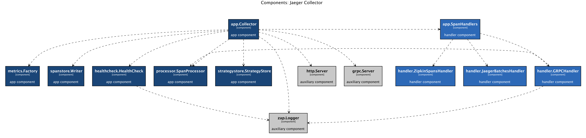
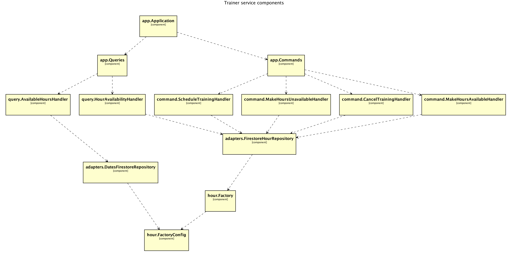

# Автоматически сгенерированные диаграммы архитектуры C4 в Go

[Данная статья является переводом. Оригинал можно найти по ссылке](https://threedots.tech/post/auto-generated-c4-architecture-diagrams-in-go/)

Кшиштоф Речек. Программист-энтузиаст и инженер-программист с опытом разработки как 
низкоуровневого, так и высокоуровневого программного обеспечения.

> Привет! Пожалуйста, тепло поприветствуйте Кшиштофа в первом гостевом посте в 
> нашем блоге. 🎉 Мы работаем с Кшиштофом последние два года и рады поделиться 
> его работой здесь.
> 
> Милош и Роберт

У всех нас уходит много сил на работу с диаграммами архитектуры программного 
обеспечения, не так ли? Вы когда-нибудь задумывались, почему? Если вы зададите 
себе вопрос, почему поддержание современных и подробных диаграмм архитектуры 
программного обеспечения так болезненно, вы получите длинный список правильных 
ответов.

Наше программное обеспечение постоянно меняется. Мы обновляем его ежедневно, 
начиная с простой смены имён, и заканчивая полномасштабным рефакторингом, 
перекраивающим всё приложение. Каждое из этих изменений требует тщательного 
согласования диаграмм архитектуры программного обеспечения. Скорее всего, вы 
тоже думали, что рисование диаграмм даже самыми удобными инструментами отнимает 
много времени. Это требует больших усилий. Эти диаграммы, как известно, выходят 
из-под контроля, сохраняя устаревшие имена и уже удаленные модули, но при этом 
теряют свою первоначальную удобочитаемую и хорошо организованную структуру. 
Все это сильно разочаровывает.

## Если бы идеальный мир когда-либо существовал...

Каждый ценит хорошо структурированную диаграмму когда присоединяется к новому,
неизведанному проекту. Еще лучше, если это простая для навигации схема модели 
C4, похожая на карту.



Пример автоматически сгенерированной диаграммы C4

Если эта концепция не кажется вам знакомой, в её основе лежит простая идея.
Модель C4 вводит четыре уровня визуализации архитектуры программного 
обеспечения: контекст (Context), контейнеры (Containers), компоненты 
(Components) и код (Code). В зависимости от информации, которую вы ищете, вы 
можете перейти к конкретной части реализации, точно так же, как вы 
просматриваете географические карты. При поиске конкретного адреса вы обычно 
используете карту города или даже района, а не карту всей страны. Следовательно,
когда вы cvjnhbnt, как отдельные сервисные модули взаимодействуют друг с 
другом, вы ищите их на диаграмме компонентов этого сервиса. Когда вы ищете 
взаимодействия с сервисами и средами выполнения, вы перейдете к контейнерам.
Вы поняли идею? Для получения дополнительной информации перейдите на [сайт 
модели C4](https://c4model.com/). На мой взгляд, это лучший подход, предложенный 
пока что.

Стоит ли поддержание подробных и актуальных диаграмм архитектуры ваших 
приложений всех этих усилий? И обязательно ли это делать вручную? Что, если бы 
мы могли...

## Автоматизировать их!

Если вы работаете в экосистеме Go, вы привыкли к генерации кода. Что, если бы 
мы также могли генерировать диаграммы программного обеспечения из кода? Более 
того, что, если бы мы могли делать это автоматически, в рамках конвейеров 
непрерывной интеграции?

Руководствуясь этой идеей, я написал библиотеку, которая генерирует диаграммы 
из кода с помощью всего одного файла конфигурации. Позвольте мне показать вам,
как его использовать.

## Начнем с простого

Чтобы продемонстрировать эту функцию, я выбрал репозиторий, знакомый 
большинству читателей — [приложение wild-workouts-go-ddd-example](https://github.com/ThreeDotsLabs/wild-workouts-go-ddd-example). Существует 
несколько сервисов, для которых мы могли бы попытаться создать диаграммы. 
Начнем с `trainer`.

На данный момент библиотека предоставляет набор компонентов для написания 
собственной команды автогенерации диаграммы.

Я создал такую в репозитории `wild-workouts-go-ddd-example`. Внутри отдельной 
директории `tools/c4` я создал файл с простой командой.

```go
func main() {
    s, err := scraper.NewScraperFromConfigFile("scraper.yml")
    if err != nil { ... }
    
    app := trainerService.NewApplication(context.Background())
    
    structure := s.Scrape(app)

    v, err := view.NewViewFromConfigFile("scraper.yml")
    if err != nil { ... }
    
    outFile, err := os.Create(outFileName)
    if err != nil { ... }
    defer outFile.Close()
    
    err = v.RenderStructureTo(structure, outFile)
    if err != nil { ... }
}
```
Весь исходный код: [github.com/ThreeDotsLabs/wild-workouts-go-ddd-example/tools/c4/main.go](https://github.com/ThreeDotsLabs/wild-workouts-go-ddd-example/blob/master/tools/c4/main.go#L21)

В этой команде я использую несколько компонентов, предоставляемых библиотекой.

Первый, `scraper`, просматривает любую структуру Go и собирает посещенные компоненты 
в соответствии с предоставленной конфигурацией и правилами парсинга. Я начал 
с минимального файла конфигурации:

```yml
configuration:
  pkgs:
    - "github.com"

rules:
  - name_regexp: ".*"
    pkg_regexps:
      - ".*"
```
Весь исходный код: [github.com/ThreeDotsLabs/wild-workouts-go-ddd-example/tools/c4/scraper.yml](https://github.com/ThreeDotsLabs/wild-workouts-go-ddd-example/blob/master/tools/c4/scraper.yml)

В конфигурации я указываю парсеру сканировать все компоненты из любого пакета, 
начиная с префикса `github.com`, а затем собирать те, которые соответствуют 
правилам для имени и регулярных выражений пакета. Выражение `.*` будет 
соответствовать любой строке, поэтому в основном я хочу собрать все.

Для тех из вас, кто ненавидит YAML, та же самая конфигурация может быть 
выполнена программно.

Дальше мне нужно создать экземпляр контекста приложения-службы в качестве 
«контента» для парсинга. Роберт и Милош реализовали удобный конструктор, который 
я использую здесь. Затем я могу передать его парсеру и получить обратно модель 
`Structure`, содержащую все собранные данные.

Я создаю еще один библиотечный компонент для отображения полученной структуры 
в выходной файл — представление. Он использует тот же файл конфигурации, что и
парсер, дополненный всего одной строкой — определением представления.

```yml
view:
  title: Trainer service components
```
Весь исходный код: [github.com/ThreeDotsLabs/wild-workouts-go-ddd-example/tools/c4/view.yml](https://github.com/ThreeDotsLabs/wild-workouts-go-ddd-example/blob/master/tools/c4/view.yml)

...и он готов.

Выходной файл имеет тип `*.plantuml`. Мне нужно преобразовать его в файл 
изображения `*.png` с помощью инструмента CLI `plantuml`.

```shell
plantuml out/view.plantuml
```

Вот что я получил:



Сырая C4 диаграмма

## Углубляемся

Пока всё идёт нормально. Но здесь есть как минимум пара вопросов. Работает, 
но все плоско! Все, что я вижу на диаграмме, — это карта компонентов без 
каких-либо подробностей, описания или цветового кодирования. Какие из 
компонентов относятся к прикладному слою или слою предметной области? Кроме 
того, мы мало знаем о связанной инфраструктуре. Используется ли какая-либо база 
данных? Если да, то какой из компонентов его использует? Давайте повторим 
процедуру.

Мне нужно расширить диапазон парсинга, добавив пакет с клиентом firestore.
Приложение использует базу данных firestore, поэтому я включил его клиент в 
схему.

```yml
configuration:
  pkgs:
    - "github.com"
    - "cloud.google.com/go/firestore"
```
Весь исходный код: [github.com/ThreeDotsLabs/wild-workouts-go-ddd-example/tools/c4/scraper.yml](https://github.com/ThreeDotsLabs/wild-workouts-go-ddd-example/blob/master/tools/c4/scraper.yml)

Затем я создаю несколько правил, которые предписывают парсеру интерпретировать 
компоненты из указанных пакетов. С помощью правил я мог помечать компоненты, 
добавлять описания, определять названия функции и многое другое.

Вот несколько примеров правил, в которых я определяю компоненты приложения, 
предметной области и базы данных.

```yml
rules:
  - name_regexp: ".*"
    pkg_regexps:
      - ".*/app/command.*"
    component:
      description: "application command"
      tags:
        - APP
  - name_regexp: ".*"
    pkg_regexps:
      - ".*/domain/.*"
    component:
      description: "domain component"
      tags:
        - DOMAIN
  - name_regexp: ".*Client$"
    pkg_regexps:
      - "cloud.google.com/go/firestore$"
    component:
      name: "Firestore"
      description: "firestore client"
      tags:
        - DB
```
Весь исходный код: [github.com/ThreeDotsLabs/wild-workouts-go-ddd-example/tools/c4/scraper.yml](https://github.com/ThreeDotsLabs/wild-workouts-go-ddd-example/blob/master/tools/c4/scraper.yml)

Наконец, я могу добавить несколько стилей представления и назначить их тегам, 
определенным выше.

```yml
view:
  title: Trainer service components
  line_color: 000000ff
  styles:
    - id: APP
      background_color: 1a4577ff
      font_color: ffffffff
      border_color: 000000ff
    - id: DOMAIN
      background_color: ffffffff
      font_color: 000000ff
      border_color: 000000ff
    - id: DB
      background_color: c8c8c8ff
      font_color: 000000ff
      border_color: 000000ff
      shape: database
```
Весь исходный код: [github.com/ThreeDotsLabs/wild-workouts-go-ddd-example/tools/c4/view.yml](https://github.com/ThreeDotsLabs/wild-workouts-go-ddd-example/blob/master/tools/c4/view.yml)

Когда я перезапустил парсер, я получил следующий результат. Разве это не 
выглядит намного лучше сейчас?


Стилизованная C4 диаграмма

## Хочешь узнать больше?

Если вы хотите более подробно изучить этот пример, перейдите в [репозиторий 
приложений wild-workouts-go-ddd-example](https://github.com/ThreeDotsLabs/wild-workouts-go-ddd-example)
и проверьте реализацию, в которой я создаю полные схемы для всех микросервисов.

Вы также можете узнать больше о самой библиотеке. Посетите [репозиторий 
go-structurizr](https://github.com/krzysztofreczek/go-structurizr) и погрузитесь 
в документацию и предоставленные примеры.

Имея довольно мощный способ автоматического создания диаграмм из golang кода,
каждый раз, когда вы меняете свой код, вы можете просто повторно генерировать
диаграммы, используя ту же самую конфигурацию! Наконец, может показаться 
заманчивым полностью автоматизировать его как часть наших обычных конвейеров 
непрерывной интеграции. Если вы хотите узнать, как я это делаю, дайте мне 
знать в комментариях.