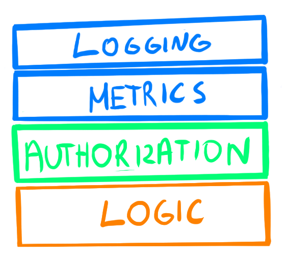
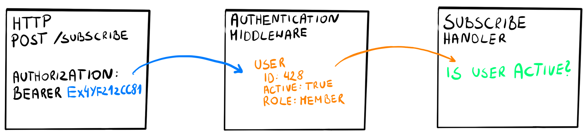
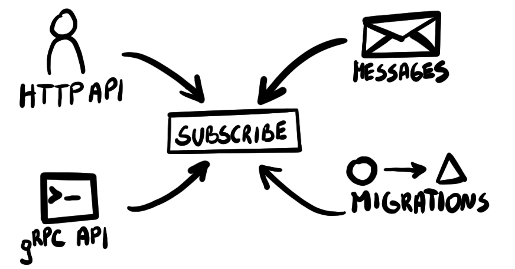
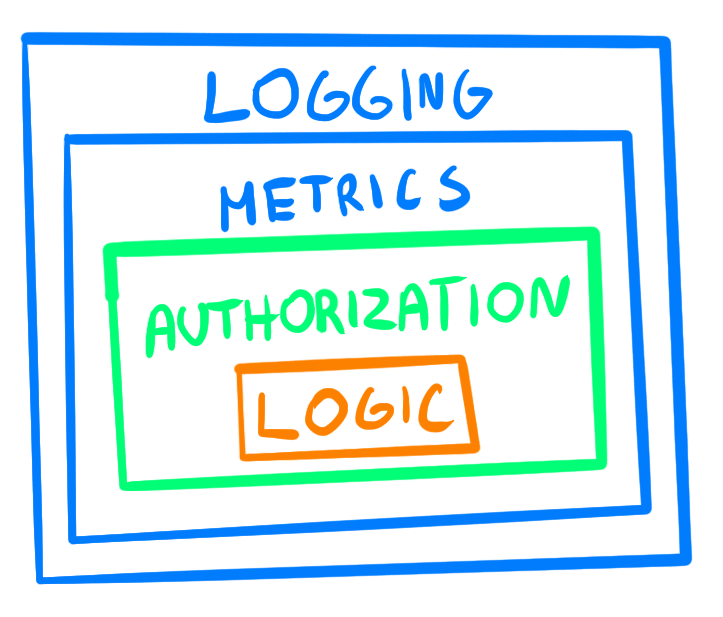
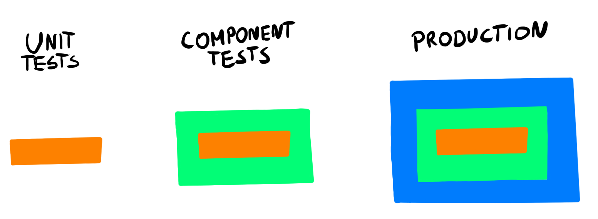

# Увеличиваем сцепление в Go c помощью обобщенных декораторов

[Данная статья является переводом. Оригинал можно найти по ссылке](https://threedots.tech/post/safer-enums-in-go/)

Милош Смолка. Старший бэкенд-инженер [GetHarley](https://getharley.com/). Соучредитель
[Three Dots Labs](https://threedotslabs.com/). Создатель [Watermill](https://github.com/ThreeDotsLabs/watermill).

Сцепление - это часть принципа слабой связанности (low coupling) и высокого 
сцепления (high cohesion), который делает ваш код поддерживаемым. В то время
как слабая связанность означает небольшое количество зависимостей, высокое
сцепление примерно означает единую ответственность. Высокосцепленный код 
(модуль или функция) фокусируется на одну цель. Слабая сцепленность 
означает, что он выполняет множество несвязанных вещей.

Я писал о связанности в [предыдущей статье об антипаттернах](https://threedots.tech/post/common-anti-patterns-in-go-web-applications/).
Вот несколько советов по повышению сцепленности в приложениях Go, используя 
недавно добавленные дженерики.

## Логика приложения

В вашем проекте существует место, где располагается логика вашего приложения. 
Мы называем это слоем приложения (_application layer_) и разделяем его на 
команды и запросы, CQRS стиль. Возможно, вы называете его обработчиками, 
сервисами, контроллерами или сценариями использования (use cases). Надеюсь, 
он не смешан с деталями реализации, такими как HTTP обработчики.

> Если вы всё еще не разделяете свою логику, ознакомьтесь с нашими статьями
> о чистой архитектуре и CQRS.

Как бы вы не назвали этот код, в нём, вероятно, находится не только логика. 
Некоторые общие операции должны выполняться для каждого запроса, который 
обрабатывает ваше приложение. Они часто связаны с наблюдаемостью, например, 
записью логов, метрик и трассировкой. Другими примерами являются повторные 
попытки, тайм-ауты или механизм авторизации.



Условное разделение кода в стандартном обработчике.

```go
func (h SubscribeHandler) Handle(ctx context.Context, cmd Subscribe) (err error) {
	start := time.Now()
	h.logger.Println("Subscribing to newsletter", cmd)
	defer func() {
		end := time.Since(start)
		h.metricsClient.Inc("commands.subscribe.duration", int(end.Seconds()))

		if err == nil {
			h.metricsClient.Inc("commands.subscribe.success", 1)
			h.logger.Println("Subscribed to newsletter")
		} else {
			h.metricsClient.Inc("commands.subscribe.failure", 1)
			h.logger.Println("Failed subscribing to newsletter:", err)
		}
	}()
}
```

Весь исходный код: [github.com/ThreeDotsLabs/go-web-app-antipatterns/03-cohesion/01-low-cohesion/subscribe.go](https://github.com/ThreeDotsLabs/go-web-app-antipatterns/blob/769cdacf9cd2d6407af8014bfea3b2f4351c89f1/03-cohesion/01-low-cohesion/subscribe.go#L34)

**Если такие операций находятся рядом с логикой — это снижает сцепленность.
В таком коде смешаны разные понятия.**

В конце концов, становится трудно понять саму логику работы. Даже если вы 
переместите какую-то часть кода во вспомогательные функции, вы в конечном 
итоге будете передавать множество аргументов и обрабатывать ошибки. Вы 
рискуете, что кто-то скопирует всю _сигнатуру_ функции и забудет изменить 
одно из аргументов. Обновление вспомогательного кода требует изменения части, 
связанной с логикой.

## Зависимость от контекста пользователя

Интересная ситуация возникает когда вам нужно по-разному обрабатывать запросы
в зависимости от вызывающей стороны.

Типичным примером является проверка прав доступа или атрибутов пользователя.
Вам нужно передать обработчику какой-то контекст пользователя — токен,
идентификатор пользователя или весь объект `User`. Без него логика 
работать не может.



Middleware, преобразующее токен авторизации в контекст пользователя.

```go
user, err := UserFromContext(ctx)
if err != nil {
    return err
}

if !user.Active {
    return errors.New("the user's account is not active")
}
```

Весь исходный код: [github.com/ThreeDotsLabs/go-web-app-antipatterns/03-cohesion/01-low-cohesion/subscribe.go](https://github.com/ThreeDotsLabs/go-web-app-antipatterns/blob/769cdacf9cd2d6407af8014bfea3b2f4351c89f1/03-cohesion/01-low-cohesion/subscribe.go#L50)

Но часто существует несколько точек входа для выполнения одного и того же
действия. Например, в системе, подписывающей пользователей на рассылку 
новостей, мы могли бы иметь:

* Общедоступный HTTP API, который использует контекст пользователя, 
  полученный из токена сессии.
* Внутренний gRPC API, который вызывают другие службы. Инструмент 
  командной строки для администратора также использует его.
* Обработчик сообщений, реагирующий на уже произошедшее событие 
  (зарегистрированный пользователь, давший согласие на получение 
  рассылки).
* Миграция, которая запускается при запуске службы. Он добавляет 
  подписки, которые не были созданы из-за ошибки.

За исключением первой точки входа, все остальные не имеют надлежащего
контекста пользователя, который могла бы использовать логика.



Несколько точек входа в один и тот же обработчик команд.

Вы должны вручную создать и передать _имитацию_ контекста пользователя для 
точек входа, отличных от HTTP API.

```go
fakeUser := User{
	ID:     "1", // отсутствует ID в контексте, предположим, что пользователь с правами root осуществляет изменения 
	Active: true,
}

ctx = ContextWithUser(ctx, fakeUser)

err := handler.Handle(ctx, cmd)
if err != nil {
	return err
}
```

Весь исходный код: [github.com/ThreeDotsLabs/go-web-app-antipatterns/03-cohesion/01-low-cohesion/main.go](https://github.com/ThreeDotsLabs/go-web-app-antipatterns/blob/769cdacf9cd2d6407af8014bfea3b2f4351c89f1/03-cohesion/01-low-cohesion/main.go#L64)

Даже если ваше приложение предоставляет только общедоступный HTTP API, 
тестировать этот функционал неудобно. Вам нужно подготовить имитацию 
пользователя каждый раз, когда вы вызываете обработчик или имитируете его 
работу где-то в зависимостях.

```go
func TestSubscribe(t *testing.T) {
	logger := log.New(os.Stdout, "", log.LstdFlags)
	metricsClient := nopMetricsClient{}

	handler := NewSubscribeHandler(logger, metricsClient)

	user := User{
		ID:     "1000",
		Active: true,
	}

	ctx := ContextWithUser(context.Background(), user)

	cmd := Subscribe{
		Email:        "user@example.com",
		NewsletterID: "product-news",
	}

	err := handler.Handle(ctx, cmd)
	if err != nil {
		t.Fatal(err)
	}
}
```

Весь исходный код: [github.com/ThreeDotsLabs/go-web-app-antipatterns/03-cohesion/01-low-cohesion/subscribe_test.go](https://github.com/ThreeDotsLabs/go-web-app-antipatterns/blob/769cdacf9cd2d6407af8014bfea3b2f4351c89f1/03-cohesion/01-low-cohesion/subscribe_test.go#L10)

> ❌ Антипаттерн: Слабая сцепленность
> Не смешивайте логику вашего приложения с другим кодом непосредственно в 
> обработчике.

## Шаблон декоратор

Декораторы — одни из наименее противоречивых шаблонов проектирования. В конце
концов, HTTP middlewares широко используется, и в их основе лежит та же 
самая идея. Вы можете считать декораторы *middleware для слоя приложения*.

Декораторы позволяют вам разделять части, не связанные друг с другом, но в 
то же время вы всё равно можете явно использовать их там, где это 
необходимо.

Вы оборачиваете логику в другие операции. Обработчик логики ничего не знает
о декораторах, в которые обёрнут.



Декораторы, в которые обёрнут обработчик команд.

```go
type subscribeAuthorizationDecorator struct {
	base SubscribeHandler
}

func (d subscribeAuthorizationDecorator) Handle(ctx context.Context, cmd Subscribe) error {
	user, err := UserFromContext(ctx)
	if err != nil {
		return err
	}

	if !user.Active {
		return errors.New("the user's account is not active")
	}

	return d.base.Handle(ctx, cmd)
}
```

Весь исходный код: [github.com/ThreeDotsLabs/go-web-app-antipatterns/03-cohesion/02-decorators/decorators.go](https://github.com/ThreeDotsLabs/go-web-app-antipatterns/blob/769cdacf9cd2d6407af8014bfea3b2f4351c89f1/03-cohesion/02-decorators/decorators.go#L48)

Часть, отвечающая за логику, теперь значительно уменьшилась.

```go
func (h subscribeHandler) Handle(ctx context.Context, cmd Subscribe) error {
	// Подписываем пользователя на рассылку новостей
	return nil
}
```

Вы можете выбрать какие декораторы использовать в зависимости от сценария
использования (use case). Вы можете их настроить в конструкторах.



Разные наборы декораторов для разных целей.

```go
func NewAuthorizedSubscribeHandler(logger Logger, metricsClient MetricsClient) SubscribeHandler {
	return subscribeLoggingDecorator{
		base: subscribeMetricsDecorator{
			base: subscribeAuthorizationDecorator{
				base: subscribeHandler{},
			},
			client: metricsClient,
		},
		logger: logger,
	}
}

func NewUnauthorizedSubscribeHandler(logger Logger, metricsClient MetricsClient) SubscribeHandler {
	return subscribeLoggingDecorator{
		base: subscribeMetricsDecorator{
			base:   subscribeHandler{},
			client: metricsClient,
		},
		logger: logger,
	}
}

func NewSubscribeHandler() SubscribeHandler {
	return subscribeHandler{}
}
```

Весь исходный код: [github.com/ThreeDotsLabs/go-web-app-antipatterns/03-cohesion/02-decorators/subscribe.go](https://github.com/ThreeDotsLabs/go-web-app-antipatterns/blob/769cdacf9cd2d6407af8014bfea3b2f4351c89f1/03-cohesion/02-decorators/subscribe.go#L26)

Вы можете написать unit тест для кода, не задумываясь о частях, не 
связанных непосредственно с логикой. Вам не нужно имитировать логгер или 
клиент метрик. Тесты становятся короче и их легче понять.

```go
func TestSubscribe(t *testing.T) {
	handler := NewSubscribeHandler()

	cmd := Subscribe{
		Email:        "user@example.com",
		NewsletterID: "product-news",
	}

	err := handler.Handle(context.Background(), cmd)
	if err != nil {
		t.Fatal(err)
	}
}
```

Весь исходный код: [github.com/ThreeDotsLabs/go-web-app-antipatterns/03-cohesion/02-decorators/subscribe_test.go](https://github.com/ThreeDotsLabs/go-web-app-antipatterns/blob/769cdacf9cd2d6407af8014bfea3b2f4351c89f1/03-cohesion/02-decorators/subscribe_test.go#L8)

> Вам все еще нужно протестировать механизм авторизации. Я предлагаю 
> сделать это на уровне тестирования компонентов.
> 
> Вы можете узнать больше о различных типах тестов из статьи о
> [Тестовой архитектуре микросервисов](part12.md).

> ✅ Тактика: Декораторы
> Оберните свою логику в декораторы. Выберите какой применять в зависимости 
> от сценария использования (use case).

## Обобщенные декораторы

Разделение кода с использованием декораторов обычно приводит к некой 
шаблонности, повторяемости. Обычно мы боремся с этим, используя генерацию 
кода. Например, вы можете легко создавать модели API или хранилища. Например,
вы можете легко сгенерировать [API модели или модель для 
хранилища](part14-2.md).

Раньше мы тоже генерировали наши декораторы. Но с выходом версии Go 1.18 мы 
можем заменить их на обобщенные декораторы.

Поскольку все наши обработчики команд используют одну и ту же сигнатуру,
команда - это единственный обобщенный тип, который нам нужен. (Команда — это 
структура, содержащая все входные данные для обработчика команд.)

```go
type CommandHandler[C any] interface {
	Handle(ctx context.Context, cmd C) error
}
```

Весь исходный код: [github.com/ThreeDotsLabs/go-web-app-antipatterns/03-cohesion/03-generics/subscribe.go](https://github.com/ThreeDotsLabs/go-web-app-antipatterns/blob/769cdacf9cd2d6407af8014bfea3b2f4351c89f1/03-cohesion/03-generics/subscribe.go#L7)

```go
type authorizationDecorator[C any] struct {
	base CommandHandler[C]
}

func (d authorizationDecorator[C]) Handle(ctx context.Context, cmd C) error {
	user, err := UserFromContext(ctx)
	if err != nil {
		return err
	}

	if !user.Active {
		return errors.New("the user's account is not active")
	}

	return d.base.Handle(ctx, cmd)
}
```

Весь исходный код: [github.com/ThreeDotsLabs/go-web-app-antipatterns/03-cohesion/03-generics/decorators.go](https://github.com/ThreeDotsLabs/go-web-app-antipatterns/blob/769cdacf9cd2d6407af8014bfea3b2f4351c89f1/03-cohesion/03-generics/decorators.go#L50)

Вы можете использовать обобщенные декораторы с любым другим обработчиком 
команд. Вы даже можете переместить их в отдельную библиотеку.

```go
func NewUnauthorizedSubscribeHandler(logger Logger, metricsClient MetricsClient) CommandHandler[Subscribe] {
	return loggingDecorator[Subscribe]{
		base: metricsDecorator[Subscribe]{
			base:   SubscribeHandler{},
			client: metricsClient,
		},
		logger: logger,
	}
}
```

Весь исходный код: [github.com/ThreeDotsLabs/go-web-app-antipatterns/03-cohesion/03-generics/subscribe.go](https://github.com/ThreeDotsLabs/go-web-app-antipatterns/blob/769cdacf9cd2d6407af8014bfea3b2f4351c89f1/03-cohesion/03-generics/subscribe.go#L38)

> ✅ Тактика: Обобщенные декораторы
> Используйте дженерики, чтобы уменьшить дублирование кода

## О чём следует помнить

В большинстве случаев в Go имеет смысл **принимать интерфейсы и возвращать
структуры**. Но чтобы сделать возможной обертывание, вам нужно вернуть 
интерфейс из конструкторов.

```go
type SubscribeHandler interface {
	Handle(ctx context.Context, cmd Subscribe) error
}

type subscribeHandler struct{}

func NewSubscribeHandler() SubscribeHandler {
	return subscribeHandler{}
}
```

Весь исходный код: [github.com/ThreeDotsLabs/go-web-app-antipatterns/03-cohesion/02-decorators/subscribe.go](https://github.com/ThreeDotsLabs/go-web-app-antipatterns/blob/769cdacf9cd2d6407af8014bfea3b2f4351c89f1/03-cohesion/02-decorators/subscribe.go#L20)

Недостатком является более сложная навигация по проекту. Вы не можете просто 
щелкнуть по методу `Handle`, чтобы попасть в его определение. Однако, если 
используете современную IDE, она покажет, что реализует интерфейс.

Кроме того, имейте в виду, что это может удивить тех, кто пытается следовать 
общему правилу. Это нормально — нарушать правила, но понимать (и быть готовым 
объяснить), _почему_ вы делаете исключение.

Еще одна вещь, на которую следует обратить внимание, это то, как вы обертываете
свои декораторы. Внешние декораторы выполняются первыми, и иногда порядок 
имеет значение. Например, вы хотите сохранить логи и метрики даже в случае 
сбоя авторизации.

## Весь пример

Весь исходный код доступен в [репозитории с антишаблонами](https://github.com/ThreeDotsLabs/go-web-app-antipatterns/tree/master/03-cohesion).

Он содержит декораторы для логгера и метрик, готовые к использованию с 
минимальными изменениями.

## Wild Workouts

Параллельно Роберт добавил декораторы в Wild Workouts, наш пример веб-приложения, 
о котором вы, возможно, знаете из наших предыдущих статей. Просмотрите [коммит](https://github.com/ThreeDotsLabs/wild-workouts-go-ddd-example/commit/4cc4ad70c2051ff31c7a20e8d5abe26b5dacd3fb), 
чтобы увидеть, как их использовать в реальном приложении.

В этой статье не рассматриваются две вспомогательные функции: 
[ApplyCommandDecorators](https://github.com/ThreeDotsLabs/wild-workouts-go-ddd-example/blob/4cc4ad70c2051ff31c7a20e8d5abe26b5dacd3fb/internal/common/decorator/command.go#L11)
и [ApplyQueryDecorators](https://github.com/ThreeDotsLabs/wild-workouts-go-ddd-example/blob/4cc4ad70c2051ff31c7a20e8d5abe26b5dacd3fb/internal/common/decorator/query.go#L9).

Роберт также добавил поддержку для [локального запуска Wild Workouts](https://github.com/ThreeDotsLabs/wild-workouts-go-ddd-example#running-locally)
на процессорах M1. Если у вас еще не было возможности сделать это, сейчас 
хороший момент, чтобы поэкспериментировать с проектом.