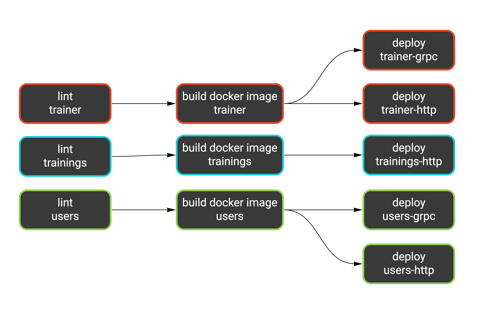
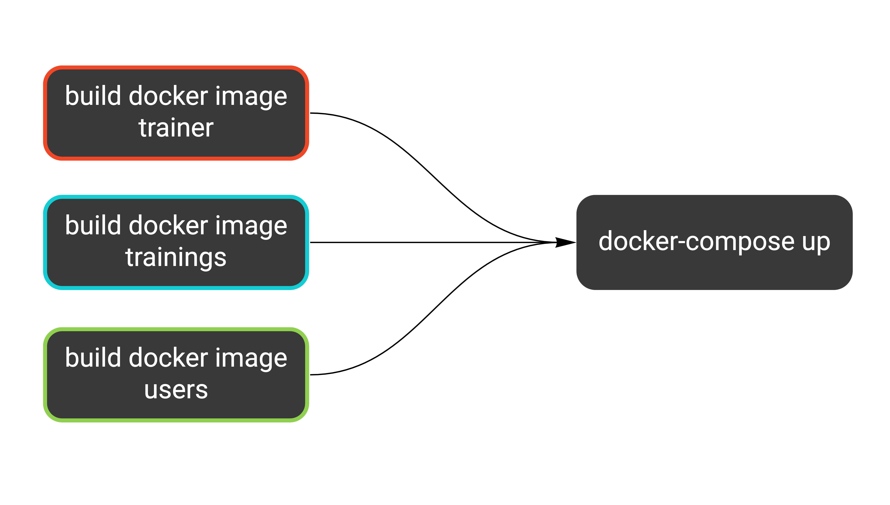
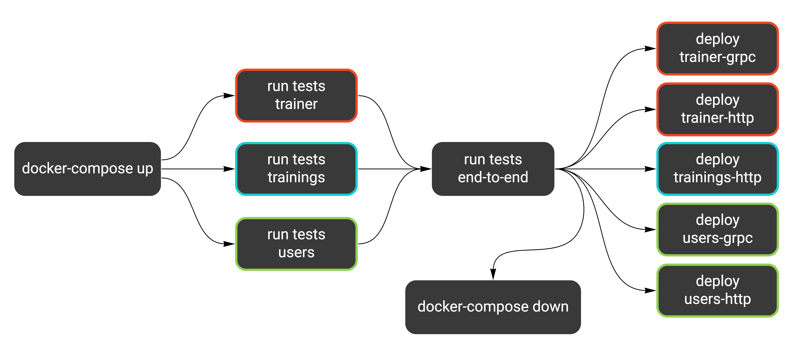

# Запуск интеграционных тестов в Google Cloud Build с использованием docker-compose

[Данная статья является переводом. Оригинал можно найти по ссылке](https://threedots.tech/post/running-integration-tests-on-google-cloud-build/)

Милош Смолка. Технический руководитель [Karhoo](https://www.karhoo.com/). Соучредитель
[Three Dots Labs](https://threedotslabs.com/). Создатель [Watermill](https://github.com/ThreeDotsLabs/watermill).

Этот пост является прямым продолжением [Тестовой архитектуры микросервисов](https://threedots.tech/post/microservices-test-architecture/),
где я представил новые виды тестов в нашем проекте, используемом в качестве
примера.

[Wild Workouts](https://github.com/ThreeDotsLabs/wild-workouts-go-ddd-example) использует Google Cloud Build в качестве CI/CD платформы. Он 
настроен на **непрерывное развертывание**, что означает, что изменения попадают 
в рабочую среду, как только успешно проходит конвейер. Если принять во внимание 
нашу нынешнюю настройку проекта, то она и смелая, и наивная. У нас там не запущены 
никакие тесты, которые могли бы уберечь нас от очевидных ошибок (в любом 
случае, не столь очевидные ошибки редко могут быть обнаружены тестами).

В этой статье я покажу, как запускать интеграционные, компонентные и сквозные 
тесты в Google Cloud Build с помощью docker-compose.

> Это не просто очередная статья со случайными фрагментами кода.
>
> Этот пост является частью большого цикла, показывающий как создавать приложения на
> **Go, которые легко разрабатывать, поддерживать и с ними интересно работать в
> долгосрочной перспективе**. Мы делаем это, делясь проверенными методами, основанными
> на многих экспериментах, проведёнными с возглавляемыми нами с командами,
> и [научных исследованиях](https://threedots.tech/post/ddd-lite-in-go-introduction/#thats-great-but-do-you-have-any-evidence-it-works).
> Вы можете изучить эти методы, создав с нами [полнофункциональный](https://threedots.tech/post/serverless-cloud-run-firebase-modern-go-application/#what-wild-workouts-can-do) пример
> веб-приложения на Go - **Wild Workouts**.
>
> Мы поступили не совсем обычно — **добавили некоторые не сразу заметные проблемы
> в первоначальную реализацию Wild Workouts**. Неужели мы сошли с ума? Пока нет. 😉
> Эти проблемы характерны для многих проектов Go. **В долгосрочной перспективе эти
> небольшие проблемы становятся критичными и не позволяют добавлять новые функционал.**
>
> **Это один из важнейших навыков старшего или ведущего разработчика; всегда нужно
> помнить о долгосрочных последствиях.**
>
> Мы исправим их путем **рефакторинга** Wild Workouts. Таким образом, вы быстро поймёте
> методики, которыми мы делимся.
> Знаете ли вы это чувство, когда прочитали статью о какой-то методике и попытались
> реализовать её, но не смогли из-за упущений и пропуска деталей в руководстве.
> Пропуск деталей делает статьи короче и увеличивает просмотры страниц, но это
> не наша цель. Наша цель — создать материал, который даст достаточно знаний для
> применения представленных методик. Если вы еще не читали [предыдущие статьи из
> этого цикла](https://threedots.tech/series/modern-business-software-in-go/),
> мы настоятельно рекомендуем это сделать.
>
> Мы считаем, что в некоторых областях знаний нельзя пропускать детали. Если вы
> хотите быстро и эффективно создавать сложные приложения, вам нужно потратить
> некоторое время, чтобы узнать как это сделать. Если бы всё было так просто,
> у нас бы не было такого большого количества устрашающего устаревшего кода.
>
> Вот [полный список из 14 опубликованных на данный момент статей](https://threedots.tech/series/modern-business-software-in-go/).
>
> Весь код Wild Workouts доступен на [GitHub](https://github.com/ThreeDotsLabs/wild-workouts-go-ddd-example). Не забудьте поставить звезду
> нашему проекту! ⭐

## Текущая конфигурация

Давайте посмотрим на текущий файл `cloudbuild.yaml`. Хотя он довольно простой,
большинство шагов выполняется несколько раз, поскольку мы храним 3 микросервиса
в одном репозитории. Я сосредоточусь на бэкенд-части, поэтому сейчас я пропущу 
всю конфигурацию, связанную с развертыванием фронтенда.

```yaml
steps:
  - id: trainer-lint
    name: golang
    entrypoint: ./scripts/lint.sh
    args: [trainer]
  - id: trainings-lint
    name: golang
    entrypoint: ./scripts/lint.sh
    args: [trainings]
  - id: users-lint
    name: golang
    entrypoint: ./scripts/lint.sh
    args: [users]

  - id: trainer-docker
    name: gcr.io/cloud-builders/docker
    entrypoint: ./scripts/build-docker.sh
    args: ["trainer", "$PROJECT_ID"]
    waitFor: [trainer-lint]
  - id: trainings-docker
    name: gcr.io/cloud-builders/docker
    entrypoint: ./scripts/build-docker.sh
    args: ["trainings", "$PROJECT_ID"]
    waitFor: [trainings-lint]
  - id: users-docker
    name: gcr.io/cloud-builders/docker
    entrypoint: ./scripts/build-docker.sh
    args: ["users", "$PROJECT_ID"]
    waitFor: [users-lint]

  - id: trainer-http-deploy
    name: gcr.io/cloud-builders/gcloud
    entrypoint: ./scripts/deploy.sh
    args: [trainer, http, "$PROJECT_ID"]
    waitFor: [trainer-docker]
  - id: trainer-grpc-deploy
    name: gcr.io/cloud-builders/gcloud
    entrypoint: ./scripts/deploy.sh
    args: [trainer, grpc, "$PROJECT_ID"]
    waitFor: [trainer-docker]
  - id: trainings-http-deploy
    name: gcr.io/cloud-builders/gcloud
    entrypoint: ./scripts/deploy.sh
    args: [trainings, http, "$PROJECT_ID"]
    waitFor: [trainings-docker]
  - id: users-http-deploy
    name: gcr.io/cloud-builders/gcloud
    entrypoint: ./scripts/deploy.sh
    args: [users, http, "$PROJECT_ID"]
    waitFor: [users-docker]
  - id: users-grpc-deploy
    name: gcr.io/cloud-builders/gcloud
    entrypoint: ./scripts/deploy.sh
    args: [users, grpc, "$PROJECT_ID"]
    waitFor: [users-docker]
```
Весь исходный код: [github.com/ThreeDotsLabs/wild-workouts-go-ddd-example/cloudbuild.yaml](https://github.com/ThreeDotsLabs/wild-workouts-go-ddd-example/blob/227e540bb22d0265ed88286d1eb7714d02dc45be/cloudbuild.yaml)

Обратите внимание на ключ `waitFor`. Это заставляет шаг ожидать только других 
указанных шагов. Таким образом, некоторые задания могут выполняться параллельно.

Вот более удобочитаемая версия происходящего:



У нас существует похожая последовательность действий для каждого сервиса:
lint (статический анализ), создание образа Docker и его развертывание в виде 
одной или двух служб Cloud Run.

Поскольку наш набор тестов готов и работает локально, нам нужно выяснить, как 
подключить его к конвейеру.

## Docker Compose

МЫ уже определили один docker-compose файл, и я хотел бы оставить его таким. 
Мы будем использовать его для:

* запуска приложения локально,
* запуска тестов локально,
* запуска тестов в CI.

Эти три цели имеют разные потребности. Например, при локальном запуске 
приложения мы хотим иметь горячую перезагрузку кода. Но это бессмысленно в CI.
С другой стороны, мы не можем делать доступными порты на локальном хосте (`localhost`) в CI, 
что является самым простым способом доступа к приложению в локальной среде.

К счастью, docker-compose достаточно гибок, чтобы поддерживать все эти варианты
использования. Мы будем использовать базовый файл `docker-compose.yml` и 
дополнительный файл `docker-compose.ci.yml` с переопределениями только для CI. 
Вы можете запустить его, передав оба файла с флагом `-f` (обратите внимание, что 
для каждого файла указан один флаг). Ключи из файлов будут объединены в 
указанном порядке.

```shell
docker-compose -f docker-compose.yml -f docker-compose.ci.yml up -d
```

> Как правило, docker-compose ищет файл docker-compose.yml в текущем каталоге 
> или родительских каталогах. Использование флага -f отключает это поведение, 
> поэтому анализируются только указанные файлы.

Чтобы запустить его в Cloud Build, мы можем использовать образ `docker/compose`.

```yaml
- id: docker-compose
  name: 'docker/compose:1.19.0'
  args: ['-f', 'docker-compose.yml', '-f', 'docker-compose.ci.yml', 'up', '-d']
  env:
    - 'PROJECT_ID=$PROJECT_ID'
  waitFor: [trainer-docker, trainings-docker, users-docker]
```
Весь исходный код: [github.com/ThreeDotsLabs/wild-workouts-go-ddd-example/cloudbuild.yaml](https://github.com/ThreeDotsLabs/wild-workouts-go-ddd-example/blob/d6077806771e0d22d62f8dba5ae6b64d554d6ea0/cloudbuild.yaml#L31)

Поскольку мы заполнили `waitFor` правильными именами шагов, мы можем быть 
уверены, что присутствуют правильные образы. Вот что мы только что добавили:



Первое переопределение, которое мы добавляем в `docker-compose.ci.yml`, 
заставляет каждый сервис использовать образы докеров по тегу вместо создания 
одного из `docker/app/Dockerfile`. Это гарантирует, что наши тесты проверяют те 
же образы, которые мы собираемся развернуть.

Обратите внимание на переменную `${PROJECT_ID}` в ключах образа. Это должен 
быть продакшен проект, поэтому мы не можем жестко запрограммировать его в 
репозитории. Cloud Build предоставляет эту переменную на каждом этапе, поэтому 
мы просто передаем ее команде `docker-compose up` (см. определение выше).

```yml
services:
  trainer-http:
    image: "gcr.io/${PROJECT_ID}/trainer"

  trainer-grpc:
    image: "gcr.io/${PROJECT_ID}/trainer"

  trainings-http:
    image: "gcr.io/${PROJECT_ID}/trainings"

  users-http:
    image: "gcr.io/${PROJECT_ID}/users"

  users-grpc:
    image: "gcr.io/${PROJECT_ID}/users"
```
Весь исходный код: [github.com/ThreeDotsLabs/wild-workouts-go-ddd-example/docker-compose.ci.yml](https://github.com/ThreeDotsLabs/wild-workouts-go-ddd-example/blob/d6077806771e0d22d62f8dba5ae6b64d554d6ea0/docker-compose.ci.yml#L2)

## Сеть

Сегодня многие системы непрерывной интеграции используют Docker, обычно
выполняя каждый шаг внутри контейнера с выбранным образом. Использование 
docker-compose в CI немного сложнее, так как обычно это означает запуск Docker
контейнеров из Docker контейнера.

В Google Cloud Build все контейнеры находятся внутри [сети `cloudbuild`](https://cloud.google.com/build/docs/build-config#network).
Простого добавления этой сети в качестве сети по умолчанию для нашего 
`docker-compose.ci.yml` достаточно, чтобы шаги CI подключались к службам
docker-compose.

Вот вторая часть нашего файла переопределения:

```yml
networks:
  default:
    external:
      name: cloudbuild
```
Весь исходный код: [github.com/ThreeDotsLabs/wild-workouts-go-ddd-example/docker-compose.ci.yml](https://github.com/ThreeDotsLabs/wild-workouts-go-ddd-example/blob/d6077806771e0d22d62f8dba5ae6b64d554d6ea0/docker-compose.ci.yml#L17)

## Переменные окружения

Использование переменных среды в качестве конфигурации сначала кажется 
простым, но быстро становится сложным, учитывая, сколько случаев нам 
нужно обработать. Попробуем перечислить их все:

* запуск приложения локально,
* запуск тестов компонентов локально,
* запуск тестов компонентов в CI,
* запуск сквозных тестов локально,
* запуск сквозных тестов в CI.

Я не добавлял запуск приложения в продакшен среде, так как оно не использует 
docker-compose.

Почему компонентные и сквозные тесты разделены? Первые запускают сервисы по
запросу, а вторые взаимодействуют с сервисами, уже работающими в 
рамках docker-compose. Это означает, что оба типа будут использовать разные 
конечные точки для доступа к сервисам.

> Подробнее о компонентных и сквозных тестах читайте в [предыдущей статье](https://threedots.tech/post/microservices-test-architecture/). Если
> коротко: мы фокусируемся на тестах компонентов, которые не включают внешние 
> сервисы. Сквозные тесты нужны только для того, чтобы подтвердить, что контракт
> не нарушен на очень высоком уровне и только для наиболее критического пути. Это
> позволяет создавать несвязанные сервисы.

У нас уже есть базовый файл `.env`, содержащий большинство переменных. Он 
передается каждой службе в определении docker-compose.

Кроме того, docker-compose автоматически загружает этот файл, когда находит его
в рабочем каталоге. Благодаря этому мы также можем использовать переменные 
внутри определения yaml.

```yml
services:
  trainer-http:
    build:
      context: docker/app        
    ports:
      # $PORT переменная поступает из файла .env 
      - "127.0.0.1:3000:$PORT"
    env_file:
      # все переменные из .env передаются в сервис
      - .env
    # (часть определения опущена)
```
Весь исходный код: [github.com/ThreeDotsLabs/wild-workouts-go-ddd-example/docker-compose.yml](https://github.com/ThreeDotsLabs/wild-workouts-go-ddd-example/blob/a3f4a35ff14a33950eb5caebe54d27b25bcf69e3/docker-compose.yml#L23)

Нам также нужно, чтобы эти переменные загружались при запуске тестов. Это 
довольно легко сделать в bash:

```shell
source .env
# то же самое
. .env
```

Однако у переменных в нашем файле `.env` нет префикса `export`, поэтому они 
не будут передаваться дальше приложениям, работающим в терминале. Мы не можем 
использовать префикс, потому что он несовместим с синтаксисом, который ожидает 
docker-compose.

Кроме того, мы не можем использовать один файл для всех случаев. Нам нужно 
перезаписать некоторые переменные, как мы сделали с определением docker-compose.
Моя идея состоит в том, чтобы создать один дополнительный файл для каждого 
случая. Он будет загружен вместе с базовым файлом `.env`.

Посмотрим в чём заключается разница между всеми случаями. Для простоты я добавил 
только users-http, но идея применима ко всем сервисам.

| Случай    | Хост MySQL |    Хост Firestore | Адрес users-http | Файл | 
| ----------- | ----------- | ----- | ------ | ------ |
| Запуск локально | localhost | localhost | localhost:3002 | [.env](https://github.com/ThreeDotsLabs/wild-workouts-go-ddd-example/blob/d6077806771e0d22d62f8dba5ae6b64d554d6ea0/.env) |
| Локальные тесты компонентов  | localhost | localhost | localhost:5002 | [.test.env](https://github.com/ThreeDotsLabs/wild-workouts-go-ddd-example/blob/d6077806771e0d22d62f8dba5ae6b64d554d6ea0/.test.env) |
| CI тесты компонентов  | mysql | firestore-component-tests | localhost:5002 | [.test.ci.env](https://github.com/ThreeDotsLabs/wild-workouts-go-ddd-example/blob/d6077806771e0d22d62f8dba5ae6b64d554d6ea0/.test.ci.env) |
| Локальные сквозные тесты  | - | - | localhost:3002 | [.e2e.env](https://github.com/ThreeDotsLabs/wild-workouts-go-ddd-example/blob/d6077806771e0d22d62f8dba5ae6b64d554d6ea0/.e2e.env) |
| CI сквозные тесты | - | - | users-http:3000 | [.e2e.ci.env](https://github.com/ThreeDotsLabs/wild-workouts-go-ddd-example/blob/d6077806771e0d22d62f8dba5ae6b64d554d6ea0/.e2e.ci.env) |

Сервисы запускаются командой docker-compose с использованием портов 3000+,
а тесты компонентов запускают сервисы на портах 5000+. Таким образом, оба 
экземпляра могут работать одновременно.

Я создал bash-скрипт, который считывает переменные и запускает тесты. **Пожалуйста, 
не пытайтесь определить такой сложный сценарий непосредственно в Makefile. Make 
ужасно справляется с управлением переменными окружения.** Это будет вам стоить большого
числа нервных клеток.

Другая причина создания отдельного скрипта заключается в том, что мы храним 
3 сервиса в одном репозитории, а сквозные тесты — в отдельном каталоге.
Если мне нужно запустить одну и ту же команду несколько раз, я предпочитаю 
вызывать сценарий с двумя переменными, а не длинным заклинанием из флагов и 
аргументов.

Третий аргумент в пользу отдельных bash-скриптов — их можно проверять с помощью
[shellcheck](https://www.shellcheck.net/).

```shell
#!/bin/bash
set -e

readonly service="$1"
readonly env_file="$2"

cd "./internal/$service"
env $(cat "../../.env" "../../$env_file" | grep -Ev '^#' | xargs) go test -count=1 ./...
```
Весь исходный код: [github.com/ThreeDotsLabs/wild-workouts-go-ddd-example/scripts/test.sh](https://github.com/ThreeDotsLabs/wild-workouts-go-ddd-example/blob/d6077806771e0d22d62f8dba5ae6b64d554d6ea0/scripts/test.sh)

Скрипт запускает `go test` в заданной директории с переменными окружения, 
загруженными из `.env` и указанного файла. Трюк `env / xargs` передаёт все 
переменные следующей команде. Обратите внимание, как мы удаляем комментарии из 
файла с помощью `grep`.

> Тестируем кэш 
>
> `go test` кэширует успешные результаты, если соответствующие файлы не изменены.
> 
> С тестами, использующими Docker, может случиться так, что вы что-то измените 
> на уровне инфраструктуры, например, определение docker-compose или некоторые 
> переменные окружения. `go test` этого не обнаружит, и вы можете принять 
> кешированный тест за успешный.
> 
> Об этом легко забыть, а поскольку наши тесты и так быстрые, мы можем отключить
> кэш. Флаг -count=1 — идиоматический (хотя и не очевидный) способ сделать это.

## Запускаем тесты

У меня сквозные тесты запускаются после того как пройдены тесты для всех 
сервисов. Это должно быть похоже на то, как вы обычно их запускаете. **Помните, 
сквозные тесты должны работать как двойная проверка, и собственные тесты каждого 
сервиса должны иметь наибольшее покрытие.**

Поскольку объем наших сквозных тестов невелик, мы можем запустить их перед 
развертыванием сервисов. Если бы они работали в течение длительного времени, 
это могло бы заблокировать наши развертывания. В этом случае лучшей
идеей было бы полагаться на тесты компонентов каждого сервиса и параллельно 
запускать пакет сквозных тестов.

```yaml
- id: trainer-tests
  name: golang
  entrypoint: ./scripts/test.sh
  args: ["trainer", ".test.ci.env"]
  waitFor: [docker-compose]
- id: trainings-tests
  name: golang
  entrypoint: ./scripts/test.sh
  args: ["trainings", ".test.ci.env"]
  waitFor: [docker-compose]
- id: users-tests
  name: golang
  entrypoint: ./scripts/test.sh
  args: ["users", ".test.ci.env"]
  waitFor: [docker-compose]
- id: e2e-tests
  name: golang
  entrypoint: ./scripts/test.sh
  args: ["common", ".e2e.ci.env"]
  waitFor: [trainer-tests, trainings-tests, users-tests]
```
Весь исходный код: [github.com/ThreeDotsLabs/wild-workouts-go-ddd-example/cloudbuild.yaml](https://github.com/ThreeDotsLabs/wild-workouts-go-ddd-example/blob/d6077806771e0d22d62f8dba5ae6b64d554d6ea0/cloudbuild.yaml#L38)

```yaml
- id: docker-compose-down
  name: 'docker/compose:1.19.0'
  args: ['-f', 'docker-compose.yml', '-f', 'docker-compose.ci.yml', 'down']
  env:
    - 'PROJECT_ID=$PROJECT_ID'
  waitFor: [e2e-tests]
```
Весь исходный код: [github.com/ThreeDotsLabs/wild-workouts-go-ddd-example/cloudbuild.yaml](https://github.com/ThreeDotsLabs/wild-workouts-go-ddd-example/blob/d6077806771e0d22d62f8dba5ae6b64d554d6ea0/cloudbuild.yaml#L59)

Вторая часть нашего конвейера теперь выглядит так:



Вот как выглядит локальный запуск тестов (я добавил его в `make` в предыдущей 
статье). Это точно такие же команды, как и в CI, только с другими файлами `.env`.

```makefile
test:
	@./scripts/test.sh common .e2e.env
	@./scripts/test.sh trainer .test.env
	@./scripts/test.sh trainings .test.env
	@./scripts/test.sh users .test.env
```
Весь исходный код: [github.com/ThreeDotsLabs/wild-workouts-go-ddd-example/Makefile](https://github.com/ThreeDotsLabs/wild-workouts-go-ddd-example/blob/d6077806771e0d22d62f8dba5ae6b64d554d6ea0/Makefile#L60)

## Разделяем тесты

Глядя на таблицу из предыдущей статьи, мы могли разделить тесты на две группы в
зависимости от того, используют ли они Docker.

| Особенность    | Unit |    Интеграционные | Компонентов | Сквозные | 
| ----------- | ----------- | ----- | ------ | ------ |
| База данных в Docker | Нет | Да | Да | Да |

Unit тесты — это единственная категория, в которой не используется база данных 
Docker, в то время как интеграционные, компонентные и сквозные тесты используют
её.

Несмотря на то, что мы сделали все наши тесты быстрыми и стабильными, настройка 
инфраструктуры Docker добавляет некоторые накладные расходы. Полезно запускать
все unit тесты отдельно, в качестве первой защиты от ошибок.

Мы могли бы использовать теги build, чтобы выделить тесты, которые не используют
Docker. Вы можете определить теги build в первой строке файла.

```go
// +build docker
```

Теперь мы могли бы запускать модульные тесты отдельно от всех тестов. Например, 
приведенная ниже команда запустит только тесты, которым нужны Docker сервисы:

```shell
go test -tags=docker ./...
```

Другой способ разделения тестов — использование флага `-short` и проверка 
[testing.Short()](https://golang.org/pkg/testing/#Short) в каждом тестовом 
случае.

В итоге я решил не вводить это разделение. Мы сделали наши тесты стабильными 
и достаточно быстрыми, чтобы запустить их все сразу не было проблемой. Однако 
наш проект довольно мал, и набор тестов охватывает только критические пути. 
Когда он разрастется, может быть хорошей идеей ввести теги сборки в тесты 
компонентов.

## Отступление: краткое введение в CI отладку

Пока я вносил изменения в этот пост, первоначальные тестовые прогоны в Cloud 
Build продолжали давать сбои. Судя по логам, тесты не смогли достучаться до 
сервисов из docker-compose.

Поэтому я начал отладку и добавил простой bash-скрипт, который будет подключаться 
к сервисам через `telnet`.

К моему удивлению, подключение к `mysql:3306` работало правильно, а к 
`firestore:8787` — нет, и то же самое для всех сервисов Wild Workouts.

Я думал, что это из-за того, что docker-compose долго запускается, но любое 
количество попыток повторного подключения не помогло. Наконец, я решил 
попробовать что-то безумное и настроил обратный SSH-туннель из одного из 
контейнеров в docker-compose.

Это позволило мне использовать SSH внутри одного из контейнеров, пока сборка 
еще выполнялась. Затем я попробовал использовать `telnet` и `curl`, и они правильно 
работали для всех сервисов.

Наконец, я обнаружил ошибку в сценарии bash, который использовал.

```shell
readonly host="$1"
readonly port="$1"

# (код для повторного запуска)

telnet "$host" "$port"
```

Из-за опечатки в определении переменных команда `telnet` выполнялась следующим 
образом: `telnet $host $host`. Так почему же это сработало для MySQL? Оказывается, 
telnet распознает порты, указанные в `/etc/services`. Таким образом, `telnet 
mysql mysql` был переведен в `telnet mysql 3306` и работал нормально, но не 
работал ни с одной другой службой.

Почему тесты провалились? А оказалось, что причина совсем в другом.

Изначально мы подключались к MySQL так:

```go
config := mysql.Config{
    Addr:      os.Getenv("MYSQL_ADDR"),
    User:      os.Getenv("MYSQL_USER"),
    Passwd:    os.Getenv("MYSQL_PASSWORD"),
    DBName:    os.Getenv("MYSQL_DATABASE"),
    ParseTime: true, // с этим параметром мы можем использовать time.Time в mysqlHour.Hour
}

db, err := sqlx.Connect("mysql", config.FormatDSN())
if err != nil {
    return nil, errors.Wrap(err, "cannot connect to MySQL")
}
```
Весь исходный код: [github.com/ThreeDotsLabs/wild-workouts-go-ddd-example/internal/trainer/adapters/hour_mysql_repository.go](https://github.com/ThreeDotsLabs/wild-workouts-go-ddd-example/blob/0e3e9d80eb14639bc42935795f7ca3b73da36304/internal/trainer/adapters/hour_mysql_repository.go#L184)

Я посмотрел переменные окружения, и все они были заполнены правильно. После 
добавления некоторых отладочных `fmt.Println()` **я обнаружил, что часть 
конфигурации `Addr` полностью игнорируется клиентом MySQL, потому что мы не 
указали поле `Net`.** Почему это сработало для локальных тестов? Поскольку MySQL 
был доступен на `localhost`, который является адресом по умолчанию.

В другом тесте не удалось подключиться к одному из сервисов Wild Workouts, и 
оказалось, что я использовал неправильный порт в файле `.env`.

Зачем я вообще это делюсь? Я думаю, что это отличный пример того, как часто 
может выглядеть работа с CI системами. **Когда сразу несколько вещей работают 
с ошибками, легко прийти к неверным выводам и копнуть глубже в неправильном 
направлении.**

В случае сомнений я предпочитаю пользоваться базовыми инструментами для 
исследования проблем с Linux, такими как `strace`, `curl` или `telnet`. Именно поэтому 
я сделал обратный туннель SSH, и я рад, что сделал это, потому что это кажется 
отличным способом отладки проблем внутри CI. Я чувствую, что когда-нибудь 
воспользуюсь им снова. 😄

## Заключение

Нам удалось сохранить единое определение docker-compose для запуска тестов 
локально и в конвейере. Весь запуск Cloud Build от git push до продакшен 
занимает 4 минуты.

Мы использовали несколько хитрых приемов, но это обычные вещи при работе с CI. 
Иногда вы просто необходимо добавить немного магии bash, чтобы все заработало.

В отличие от кода домена, хаки в вашей настройке CI не должны сильно 
навредить вам, пока их немного. Просто убедитесь, что вам легко понять, что 
происходит, чтобы вы не были единственным человеком, обладающим всеми знаниями.

Этой статьёй мы завершаем первую часть рефакторинга Wild Workouts. Теперь мы 
собираемся перейти к стратегическим шаблонам проектирования. Спасибо за чтение, 
и скоро увидимся! 👋
