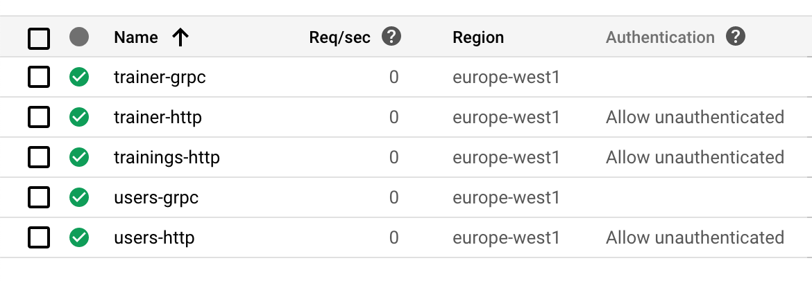
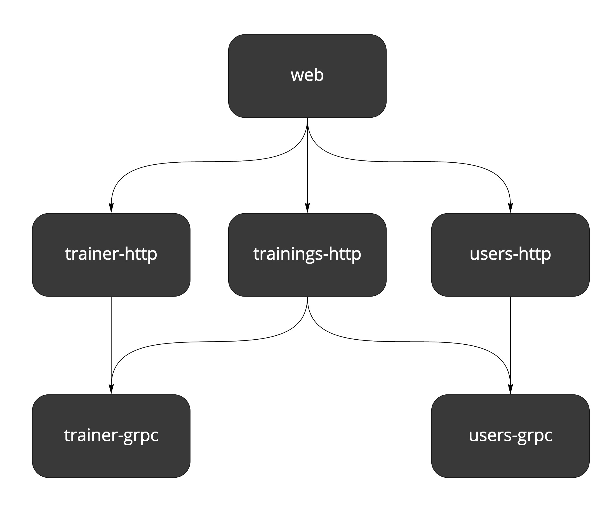
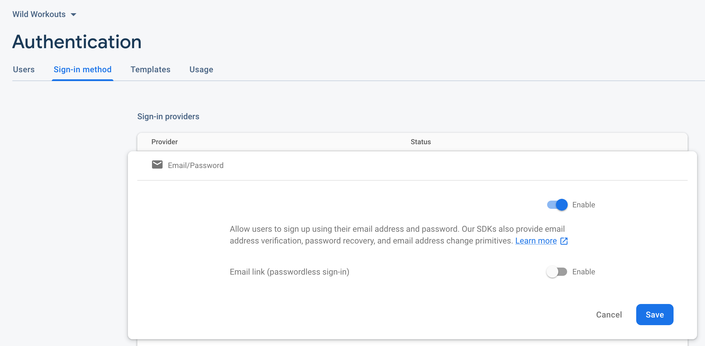

# Подробное описание настройки Terraform для бессерверного приложения в Google Cloud Run и Firebase

Милош Смолка. Технический руководитель [Karhoo](https://www.karhoo.com/). Соучредитель
[Three Dots Labs](https://threedotslabs.com/). Создатель [Watermill](https://github.com/ThreeDotsLabs/watermill).

В [предыдущем посте](https://threedots.tech/post/serverless-cloud-run-firebase-modern-go-application/) 
[Роберт](https://twitter.com/roblaszczak) представил наш пример бессерверного приложения [Wild Workouts](https://github.com/ThreeDotsLabs/wild-workouts-go-ddd-example).
Каждую неделю или две мы будем выпускать новые статьи, связанные с этим проектом,
с упором на создание бизнес-приложений на Go. В этом посте я продолжу с того 
места, на котором остановился Роберт, и опишу настройку инфраструктуры.

Мы выбрали **Google Cloud Platform (GCP)**, в качестве платформы, где будут располагаться все
инфраструктурные части проекта. Мы используем **Cloud Run** для запуска Go сервисов,
**Firestore** в качестве базы данных, **Cloud Build** в качестве CI / CD и **Firebase** для 
веб-хостинга и аутентификации. Проект основан на [Terraform](https://www.terraform.io/).

## Инфраструктура как код

Если вы совсем не знакомы с Terraform, это инструмент для хранения конфигурации в виде
текстовых файлов. Такой метод также известен как "Инфраструктура как код". Это довольно 
большая тема, поэтому я упомяну лишь несколько преимуществ:

* **Хранение конфигурации инфраструктуры в репозитории.** Это дает вам все преимущества 
  контроля версий, такие как история коммитов, единый источник достоверной 
  информации и код ревью.
* **Постоянство во времени.** В идеале не производится каких-либо ручных изменений 
  инфраструктуры, кроме тех, которые описаны в конфигурации.
* **Несколько сред разработки**. Когда вы перестаёте относиться к серверам как к любимцам, 
  намного проще создавать идентичные среды, иногда даже по запросу.

## Terraform для начинающих

_Вы можете пропустить эту часть, если уже знаете основы Terraform._

В Terraform вы определяете набор **ресурсов** в файлах `.tf`, используя синтаксис [HCL](https://github.com/hashicorp/hcl).
Ресурсом может быть база данных, сетевая конфигурация, вычислительный экземпляр
или даже набор прав доступа. Доступные типы ресурсов зависят от используемой 
платформы (например, AWS, GCP, Digital Ocean).

Все ресурсы определяются **декларативно**. Вы не пишете псевдокод, который создает 
серверы. Вместо этого вы определяете желаемый результат. Terraform придумывает
как настроить то, что вы описали. Например, он достаточно умён, чтобы создать
ресурс, только если его не существует.

Ресурсы могут ссылаться друг на друга, используя полное имя.

Помимо ресурсов, в проекте также можно определить **входные переменные**, заполняемые 
пользователем, и **выходные значения**, которые можно вывести на экране или 
сохранить в файле.

Также существуют **источники данных**, которые ничего не создают, а только считывают 
существующие удаленные ресурсы.

Вы можете найти все доступные ресурсы в документации конкретной платформы. 
Вот пример для [Google Cloud Platform](https://www.terraform.io/docs/providers/google/index.html).

Вам нужно знать две основные команды: `terraform plan` и `terraform apply`.

`apply` добавляет все ресурсы, определенные в текущем каталоге, во все файлы с 
расширением `.tf`. Команда `plan` - это режим «пробного прогона», выводящий 
все изменения, которые будут добавлены командой `apply`.

После добавления изменений, в том же каталоге появится файл `terraform.tfstate`.
Этот файл содержит локальное ["состояние"](https://www.terraform.io/docs/state/index.html) вашей инфраструктуры.

## Google Cloud проект

Наша конфигурация Terraform создает новый проект GCP. Он полностью отделен от 
других ваших проектов, и его легко удалить.

Поскольку некоторые ресурсы выходят за рамки бесплатной пробной версии, вам 
необходимо иметь _учетную запись для выставления счетов_. Это может быть учетная 
запись с привязанной кредитной картой, но также будет достаточно кредита в 
300 долларов для новых учетных записей.

Основная часть, где определен проект, выглядит следующим образом:

```
```
Весь исходный код: [github.com/ThreeDotsLabs/wild-workouts-go-ddd-example/terraform/project.tf](https://github.com/ThreeDotsLabs/wild-workouts-go-ddd-example/blob/3d2ce607c0bcddc2a7f9cb56193167c8543d57ec/terraform/project.tf#L1)

Давайте посмотрим, что делает каждый блок:

1 блок. Делает доступным GCP провайдера. Определяет **имя проекта** и выбранную **область**
для переменных. Эти два поля «наследуются» всеми ресурсами, если они не переопределены.
2 блок. Находит учетную запись для выставления счетов по имени, указанном в переменной.
3 блок. Создает новый проект Google, связанный с учетной записью. **Обратите внимание на 
ссылку с идентификатором учетной записи.**
4 блок. Добавляет определенного пользователя в качестве владельца проекта. 
**Обратите внимание на интерполяцию строки.**

## Включаем API

В только что созданном GCP проекте вы не можете сразу пользоваться большинством 
сервисов. Вы должны сначала включить API для каждого из них. Вы можете сделать это, 
нажав кнопку в GCP консоли или сделать то же самое в [Terraform](https://www.terraform.io/docs/providers/google/r/google_project_service.html):

```terraform
resource "google_project_service" "compute" {
  service = "[compute.googleapis.com](http://compute.googleapis.com/)"
  depends_on = [google_project.project]
}
```
Весь исходный код: [github.com/ThreeDotsLabs/wild-workouts-go-ddd-example/terraform/project.tf](https://github.com/ThreeDotsLabs/wild-workouts-go-ddd-example/blob/3d2ce607c0bcddc2a7f9cb56193167c8543d57ec/terraform/project.tf#L22)

Мы включили следующие API:

* репозитории облачных источников
* облачная сборка
* реестр контейнеров
* вычисления
* Cloud Run
* Firebase
* Firestore

## Примечание о зависимостях

Если вас заинтересовала строка depends_on, то она предназначена для установки 
явной зависимости между службой и проектом. Terraform обнаруживает зависимости 
между ресурсами, если они ссылаются друг на друга. В первом фрагменте кода так происходит 
с учетной записью, на которую ссылается проект:

```terraform
data "google_billing_account" "account" {
  display_name = var.billing_account
}

resource "google_project" "project" {
  # ...
  billing_account = data.google_billing_account.account.id
}
```

В ресурсе `google_project_service` мы нигде не прописываем `project`, потому что он
уже определен в блоке `provider`. Вместо этого, чтобы указать явную зависимость,
мы используем `depends_on`. Эта строка указывает Terraform подождать с созданием 
ресурса, пока не будет корректно создан проект.



В Cloud Run, сервис — это набор Docker контейнеров с общей конечной точкой, 
предоставляющих доступ по одному порту (HTTP или gRPC). Каждый сервис 
автоматически масштабируется в зависимости от входящего трафика. Вы можете 
выбрать максимальное количество контейнеров и количество запросов, которые 
может обработать каждый контейнер.

Также возможно подключить сервисы к асинхронному механизму издатель/подписчик
Google Cloud. В нашем проекте он пока не используется, но мы введём его в следующих 
версиях.

Плата взимается только за используемые вычислительные ресурсы, то есть при 
обработке запроса или при запуске контейнера.

Wild Workouts состоит из 3-х сервисов: _trainer_, _trainings_ и _users_. Мы решили
обрабатывать публичные API запросы через HTTP, а внутренние запросы к API с 
помощью gRPC.



Поскольку у вас не может быть двух отдельных портов, доступных из одного сервиса,
у каждого сервиса должно быть по два контейнера (кроме trainings, у которого на 
данный момент нет внутреннего API).

Всего мы развертываем 5 сервисов, каждый со схожей конфигурацией. Следуя принципу 
[DRY](https://en.wikipedia.org/wiki/Don%27t_repeat_yourself), общая конфигурация Terraform инкапсулируется в [модуле service](https://github.com/ThreeDotsLabs/wild-workouts-go-ddd-example/tree/master/terraform/service).

> [Модуль](https://www.terraform.io/docs/configuration/modules.html) в Terraform - это отдельный набор файлов в подкаталоге. Воспринимайте его
> как контейнер для группы ресурсов. Он может иметь свои входные переменные и 
> выходные значения.
> 
> Любой модуль может вызывать другие модули, используя блок `module` и 
> передавая путь к каталогу в поле `source`. Один и тот же модуль можно вызывать 
> несколько раз.
> 
> Ресурсы, определенные в главном рабочем каталоге, считаются находящимися в 
> _корневом модуле_.

Модуль содержит определение одного общего сервиса Cloud Run и многократно 
используется в `cloud-run.tf`. Он предоставляет доступ к нескольким переменным,
например, имя и тип сервера (HTTP или gRPC).

Сервис, используемый для gRPC, проще в настройке:

```terraform
module cloud_run_trainer_grpc {
  source = "./service"

  project    = var.project
  location   = var.region
  dependency = null_resource.init_docker_images

  name     = "trainer"
  protocol = "grpc"
}
```
Весь исходный код: [github.com/ThreeDotsLabs/wild-workouts-go-ddd-example/terraform/cloud-run.tf](https://github.com/ThreeDotsLabs/wild-workouts-go-ddd-example/blob/3d2ce607c0bcddc2a7f9cb56193167c8543d57ec/terraform/cloud-run.tf#L1)

`protocol` передаётся через переменную окружения `SERVER_TO_RUN`, которая определяет
на каком сервере будет запущен сервис.

Сравним его с определением для HTTP сервиса. Мы используем тот же модуль, и 
для него определены дополнительные переменные окружения. Нам нужно добавить их,
потому что публичные сервисы связываются с внутренними сервисами через gRPC API 
и должны знать их адреса.

```terraform
module cloud_run_trainings_http {
  source = "./service"

  project    = var.project
  location   = var.region
  dependency = null_resource.init_docker_images

  name     = "trainings"
  protocol = "http"
  auth     = false

  envs = [
    {
      name = "TRAINER_GRPC_ADDR"
      value = module.cloud_run_trainer_grpc.endpoint
    },
    {
      name  = "USERS_GRPC_ADDR"
      value = module.cloud_run_users_grpc.endpoint
    }
  ]
}
```
Весь исходный код: [github.com/ThreeDotsLabs/wild-workouts-go-ddd-example/terraform/cloud-run.tf](https://github.com/ThreeDotsLabs/wild-workouts-go-ddd-example/blob/3d2ce607c0bcddc2a7f9cb56193167c8543d57ec/terraform/cloud-run.tf#L31)

Ссылка `module.cloud_run_trainer_grpc.endpoint` указывает на `endpoint`, определенный
в модуле `service`:

```terraform
output endpoint {
  value = "${trimprefix(google_cloud_run_service.service.status[0].url, "https://")}:443"
}
```
Весь исходный код: [github.com/ThreeDotsLabs/wild-workouts-go-ddd-example/terraform/service/outputs.tf](https://github.com/ThreeDotsLabs/wild-workouts-go-ddd-example/blob/3d2ce607c0bcddc2a7f9cb56193167c8543d57ec/terraform/service/outputs.tf#L5)

Используя переменные окружения можно легко осведомить один сервис о наличии 
другого. Вероятно было бы лучше реализовать какое-то обнаружение сервисов при более
сложном взаимодействии и большем количестве сервисов. Возможно мы расскажем как 
сделать это в другой раз в будущем.

Если вам хочется узнать больше о переменной `dependency`, смотри раздел _Более 
глубокое изучение_ ниже.

## Права доступа к Cloud Run

В сервисах Cloud Run по умолчанию включена аутентификация. Установка переменной 
auth = false в модуле `service` добавляет дополнительную политику IAM для сервиса, 
делая его общедоступным. Мы осуществляем это только для HTTP API.

```terraform
data "google_iam_policy" "noauth" {
  binding {
    role = "roles/run.invoker"
    members = [
      "allUsers",
    ]
  }
}

resource "google_cloud_run_service_iam_policy" "noauth_policy" {
  count = var.auth ? 0 : 1

  location = google_cloud_run_service.service.location
  service  = google_cloud_run_service.service.name

  policy_data = data.google_iam_policy.noauth.policy_data
}
```
Весь исходный код: [github.com/ThreeDotsLabs/wild-workouts-go-ddd-example/terraform/service/service.tf](https://github.com/ThreeDotsLabs/wild-workouts-go-ddd-example/blob/3d2ce607c0bcddc2a7f9cb56193167c8543d57ec/terraform/service/service.tf#L49)

Обратите внимание на следующую строку:

```terraform
count = var.auth ? 0 : 1
```

Это то как в Terraform реализуется оператор `if`. `count` определяет, сколько копий 
ресурса Terraform должен создать. Он пропускает ресурсы, у которых `count` равен 0.

## Firestore

Мы выбрали Firestore в качестве базы данных для Wild Workouts. Прочитайте 
[наш первый пост](https://threedots.tech/post/serverless-cloud-run-firebase-modern-go-application/), чтобы понять причину.

Firestore может работать в двух режимах - Native или Datastore. Вы должны выбрать
режим до того как запишите первые данные в базу, поскольку после этого его нельзя 
будет изменить.

Вы можете выбрать режим в графическом интерфейсе GCP консоли, но мы хотели сделать
настройку полностью автоматизированной. В Terraform доступен ресурс
`google_project_service`, но он включает режим Datastore. К сожалению, мы не можем
использовать её, так как хотим работать в режиме Native.

Решением может быть использование команды `gcloud` (обратите внимание на `alpha` 
версию).

```terraform
gcloud alpha firestore databases create
```

Чтобы запустить эту команду, мы используем [нулевой ресурс](https://www.terraform.io/docs/providers/null/resource.html). Это особый вид ресурса, 
который позволяет запускать настраиваемые инициаторы локально или на удаленных 
серверах. [Провайдер](https://www.terraform.io/docs/provisioners/index.html) — это команда или другое программное обеспечение, вносящее 
изменения в систему.

Мы используем [инициатор local-exec](https://www.terraform.io/docs/provisioners/local-exec.html), который просто выполняет команду bash в 
локальной системе. В нашем случае это одна из целей, определенных в `Makefile`.

```terraform
resource "null_resource" "enable_firestore" {
  provisioner "local-exec" {
    command = "make firestore"
  }

  depends_on = [google_firebase_project_location.default]
}
```
Весь исходный код: [github.com/ThreeDotsLabs/wild-workouts-go-ddd-example/terraform/firestore.tf](https://github.com/ThreeDotsLabs/wild-workouts-go-ddd-example/blob/3d2ce607c0bcddc2a7f9cb56193167c8543d57ec/terraform/firestore.tf#L1)

Firestore требует предварительного создания всех составных индексов. Он также 
доступен как [ресурс Terraform](https://www.terraform.io/docs/providers/google/r/firestore_index.html).

```terraform
resource "google_firestore_index" "trainings_user_time" {
  collection = "trainings"

  fields {
    field_path = "UserUuid"
    order      = "ASCENDING"
  }

  fields {
    field_path = "Time"
    order      = "ASCENDING"
  }

  fields {
    field_path = "__name__"
    order      = "ASCENDING"
  }

  depends_on = [null_resource.enable_firestore]
}
```
Весь исходный код: [github.com/ThreeDotsLabs/wild-workouts-go-ddd-example/terraform/firestore.tf](https://github.com/ThreeDotsLabs/wild-workouts-go-ddd-example/blob/3d2ce607c0bcddc2a7f9cb56193167c8543d57ec/terraform/firestore.tf#L9)

Обратите внимание на явный параметр `depends_on`, который указывает на `null_resource`, 
создающий базу данных.

## Firebase

Firebase предоставляет нам хостинг и аутентификацию для веб-приложений.

В настоящее время Terraform поддерживает только часть Firebase API, а 
некоторые из них все еще находятся в стадии бета-тестирования. Вот почему нам 
нужно включить поставщика `google-beta`:

```terraform
provider "google-beta" {
  project     = var.project
  region      = var.region
  credentials = base64decode(google_service_account_key.firebase_key.private_key)
}
```
Весь исходный код: [github.com/ThreeDotsLabs/wild-workouts-go-ddd-example/terraform/firebase.tf](https://github.com/ThreeDotsLabs/wild-workouts-go-ddd-example/blob/3d2ce607c0bcddc2a7f9cb56193167c8543d57ec/terraform/firebase.tf#L1)

Затем мы определяем проект, [местоположение проекта](https://firebase.google.com/docs/projects/locations) 
и веб-приложение.

```terraform
resource "google_firebase_project" "default" {
  provider = google-beta

  depends_on = [
    google_project_service.firebase,
    google_project_iam_member.service_account_firebase_admin,
  ]
}

resource "google_firebase_project_location" "default" {
  provider = google-beta

  location_id = var.firebase_location

  depends_on = [
    google_firebase_project.default,
  ]
}

resource "google_firebase_web_app" "wild_workouts" {
  provider     = google-beta
  display_name = "Wild Workouts"

  depends_on = [google_firebase_project.default]
}
```
Весь исходный код: [github.com/ThreeDotsLabs/wild-workouts-go-ddd-example/terraform/firebase.tf](https://github.com/ThreeDotsLabs/wild-workouts-go-ddd-example/blob/3d2ce607c0bcddc2a7f9cb56193167c8543d57ec/terraform/firebase.tf#L25)

В управлении аутентификацией по-прежнему отсутствует Terraform API, поэтому вам 
нужно включить его вручную в [консоли Firebase](https://console.firebase.google.com/project/_/authentication/providers). Аутентификация Firebase - единственное, 
что мы не смогли автоматизировать.



## Маршрутизация Firebase

Firebase также осуществляет общедоступную маршрутизацию к сервисам. Благодаря 
этому фронтенд-приложение может вызвать API с помощью `/api/trainer` вместо
[https://trainer-http-smned2eqeq-ew.a.run.app](https://trainer-grpc-lmned2eqeq-ew.a.run.app/). 
Эти маршруты определены в `web/firebase.json`.

```json
"rewrites": [
    {
      "source": "/api/trainer{,/**}",
      "run": {
        "serviceId": "trainer-http",
        "region": "europe-west1"
      }
    },
    // ...
]
```
Весь исходный код: [github.com/ThreeDotsLabs/wild-workouts-go-ddd-example/web/firebase.json](https://github.com/ThreeDotsLabs/wild-workouts-go-ddd-example/blob/3d2ce607c0bcddc2a7f9cb56193167c8543d57ec/web/firebase.json#L8)

## Cloud Build

Cloud Build - это наш конвейер непрерывной доставки. Он должен быть включен для 
репозитория, поэтому мы определяем [триггер](https://www.terraform.io/docs/providers/google/r/cloudbuild_trigger.html) 
в Terraform и самом [репозитории](https://www.terraform.io/docs/providers/google/r/sourcerepo_repository.html).

```terraform
resource "google_sourcerepo_repository" "wild_workouts" {
  name = var.repository_name

  depends_on = [
    google_project_service.source_repo,
  ]
}

resource "google_cloudbuild_trigger" "trigger" {
  trigger_template {
    branch_name = "master"
    repo_name   =  google_sourcerepo_repository.wild-workouts.name
  }

  filename = "cloudbuild.yaml"
}
```
Весь исходный код: [github.com/ThreeDotsLabs/wild-workouts-go-ddd-example/terraform/repo.tf](https://github.com/ThreeDotsLabs/wild-workouts-go-ddd-example/blob/3d2ce607c0bcddc2a7f9cb56193167c8543d57ec/terraform/repo.tf#L1)

Конфигурация сборки должна быть определена в файле [cloudbuild.yaml](https://github.com/ThreeDotsLabs/wild-workouts-go-ddd-example/blob/3d2ce607c0bcddc2a7f9cb56193167c8543d57ec/cloudbuild.yaml), сохраненном
в репозитории. Мы определили несколько этапов в конвейере:

* Линтинг (go vet) - в будущем этот этап может быть расширен за счёт запуска тестов 
  и всевозможных статических проверок и линтеров.
* Создание docker образов.
* Развертывание docker образов в Cloud Run
* Развертывание веб-приложения на хостинге Firebase

Мы храним несколько сервисов в одном репозитории и их создание и развертывание 
практически не отличаются. Чтобы уменьшить число повторяющихся частей, в каталоге 
[scripts](https://github.com/ThreeDotsLabs/wild-workouts-go-ddd-example/tree/master/scripts) находится 
несколько вспомогательных bash файлов.

> ## Стоит ли использовать монорепозиторий?
> Мы решили хранить все сервисы в одном репозитории. Мы сделали это в основном 
> потому, что Wild Workouts - это учебный проект и гораздо проще всё настроить 
> таким образом. Так также проще работать с общей частью кода (например, 
> настройками gRPC и HTTP серверов).
> 
> Из нашего опыта использование единого репозитория — отличная отправная точка 
> для большинства проектов. Однако важно, чтобы все сервисы были полностью 
> изолированы друг от друга. При необходимости мы могли бы легко разделить их 
> на отдельные репозитории. Мы можем показать как сделать это в следующих 
> статьях этой серии.
> 
> Самым большим недостатком текущей настройки является то, что все сервисы и 
> фронтенд-приложение развертываются одновременно. Обычно вы этого не хотите,
> когда работаете с микросервисами в большой команде. Но это, вероятно, приемлемо, 
> когда вы только начинаете и создаете MVP (минимально жизнеспособный продукт).

Как принято в CI/CD инструментах, конфигурация сборки определяется в YAML 
файле. Давайте взглянем на всю конфигурацию только для одного сервиса, чтобы 
не выводить содержимое всего файла.

```yaml
steps:
- id: trainer-lint
  name: golang
  entrypoint: ./scripts/lint.sh
  args: [trainer]

- id: trainer-docker
  name: gcr.io/cloud-builders/docker
  entrypoint: ./scripts/build-docker.sh
  args: ["trainer", "$PROJECT_ID"]
  waitFor: [trainer-lint]

- id: trainer-http-deploy
  name: gcr.io/cloud-builders/gcloud
  entrypoint: ./scripts/deploy.sh
  args: [trainer, http, "$PROJECT_ID"]
  waitFor: [trainer-docker]

- id: trainer-grpc-deploy
  name: gcr.io/cloud-builders/gcloud
  entrypoint: ./scripts/deploy.sh
  args: [trainer, grpc, "$PROJECT_ID"]
  waitFor: [trainer-docker]

options:
  env:
  - 'GO111MODULE=on'
  machineType: 'N1_HIGHCPU_8'

images:
- 'gcr.io/$PROJECT_ID/trainer'
```
Весь исходный код: [github.com/ThreeDotsLabs/wild-workouts-go-ddd-example/cloudbuild.yaml](https://github.com/ThreeDotsLabs/wild-workouts-go-ddd-example/blob/3d2ce607c0bcddc2a7f9cb56193167c8543d57ec/cloudbuild.yaml#L1)

Определить отдельный этап довольно просто:
* `id` - это уникальный идентификатор шага. Его можно использовать в массиве
  `waitFor` для указания зависимостей между шагами (по умолчанию шаги выполняются 
  параллельно).
* `name` - это имя docker образа, который будет запущен на этом этапе.
* `entrypoint` работает так же, как в docker образах, поэтому это команда
  выполняется при запуске контейнера. Мы используем bash сценарии, чтобы 
  уменьшить YAML определение, но это может быть любая bash команда.
* `args` будет переданы в `entrypoint` в качестве аргументов.

В `options` мы переопределяем тип машины, чтобы наши сборки выполнялись быстрее. 
Также существует переменная среды, чтобы принудительно использовать go модули.

В списке images определены docker образы, которые должны быть оправлены в реестр
контейнеров. В приведенном выше примере docker образ создаётся на шаге 
`trainer-docker`.

## Развертывание

Развертывание в Cloud Run выполняется с помощью команды `gcloud run deploy`.
Cloud Build создает docker образ на предыдущем шаге, поэтому мы можем использовать 
последний созданный образ в реестре.

```yaml
- id: trainer-http-deploy
  name: gcr.io/cloud-builders/gcloud
  entrypoint: ./scripts/deploy.sh
  args: [trainer, http, "$PROJECT_ID"]
  waitFor: [trainer-docker]
```
Весь исходный код: [github.com/ThreeDotsLabs/wild-workouts-go-ddd-example/cloudbuild.yaml](https://github.com/ThreeDotsLabs/wild-workouts-go-ddd-example/blob/3d2ce607c0bcddc2a7f9cb56193167c8543d57ec/cloudbuild.yaml#L31)

```shell
gcloud run deploy "$service-$server_to_run" \
    --image "gcr.io/$project_id/$service" \
    --region europe-west1 \
    --platform managed
```
Весь исходный код: [github.com/ThreeDotsLabs/wild-workouts-go-ddd-example/scripts/deploy.sh](https://github.com/ThreeDotsLabs/wild-workouts-go-ddd-example/blob/3d2ce607c0bcddc2a7f9cb56193167c8543d57ec/scripts/deploy.sh#L1)

Фронтенд развертывается с помощью команды `firebase`. Здесь не нужно использовать
вспомогательный сценарий, так как фронтенд-приложение всего одно.

```yaml
- name: gcr.io/$PROJECT_ID/firebase
  args: ['deploy', '--project=$PROJECT_ID']
  dir: web
  waitFor: [web-build]
```
Весь исходный код: [github.com/ThreeDotsLabs/wild-workouts-go-ddd-example/cloudbuild.yaml](https://github.com/ThreeDotsLabs/wild-workouts-go-ddd-example/blob/3d2ce607c0bcddc2a7f9cb56193167c8543d57ec/cloudbuild.yaml#L73)

На этом шаге используется docker образ [gcr.io/$PROJECT_ID/firebase](http://gcr.io/$PROJECT_ID/firebase).
Его не существует по умолчанию, поэтому мы используем другой `null_resource` 
для создания его из [cloud-builders-community](https://github.com/GoogleCloudPlatform/cloud-builders-community.git):

```terraform
resource "null_resource" "firebase_builder" {
  provisioner "local-exec" {
    command = "make firebase_builder"
  }

  depends_on = [google_project_service.container_registry]
}
```
Весь исходный код: [github.com/ThreeDotsLabs/wild-workouts-go-ddd-example/terraform/repo.tf](https://github.com/ThreeDotsLabs/wild-workouts-go-ddd-example/blob/3d2ce607c0bcddc2a7f9cb56193167c8543d57ec/terraform/repo.tf#L20)

## Права доступа Cloud Build

Все необходимые права доступа определены в iam.tf. Cloud Build необходим доступ
к Cloud Run (для развертывания бекенд сервисов) и Firebase (для развертывания 
фронтенд-приложения).

Прежде всего мы определяем имена учетных записей как локальные переменные, 
чтобы сделать файл более читабельным. Если вам интересно, откуда взялись эти 
имена, их вы можете найти в [документации Cloud Build](https://cloud.google.com/cloud-build/docs/deploying-builds/deploy-cloud-run).

```terraform
locals {
  cloud_build_member = "serviceAccount:${google_project.project.number}@cloudbuild.gserviceaccount.com"
  compute_account    = "projects/${var.project}/serviceAccounts/${google_project.project.number}-compute@developer.gserviceaccount.com"
}
```
Весь исходный код: [github.com/ThreeDotsLabs/wild-workouts-go-ddd-example/terraform/iam.tf](https://github.com/ThreeDotsLabs/wild-workouts-go-ddd-example/blob/3d2ce607c0bcddc2a7f9cb56193167c8543d57ec/terraform/iam.tf#L1)

Затем мы определяем все права как описано в документации. Например, здесь представлена 
**учетная запись Cloud Build** с **правами админа Cloud Run**:

```terraform
resource "google_project_iam_member" "cloud_run_admin" {
  role   = "roles/run.admin"
  member = local.cloud_build_member

  depends_on = [google_project_service.cloud_build]
}
```
Весь исходный код: [github.com/ThreeDotsLabs/wild-workouts-go-ddd-example/terraform/iam.tf](https://github.com/ThreeDotsLabs/wild-workouts-go-ddd-example/blob/3d2ce607c0bcddc2a7f9cb56193167c8543d57ec/terraform/iam.tf#L20)

## Docker файлы

Мы определили несколько docker файлов для проекта в каталоге `docker`.

* [app](https://github.com/ThreeDotsLabs/wild-workouts-go-ddd-example/blob/3d2ce607c0bcddc2a7f9cb56193167c8543d57ec/docker/app/Dockerfile) - образ Go службы локальной разработки. Он использует `reflex` для 
  перекомпиляции кода налету. Изучите [наш пост о локальной Go среде](https://threedots.tech/post/go-docker-dev-environment-with-go-modules-and-live-code-reloading/), 
  чтобы понять, как он работает.
* [app-prod](https://github.com/ThreeDotsLabs/wild-workouts-go-ddd-example/blob/3d2ce607c0bcddc2a7f9cb56193167c8543d57ec/docker/app-prod/Dockerfile) - 
  продакшен образ для Go сервисов. Он создаёт Go бинарник для заданной службы
  и запускает её.
* [web](https://github.com/ThreeDotsLabs/wild-workouts-go-ddd-example/blob/3d2ce607c0bcddc2a7f9cb56193167c8543d57ec/docker/web/Dockerfile) - 
  образ фронтенд-приложения для локальной разработки.
  
## Настройка

Обычно вы запускаете Terraform проект с помощью `terraform apply`. Эта команда 
добавляет все ресурсы в текущем каталоге.

Наш пример немного сложнее, потому что он настраивает весь GCP проект вместе с
зависимостями. Makefile управляет настройкой.

Необходимые программы для запуска:

* git, gcloud и terraform, установленные в вашей системе.
* Docker
* GCP учетная запись с возможностью выставления счетов.

## Аутентификация

Для настройки вам понадобятся два учетные записи.

Сначала войдите в систему с помощью `gcloud`:

```shell
gcloud auth login
```

Затем вам необходимо получить **учетную запись для приложения по умолчанию**:

```shell
gcloud auth application-default login
```

Это хранит ваши учетные данные в таком месте, что Terraform сможет их использовать.

> ## Замечание, связанное с безопасностью!
> Подобная аутентификация — самый простой способ и подходит для локальной 
> разработки, но вы, вероятно, не захотите использовать его в продакшен среде.
> 
> Вместо этого подумайте о возможности создания служебной учётной записи только с
> подмножеством необходимых разрешений (в зависимости от того что делает ваша 
> конфигурация Terraform). Затем вы можете загрузить JSON ключ и сохранить путь 
> к нему в переменной среды GOOGLE_CLOUD_KEYFILE_JSON.

## Выбор региона

Во время настройки вам нужно выбрать [регион Cloud Run](https://cloud.google.com/run/docs/locations)
и местоположение [Firebase](https://firebase.google.com/docs/projects/locations). 
Это не одно и то же (просмотрите списки с регионами в приведённых ссылках).

Мы выбрали `europe-west1` в качестве региона по умолчанию для Cloud Run. Он 
жестко прописан в репозитории в двух файлах:

* [scripts/deploy.sh](https://github.com/ThreeDotsLabs/wild-workouts-go-ddd-example/blob/3d2ce607c0bcddc2a7f9cb56193167c8543d57ec/scripts/deploy.sh#L8) - для развертывания Cloud Run сервисов
* [web/firebase.json](https://github.com/ThreeDotsLabs/wild-workouts-go-ddd-example/blob/3d2ce607c0bcddc2a7f9cb56193167c8543d57ec/web/firebase.json#L13) - для маршрутизации публично доступных API Cloud Run

Если вас устраивают значения по умолчанию, ничего менять не нужно. Просто 
выберите ближайшее расположение Firebase, то есть, `europe-west`.

Если вы хотите использовать другой регион, вам необходимо обновить файлы, 
упомянутые выше. Перед запуском важно **закоммитить ваши изменения** в ветку `master`. 
Недостаточно изменить их локально!

## Запуск

Склонируйте [репозиторий проекта](https://github.com/ThreeDotsLabs/wild-workouts-go-ddd-example) и войдите в каталог `terraform` из командной 
строки. Для запуска достаточно одной команды `make`. Смотри прилагаемый файл 
[README](https://github.com/ThreeDotsLabs/wild-workouts-go-ddd-example/blob/3d2ce607c0bcddc2a7f9cb56193167c8543d57ec/terraform/README.md) для 
получения более подробной информации.

> ## Предупреждение о возможном списании средств
> Этот проект нельзя создать, используя бесплатную учётную запись Google Cloud 
> Platform. Вам понадобится учетная запись с возможностью выставления счетов. Вы
> можете использовать бесплатный кредит в размере 300$ для новых учётных записей
> или создать новую учётную запись в [разделе Billing](https://console.cloud.google.com/billing/create).
> 
> Для получения информации о ценах изучите [цены на Cloud Run](https://cloud.google.com/run/pricing).
> Лучше всего рассчитать стоимость вашего проекта с помощью [официального 
> калькулятора](https://cloud.google.com/products/calculator).
> 
> Wild Workouts обойдётся вам до 1$ в месяц, если вы используете его время от 
> времени. Мы рекомендуем удалить проект после того, как вы закончите экспериментировать 
> с ним.
> 
> Если Вы хотите, чтобы проект был запущен постоянно, знайте, что большая часть
> затрат приходится на Cloud Build и зависит от количества сборок (сборка запускается
> при пуше новых коммитов в `master`). Вы можете понизить версию `machineType` в `cloudbuild.yaml`, 
> чтобы уменьшить некоторые расходы за счет увеличения времени сборки.
> 
> Также рекомендуется настроить оповещение о выходе за пределы бюджета в 
> настройках учётной записи. В этом случае вы будете получать уведомление, если
> что-то вызовет непредвиденные списания.

После настройки в ваш локальный репозиторий будет добавлена новая удалённая 
ветка под названием `google`. Когда ветка `master` будет запушена в неё, произойдёт 
ваш первый Cloud Build.

Если вы хотите внести какие-либо изменения в проект, то нужно их запушить в 
правильную ветку, то есть `git push google`. Вы также можете обновить удаленный 
`origin` с помощью `git remote set-url`.

> Если вы храните свой код на GitHub, GitLab или другой платформе, вы можете 
> настроить зеркало вместо размещения репозитория в Cloud Source Repositories.

## Более глубокое изучение

### Переменные окружения

Все возможные переменные определены в файле `vars.tf`. Если переменная не имеет 
значения по умолчанию и вы его не укажете, Terraform не позволит вам добавить 
что-либо.

Существует несколько способов определить переменную для terraform apply. Вы можете
задать их по отдельности с помощью флага `-var` или все сразу флагом `-var-file`.
Terraform также ищет их в переменных окружения `TF_VAR_name`.

Мы выбрали последний вариант для этого проекта. В любом случае нам нужно 
использовать переменные окружения в Makefile и bash файлах. Таким образом, 
существует только единый источник достоверных данных.

Make запускает вначале `set-envs.sh`. Это вспомогательный скрипт, запрашивающий 
у пользователя все необходимые переменные. Затем они сохраняются в файл `.env`. 
Вы также можете редактировать этот файл вручную.

Обратите внимание, что Terraform не считывает его автоматически. Переменные из
него добавляются непосредственно перед запуском `apply`:

```makefile
load_envs:=source ./.env
# ...

apply:
	${load_envs} && terraform apply
```
Весь исходный код: [github.com/ThreeDotsLabs/wild-workouts-go-ddd-example/terraform/Makefile](https://github.com/ThreeDotsLabs/wild-workouts-go-ddd-example/blob/3d2ce607c0bcddc2a7f9cb56193167c8543d57ec/terraform/Makefile#L1)

### Создаём docker образы

Поскольку мы настраиваем проект с нуля, мы сталкиваемся с дилеммой: нам нужны docker
образы в реестре контейнеров проекта для создания экземпляров Cloud Run, но мы 
не можем создавать образы без проекта.

Вы можете настроить имя образа в Terraform равное образу, используемого в качестве 
примера, а затем позволить Cloud Build перезаписать его. Но затем каждая команда 
`terraform apply` будет пытаться вернуть его к исходному значению.

Наше решение заключается в том, чтобы сначала создавать образы на основе 
образа "hello", а затем развернуть экземпляры Cloud Run. Затем Cloud Build 
создает и развертывает правильные образы, но имя остается прежним.

```terraform
resource "null_resource" "init_docker_images" {
  provisioner "local-exec" {
    command = "make docker_images"
  }

  depends_on = [google_project_service.container_registry]
}
```
Весь исходный код: [github.com/ThreeDotsLabs/wild-workouts-go-ddd-example/terraform/docker-images.tf](https://github.com/ThreeDotsLabs/wild-workouts-go-ddd-example/blob/3d2ce607c0bcddc2a7f9cb56193167c8543d57ec/terraform/docker-images.tf#L1)

Обратите внимание, что `depends_on` указывает на API реестра контейнеров. Это
гарантирует, что Terraform не начнёт создавать образы до тех пор, пока не 
появится реестр, куда он их сможет отправить.

### Уничтожение

Вы можете удалить весь проект с помощью команды `make destroy`. Если вы откроете 
Makefile, то увидите что-то необычное перед `terraform destroy`:

```makefile
terraform state rm "google_project_iam_member.owner"
terraform state rm "google_project_service.container_registry"
terraform state rm "google_project_service.cloud_run"
```
Весь исходный код: [github.com/ThreeDotsLabs/wild-workouts-go-ddd-example/terraform/Makefile](https://github.com/ThreeDotsLabs/wild-workouts-go-ddd-example/blob/3d2ce607c0bcddc2a7f9cb56193167c8543d57ec/terraform/Makefile#L76)

Эти команды - обходной приём из-за [отсутствия в Terraform функции "skip destroy"](https://github.com/hashicorp/terraform/issues/23547).
Они удаляют некоторые ресурсы из файла локального состояния Terraform. Terraform 
не уничтожит эти ресурсы (на данный момент, их не существует).

Мы не хотим удалять наши права доступы, поскольку если что-то пойдёт не так во 
время удаления, вы заблокируете себе доступ к проекту.

Две другие строки касаются включенных API - возможно состояние гонки, при котором
некоторые ресурсы по-прежнему будет использовать эти API во время уничтожения. Удаляя
их из состояния, мы избегаем этой проблемы.

### Немного о магии

Нашей целью было максимально упростить настройку всего проекта. Из-за этого нам 
пришлось использовать обходные приёмы, когда в Terraform отсутствовали функции 
или API еще не доступен. Здесь также задействована некоторая магия в Makefile и 
bash файлах, которую не всегда легко понять.

Я хочу прояснить этот момент, потому что вы вероятно столкнётесь с подобными 
дилеммами в своих проектах. Вам нужно будет выбрать между полностью автоматизированными 
решениями, использующими API в стадии альфа-тестирования, или решения на основе 
чистого Terraform с некоторыми ручными этапами, задокументированными в проекте.

Можно использовать оба подхода. Например, этот проект легко настроить несколькими
способами, используя одну и ту же конфигурацию. Поэтому, если вы хотите создать 
точную копию продакшен среды, то легко создать отдельный проект, готовый к работе
за считанные минуты.

Если достаточно одной или двух сред, то вряд ли понадобится воссоздавать их каждую
неделю. Тогда, вероятно, следует придерживаться доступных API и задокументировать 
остальное.

## Так ли хорош бессервисный способ?

Этот проект — наш первый опыт «бессерверному» развертыванию, и поначалу у нас 
были некоторые опасения. Это все просто шумиха или за этим будущее?

Wild Workouts - это довольно небольшой проект, который может не показать всего, 
что есть в Cloud Run. В целом мы обнаружили, что его довольно просто настроить, 
и он прекрасно скрывает все сложности. Кроме того, работать с ними более 
естественно, чем с облачными функциями.

После первоначальной настройки особого обслуживания инфраструктуры не потребуется.
Вам не нужно беспокоиться о поддержании реестра Docker или кластера Kubernetes, 
и вместо этого вы можете сосредоточиться на создании приложения.

С другой стороны, он также довольно ограничен в возможностях, поскольку 
поддерживает только несколько протоколов. Похоже, он отлично подходит для сервисов 
с REST API. Модель ценообразования также кажется разумной, так как вы платите 
только за использованные ресурсы.

## Что насчёт привязки к поставщику услуг?

Вся конфигурация Terraform теперь привязана к GCP, и с этим ничего не сделать.
Если мы хотим перенести проект на AWS, потребуется новая конфигурация.

Однако, существует несколько универсальных принципов. Сервисы, работающие в 
docker образах, могут быть развёрнуты на любой платформе, будь то кластер Kubernetes
или docker-compose. Большинство платформ также предлагают своего рода реестр 
образов.

Достаточно ли написать новую конфигурацию Terraform для миграции на другую 
платформу? Не совсем, поскольку само приложение связано с Firebase и аутентификацией, 
предлагаемой GCP. Мы покажем как лучше решить эту проблему в следующих статьях 
этой серии.

## Что дальше?

Этот пост лишь поверхностно затрагивает Terraform. Есть много более сложных тем, 
на которые стоит обратить внимание, если вы собираетесь его использовать. Например, 
[удаленное состояние](https://www.terraform.io/docs/state/remote.html), необходимое 
при работе в команде.

Я надеюсь, что это было хорошее введение. Если у вас есть вопросы, сообщите нам 
в комментариях ниже. Мы возможно даже создадим полноценные статьи, отвечая на некоторые
из них, поскольку тема достаточно большая.

На следующей неделе мы поговорим о gRPC взаимодействии. 👋