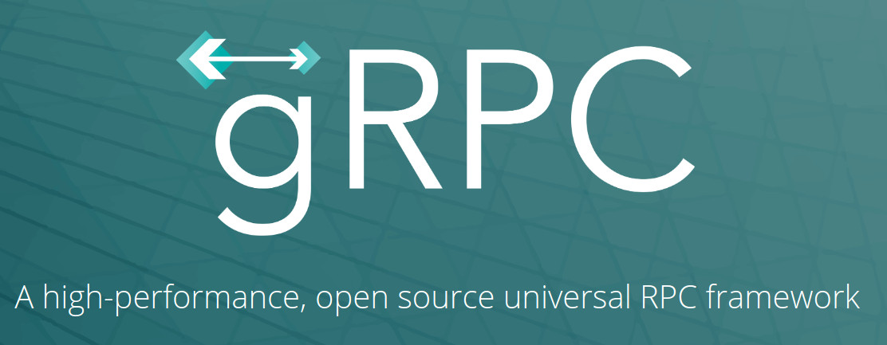
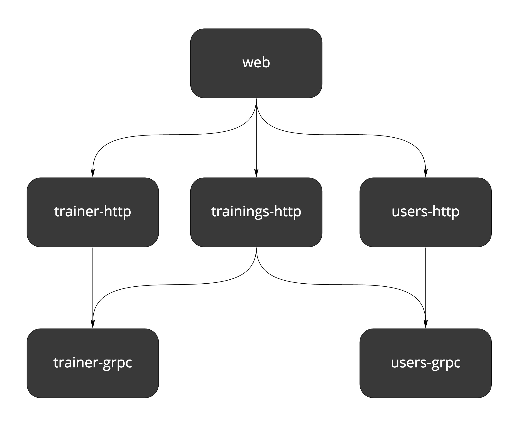
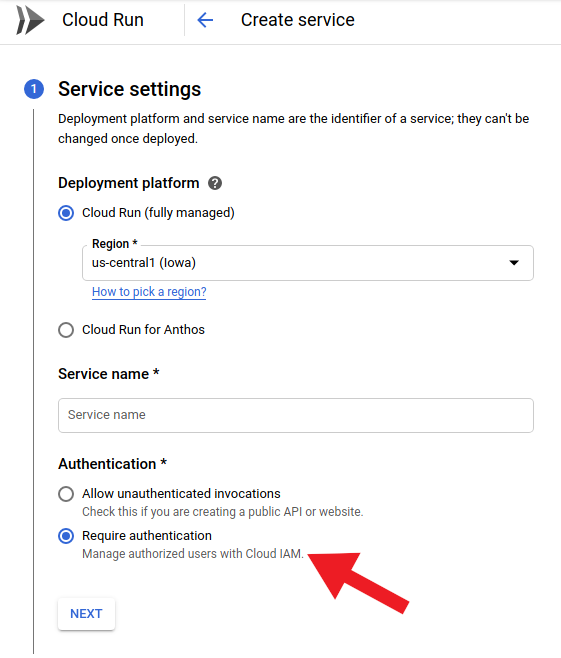
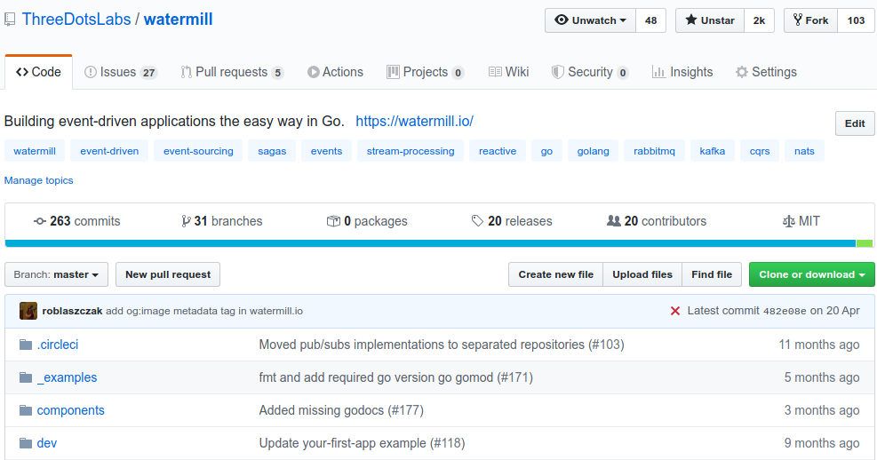

# Надежное gRPC взаимодействие в Google Cloud Run (и не только!)

Роберт Лащак. Главный инженер [Karhoo](https://www.karhoo.com/). Соучредитель
[Three Dots Labs](https://threedotslabs.com/). Создатель [Watermill](https://github.com/ThreeDotsLabs/watermill).

Добро пожаловать в третью статью из серии, посвященной созданию бизнес-приложений 
на Go! В этой серии статей мы хотим показать вам, как создавать приложения,
которые легко разрабатывать, поддерживать и приятно работать в долгосрочной
перспективе.

В статье на этой неделе я опишу, как вы можете **создать надежное внутреннее 
взаимодействие между вашими сервисами с помощью gRPC**. Я также расскажу о 
некоторых дополнительных настройках, необходимых для аутентификации и TLS для 
Cloud Run.

## Почему gRPC?

Представим себе ситуацию, которая актуальна для многих компаний:

_Знакомьтесь, Дэйв. Дэйв работает в компании, которая потратила около 2 лет на 
создание своего продукта с нуля. За это время им удалось найти тысячи клиентов,
которые хотели использовать их продукт. Они начали разрабатывать приложение во
время самого большого «бума» микросервисов. Для них это был очевидный выбор — 
использовать такую архитектуру. В настоящее время у них более 50 микросервисов,
использующих HTTP-вызовы для связи друг с другом._

_Конечно, компания Дэйва не всё делала идеально. Самая большая проблема в том, 
что сейчас все инженеры боятся что-либо менять в HTTP-контрактах. Легко внести 
некоторые изменения, которые несовместимы или не возвращают правильные 
данные. Не редкость, что из-за этого перестаёт работать всё приложение. «Разве 
мы не создали микросервисы, чтобы этого избежать?» - этот вопрос каждый день 
задают пугающие голоса в голове Дэйва._

_Дэйв уже предложил использовать OpenAPI для генерации ответов HTTP-сервера и для
клиентов. Но вскоре он обнаружил, что это при этом всё еще может возвращаться
неправильные данные из API._

Неважно звучит это (уже) знакомо для вас или нет. Решение, которым нужно воспользоваться
компании Дейва простое и легкое в реализации. **Вы можете легко создавать надёжные
контракты между вашими сервисами, используя gRPC.**



Сервера и клиенты, генерируемые gRPC, намного строже в gRPC, чем в OpenAPI. Излишне 
говорить, что такой способ намного лучше, чем OpenAPI клиент и сервер, которые 
просто копируют структуры.

> Важно помнить, что gRPC не решает проблем с качеством данных. Другими 
> словами, вы все равно можете отправлять непустые, но бессмысленные данные.
> 
> Важно обеспечить достоверность данных на многих уровнях, таких как надежный 
> контракт, тестирование контракта и сквозное тестирование.

Ещё одним важным доводом "за" может быть производительность. Вы можете найти 
множество исследований, согласно которым **gRPC может быть даже в 10 раз быстрее, 
чем REST**. Когда ваш API обрабатывает миллионы миллионов запросов в секунду, 
это может потребовать оптимизации затрат. Для таких приложений, как 
Wild Workouts, где трафик может быть меньше 10 запросов в секунду, **это не 
имеет значения**.

Чтобы не быть предвзятым агитируя за использование gRPC, я попытался найти 
любую причину не использовать его для внутреннего взаимодействия. У меня ничего 
не получилось:

* **порог вхождения низок**,
* добавление gRPC сервера не требует дополнительной работы с инфраструктурой — 
  он работает поверх HTTP/2,
* реализован на многих языках программирования, таких как Java, C/C++, Python, 
  C#, JS и [другие](https://grpc.io/about/#officially-supported-languages-and-platforms).
* теоретически вы даже можете использовать gRPC [для взаимодействия с фронтендом](https://grpc.io/blog/state-of-grpc-web/)
  (я не тестировал эту возможность).
* он соответствует принципам Go - **компилятор гарантирует, что вы не вернёте что-то 
  бессмысленное**.

Звучит многообещающе? Давайте проверим так ли это, реализовав gRPC в Wild 
Workouts!

> Это не просто очередная статья со случайными фрагментами кода.
> 
> Этот пост является частью большого цикла, показывающий как создавать приложения на
> **Go, которые легко разрабатывать, поддерживать и с ними интересно работать в
> долгосрочной перспективе**. Мы делаем это, делясь проверенными методами, основанными
> на многих экспериментах, проведёнными с возглавляемыми нами с командами,
> и [научных исследованиях](https://threedots.tech/post/ddd-lite-in-go-introduction/#thats-great-but-do-you-have-any-evidence-it-works).
> 
> Вы можете изучить эти методы, создав с нами [полнофункциональный](https://threedots.tech/post/serverless-cloud-run-firebase-modern-go-application/#what-wild-workouts-can-do) пример
> веб-приложения на Go - **Wild Workouts**.
> 
> Мы поступили не совсем обычно — **добавили некоторые не сразу заметные проблемы
> в первоначальную реализацию Wild Workouts**. Неужели мы сошли с ума? Пока нет. 😉
> Эти проблемы характерны для многих проектов Go. **В долгосрочной перспективе эти
> небольшие проблемы становятся критичными и не позволяют добавлять новые функционал.**
> 
> **Это один из важнейших навыков старшего или ведущего разработчика; всегда нужно
> помнить о долгосрочных последствиях.**
> 
> Мы исправим их путем **рефакторинга** Wild Workouts. Таким образом, вы быстро поймёте
> методики, которыми мы делимся.
> 
> Знаете ли вы это чувство, когда прочитали статью о какой-то методике и попытались
> реализовать её, но не смогли из-за упущений и пропуска деталей в руководстве.
> Пропуск деталей делает статьи короче и увеличивает просмотры страниц, но это
> не наша цель. Наша цель - создать материал, который даст достаточно знаний для
> применения представленных методик. Если вы еще не читали [предыдущие статьи из
> этого цикла](https://threedots.tech/series/modern-business-software-in-go/),
> мы настоятельно рекомендуем это сделать.
> 
> Мы считаем, что в некоторых областях знаний нельзя пропускать детали. Если вы
> хотите быстро и эффективно создавать сложные приложения, вам нужно потратить
> некоторое время, чтобы узнать как это сделать. Если бы всё было так просто,
> у нас бы не было такого большого количества устрашающего устаревшего кода.
> 
> Вот [полный список из 14 опубликованных на данный момент статей](https://threedots.tech/series/modern-business-software-in-go/).
> 
> Весь код Wild Workouts доступен на [GitHub](https://github.com/ThreeDotsLabs/wild-workouts-go-ddd-example). Не забудьте поставить звезду
> нашему проекту! ⭐

## Сгенерированный сервер

В настоящий момент у нас не так много конечных точек gRPC в Wild Workouts. Мы
можем обновлять часы, когда тренер доступен, и баланс пользователей, который он тратит
на тренировки (кредиты).



Давайте изучим `Trainer gRPC service`. Чтобы определить наш gRPC сервер, 
создадим файл `trainer.proto`.

```protobuf
syntax = "proto3";

package trainer;
option go_package = ".;trainer";

import "google/protobuf/timestamp.proto";

service TrainerService {
  rpc IsHourAvailable(IsHourAvailableRequest) returns (IsHourAvailableResponse) {}
  rpc UpdateHour(UpdateHourRequest) returns (EmptyResponse) {}
}

message IsHourAvailableRequest {
  google.protobuf.Timestamp time = 1;
}

message IsHourAvailableResponse {
  bool is_available = 1;
}

message UpdateHourRequest {
  google.protobuf.Timestamp time = 1;

  bool has_training_scheduled = 2;
  bool available = 3;
}

message EmptyResponse {}
```
Весь исходный код: [github.com/ThreeDotsLabs/wild-workouts-go-ddd-example/api/protobuf/trainer.proto](https://github.com/ThreeDotsLabs/wild-workouts-go-ddd-example/blob/33be9ae12a031b85b09fd8779fc445445785b106/api/protobuf/trainer.proto)

Определения в `.proto` файле преобразуются в Go код с помощью 
_компилятора Protocol Buffer_ (protoc).

```makefile
.PHONY: proto
proto:
    protoc --go_out=internal/common/genproto/trainer --go-grpc_out=internal/common/genproto/trainer -I api/protobuf api/protobuf/trainer.proto
    protoc --go_out=internal/common/genproto/users --go-grpc_out=internal/common/genproto/users -I api/protobuf api/protobuf/users.proto
```
Весь исходный код: [github.com/ThreeDotsLabs/wild-workouts-go-ddd-example/Makefile](https://github.com/ThreeDotsLabs/wild-workouts-go-ddd-example/blob/3d2ce607c0bcddc2a7f9cb56193167c8543d57ec/Makefile)

> Чтобы сгенерировать Go код из `.proto` файла Вам нужно установить [protoc](https://grpc.io/docs/protoc-installation/) и
> [protoc Go плагин](https://grpc.io/docs/quickstart/go/).
> 
> Список поддерживаемых типов можно найти в спецификации языка Protocol Buffers 
3-ей версии. Более сложные встроенные типы, такие как Timestamp, можно найти 
> в списке Часто Используемые Типы.

Вот как выглядит сгенерированная модель:

```go
type UpdateHourRequest struct {
    // вспомогательные поля, необходимые proto
  
    Time                 *timestamp.Timestamp `protobuf:"bytes,1,opt,name=time,proto3" json:"time,omitempty"`
    HasTrainingScheduled bool                 `protobuf:"varint,2,opt,name=has_training_scheduled,json=hasTrainingScheduled,proto3" json:"has_training_scheduled,omitempty"`
    Available            bool                 `protobuf:"varint,3,opt,name=available,proto3" json:"available,omitempty"`
}
```
Весь исходный код: [github.com/ThreeDotsLabs/wild-workouts-go-ddd-example/internal/common/genproto/trainer/trainer.pb.go](https://github.com/ThreeDotsLabs/wild-workouts-go-ddd-example/blob/3d2ce607c0bcddc2a7f9cb56193167c8543d57ec/internal/common/genproto/trainer/trainer.pb.go#L106)

А так сервер:

```go
type TrainerServiceClient interface {
    IsHourAvailable(ctx context.Context, in *IsHourAvailableRequest, opts ...grpc.CallOption) (*IsHourAvailableResponse, error)
    UpdateHour(ctx context.Context, in *UpdateHourRequest, opts ...grpc.CallOption) (*EmptyResponse, error)
}
```
Весь исходный код: [github.com/ThreeDotsLabs/wild-workouts-go-ddd-example/internal/common/genproto/trainer/trainer.pb.go](https://github.com/ThreeDotsLabs/wild-workouts-go-ddd-example/blob/3d2ce607c0bcddc2a7f9cb56193167c8543d57ec/internal/common/genproto/trainer/trainer.pb.go#L269)

Разница между HTTP и gRPC заключается в том, что в gRPC нам не нужно 
заботиться о том, что мы должны вернуть и как это сделать. Если бы меня просили 
определить уровень строгости к возвращаемому результату для HTTP и gRPC, это 
было бы похоже на сравнение Python и Go. gRPC намного строже и невозможно 
вернуть или получить какие-либо недопустимые значения — компилятор сообщит нам 
об этом.

Protobuf также имеет встроенную возможность обрабатывать устаревшие поля и 
обеспечивать [обратную совместимость](https://developers.google.com/protocol-buffers/docs/proto3#backwards-compatibility-issues). Это очень полезно в случае, когда 
работают множество независимых команд.

> Protobuf или gRPC
> 
> Protobuf (Protocol Buffers) - это _язык определения интерфейса_, используемый 
> по умолчанию для определения интерфейса сервиса и структуры полезной нагрузки.
> Protobuf также используется для сериализации этих моделей в двоичный формат.
> 
> Более подробную информацию о gRPC и Protobuf можно найти на странице [Принципы 
> работы gRPC](https://grpc.io/docs/guides/concepts/).

Код для сервера пишется почти так же, как для HTTP, [генерируемом OpenAPI](https://threedots.tech/post/serverless-cloud-run-firebase-modern-go-application/#public-http-api) - нужно
реализовать интерфейс (в нашем случае `TrainerServiceServer`).

```go
type GrpcServer struct {
    trainer.TrainerServiceServer
    db db
}

func (g GrpcServer) IsHourAvailable(ctx context.Context, req *trainer.IsHourAvailableRequest) (*trainer.IsHourAvailableResponse, error) {
    timeToCheck, err := grpcTimestampToTime(req.Time)
    if err != nil {
        return nil, status.Error(codes.InvalidArgument, "unable to parse time")
    }

    model, err := g.db.DateModel(ctx, timeToCheck)
    if err != nil {
        return nil, status.Error(codes.Internal, fmt.Sprintf("unable to get data model: %s", err))
    }

    if hour, found := model.FindHourInDate(timeToCheck); found {
        return &trainer.IsHourAvailableResponse{IsAvailable: hour.Available && !hour.HasTrainingScheduled}, nil
    }

    return &trainer.IsHourAvailableResponse{IsAvailable: false}, nil
}
```
Весь исходный код: [github.com/ThreeDotsLabs/wild-workouts-go-ddd-example/internal/trainer/grpc.go](https://github.com/ThreeDotsLabs/wild-workouts-go-ddd-example/blob/3d2ce607c0bcddc2a7f9cb56193167c8543d57ec/internal/trainer/grpc.go#L16)

Как видите, вы не можете вернуть ничего, кроме `IsHourAvailableResponse`, и 
всегда можете быть уверены, что получите `IsHourAvailableRequest`. В случае 
ошибки вы можете вернуть один из предопределенных кодов ошибки. В настоящее 
время они более актуальны, чем коды состояния HTTP.

Запуск сервера gRPC выполняется так же, как и HTTP-сервера:

```go
server.RunGRPCServer(func(server *grpc.Server) {
    svc := GrpcServer{db: firebaseDB}
    trainer.RegisterTrainerServiceServer(server, svc)
})
```
Весь исходный код: [github.com/ThreeDotsLabs/wild-workouts-go-ddd-example/internal/trainer/main.go](https://github.com/ThreeDotsLabs/wild-workouts-go-ddd-example/blob/3d2ce607c0bcddc2a7f9cb56193167c8543d57ec/internal/trainer/main.go#L38)

## Внутренний gRPC клиент

После того, как наш сервер запущен, пора его использовать. Прежде всего, нам 
нужно создать экземпляр клиента. `trainer.NewTrainerServiceClient` создается из 
`.proto`.

```go
type TrainerServiceClient interface {
    IsHourAvailable(ctx context.Context, in *IsHourAvailableRequest, opts ...grpc.CallOption) (*IsHourAvailableResponse, error)
    UpdateHour(ctx context.Context, in *UpdateHourRequest, opts ...grpc.CallOption) (*EmptyResponse, error)
}

type trainerServiceClient struct {
    cc grpc.ClientConnInterface
}

func NewTrainerServiceClient(cc grpc.ClientConnInterface) TrainerServiceClient {
    return &trainerServiceClient{cc}
}
```
Весь исходный код: [github.com/ThreeDotsLabs/wild-workouts-go-ddd-example/internal/common/genproto/trainer/trainer.pb.go](https://github.com/ThreeDotsLabs/wild-workouts-go-ddd-example/blob/3d2ce607c0bcddc2a7f9cb56193167c8543d57ec/internal/common/genproto/trainer/trainer.pb.go#L237)

Чтобы сгенерированный клиент работал, нам нужно передать пару дополнительных 
настроек. Они позволят реализовать:

* аутентификацию,
* TLS шифрование,
* «обнаружение сервисов» (мы используем жестко запрограммированные имена 
  сервисов, предоставляемые [Terraform](https://threedots.tech/post/complete-setup-of-serverless-application/#cloud-run), используя переменную окружения 
  `TRAINER_GRPC_ADDR`).
  
```go
import (
    // ...
    "github.com/MaksimDzhangirov/three-dots/internal/common/genproto/trainer"
    // ...
)

func NewTrainerClient() (client trainer.TrainerServiceClient, close func() error, err error) {
    grpcAddr := os.Getenv("TRAINER_GRPC_ADDR")
    if grpcAddr == "" {
        return nil, func() error { return nil }, errors.New("empty env TRAINER_GRPC_ADDR")
    }
  
    opts, err := grpcDialOpts(grpcAddr)
    if err != nil {
        return nil, func() error { return nil }, err
    }
  
    conn, err := grpc.Dial(grpcAddr, opts...)
    if err != nil {
        return nil, func() error { return nil }, err
    }
  
    return trainer.NewTrainerServiceClient(conn), conn.Close, nil
}
```
Весь исходный код: [github.com/ThreeDotsLabs/wild-workouts-go-ddd-example/internal/common/client/grpc.go](https://github.com/ThreeDotsLabs/wild-workouts-go-ddd-example/blob/33be9ae12a031b85b09fd8779fc445445785b106/internal/common/client/grpc.go#L17)

После того, как наш клиент создан, мы можем вызвать любой из его методов.
В этом примере мы вызываем `UpdateHour` при создании тренировки.

```go
import (
    // ... 
    "github.com/pkg/errors"
    "google.golang.org/protobuf/types/known/timestamppb"
    "github.com/MaksimDzhangirov/three-dots/internal/common/genproto/trainer"
    // ...
)

func (h HttpServer) CreateTraining(w http.ResponseWriter, r *http.Request) {
    // ...
	timestamp := timestamppb.New(postTraining.Time)
    _, err = h.trainerClient.UpdateHour(ctx, &trainer.UpdateHourRequest{
        Time:                 timestamp,
        HasTrainingScheduled: true,
        Available:            false,
    })
    if err != nil {
        return errors.Wrap(err, "unable to update trainer hour")
    }
    // ...
}
```
Весь исходный код: [github.com/ThreeDotsLabs/wild-workouts-go-ddd-example/internal/trainings/http.go](https://github.com/ThreeDotsLabs/wild-workouts-go-ddd-example/blob/33be9ae12a031b85b09fd8779fc445445785b106/internal/trainings/http.go#L94)

## Cloud Run аутентификация и TLS

Аутентификацией клиента занимается Cloud Run из коробки.



Вы также можете включить аутентификацию из пользовательского интерфейса Cloud Run.

Вам также необходимо назначить роль [role/run.invoker](https://cloud.google.com/run/docs/authenticating/service-to-service) 
служебной учетной записи сервиса.

Более простой (и рекомендуемый нами) способ — использовать Terraform. Милош 
подробно описал как это сделать в предыдущей статье.

Единственное, что не работает из коробки — это отправка аутентификации вместе с 
запросом. Я уже упоминал, что стандартный транспорт gRPC - это HTTP/2? По этой 
причине мы можем просто использовать для этого старый добрый JWT.

Чтобы всё заработало нужно реализовать интерфейс `google.golang.org/grpc/credentials.PerRPCCredentials`.
Реализация основана на официальном руководстве от [Google Cloud Documentation](https://cloud.google.com/run/docs/authenticating/service-to-service#go).

```go
type metadataServerToken struct {
    serviceURL string
}

func newMetadataServerToken(grpcAddr string) credentials.PerRPCCredentials {
    // основываясь на https://cloud.google.com/run/docs/authenticating/service-to-service#go
    // сервис должен иметь префикс https без порта
    serviceURL := "https://" + strings.Split(grpcAddr, ":")[0]
  
    return metadataServerToken{serviceURL: serviceURL}
}

// GetRequestMetadata вызывается при каждом запросе, поэтому мы уверены, что срок действия токена всегда не истек
func (t metadataServerToken) GetRequestMetadata(ctx context.Context, in ...string) (map[string]string, error) {
    // основываясь на https://cloud.google.com/run/docs/authenticating/service-to-service#go
    tokenURL := fmt.Sprintf("/instance/service-accounts/default/identity?audience=%s", t.serviceURL)
    idToken, err := metadata.Get(tokenURL)
    if err != nil {
        return nil, errors.Wrap(err, "cannot query id token for gRPC")
    }

    return map[string]string{
        "authorization": "Bearer " + idToken,
    }, nil
}

func (metadataServerToken) RequireTransportSecurity() bool {
    return true
}
```
Весь исходный код: [github.com/ThreeDotsLabs/wild-workouts-go-ddd-example/internal/common/client/auth.go](https://github.com/ThreeDotsLabs/wild-workouts-go-ddd-example/blob/33be9ae12a031b85b09fd8779fc445445785b106/internal/common/client/auth.go#L13)

Последнее, что нужно сделать, передать его в список `[]grpc.DialOption`, который
используется при создании всех gRPC клиентов.

Также рекомендуется убедиться, что сертификат нашего сервера действителен с 
помощью `grpc.WithTransportCredentials`.

Для локального Docker окружения аутентификация и TLS шифрование отключены.

```go
func grpcDialOpts(grpcAddr string) ([]grpc.DialOption, error) {
    if noTLS, _ := strconv.ParseBool(os.Getenv("GRPC_NO_TLS")); noTLS {
        return []grpc.DialOption{grpc.WithInsecure()}, nil
    }
  
    systemRoots, err := x509.SystemCertPool()
    if err != nil {
        return nil, errors.Wrap(err, "cannot load root CA cert")
    }
    creds := credentials.NewTLS(&tls.Config{
        RootCAs: systemRoots,
    })
  
    return []grpc.DialOption{
        grpc.WithTransportCredentials(creds),
        grpc.WithPerRPCCredentials(newMetadataServerToken(grpcAddr)),
    }, nil
}
```
Весь исходный код: [github.com/ThreeDotsLabs/wild-workouts-go-ddd-example/internal/common/client/grpc.go](https://github.com/ThreeDotsLabs/wild-workouts-go-ddd-example/blob/33be9ae12a031b85b09fd8779fc445445785b106/internal/common/client/grpc.go#L63)

## Решены ли все проблемы внутреннего взаимодействия?

**Молоток отлично подходит для забивания гвоздей, но не стоит его использовать для
рубки дерева. То же самое относится к gRPC или любой другой методике.**

**gRPC отлично подходит для синхронного взаимодействия, но не все процессы 
синхронны по своей природе. Использование синхронного взаимодействия повсюду 
приведёт к возникновению медленной, нестабильной системы.** В настоящее время
в Wild Workouts нет последовательности действий, которая должна быть асинхронной.
Мы рассмотрим эту тему более подробно в следующих статьях, добавив новые функции.
А пока вы можете присмотреться к библиотеке [Watermill](http://watermill.io/), 
которая также была создана нами. 😉 Он помогает легко создавать асинхронные, 
управляемые событиями приложения.



## Что дальше?

Наличие надёжных контрактов не означает, что мы не внедряем ненужное внутреннее 
взаимодействие. В некоторых случаях операции можно выполнить в одном сервисе
более простым и практичным способом.

Избежать этих проблем непросто. К счастью, мы знаем методики, которые нам в 
этом успешно помогают. Мы скоро поделимся ими с вами. 😉

**Прежде, чем перейти к ним, нам осталось рассмотреть ещё одну тему, связанную с 
нашим "Слишком современном приложением". Она будет посвящена Firebase HTTP 
аутентификации. После этого приступим к рефакторингу!** Как я уже 
упоминал в [первой статье](https://threedots.tech/post/serverless-cloud-run-firebase-modern-go-application/), мы уже намеренно добавили некоторые проблемы в Wild
Workouts. Не терпится узнать, что не так с Wild Workouts? Напишите нам об этом
в комментариях! 😉

Увидимся на следующей неделе. 👋