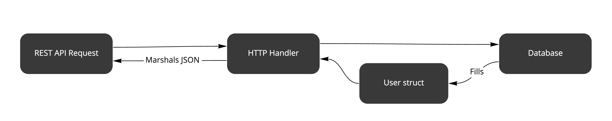
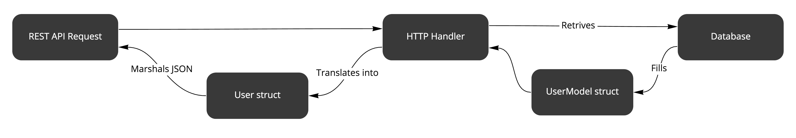

# Бизнес-приложения на Go: что нужно знать о DRY

[Данная статья является переводом. Оригинал можно найти по ссылке](https://threedots.tech/post/things-to-know-about-dry/)

Милош Смолка. Технический руководитель [Karhoo](https://www.karhoo.com/). Соучредитель
[Three Dots Labs](https://threedotslabs.com/). Создатель [Watermill](https://github.com/ThreeDotsLabs/watermill).

Если вы впервые здесь, это следующий пост в нашей серии статей [Бизнес приложения
на Go](https://threedots.tech/series/modern-business-software-in-go/). Ранее мы 
представили [Wild Workouts](https://threedots.tech/post/serverless-cloud-run-firebase-modern-go-application/), наш пример приложения, созданного в современном 
стиле с некоторыми едва заметными антипаттернами. Мы добавили их специально, 
чтобы показать распространенные ошибки и дать советы, как их избежать.

В этом посте мы начинаем рефакторинг Wild Workouts. Предыдущие статьи дадут 
вам больше понимания о происходящем, но читать их не обязательно, чтобы понять 
эту.

## Предыстория

Знакомьтесь, Сьюзан, инженером-программистом, которой скучно на ее нынешней 
работе, связанной с устаревшим корпоративным программным обеспечением. Сьюзан 
начала искать новую работу и нашла стартап Wild Workouts, который использует 
бессерверные Go микросервисы. Это казалось чем-то свежим и современным, поэтому 
после успешного процесса найма, она начала свой первый день в новой компании.

В команде было всего несколько инженеров, так что адаптация Сьюзен шла очень быстро.
Прямо в первый день ей было поручено первое задание, которое должно было 
познакомить ее с приложением.

> Нам нужно сохранять последний IP-адрес каждого пользователя. Это позволит 
> добавить функционал, связанный с безопасностью в будущем, например, дополнительное
> подтверждение при входе в систему с нового места. На данный момент мы просто 
> хотим сохранить его в базе данных.

Сьюзан некоторое время изучала приложение. Она попыталась понять, что 
происходит в каждой сервисе и куда добавить новое поле для хранения IP-адреса.
Наконец, она обнаружила структуру [User](https://github.com/ThreeDotsLabs/wild-workouts-go-ddd-example/blob/3d2ce607c0bcddc2a7f9cb56193167c8543d57ec/internal/users/openapi_types.gen.go#L7), 
которую она могла расширить.

```go
// User определяет модель для пользователя
type User struct {
    Balance     int     `json:"balance"`
    DisplayName string  `json:"displayName"`
    Role        string  `json:"role"`
+   LastIp      string  `json:"lastIp"`
}
```

Сьюзан быстро опубликовала свой первый пул-реквест. Вскоре Дэйв, старший 
инженер, добавил комментарий во время код ревью.

> Я не думаю, что мы давать доступ к этому полю через REST API.

Сьюзан была удивлена, так как была уверена, что обновила модель базы данных.
В замешательстве она спросила Дэйва, правильное ли определила место для добавления 
нового поля.

Дэйв объяснил, что Firestore, база данных приложения, хранит документы, 
преобразованные из Go структур. Таким образом, структура User может использоваться как 
для фронтенд-ответов, так и с хранилища.

_«Благодаря такому подходу вам не нужно дублировать код. «Достаточно один раз 
изменить YAML определение и заново создать файл»_ - сказал он с энтузиазмом.

Благодарная за подсказку, Сьюзен добавила еще одно изменение, чтобы скрыть 
новое поле из API ответа.

```shell
diff --git a/internal/users/http.go b/internal/users/http.go
index 9022e5d..cd8fbdc 100644
--- a/internal/users/http.go
+++ b/internal/users/http.go
@@ -27,5 +30,8 @@ func (h HttpServer) GetCurrentUser(w http.ResponseWriter, r *http.Request) {
        user.Role = authUser.Role
        user.DisplayName = authUser.DisplayName

+       // Не выдаём последний IP адрес пользователя в API ответе 
+       user.LastIp = nil
+
        render.Respond(w, r, user)
 }
```

Одной строчки хватило, чтобы исправить эту проблему. Для Сьюзен первый день 
был весьма продуктивным.

## Последующие размышления

Несмотря на то, что решение Сьюзан было одобрено и добавлено в основную ветку, 
что-то ее беспокоило по дороге домой. **Правильно ли использовать одну и ту же 
структуру как для API ответа, так и для модели базы данных?** Разве мы не рискуем 
случайно выдать личные данные пользователя, если будем продолжать расширять 
структуру по мере роста приложения? Что, если мы хотим изменить только в API 
ответ, не изменяя поля базы данных?



А что насчёт разделения двух структур? Именно так Сьюзан поступила бы на своей 
старой работе, но, возможно, это были корпоративные методики, которые не следует
использовать в Go микросервисах. Кроме того, команда очень строго следовала 
принципу **«Не повторяйся»**.

## Рефакторинг

На следующий день Сьюзен рассказала о своих сомнениях Дэйву и спросила о его 
мнении. Сначала он не понял беспокойства и упомянул, что, возможно, ей нужно 
привыкнуть к тому как это "делается в Go".

Сьюзан указала на другой фрагмент кода в Wild Workouts, в котором использовалось 
аналогичное не стандартное решение. Она указала, что, по её опыту, такой код 
может быстро выйти из-под контроля.

```go
    user, err := h.db.GetUser(r.Context(), authUser.UUID)
    if err != nil {
        httperr.InternalError("cannot-get-user", err, w, r)
        return
    }
    user.Role = authUser.Role
    user.DisplayName = authUser.DisplayName

    render.Respond(w, r, user)
```
Сейчас HTTP обработчик вносит изменения в структуру `user` напрямую.

В конце концов, они согласились обсудить это снова в рамках пул-реквеста.
Вскоре Сьюзен подготовила предложение по рефакторингу.

```shell
diff --git a/internal/users/firestore.go b/internal/users/firestore.go
index 7f3fca0..670bfaa 100644
--- a/internal/users/firestore.go
+++ b/internal/users/firestore.go
@@ -9,6 +9,13 @@ import (
        "google.golang.org/grpc/status"
 )

+type UserModel struct {
+       Balance     int
+       DisplayName string
+       Role        string
+       LastIP      string
+}
+
diff --git a/internal/users/http.go b/internal/users/http.go
index 9022e5d..372b5ca 100644
--- a/internal/users/http.go
+++ b/internal/users/http.go
@@ -1,6 +1,7 @@
-       user.Role = authUser.Role
-       user.DisplayName = authUser.DisplayName

-       render.Respond(w, r, user)
+       userResponse := User{
+               DisplayName: authUser.DisplayName,
+               Balance:     user.Balance,
+               Role:        authUser.Role,
+       }
+
+       render.Respond(w, r, userResponse)
 }
```
Весь исходный код: [github.com/ThreeDotsLabs/wild-workouts-go-ddd-example/commit/14d9e7badcf5a91811059d377cfa847ec7b4592f](https://github.com/ThreeDotsLabs/wild-workouts-go-ddd-example/commit/14d9e7badcf5a91811059d377cfa847ec7b4592f)

В этот раз Сьюзен не стала менять что-то в OpenAPI определении. В конце концов, 
она не должна была вносить какие-либо изменения в REST API. Вместо этого она вручную
создала другую структуру, такую же как `User`, но исключительно для модели базы 
данных. Затем она добавила в неё новое поле.

В новом решении немного больше строк кода, но в нем устранена связь кода 
между REST API и уровнем базы данных (и все это без введения другого 
микросервиса). В следующий раз, когда кто-то захочет добавить поле, он сможет 
сделать это, обновив соответствующую структуру.



## Столкновение интересов

Больше всего Дэйва беспокоило то, что второе решение нарушает принцип [DRY](https://en.wikipedia.org/wiki/Don%27t_repeat_yourself) и 
приводит к повторению кода в нескольких местах. С другой стороны, Сьюзен 
опасалась, что исходный подход нарушает **принцип единой ответственности** 
(буква «S» в [SOLID](https://en.wikipedia.org/wiki/SOLID)). Кто прав?

Сложно прийти к единому мнению. Иногда кажется, что код дублируется, но это
один из лучших инструментов для борьбы со связанностью кода. Спросите себя,
меняется ли код, использующий общую структуру, одновременно во всех местах? 
Если нет, то можно с уверенностью предположить, что дублирование — правильный 
выбор.

Обычно DRY лучше применять к поведению, а не к данным. Например, выделение 
общего кода в отдельную функцию не имеет тех недостатков, которые мы обсуждали 
до сих пор.

## Подумаешь? Может всё не стоило усилий?

Влияет ли такое незначительное изменение на архитектуру?

Сьюзен внесла небольшое изменение, о последствиях которого она не знала.
Для других инженеров это было очевидно, но не для новичка. Думаю, вам также 
знакомо **чувство страха внести изменения в неизвестную систему, потому что вы не 
можете знать, к чему это может привести.**

Если вы примете много неправильных решений, даже небольших, они постепенно будут 
усугубляться. Со временем разработчики начинают жаловаться на то, что с 
приложением сложно работать. Переломный момент наступает, когда кто-то 
упоминает слово «переписать», и внезапно вы понимаете, что столкнулись с 
большой проблемой.

> Альтернативой хорошему дизайну является всегда плохой дизайн. Не существует 
> компромиссов.
> **Адам Джадж**

Прежде чем столкнуться с проблемами, стоит обсудить архитектурные решения. Если 
в приложении "не используется архитектура", значит у него плохая архитектура.

## Могут ли микросервисы быть выходом из положения?

При всех преимуществах, которые дают нам микросервисы, возникла и опасная 
идея, проповедуемая некоторыми руководствами по созданию микросервисов. **В нем 
говорится, что микросервисы упростят ваше приложение.** Поскольку создавать 
большие программные проекты сложно, некоторые обещают, что вам не придется 
беспокоиться об этом, если вы разделите приложение на маленькие части.

На бумаге эта идея звучит хорошо, но в ней упускается смысл разделения 
программного обеспечения. Как узнать, где поставить границы? Вы просто 
разделите сервис на основе каждого объекта базы данных? Конечные точки REST?
Функционал приложения? **Как обеспечить слабую связанность между сервисами?**

## Распределенный монолит

Если вы начнёте создавать приложение с плохо разделенных сервисов, вы, 
скорее всего, получите тот же монолит, которого пытались избежать, с 
дополнительными сетевыми накладными расходами и сложными инструментами для 
управления этим беспорядком (также известный как **распределенный монолит**).
Вы просто замените сильносвязанные модули сильносвязанными сервисами. А поскольку 
теперь все используют кластер Kubernetes, вы можете даже подумать, что 
соблюдаете отраслевые стандарты.

Даже если вы сможете переписать один сервис за день, сможете ли вы так же быстро 
изменить способ взаимодействия сервисов друг с другом? Что если ответственность 
за них несут разные команды, исходя из неправильного деления? Подумайте, 
насколько проще провести рефакторинг отдельного приложения.

Все вышеперечисленное не отменяет других преимуществ использования 
микросервисов, таких как независимое развертывание (что важно для непрерывной 
доставки) и более простое горизонтальное масштабирование. Как и в случае со 
всеми методиками, убедитесь, что вы используете правильный инструмент для 
работы в нужное время.

> Мы специально ввели подобные проблемы в Wild Workouts. Мы рассмотрим их в 
> будущих публикациях и обсудим другие методики разделения.
> 
> Некоторые идеи можно найти в посте Роберта: [_Почему использование микросервисов
> или монолита может быть лишь незначительной деталью?_](https://threedots.tech/post/microservices-or-monolith-its-detail/)

## Все ли это применимо к Go?

Go проекты с открытым исходным кодом обычно представляют собой низкоуровневые 
приложения и инструменты инфраструктуры. Это было особенно верно в начале 
становления языка, но всё ещё трудно найти хорошие примеры Go приложений, где 
бы использовалась **логика предметной области**.

Под «логикой предметной области» я не имею в виду финансовые приложения или 
сложное программное обеспечение для бизнеса. **Если вы разрабатываете какое-либо 
веб-приложение, существует большая вероятность, что там будут 
сложные предметные области, которые вам нужно как-то смоделировать.**

Следуя некоторым DDD примерам, вы можете почувствовать, что больше не пишете на
Go. Я прекрасно понимаю, что принудительно использовать шаблоны ООП напрямую 
из Java - неинтересно. Однако **есть некоторые идеи, не зависящие от языка, 
которые, я думаю, стоит рассмотреть.**

## Существует ли альтернатива?

Мы потратили последние несколько лет на изучение этой темы. Нам очень нравится 
простота Go, но мы также добились успеха благодаря идеям из 
предметно-ориентированного проектирования и [чистой архитектуры](https://blog.cleancoder.com/uncle-bob/2012/08/13/the-clean-architecture.html).

По какой-то причине с появлением микросервисов разработчики не перестали 
говорить о техническом долге и устаревшем программном обеспечении. Вместо 
того, чтобы искать серебряную пулю, мы предпочитаем прагматично использовать 
бизнес-ориентированные методики вместе с микросервисами.

Мы еще не закончили рефакторинг Wild Workouts. В одном из следующих постов мы 
увидим, как внедрить чистую архитектуру в проект.