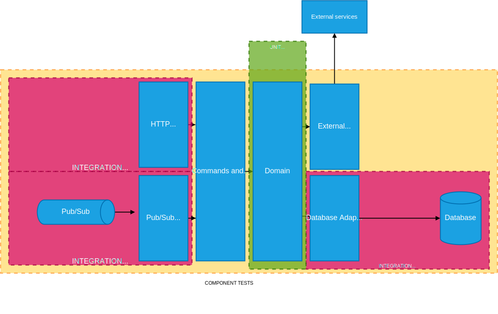
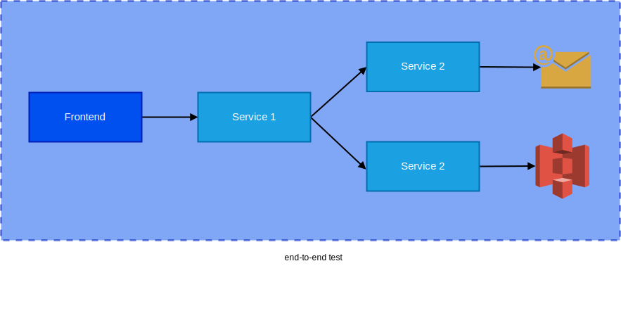
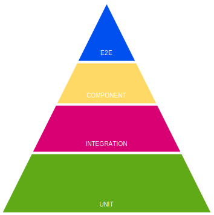
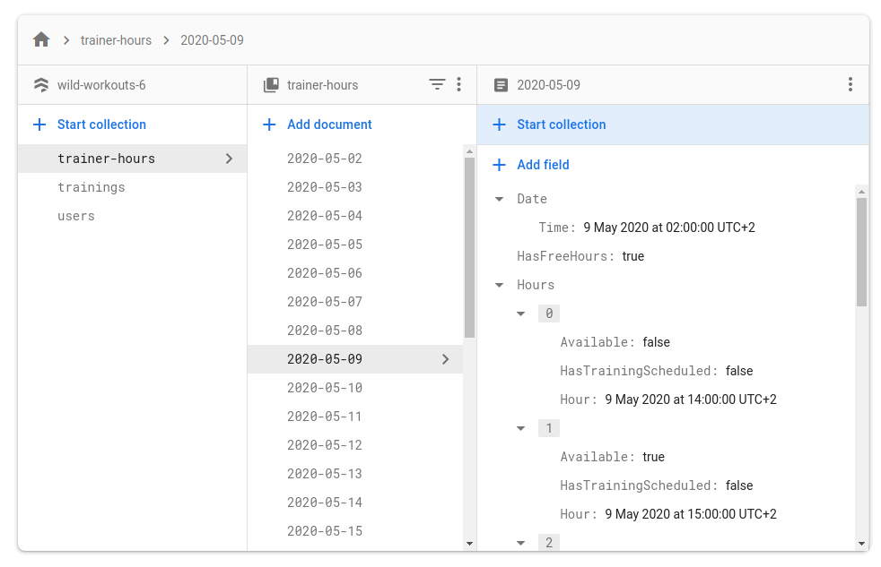

# 4 практических правила для создания качественных интеграционных тестов с базой данных на Go

[Данная статья является переводом. Оригинал можно найти по ссылке](https://threedots.tech/post/database-integration-testing/)

Роберт Лащак. Главный инженер [Karhoo](https://www.karhoo.com/). Соучредитель
[Three Dots Labs](https://threedotslabs.com/).
Создатель [Watermill](https://github.com/ThreeDotsLabs/watermill).

Вы когда-нибудь слышали о проекте, где изменения тестировались на 
клиентах, которые вам не нравятся, или на странах, не приносящих прибыли?
Или еще хуже — работали ли Вы над таким проектом?

Недостаточно сказать, что это просто несправедливо и непрофессионально. 
Также сложно разработать что-то новое, потому что вы боитесь вносить какие-либо 
изменения в свою кодовую базу.

В [отчете о навыках разработчиков HackerRank за 2019 год](https://research.hackerrank.com/developer-skills/2019#jobsearch3) 
_профессиональный рост и обучение_ были отмечены как наиболее важные факторы 
при поиске новой работы. Как вы думаете, сможете ли вы чему-нибудь научиться и 
развиваться, тестируя свое приложение таким образом?

**Все это ведет к разочарованию и выгоранию.**

Чтобы легко и уверенно разрабатывать приложение, вам потребуется набор тестов 
на нескольких уровнях. В этой статье я расскажу на практических примерах, 
как реализовать качественные интеграционные тесты с базой данных. Я также 
расскажу об основных методах тестирования Go, таких как тестовые таблицы,
assert функции, параллельное выполнение и тестирование методом черного ящика.

Что на самом деле означает высокое качество тестирования?

## 4 правила качественного тестирования

Я подготовил 4 правила, которые нужно выполнить, чтобы говорить о высоком 
качестве интеграционных тестов.

1. Быстрота

Хорошие тесты **должны быть быстрыми. Здесь нет компромиссов.**

Все ненавидят длительные тесты. Давайте подумаем о времени и психическом 
здоровье ваших товарищей по команде, когда они ждут результатов тестов. И в 
CI, и локально. Это ужасно.

Когда вы ждете долгое время, вы, вероятно, тем временем начнете делать 
что-нибудь еще. После того, как CI закончится (надеюсь), вам нужно будет вернуться
к этой задаче. Переключение контекста — один из самых серьезных убийц 
производительности. Это очень утомляет наш мозг. Мы не роботы.

Я знаю, что есть еще компании, где тесты могут выполняться 24 часа в сутки. 
Мы не хотим следовать этому подходу. 😉

Вы должны иметь возможность выполнять тесты локально менее чем за 1 минуту, в 
идеале **менее чем за 10 секунд**. Я знаю, что иногда может потребоваться некоторое 
время. Это инвестиция с отличным ROI (_возвратом инвестиций_)! В этом случае вы 
можете очень быстро проверить свои изменения. Кроме того, время развертывания и 
т. д. намного короче.

По моему опыту, всегда стоит пытаться найти быстрые решения, которые могут 
максимально сократить выполнение тестов. Здесь отлично работает [принцип Парето 
(правило 80/20)](https://en.wikipedia.org/wiki/Pareto_principle)!

2. Тестирование достаточного количества ситуаций на всех уровнях.

Я надеюсь, что вы уже знаете, что 100% тестовое покрытие - не лучшая идея 
(если это не простая/важная библиотека).

Всегда полезно задать себе вопрос _«насколько легко это может сломаться?»_. Ещё 
более целесообразно задать этот вопрос, если вы чувствуете, что выполняемый тест 
начинает выглядеть точно так же, как функция, которую вы тестируете. В конце
концов мы не пишем тесты, потому что тесты хороши, но они должны прикрывать нас 
от неприятностей!

По моему опыту, **покрытие в 70-80% - неплохой результат в Go.**

Также не лучшая идея покрывать все с помощью компонентных или сквозных тестов. 
Во-первых, вы не сможете этого сделать из-за невозможности смоделировать 
некоторые случаи ошибок, например, откаты транзакций в репозитории. Во-вторых, 
это нарушит первое правило. Эти тесты будут медленными.





Тесты на нескольких уровнях также должны перекрываться, чтобы мы знали, что 
интеграция выполнена правильно.

Вам может показаться, что решить эту проблему просто: использовать тестовую 
пирамиду! И это действительно так... иногда. Особенно в приложениях, которые
выполняют множество операций записи.



Но как быть, например, с приложениями, которые собирают данные из нескольких 
других служб и предоставляют данные через API? В нем нет сложной логики 
сохранения данных. Вероятно, большая часть кода связана с операциями с базой 
данных. В этом случае следует использовать **перевернутую тестовую пирамиду** 
(она больше похожа на елку). Когда большая часть нашего приложения подключена к 
какой-либо инфраструктуре (например, к базе данных), просто сложно покрыть 
многие функции с помощью unit тестов.


3. Тесты должны быть надежными и детерминированными.

Знаете ли вы это чувство, когда вы делаете какое-то срочное исправление, тесты 
проходят локально, вы отправляете изменения в репозиторий и... через 20 минут 
они не работают в CI? Это невероятно расстраивает. Это также отбивать охоту у нас 
добавлять новые тесты. Это также снижает наше доверие к ним.

Вы должны исправить эту проблему как можно быстрее. В этом случае [теория 
разбитых окон](https://en.wikipedia.org/wiki/Broken_windows_theory) действительно верна.

4. Вы должны иметь возможность выполнять большинство тестов локально.

Тесты, запускаемые локально, должны дать вам достаточно уверенности в том, 
что функция, которую вы разработали или отредактировали, все еще работает. 
**E2E-тесты должны просто перепроверить, все ли правильно интегрировано.**

У вас также будет гораздо больше уверенности, когда контракты между сервисами 
будут [надежными из-за использования gRPC](https://threedots.tech/post/robust-grpc-google-cloud-run/), protobuf или OpenAPI.

Это хорошая причина покрыть тестами как можно больше на более низких уровнях 
(начиная с самого низкого): unit, интеграционном и компонентном. 
Только тогда E2E.

## Реализация

У нас есть общая теоретическая база. Но нам никто не платит за то, что мы 
являемся знатоками теории программирования. Давайте рассмотрим несколько 
практических примеров, которые вы можете реализовать в своем проекте.

Начнем с шаблона репозиторий, который я описал в предыдущей статье. Вам не 
нужно читать остальные статьи из этой серии, но рекомендуется просмотреть хотя 
бы [предыдущую](https://threedots.tech/post/repository-pattern-in-go/). Вам будет
намного понятнее как работает наша реализация репозитория.

> Это не просто очередная статья со случайными фрагментами кода.
> 
> Этот пост является частью большого цикла, показывающий как создавать приложения на
> **Go, которые легко разрабатывать, поддерживать и с ними интересно работать в
> долгосрочной перспективе**. Мы делаем это, делясь проверенными методами, основанными
> на многих экспериментах, проведёнными с возглавляемыми нами с командами,
> и [научных исследованиях](https://threedots.tech/post/ddd-lite-in-go-introduction/#thats-great-but-do-you-have-any-evidence-it-works).
> Вы можете изучить эти методы, создав с нами [полнофункциональный](https://threedots.tech/post/serverless-cloud-run-firebase-modern-go-application/#what-wild-workouts-can-do) пример
> веб-приложения на Go - **Wild Workouts**.
> 
> Мы поступили не совсем обычно — **добавили некоторые не сразу заметные проблемы
> в первоначальную реализацию Wild Workouts**. Неужели мы сошли с ума? Пока нет. 😉
> Эти проблемы характерны для многих проектов Go. **В долгосрочной перспективе эти
> небольшие проблемы становятся критичными и не позволяют добавлять новые функционал.**
>
> **Это один из важнейших навыков старшего или ведущего разработчика; всегда нужно
> помнить о долгосрочных последствиях.**
>
> Мы исправим их путем **рефакторинга** Wild Workouts. Таким образом, вы быстро поймёте
> методики, которыми мы делимся.
> Знаете ли вы это чувство, когда прочитали статью о какой-то методике и попытались
> реализовать её, но не смогли из-за упущений и пропуска деталей в руководстве.
> Пропуск деталей делает статьи короче и увеличивает просмотры страниц, но это
> не наша цель. Наша цель — создать материал, который даст достаточно знаний для
> применения представленных методик. Если вы еще не читали [предыдущие статьи из
> этого цикла](https://threedots.tech/series/modern-business-software-in-go/),
> мы настоятельно рекомендуем это сделать.
>
> Мы считаем, что в некоторых областях знаний нельзя пропускать детали. Если вы
> хотите быстро и эффективно создавать сложные приложения, вам нужно потратить
> некоторое время, чтобы узнать как это сделать. Если бы всё было так просто,
> у нас бы не было такого большого количества устрашающего устаревшего кода.
> 
> Вот [полный список из 14 опубликованных на данный момент статей](https://threedots.tech/series/modern-business-software-in-go/).
>
> Весь код Wild Workouts доступен на [GitHub](https://github.com/ThreeDotsLabs/wild-workouts-go-ddd-example). Не забудьте поставить звезду
> нашему проекту! ⭐

Способ взаимодействия с нашей базой данных определяется интерфейсом 
`hour.Repository`. Предполагается, что наша реализация репозитория проста. Вся 
сложная логика обрабатывается на уровне предметной области нашего приложения. **Она
должна просто сохранять данные без каких-либо проверок и т. д. Одним из 
существенных преимуществ такого подхода является упрощение реализации 
репозитория и тестов.**

В предыдущей статье я подготовил три различных реализации базы данных: MySQL, 
Firebase и в памяти. Мы протестируем их все. Все они полностью совместимы, поэтому 
у нас будет только один набор тестов.

```go
package hour

type Repository interface {
    GetOrCreateHour(ctx context.Context, hourTime time.Time) (*Hour, error)
    UpdateHour(
        ctx context.Context,
        hourTime time.Time,
        updateFn func(h *Hour) (*Hour, error),
    ) error
}
```
Весь исходный код: [github.com/ThreeDotsLabs/wild-workouts-go-ddd-example/internal/trainer/domain/hour/repository.go](https://github.com/ThreeDotsLabs/wild-workouts-go-ddd-example/blob/521fdb5d6aa4f1f7ff18ec33f50ce6710906d73b/internal/trainer/domain/hour/repository.go#L8)

Из-за нескольких реализаций репозиториев в наших тестах мы перебираем их в 
списке.

> Это на самом деле очень походе на то, как мы проводили [тесты в Watermill](https://github.com/ThreeDotsLabs/watermill/blob/master/pubsub/tests/test_pubsub.go).
> 
> Все реализации Издателя/Подписчика проходят через один и тот же набор тестов.

Все тесты, которые мы напишем, будут тестами черного ящика. Другими словами — 
мы будем покрывать тестами только публичные функции. Чтобы гарантировать это, 
все наши тестовые пакеты имеют суффикс `_test`. Это заставляет нас использовать 
только публичный интерфейс пакета. **В будущем это окупится гораздо более стабильными 
тестами, на которые не влияют никакие внутренние изменения.** Если вы не можете 
написать хорошие тесты черного ящика, вам следует подумать о том, хорошо ли 
спроектированы ваши общедоступные API.

Все тесты нашего репозитория выполняются параллельно. Благодаря этому они отрабатывают менее 
чем за `200 мс`. После добавления нескольких тестовых случаев это время не должно 
значительно увеличиваться.

```go
package main_test

func TestRepository(t *testing.T) {
    rand.Seed(time.Now().UTC().UnixNano())
    
    repositories := createRepositories(t)
    
    for i := range repositories {
        // Когда вы перебираете срез и позже используете повторяющееся значение в goroutine (здесь из-за t.Parallel ()),
        // вам нужно всегда создавать переменную в теле цикла!
        // Подробнее здесь: https://github.com/golang/go/wiki/CommonMistakes#using-goroutines-on-loop-iterator-variables
        r := repositories[i]
    
        t.Run(r.Name, func(t *testing.T) {
            // Всегда полезно создавать все не unit тесты, чтобы они могли работать параллельно.
            // Благодаря этому ваши тесты всегда будут быстро выполняться, и вы не будете бояться добавлять тесты из-за замедления.
            t.Parallel()
    
            t.Run("testUpdateHour", func(t *testing.T) {
                t.Parallel()
                testUpdateHour(t, r.Repository)
            })
            t.Run("testUpdateHour_parallel", func(t *testing.T) {
                t.Parallel()
                testUpdateHour_parallel(t, r.Repository)
            })
            t.Run("testHourRepository_update_existing", func(t *testing.T) {
                t.Parallel()
                testHourRepository_update_existing(t, r.Repository)
            })
            t.Run("testUpdateHour_rollback", func(t *testing.T) {
                t.Parallel()
                testUpdateHour_rollback(t, r.Repository)
            })
        })
    }
}
```
Весь исходный код: [github.com/ThreeDotsLabs/wild-workouts-go-ddd-example/internal/trainer/hour_repository_test.go](https://github.com/ThreeDotsLabs/wild-workouts-go-ddd-example/blob/521fdb5d6aa4f1f7ff18ec33f50ce6710906d73b/internal/trainer/hour_repository_test.go#L19)

Когда у нас несколько тестов, где мы передаём один и те же входные параметры и 
проверяем один и тот же ответ, рекомендуется использовать метод, известный как 
_тестовая таблица_. Идея проста: вы должны определить набор входных параметров 
и ожидаемых результатов теста и выполнить итерацию по ней для выполнения тестов.

```go
func testUpdateHour(t *testing.T, repository hour.Repository) {
    t.Helper()
    ctx := context.Background()
    
    testCases := []struct {
        Name       string
        CreateHour func(*testing.T) *hour.Hour
    }{
        {
            Name: "available_hour",
            CreateHour: func(t *testing.T) *hour.Hour {
                return newValidAvailableHour(t)
            },
        },
        {
            Name: "not_available_hour",
            CreateHour: func(t *testing.T) *hour.Hour {
                h := newValidAvailableHour(t)
                require.NoError(t, h.MakeNotAvailable())
    
                return h
            },
        },
        {
            Name: "hour_with_training",
            CreateHour: func(t *testing.T) *hour.Hour {
                h := newValidAvailableHour(t)
                require.NoError(t, h.ScheduleTraining())
    
                return h
            },
        },
    }
    
    for _, tc := range testCases {
        t.Run(tc.Name, func(t *testing.T) {
            newHour := tc.CreateHour(t)
    
            err := repository.UpdateHour(ctx, newHour.Time(), func(_ *hour.Hour) (*hour.Hour, error) {
                // UpdateHour выдаёт нам существующий/новый *hour.Hour,
                // но мы игнорируем этот час и сохраняем результат `CreateHour`
                // мы можем проверить значение этого часа позднее в assertHourInRepository
                return newHour, nil
            })
            require.NoError(t, err)
    
            assertHourInRepository(ctx, t, repository, newHour)
        })
    }
}
```
Весь исходный код: [github.com/ThreeDotsLabs/wild-workouts-go-ddd-example/internal/trainer/hour_repository_test.go](https://github.com/ThreeDotsLabs/wild-workouts-go-ddd-example/blob/521fdb5d6aa4f1f7ff18ec33f50ce6710906d73b/internal/trainer/hour_repository_test.go#L77)

Как видите, мы использовали очень популярную библиотеку 
[github.com/stretchr/testify](https://github.com/stretchr/testify). Это значительно 
сокращает количество повторяющегося кода в тестах, предоставляя несколько вспомогательных
функций для [asserts](https://godoc.org/github.com/stretchr/testify/assert).

> require.NoError()
> 
> Когда assert.NoError завершается с ошибкой, выполнение тестов не прерывается.
> 
> Стоит отметить, что asserts из пакета `require` останавливают выполнение теста 
> в случае его сбоя. По этой причине для проверки ошибок часто рекомендуется 
> использовать команду `require`. Во многих случаях, если какая-то операция 
> завершается неудачно, нет смысла что-либо проверять дальше.
> 
> Когда мы проверяем несколько значений, assert - лучший выбор, потому что вы 
> получите больше информации.

Если у нас есть более конкретные данные для assert, всегда полезно добавить 
несколько вспомогательных функций. Это устраняет большое количество дублирования
в коде и значительно улучшает читаемость тестов!

```go
func assertHourInRepository(ctx context.Context, t *testing.T, repo hour.Repository, hour *hour.Hour) {
    require.NotNil(t, hour)
    
    hourFromRepo, err := repo.GetOrCreateHour(ctx, hour.Time())
    require.NoError(t, err)
    
    assert.Equal(t, hour, hourFromRepo)
}
```
Весь исходный код: [github.com/ThreeDotsLabs/wild-workouts-go-ddd-example/internal/trainer/hour_repository_test.go](https://github.com/ThreeDotsLabs/wild-workouts-go-ddd-example/blob/521fdb5d6aa4f1f7ff18ec33f50ce6710906d73b/internal/trainer/hour_repository_test.go#L327)

## Тестируем транзакции

Ошибки научили меня, что я не должен доверять себе при реализации сложного 
кода. Иногда мы не можем понять документацию или просто допустить какую-то 
глупую ошибку. Вы можете обрести уверенность двумя способами:

1. TDD - давайте начнем с теста, который проверит, правильно ли работает 
   транзакция.
2. Давайте начнем с реализации, а тесты добавим позже.

```go
func testUpdateHour_rollback(t *testing.T, repository hour.Repository) {
    t.Helper()
    ctx := context.Background()
    
    hourTime := newValidHourTime()
    
    err := repository.UpdateHour(ctx, hourTime, func(h *hour.Hour) (*hour.Hour, error) {
        require.NoError(t, h.MakeAvailable())
        return h, nil
    })
    
    err = repository.UpdateHour(ctx, hourTime, func(h *hour.Hour) (*hour.Hour, error) {
        assert.True(t, h.IsAvailable())
        require.NoError(t, h.MakeNotAvailable())
    
        return h, errors.New("something went wrong")
    })
    require.Error(t, err)
    
    persistedHour, err := repository.GetOrCreateHour(ctx, hourTime)
    require.NoError(t, err)
    
    assert.True(t, persistedHour.IsAvailable(), "availability change was persisted, not rolled back")
}
```
Весь исходный код: [github.com/ThreeDotsLabs/wild-workouts-go-ddd-example/internal/trainer/hour_repository_test.go](https://github.com/ThreeDotsLabs/wild-workouts-go-ddd-example/blob/521fdb5d6aa4f1f7ff18ec33f50ce6710906d73b/internal/trainer/hour_repository_test.go#L197)

Когда я не использую TDD, я стараюсь быть параноиком, если тестовая реализация верна.

Для большей уверенности я использую прием, который я называю **тестовым саботажем**.

**Метод довольно простой — давайте сломаем тестируемую нами реализацию и 
посмотрим, завершится ли тест неудачей.**

```shell
func (m MySQLHourRepository) finishTransaction(err error, tx *sqlx.Tx) error {
-       if err != nil {
-               if rollbackErr := tx.Rollback(); rollbackErr != nil {
-                       return multierr.Combine(err, rollbackErr)
-               }
-
-               return err
-       } else {
-               if commitErr := tx.Commit(); commitErr != nil {
-                       return errors.Wrap(err, "failed to commit tx")
-               }
-
-               return nil
+       if commitErr := tx.Commit(); commitErr != nil {
+               return errors.Wrap(err, "failed to commit tx")
        }
+
+       return nil
}
```

Если после такого изменения ваши тесты пройдут успешно, у меня плохие новости...

## Тестирование условий гонки в базе данных

Наши приложения не работают в вакууме. Всегда может случиться так, что 
несколько клиентов могут попытаться выполнить одну и ту же операцию, и только 
один победит!

В нашем случае типичный случай — это когда два клиента пытаются запланировать 
тренировку одновременно. **У нас может быть только одна тренировка в конкретный 
час.**

Это ограничение достигается за счет оптимистической блокировки (описанной в 
[предыдущей статье](https://threedots.tech/post/repository-pattern-in-go/#updating-the-data)) и 
ограничений предметной области (описанных [две статьи назад](https://threedots.tech/post/ddd-lite-in-go-introduction/#the-third-rule---domain-needs-to-be-database-agnostic)).

Давайте проверим, можно ли запланировать тренировку на конкретный час более 
одного раза. Идея проста: **создадим 20 горутин, которые запустим одновременно и
попробуем запланировать тренировку.** Мы ожидаем, что это получится только у 
одного workerа.

```go
func testUpdateHour_parallel(t *testing.T, repository hour.Repository) {
    // ...
    
    workersCount := 20
    workersDone := sync.WaitGroup{}
    workersDone.Add(workersCount)
    
    // закрытие startWorkers разблокирует всех workerы сразу,
    // благодаря этому будет больше возможности получить состояние гонки
    startWorkers := make(chan struct{})
    // если обучение было успешно запланировано, номер workerа отправляется в этот канал
    trainingsScheduled := make(chan int, workersCount)
    
    // мы пытаемся создать условие гонки, на практике только один worker должен быть в состоянии завершить транзакцию
    for worker := 0; worker < workersCount; worker++ {
        workerNum := worker
    
        go func() {
            defer workersDone.Done()
            <-startWorkers
    
            schedulingTraining := false
    
            err := repository.UpdateHour(ctx, hourTime, func(h *hour.Hour) (*hour.Hour, error) {
                // тренировка уже запланирована, ничего делать не нужно
                if h.HasTrainingScheduled() {
                    return h, nil
                }
                // тренировка еще не запланирована, так что давайте попробуем это сделать
                if err := h.ScheduleTraining(); err != nil {
                    return nil, err
                }
    
                schedulingTraining = true
    
                return h, nil
            })
    
            if schedulingTraining && err == nil {
                // обучение планируется только в том случае, если UpdateHour не вернул ошибку
                trainingsScheduled <- workerNum
            }
        }()
    }
    
    close(startWorkers)
    
    // ждём, когда все workerы закончат работу
    workersDone.Wait()
    close(trainingsScheduled)
    
    var workersScheduledTraining []int
    
    for workerNum := range trainingsScheduled {
        workersScheduledTraining = append(workersScheduledTraining, workerNum)
    }
    
    assert.Len(t, workersScheduledTraining, 1, "only one worker should schedule training")
}
```
Весь исходный код: [github.com/ThreeDotsLabs/wild-workouts-go-ddd-example/internal/trainer/hour_repository_test.go](https://github.com/ThreeDotsLabs/wild-workouts-go-ddd-example/blob/521fdb5d6aa4f1f7ff18ec33f50ce6710906d73b/internal/trainer/hour_repository_test.go#L128)

**Это также хороший пример того, что некоторые варианты использования легче 
протестировать в интеграционном тесте, а не на уровне приемки или E2E.** Такие 
тесты, как E2E, будут действительно тяжелыми, и вам понадобится больше workerов, 
чтобы убедиться, что они выполняют транзакции одновременно.

## Ускорением выполнение тестов

Если ваши тесты не могут выполняться параллельно, они будут медленными. Даже на 
самой лучшей машине.

Достаточно ли добавления `t.Parallel()`? Что ж, нам нужно убедиться, что наши 
тесты независимы. В нашем случае, если **два теста попытаются отредактировать 
один и тот же час, они могут завершиться неудачей случайным образом**. Это крайне 
нежелательная ситуация.

Для этого я создал функцию `newValidHourTime()`, которая создаёт случайный 
час, уникальный в текущем тестовом прогоне. В большинстве приложений может 
быть достаточно создания уникального UUID для ваших сущностей.

В некоторых ситуациях это может быть менее очевидно, но все же возможно. Я 
рекомендую вам потратить некоторое время, чтобы найти решение. Пожалуйста, 
относитесь к этому как к вложению в психическое здоровье вас и ваших товарищей 
по команде 😉.

```go
// usedHours хранит часы, используемые во время теста,
// чтобы гарантировать, что в одном тестовом прогоне мы не используем один и тот же час
// (между тестовыми запусками проблем быть не должно)
var usedHours = sync.Map{}

func newValidHourTime() time.Time {
    for {
        minTime := time.Now().AddDate(0, 0, 1)
    
        minTimestamp := minTime.Unix()
        maxTimestamp := minTime.AddDate(0, 0, testHourFactory.Config().MaxWeeksInTheFutureToSet*7).Unix()
    
        t := time.Unix(rand.Int63n(maxTimestamp-minTimestamp)+minTimestamp, 0).Truncate(time.Hour).Local()
    
        _, alreadyUsed := usedHours.LoadOrStore(t.Unix(), true)
        if !alreadyUsed {
            return t
        }
    }
}
```
Весь исходный код: [github.com/ThreeDotsLabs/wild-workouts-go-ddd-example/internal/trainer/hour_repository_test.go](https://github.com/ThreeDotsLabs/wild-workouts-go-ddd-example/blob/521fdb5d6aa4f1f7ff18ec33f50ce6710906d73b/internal/trainer/hour_repository_test.go#L306)

Ещё один положительный момент в том, чтобы наши тесты были независимыми, так 
это отсутствие необходимости в очистке данных. По моему опыту, очистка данных 
всегда беспорядочная, потому что:

* когда она работает некорректно, это создает проблемы с отладкой в тестах,
* это замедляет тесты,
* это добавляет накладные расходы на разработку (вам нужно не забыть обновлять функцию очистки),
* это может затруднить выполнение параллельных тестов.

Также может случиться, что мы не сможем запускать тесты параллельно. Двумя 
распространенными примерами являются:

* пагинация — если вы перебираете страницы, другие тесты могут помещать что-то между 
  ними и перемещать «элементы» на страницах.
* глобальные счётчики — как и в случае с пагинацией, другие тесты могут неожиданным 
  образом повлиять на счетчик.

В таком случае стоит сделать эти тесты как можно короче.

### Пожалуйста, не используйте sleep в тестах!

Последний совет, который делает тесты нестабильными и медленными, - это 
добавление в них функции `sleep`. Пожалуйста, **не делайте так**! Намного лучше 
синхронизировать ваши тесты с каналами или `sync.WaitGroup{}`. Они быстрее и 
стабильнее.

Если вам действительно нужно чего-то подождать, лучше использовать 
`assert.Eventually` вместо `sleep`.

> `Eventually` предполагает, что заданное `condition` (условие) будет выполнено в течение 
> времени `waitFor`, периодически проверяя требуемую функцию каждый тик.
> 
> ```go
> assert.Eventually(
>    t, 
>    func() bool { return true }, // условие
>    time.Second, // waitFor
>    10*time.Millisecond, // тик
> )
> ```
> [godoc.org/github.com/stretchr/testify/assert](https://godoc.org/github.com/stretchr/testify/assert#Eventually)

## Запуск

Теперь, когда наши тесты реализованы, пора их запустить!

Перед этим нам нужно запустить наш контейнер с Firebase и MySQL с помощью 
`docker-compose up`.

Я подготовил команду `make test`, которая последовательно запускает тесты 
(например, флаг `-race`). Его также можно использовать в CI.

```shell
$ make test 

?      github.com/ThreeDotsLabs/wild-workouts-go-ddd-example/internal/common/auth [no test files]
?      github.com/ThreeDotsLabs/wild-workouts-go-ddd-example/internal/common/client   [no test files]
?      github.com/ThreeDotsLabs/wild-workouts-go-ddd-example/internal/common/genproto/trainer [no test files]
?      github.com/ThreeDotsLabs/wild-workouts-go-ddd-example/internal/common/genproto/users   [no test files]
?      github.com/ThreeDotsLabs/wild-workouts-go-ddd-example/internal/common/logs [no test files]
?      github.com/ThreeDotsLabs/wild-workouts-go-ddd-example/internal/common/server   [no test files]
?      github.com/ThreeDotsLabs/wild-workouts-go-ddd-example/internal/common/server/httperr   [no test files]
ok     github.com/ThreeDotsLabs/wild-workouts-go-ddd-example/internal/trainer 0.172s
ok     github.com/ThreeDotsLabs/wild-workouts-go-ddd-example/internal/trainer/domain/hour 0.031s
?      github.com/ThreeDotsLabs/wild-workouts-go-ddd-example/internal/trainings   [no test files]
?      github.com/ThreeDotsLabs/wild-workouts-go-ddd-example/internal/users   [no test files]
```

## Запускаем один тест и передаём дополнительные параметры
Если вы хотите передать дополнительные параметры, получить подробный вывод (-v) 
или выполнить один конкретный тест (-run), вы можете передать их после 
`make test --`.

```shell
$ make test -- -v -run ^TestRepository/memory/testUpdateHour$ 

--- PASS: TestRepository (0.00s)
  --- PASS: TestRepository/memory (0.00s)
      --- PASS: TestRepository/memory/testUpdateHour (0.00s)
          --- PASS: TestRepository/memory/testUpdateHour/available_hour (0.00s)
          --- PASS: TestRepository/memory/testUpdateHour/not_available_hour (0.00s)
          --- PASS: TestRepository/memory/testUpdateHour/hour_with_training (0.00s)
PASS
```

Если вам интересно, как это реализовано, вся магия находится в 
[моём файле Makefile 🧙‍♂️](https://github.com/ThreeDotsLabs/wild-workouts-go-ddd-example/blob/521fdb5d6aa4f1f7ff18ec33f50ce6710906d73b/Makefile#L60).

## Отладка

Иногда наши тесты завершаются с ошибкой по непонятной причине. В этом случае 
полезно иметь возможность легко проверять, какие данные у нас находятся в нашей базе 
данных.

Для SQL баз данных я предпочитаю [mycli для MySQL](https://www.mycli.net/install) и [pgcli для PostgreSQL](https://www.pgcli.com/). Я 
добавил команду `make mycli` в Makefile, поэтому вам не нужно постоянно передавать 
учетные данные.

```shell
$ make mycli

mysql user@localhost:db> SELECT * from `hours`;
+---------------------+--------------------+
| hour                | availability       |
|---------------------+--------------------|
| 2020-08-31 15:00:00 | available          |
| 2020-09-13 19:00:00 | training_scheduled |
| 2022-07-19 19:00:00 | training_scheduled |
| 2023-03-19 14:00:00 | available          |
| 2023-08-05 03:00:00 | training_scheduled |
| 2024-01-17 07:00:00 | not_available      |
| 2024-02-07 15:00:00 | available          |
| 2024-05-07 18:00:00 | training_scheduled |
| 2024-05-22 09:00:00 | available          |
| 2025-03-04 15:00:00 | available          |
| 2025-04-15 08:00:00 | training_scheduled |
| 2026-05-22 09:00:00 | training_scheduled |
| 2028-01-24 18:00:00 | not_available      |
| 2028-07-09 00:00:00 | not_available      |
| 2029-09-23 15:00:00 | training_scheduled |
+---------------------+--------------------+
15 rows in set
Time: 0.025s
```

Для Firestore эмулятор предоставляет пользовательский интерфейс по адресу
[http://localhost:4000/firestore/](http://localhost:4000/firestore/).



## Первый шаг к созданию хорошо протестированного приложения

Самый большой пробел, который у нас сейчас есть, - это отсутствие тестов на 
уровне компонентов и E2E. Кроме того, большая часть приложения вообще не 
тестируется. Мы исправим это в следующих статьях. Мы также затронем некоторые 
темы, которые пропустили в этот раз.

Но перед этим у нас есть одна тема, которую мы должны были затронуть ранее — 
чистая/гексагональная архитектура! Такой подход поможет нам немного упорядочить 
наше приложение и упростит будущий рефакторинг и реализацию нового функционала.

Напомним, **весь исходный код Wild Workouts [доступен на GitHub](https://github.com/ThreeDotsLabs/wild-workouts-go-ddd-example/). Вы можете 
запустить его локально и развернуть в Google Cloud с помощью одной команды.**

Вам понравилась эта статья, но не было возможности прочитать предыдущие? Самое время наверстать!
Ещё целых 7 статей, которые стоит просмотреть!

На сегодня все. До скорой встречи! 🙂