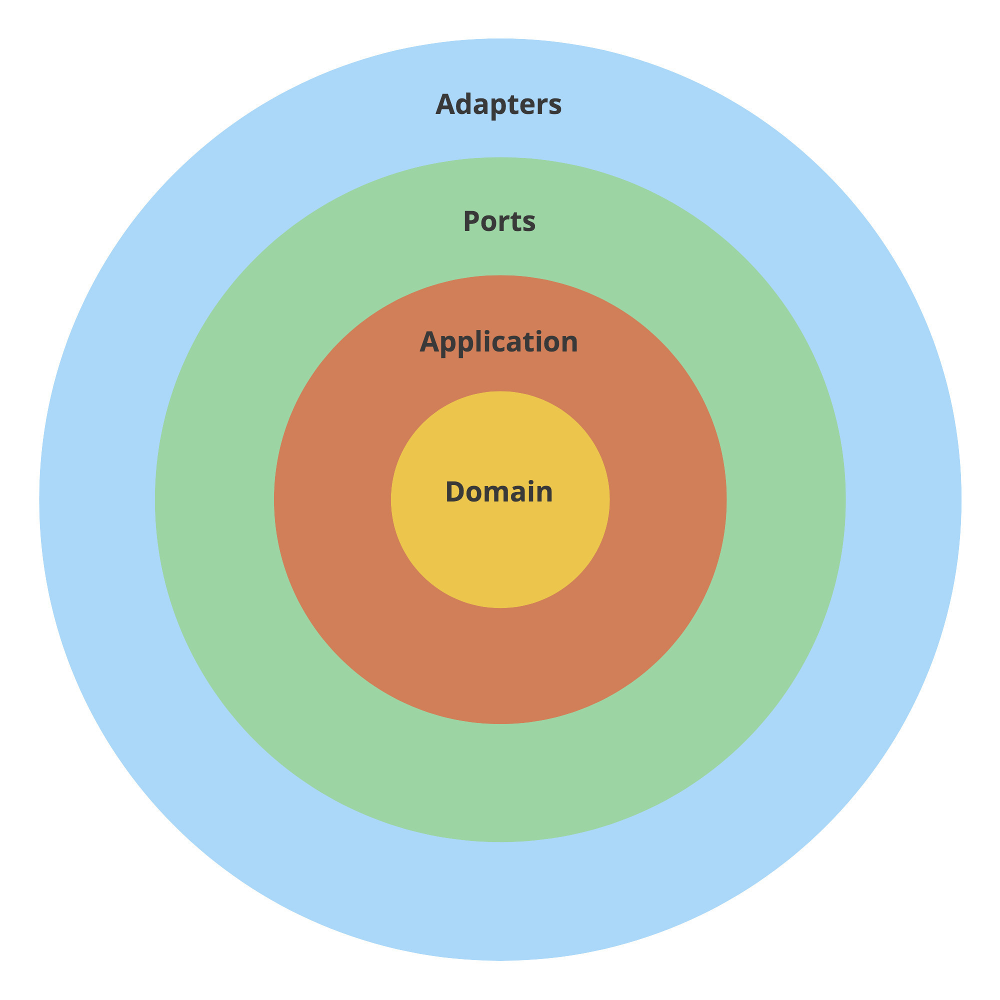
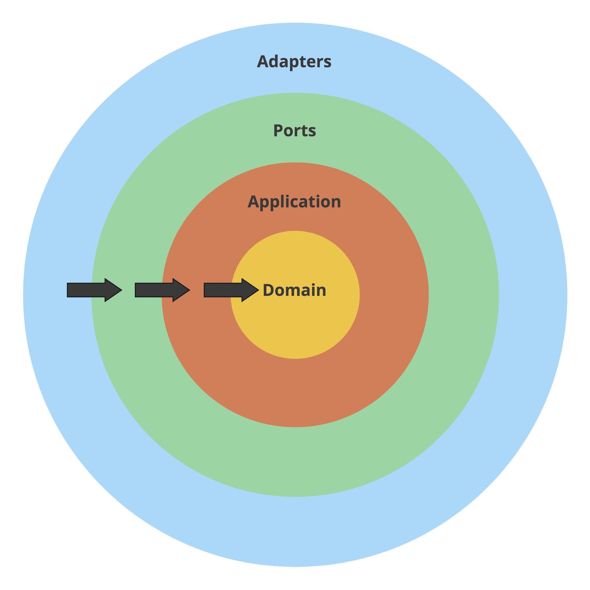

# Введение в чистую архитектуру путем рефакторинга проекта на Go

[Данная статья является переводом. Оригинал можно найти по ссылке](https://threedots.tech/post/introducing-clean-architecture/)

Милош Смолка. Технический руководитель [Karhoo](https://www.karhoo.com/). Соучредитель
[Three Dots Labs](https://threedotslabs.com/). Создатель [Watermill](https://github.com/ThreeDotsLabs/watermill).

Авторы [Accelerate](https://itrevolution.com/book/accelerate/) посвящают целую главу архитектуре программного обеспечения и 
тому, как она влияет на производительность разработки. Они часто упоминают 
создание «слабосвязанных» приложений.

> Цель состоит в том, чтобы ваша архитектура поддерживала способность
> команд выполнять свою работу — от проектирования до развертывания - без 
> необходимости частой коммуникации между командами.
> 
> [Accelerate](https://itrevolution.com/book/accelerate/)

> Если вы еще не читали [Accelerate](https://itrevolution.com/book/accelerate/), я очень рекомендую её. В книге представлены 
> научные данные о методах, обеспечивающих высокую производительность команд 
> разработчиков. Описываемый мной подход основан не только на нашем опыте, но 
> также упоминается в книге.

Хотя кажется, что связанность в основном касается микросервисов, разрабатываемых 
несколькими командами, мы считаем, что слабосвязанная архитектура не менее 
полезна для работы в команде. Соблюдение архитектурных стандартов делает 
возможной параллельную работу и помогает привлечь новых членов команды.

Вы, наверное, слышали о концепции _слабая связанность/сильная связность_, но 
редко бывает очевидно, как ее достичь. Хорошая новость в том, что это главное 
преимущество чистой архитектуры.

Этот шаблон проектирования — не только отличный способ начать проект, но и 
полезен при рефакторинге плохо спроектированного приложения. В этом посте я 
сосредоточусь на последнем. Я показываю рефакторинг реального приложения, 
поэтому должно быть понятно, как применить аналогичные изменения в ваших 
проектах.

Мы заметили и другие преимущества этого подхода:

* стандартная структура, поэтому легко сориентироваться в проекте,
* более быстрое развитие в долгосрочной перспективе,
* имитация зависимостей становится тривиальной в unit тестах,
* простой переход от прототипов к подходящим решениям (например, замена 
  хранилища в памяти на SQL базу данных).

## Чистая Архитектура

Мне было нелегко придумать название для этого поста, потому что существуют много разновидностей 
этого шаблона проектирования. Например, [чистая архитектура](https://blog.cleancoder.com/uncle-bob/2012/08/13/the-clean-architecture.html), 
[луковая архитектура](https://jeffreypalermo.com/2008/07/the-onion-architecture-part-1/), 
[шестиугольная архитектура](https://web.archive.org/web/20180822100852/http://alistair.cockburn.us/Hexagonal+architecture), 
а также порты и адаптеры.

Последние пару лет мы пытались использовать эти шаблоны в Go идиоматическим 
образом. Мы пробовали использовать некоторые подходы, терпели неудачу, изменяли
их и пытались снова.

Мы пришли к сочетанию вышеперечисленных идей, иногда не строго следуя исходным 
шаблонам, но мы обнаружили, что они хорошо работают в Go. Я покажу наш подход с 
рефакторингом нашего примера приложения [Wild Workouts](https://github.com/ThreeDotsLabs/wild-workouts-go-ddd-example).

Хочу отметить, что идея вовсе не нова. Большая часть этого — **абстрагирование 
от деталей реализации**, стандарт в технологии, особенно в программном 
обеспечении.

По другому это называется - **разделение интересов**. Эта концепция настолько 
устарела, что существует на нескольких уровнях. Существуют структуры, 
пространства имен, модули, пакеты и даже (микро) сервисы. Все предназначено для
удержания связанных вещей в определенных границах. Иногда это кажется здравым смыслом:

* Если вам нужно оптимизировать SQL-запрос, вы не хотите рисковать изменением формата отображения.

* Если вы изменяете формат HTTP ответа, вы не захотите изменять схему базы данных.

**Наша методика использования чистой архитектуры состоит из двух объединенных 
идей:** разделения портов и адаптеров и ограничения того, как структуры кода 
соотносятся друг с другом.

> Это не просто очередная статья со случайными фрагментами кода.
>
> Этот пост является частью большого цикла, показывающий как создавать приложения на
> **Go, которые легко разрабатывать, поддерживать и с ними интересно работать в
> долгосрочной перспективе**. Мы делаем это, делясь проверенными методами, основанными
> на многих экспериментах, проведёнными с возглавляемыми нами с командами,
> и [научных исследованиях](https://threedots.tech/post/ddd-lite-in-go-introduction/#thats-great-but-do-you-have-any-evidence-it-works).
> Вы можете изучить эти методы, создав с нами [полнофункциональный](https://threedots.tech/post/serverless-cloud-run-firebase-modern-go-application/#what-wild-workouts-can-do) пример
> веб-приложения на Go - **Wild Workouts**.
>
> Мы поступили не совсем обычно — **добавили некоторые не сразу заметные проблемы
> в первоначальную реализацию Wild Workouts**. Неужели мы сошли с ума? Пока нет. 😉
> Эти проблемы характерны для многих проектов Go. **В долгосрочной перспективе эти
> небольшие проблемы становятся критичными и не позволяют добавлять новые функционал.**
>
> **Это один из важнейших навыков старшего или ведущего разработчика; всегда нужно
> помнить о долгосрочных последствиях.**
>
> Мы исправим их путем **рефакторинга** Wild Workouts. Таким образом, вы быстро поймёте
> методики, которыми мы делимся.
> Знаете ли вы это чувство, когда прочитали статью о какой-то методике и попытались
> реализовать её, но не смогли из-за упущений и пропуска деталей в руководстве.
> Пропуск деталей делает статьи короче и увеличивает просмотры страниц, но это
> не наша цель. Наша цель — создать материал, который даст достаточно знаний для
> применения представленных методик. Если вы еще не читали [предыдущие статьи из
> этого цикла](https://threedots.tech/series/modern-business-software-in-go/),
> мы настоятельно рекомендуем это сделать.
>
> Мы считаем, что в некоторых областях знаний нельзя пропускать детали. Если вы
> хотите быстро и эффективно создавать сложные приложения, вам нужно потратить
> некоторое время, чтобы узнать как это сделать. Если бы всё было так просто,
> у нас бы не было такого большого количества устрашающего устаревшего кода.
>
> Вот [полный список из 14 опубликованных на данный момент статей](https://threedots.tech/series/modern-business-software-in-go/).
>
> Весь код Wild Workouts доступен на [GitHub](https://github.com/ThreeDotsLabs/wild-workouts-go-ddd-example). Не забудьте поставить звезду
> нашему проекту! ⭐

## Прежде, чем мы начнём

Перед тем, как представить чистую архитектуру в Wild Workouts, я немного 
переработал проект. Изменения происходят благодаря шаблонам, которые мы ввели
в предыдущих статьях.

Первое - это использование отдельных моделей для сущностей баз данных и 
HTTP-ответов. В своём [посте о принципе DRY](https://threedots.tech/post/things-to-know-about-dry/)
я внёс изменения в сервис `user`. Теперь я воспользовался этим же шаблоном в 
сервисах `trainer` и `trainings`. Смотри [весь коммит на Github](https://github.com/ThreeDotsLabs/wild-workouts-go-ddd-example/commit/e48fbc3d2324da887415bd91918d5e46ebfd5baf).

Второе изменение касается **шаблона репозитория**, который Роберт представил в 
[предыдущей статье](https://threedots.tech/post/repository-pattern-in-go/). [Мой рефакторинг](https://github.com/ThreeDotsLabs/wild-workouts-go-ddd-example/commit/f89da08cc3c1c7ed8e7767415b04e87d3a5ef9cf) перенес код, связанный с базой данных, в 
trainings в отдельную структуру.

## Разделение портов и адаптеров

Порты и адаптеры можно называть по-разному, например, интерфейсами и инфраструктурой. 
Идея состоит в том, чтобы явно отделить эти две категории от остальной части 
кода вашего приложения.

Код в этих группах мы размещаем в разных пакетах и называем их "слоями". **Обычно
мы используем следующие слои: адаптеры, порты, приложение и предметная область.**

> **Прочтите это, если знаете гексагональную архитектуру**
>
> Возможно, вас смущают названия порты и адаптеры. Мы напортачили и выбрали 
> одинаковые названия для разных вещей (даже если они хорошо подходят).
> 
> * Наши **порты** называются **первичными адаптерами** в гексагональной архитектуре
> * Наши **адаптеры** называются **вторичными адаптерами** в гексагональной архитектуре
> 
> Идея осталась прежней. Мы считаем что слова первичный/вторичный усложняют 
> понимание, поэтому используйте, то которое лучше вам подходит. Вы можете 
> использовать шлюзы, точки входа, интерфейсы, инфраструктуру и так далее. Просто
> убедитесь, что все определения согласованы и ваша команда знает, что где 
> используется.
> 
> Что с оригинальными портами? Благодаря неявным интерфейсам Go мы не видим 
> смысла хранить их в отдельном слое. Мы храним интерфейсы непосредственно там,
> где они используются (смотри код ниже).

* **С помощью адаптера ваше приложение общается с внешним миром.** Вы должны адаптировать 
  свои внутренние структуры в соответствии с тем, что ожидает внешний API. Подумайте SQL 
  о запросах, HTTP или gRPC клиентах, средствах чтения и записи файлов, издатель 
  сообщений в шаблоне Издатель/Подписчик.

* **Порт — это вход вашего приложения**, и это единственный способ, с помощью 
  которого внешний мир может к нему достучаться. Это может быть HTTP или gRPC 
  сервер, команда интерфейса командной строки или подписчик сообщений в шаблоне 
  Издатель/Подписчик.

* **Логика приложения** - это тонкий слой, который "склеивает" другие слои. Он также 
  называется "сценариями использования". Если вы читаете код сценария и не 
  можете определить какую базу данных он использует или какой URL-адрес вызывает, 
  это хороший знак. Иногда они очень короткие и это нормально. Думайте о нём как об 
  управляющем.

* Если вы используете [предметно-ориентированное проектирование](https://threedots.tech/post/ddd-lite-in-go-introduction/), вы можете 
  ввести **уровень предметной области, который содержит только бизнес-логику.**
  
> Если идея разделения слоев все еще не ясна, взгляните на свой смартфон. 
> Если задуматься, в нем тоже используются похожие концепции.
> 
> Вы можете управлять своим смартфоном с помощью физических кнопок, сенсорного 
> экрана или голосового помощника. Независимо от того, нажимаете ли вы кнопку 
> «увеличить громкость», проводите пальцем по шкале громкости вверх или 
> говорите «Siri, громкость выше», эффект будет одинаковым. Есть несколько 
> точек входа (**портов**) в **логике** «изменения громкости».
> 
> Когда вы включаете музыку, вы можете слышать ее из динамика. Если вы 
> подключите наушники, звук автоматически переключится на них. Вашему 
> музыкальному приложению все равно. Он не обращается напрямую к оборудованию, 
> а использует один из **адаптеров**, предоставляемых ОС.
> 
> Можете ли вы представить себе мобильного приложения, которое должно знать 
> модель наушников, подключенных к смартфону? Добавление SQL-запросов непосредственно
> в логику приложения аналогично этому: оно раскрывает детали реализации.



Приступим к рефакторингу с введения слоев в сервисе trainings. Пока проект 
выглядит так:

```shell
trainings/
├── firestore.go
├── go.mod
├── go.sum
├── http.go
├── main.go
├── openapi_api.gen.go
└── openapi_types.gen.go
```

Эта часть рефакторинга проста:

1. Создайте каталоги `ports`, `adapters` и `app`.
2. Переместите каждый файл в соответствующий каталог.

```shell
trainings/
├── adapters
│   └── firestore.go
├── app
├── go.mod
├── go.sum
├── main.go
└── ports
    ├── http.go
    ├── openapi_api.gen.go
    └── openapi_types.gen.go
```

Подобные пакеты я ввел в сервис `trainer`. В этот раз мы не будем вносить 
никаких изменений в сервис `users`. Там нет логики приложения, да и в целом 
он небольшой. Как и в случае с любой другой методикой, применяйте чистую 
архитектуру там, где это имеет смысл.

> Если проект будет разрастаться, будет полезно добавить ещё один уровень 
> каталогов. Например, `adapters/hour/mysql_repository.go` или 
> `ports/http/hour_handler.go`.

Вы, наверное, заметили, что в пакете `app` нет файлов. Теперь нам нужно 
извлечь логику приложения из HTTP обработчиков.

## Слой приложения

Посмотрим, где находится логика нашего приложения. Взгляните на метод 
`CancelTraining` в сервисе `trainings`.

```go
func (h HttpServer) CancelTraining(w http.ResponseWriter, r *http.Request, trainingUUID string) {
    trainingUUID = r.Context().Value("trainingUUID").(string)
  
    user, err := auth.UserFromCtx(r.Context())
    if err != nil {
        httperr.Unauthorised("no-user-found", err, w, r)
        return
    }
  
    err = h.db.CancelTraining(r.Context(), user, trainingUUID)
    if err != nil {
        httperr.InternalError("cannot-update-training", err, w, r)
        return
    }
}
```
Весь исходный код: [github.com/ThreeDotsLabs/wild-workouts-go-ddd-example/internal/trainings/http.go](https://github.com/ThreeDotsLabs/wild-workouts-go-ddd-example/blob/f89da08cc3c1c7ed8e7767415b04e87d3a5ef9cf/internal/trainings/http.go#L95)

Этот метод является точкой входа в приложение. Здесь не так много логики, поэтому 
давайте углубимся в метод `db.CancelTraining`.


Внутри Firestore транзакции много кода, не относящегося к работе с базой данных.

Что еще хуже, реальная логика приложения внутри этого метода использует модель 
базы данных (`TrainingModel`) для принятия решений:

```go
if training.canBeCancelled() {
    // ...
} else {
    // ...
}
```
Весь исходный код: [github.com/ThreeDotsLabs/wild-workouts-go-ddd-example/internal/trainings/firestore.go](https://github.com/ThreeDotsLabs/wild-workouts-go-ddd-example/blob/f89da08cc3c1c7ed8e7767415b04e87d3a5ef9cf/internal/trainings/firestore.go#L133)

Смешение бизнес-правил (например, когда тренировка может быть отменена) с 
моделью базы данных замедляет разработку, так как код становится трудным для 
понимания и размышлений. Такую логику тоже сложно проверить.

Чтобы исправить это, мы добавляем промежуточный тип `Training` в слой 
приложения:

```go
type Training struct {
    UUID     string
    UserUUID string
    User     string
  
    Time  time.Time
    Notes string
  
    ProposedTime   *time.Time
    MoveProposedBy *string
}

func (t Training) CanBeCancelled() bool {
    return t.Time.Sub(time.Now()) > time.Hour*24
}

func (t Training) MoveRequiresAccept() bool {
    return !t.CanBeCancelled()
}
```
Весь исходный код: [github.com/ThreeDotsLabs/wild-workouts-go-ddd-example/internal/trainings/app/training.go](https://github.com/ThreeDotsLabs/wild-workouts-go-ddd-example/blob/e98630507809492b16496f4370dd26b1d26220d3/internal/trainings/app/training.go#L5)

Теперь сразу должно быть понятно, когда тренировку можно отменить. Мы не можем 
сказать, как тренировка хранится в базе данных или в формате JSON, используемом в 
HTTP API. Это хороший знак.

Теперь мы можем обновить методы в слое базы данных, чтобы они возвращали 
этот универсальный тип приложения вместо структуры, зависящей от базы данных 
(`TrainingModel`). Отображение тривиально, потому что структуры имеют одинаковые 
поля (но с этого момента они могут развиваться независимо друг от друга).

```go
t := TrainingModel{}
if err := doc.DataTo(&t); err != nil {
    return nil, err
}

trainings = append(trainings, app.Training(t))
```
Весь исходный код: [github.com/ThreeDotsLabs/wild-workouts-go-ddd-example/internal/trainings/adapters/trainings_firestore_repository.go](https://github.com/ThreeDotsLabs/wild-workouts-go-ddd-example/blob/e98630507809492b16496f4370dd26b1d26220d3/internal/trainings/adapters/trainings_firestore_repository.go#L77)

## Сервис приложения

Затем мы создаем структуру `TrainingsService` в пакете `app`, которая будет 
служить точкой входа в логику приложения `trainings`.

```go
type TrainingService struct {
}

func (c TrainingService) CancelTraining(ctx context.Context, user auth.User, trainingUUID string) error {

}
```

Итак, как нам теперь вызвать базу данных? Давайте попробуем воспроизвести то, 
что использовалось до сих пор в HTTP обработчике.

```go
type TrainingService struct {
    db adapters.DB
}

func (c TrainingService) CancelTraining(ctx context.Context, user auth.User, trainingUUID string) error {
    return c.db.CancelTraining(ctx, user, trainingUUID)
}
```

Однако этот код не компилируется.

```shell
import cycle not allowed
package github.com/MaksimDzhangirov/three-dots/part9/internal/trainings
        imports github.com/MaksimDzhangirov/three-dots/part9/internal/trainings/adapters
        imports github.com/MaksimDzhangirov/three-dots/part9/internal/trainings/app
        imports github.com/MaksimDzhangirov/three-dots/part9/internal/trainings/adapters
```

Нам нужно **решить, как слои должны ссылаться друг на друга.**

## Принцип инверсии зависимостей

Четкое разделение портов, адаптеров и логики приложения полезно само по себе. 
Чистая архитектура еще больше улучшает её с помощью инверсии зависимостей.

Принцип гласит, что **внешние слои (детали реализации) могут ссылаться на 
внутренние слои (абстракции), но не наоборот.** Вместо этого внутренние слои 
должны зависеть от интерфейсов.

* **Предметная область** вообще ничего не знает о других слоях. Он содержит 
  только бизнес-логику.
* **Приложение** может импортировать предметную область, но ничего не знает о 
  внешних слоях. **Оно не знает, вызывается ли оно HTTP-запросом, обработчиком 
  Издатель/Подписчик или CLI командой.**
* **Порты** могут импортировать внутренние слои. Порты — это точки входа в 
  приложение, поэтому они часто запускают сервисы или команды приложения. Однако 
  у них нет прямого доступа к **адаптерам**.
* **Адаптеры** могут импортировать внутренние слои. Обычно они работают с типами из 
  слоёв **Приложение** и **Предметная область**, например, извлекая их из базы 
  данных.
  


Опять же, это не новая идея. **Принцип инверсии зависимостей — буква «D» в 
[SOLID](https://en.wikipedia.org/wiki/SOLID).** Думаете он применим только к ООП?
Так уж получилось, что [Go интерфейсы идеально подходят для этого](https://dave.cheney.net/2016/08/20/solid-go-design).

Этот принцип решает проблему как пакеты должны ссылаться друг на друга. Наилучшее решение 
редко бывает очевидным, особенно в Go, где циклический импорт запрещен.
Возможно, поэтому некоторые разработчики утверждают, что лучше избегать 
«вложенности» и хранить весь код в одном пакете. **Но пакеты существуют по какой-то 
причине, и этой причиной является разделение разных по смыслу понятий.**

Возвращаясь к нашему примеру, как мы должны ссылаться на слой базы данных?

Поскольку Go интерфейсы не нужно реализовывать явно, мы можем **определить их 
рядом с кодом, который в них нуждается.**

Таким образом, сервис приложения утверждает: _"Мне нужен способ отменить 
обучение с заданным UUID. Меня не волнует, как вы это делаете, но я верю, что 
вы сделаете это правильно, если реализуете этот интерфейс"_.

```go
type trainingRepository interface {
    CancelTraining(ctx context.Context, user auth.User, trainingUUID string) error
}

type TrainingService struct {
    trainingRepository trainingRepository
}

func (c TrainingService) CancelTraining(ctx context.Context, user auth.User, trainingUUID string) error {
    return c.trainingRepository.CancelTraining(ctx, user, trainingUUID)
}
```
Весь исходный код: [github.com/ThreeDotsLabs/wild-workouts-go-ddd-example/internal/trainings/app/training_service.go](https://github.com/ThreeDotsLabs/wild-workouts-go-ddd-example/blob/e98630507809492b16496f4370dd26b1d26220d3/internal/trainings/app/training_service.go#L13)

Метод базы данных вызывает gRPC-клиенты сервисов `trainer` и `users`. Это 
неподходящее место, поэтому мы введём два новых интерфейса, которые будет 
использовать сервис.

```go
type userService interface {
    UpdateTrainingBalance(ctx context.Context, userID string, amountChange int) error
}

type trainerService interface {
    ScheduleTraining(ctx context.Context, trainingTime time.Time) error
    CancelTraining(ctx context.Context, trainingTime time.Time) error
}
```
Весь исходный код: [github.com/ThreeDotsLabs/wild-workouts-go-ddd-example/internal/trainings/app/training_service.go](https://github.com/ThreeDotsLabs/wild-workouts-go-ddd-example/blob/e98630507809492b16496f4370dd26b1d26220d3/internal/trainings/app/training_service.go#L23)

> Обратите внимание, что "user" и "trainer" в данном контексте — это не 
> микросервисы, а понятия приложения (бизнеса). Так уж получилось, что в этом 
> проекте они находятся в рамках одноименных микросервисов.

Мы переносим реализации этих интерфейсов в адаптеры, которые называются
[UsersGrpc](https://github.com/ThreeDotsLabs/wild-workouts-go-ddd-example/blob/e98630507809492b16496f4370dd26b1d26220d3/internal/trainings/adapters/users_grpc.go#L9) 
и [TrainerGrpc](https://github.com/ThreeDotsLabs/wild-workouts-go-ddd-example/blob/e98630507809492b16496f4370dd26b1d26220d3/internal/trainings/adapters/trainer_grpc.go#L13). В качестве бонуса теперь также происходит 
преобразование метки времени, прозрачно для сервиса приложения.

## Извлекаем логику приложения

Код компилируется, но сервис вашего приложения пока мало что делает. Пришло 
время извлечь логику и поместить ее в нужное место.

Наконец, мы можем использовать шаблон функции обновления из [статьи о Репозиториях](https://threedots.tech/post/repository-pattern-in-go/),
чтобы извлечь логику приложения из репозитория.

```go
func (c TrainingService) CancelTraining(ctx context.Context, user auth.User, trainingUUID string) error {
    return c.repo.CancelTraining(ctx, trainingUUID, func(training Training) error {
        if user.Role != "trainer" && training.UserUUID != user.UUID {
            return errors.Errorf("user '%s' is trying to cancel training of user '%s'", user.UUID, training.UserUUID)
        }
  
        var trainingBalanceDelta int
        if training.CanBeCancelled() {
            // просто возвращаем кредит потраченный на тренировку
            trainingBalanceDelta = 1
        } else {
            if user.Role == "trainer" {
                // 1 за отмену тренировки, + 1 - пеня за отмену тренером менее, чем за 24 часа до тренировки
                trainingBalanceDelta = 2
            } else {
                // пеня за отмену тренировки менее, чем за 24 часа
                trainingBalanceDelta = 0
            }
        }
  
        if trainingBalanceDelta != 0 {
            err := c.userService.UpdateTrainingBalance(ctx, training.UserUUID, trainingBalanceDelta)
            if err != nil {
                return errors.Wrap(err, "unable to change trainings balance")
            }
        }
  
        err := c.trainerService.CancelTraining(ctx, training.Time)
        if err != nil {
            return errors.Wrap(err, "unable to cancel training")
        }
  
        return nil
    })
}
```
Весь исходный код: [github.com/ThreeDotsLabs/wild-workouts-go-ddd-example/internal/trainings/app/training_service.go](https://github.com/ThreeDotsLabs/wild-workouts-go-ddd-example/blob/e98630507809492b16496f4370dd26b1d26220d3/internal/trainings/app/training_service.go#L164)

Логика подсказывает, что когда-нибудь в будущем мы, возможно, захотим ввести 
слой предметной области. А пока оставим как есть.

Я описал процесс только для одного метода CancelTraining. Посмотрите на 
[отличия между версиями](https://github.com/ThreeDotsLabs/wild-workouts-go-ddd-example/commit/e98630507809492b16496f4370dd26b1d26220d3), чтобы узнать, как я отрефакторил другие методы.

## Внедрение зависимостей

Как сообщить сервису, какой адаптер использовать? Сначала мы определяем простой
конструктор для сервиса.

```go
func NewTrainingsService(
    repo trainingRepository,
    trainerService trainerService,
    userService userService,
) TrainingService {
    if repo == nil {
        panic("missing trainingRepository")
    }
    if trainerService == nil {
        panic("missing trainerService")
    }
    if userService == nil {
        panic("missing userService")
    }
  
    return TrainingService{
        repo:           repo,
        trainerService: trainerService,
        userService:    userService,
    }
}
```
Весь исходный код: [github.com/ThreeDotsLabs/wild-workouts-go-ddd-example/internal/trainings/app/training_service.go](https://github.com/ThreeDotsLabs/wild-workouts-go-ddd-example/blob/e98630507809492b16496f4370dd26b1d26220d3/internal/trainings/app/training_service.go#L38)

Затем в `main.go` внедряем адаптер.

```go
trainingsRepository := adapters.NewTrainingsFirestoreRepository(client)
trainerGrpc := adapters.NewTrainerGrpc(trainerClient)
usersGrpc := adapters.NewUsersGrpc(usersClient)

trainingsService := app.NewTrainingsService(trainingsRepository, trainerGrpc, usersGrpc)
```
Весь исходный код: [github.com/ThreeDotsLabs/wild-workouts-go-ddd-example/internal/trainings/main.go](https://github.com/ThreeDotsLabs/wild-workouts-go-ddd-example/blob/e98630507809492b16496f4370dd26b1d26220d3/internal/trainings/main.go#L39)

Использование в функции `main` - самый простой способ внедрения зависимостей.
Позже мы рассмотрим [библиотеку wire](https://github.com/google/wire), поскольку в будущих публикациях проект станет 
намного сложнее.

## Добавляем тесты

Изначально в проекте были смешаны все уровни и имитировать зависимости было 
невозможно. Единственный способ протестировать их — использовать интеграционные 
тесты с правильной базой данных и работающими сервисами.

Хотя в некоторых случаях можно использовать такие тесты, они, как правило, медленнее
и работать с ними не так приятно, как с unit тестами. После внесения изменений 
я смог [покрыть `CancelTraining` набором unit тестов](https://github.com/ThreeDotsLabs/wild-workouts-go-ddd-example/blob/e98630507809492b16496f4370dd26b1d26220d3/internal/trainings/app/training_service_test.go).

Я использовал стандартный для Go подход написания табличных тестов, чтобы все
тестируемые случаи были легкими для чтения и понимания.

```go
{
    Name:     "return_training_balance_when_trainer_cancels",
    UserRole: "trainer",
    Training: app.Training{
        UserUUID: "trainer-id",
        Time:     time.Now().Add(48 * time.Hour),
    },
    ShouldUpdateBalance:   true,
    ExpectedBalanceChange: 1,
},
{
    Name:     "extra_training_balance_when_trainer_cancels_before_24h",
    UserRole: "trainer",
    Training: app.Training{
        UserUUID: "trainer-id",
        Time:     time.Now().Add(12 * time.Hour),
    },
    ShouldUpdateBalance:   true,
    ExpectedBalanceChange: 2,
},
```
Весь исходный код: [github.com/ThreeDotsLabs/wild-workouts-go-ddd-example/internal/trainings/app/training_service_test.go](https://github.com/ThreeDotsLabs/wild-workouts-go-ddd-example/blob/e98630507809492b16496f4370dd26b1d26220d3/internal/trainings/app/training_service_test.go#L38)

Никаких библиотек для mocking я не использовал. Вы можете использовать их, 
если хотите, но ваши интерфейсы обычно должны быть достаточно маленькими, чтобы 
просто писать нужные mock.

```go
type trainerServiceMock struct {
    trainingsCancelled []time.Time
}

func (t *trainerServiceMock) CancelTraining(ctx context.Context, trainingTime time.Time) error {
    t.trainingsCancelled = append(t.trainingsCancelled, trainingTime)
    return nil
}
```
Весь исходный код: [github.com/ThreeDotsLabs/wild-workouts-go-ddd-example/internal/trainings/app/training_service_test.go](https://github.com/ThreeDotsLabs/wild-workouts-go-ddd-example/blob/e98630507809492b16496f4370dd26b1d26220d3/internal/trainings/app/training_service_test.go#L169)

Вы заметили необычно большое количество нереализованных методов в `repositoryMock`?
Это связано с тем, что мы используем единый сервис `training` для всех методов, 
поэтому нам нужно реализовать весь интерфейс, даже при тестировании только одного 
из них.

Мы реализуем их в нашем следующем [посте о CQRS](https://threedots.tech/post/basic-cqrs-in-go).

## Что насчёт повторяющихся частей кода?

Возможно вы спросите: не слишком ли много раз дублируется код? Размер проекта 
действительно увеличился в плане строк, но это само по себе ему не вредит. **Это
[вложение в слабую связанность](https://threedots.tech/post/things-to-know-about-dry/), 
которое окупится по мере роста проекта.**

Поначалу может показаться, что хранить все в одном пакете проще, но наличие 
границ помогает, когда вы рассматриваете работу в команде. Если все ваши 
проекты имеют одинаковую структуру, адаптация для новых членов команды пройдёт 
легко. Подумайте, насколько сложнее было бы, если бы все слои были смешаны 
([пакет приложения Mattermost](https://github.com/mattermost/mattermost-server/tree/master/app) 
является примером такого подхода).

## Обработка ошибок приложения

Еще одна вещь, которую я добавил, - это [ошибки, не зависящие от портов, с 
настраиваемыми slugs](https://github.com/ThreeDotsLabs/wild-workouts-go-ddd-example/blob/e98630507809492b16496f4370dd26b1d26220d3/internal/common/errors/errors.go). Они позволяют слою приложения возвращать обобщенные 
ошибки, которые могут обрабатываться как HTTP, так и gRPC обработчиками. 

```go
if from.After(to) {
    return nil, errors.NewIncorrectInputError("date-from-after-date-to", "Date from after date to")
}
```
Весь исходный код: [github.com/ThreeDotsLabs/wild-workouts-go-ddd-example/internal/trainer/app/hour_service.go](https://github.com/ThreeDotsLabs/wild-workouts-go-ddd-example/blob/e98630507809492b16496f4370dd26b1d26220d3/internal/trainer/app/hour_service.go#L29)

Вышеприведенная ошибка преобразуется в HTTP-ответ 400 Bad Request в портах. Она 
включает в себя slug, который можно преобразовать на фронтенде и показать 
пользователю. Это ещё одна методика, позволяющая избежать утечки деталей реализации
в логику приложения.

## Что еще?

Я рекомендую вам просмотреть [полную версию коммита](https://github.com/ThreeDotsLabs/wild-workouts-go-ddd-example/commit/e98630507809492b16496f4370dd26b1d26220d3), 
чтобы увидеть, как я реорганизовал другие части Wild Workouts.

Вам может быть интересно, как гарантировать правильное использование слоев? Это 
еще одна вещь, о которой нужно помнить при код ревью?

К счастью, это можно проверить с помощью статического анализа. Вы можете 
проверить свой проект с помощью линтера [go-cleanarch](https://github.com/roblaszczak/go-cleanarch) локально Роберта или 
включить его в свой CI конвейер.

После разделения на слои, мы готовы к введению более сложных шаблонов проектирования.

В следующий раз [Роберт](https://twitter.com/roblaszczak) покажет, как улучшить проект, применив CQRS.

Если вы хотите узнать больше о чистой архитектуре, прочитайте статью [Почему 
использование микросервисов или монолита может быть лишь незначительной 
деталью?](https://threedots.tech/post/microservices-or-monolith-its-detail/).