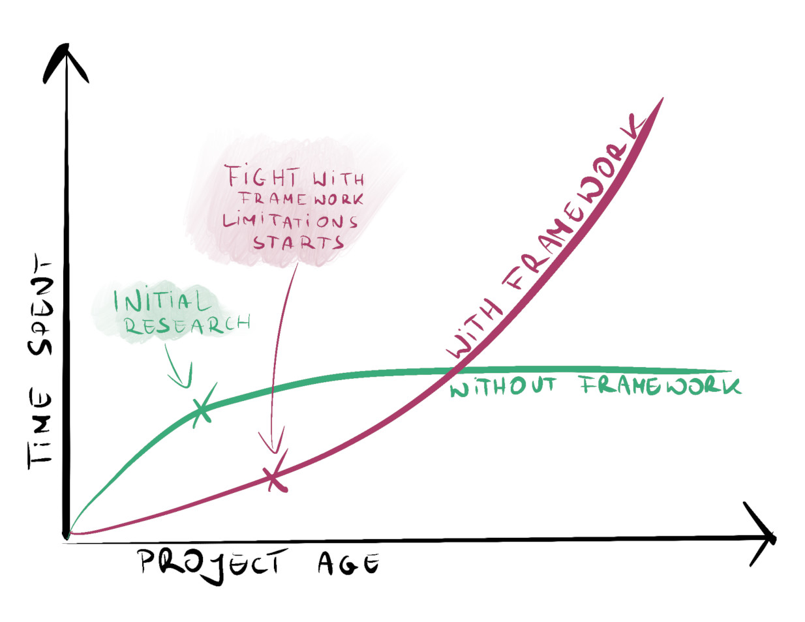

# Какой самый лучший Go фреймворк? - Не используйте фреймворки

[Данная статья является переводом. Оригинал можно найти по ссылке](https://threedots.tech/post/best-go-framework/)

Роберт Лащак. Главный инженер [SlashID](http://slashid.dev/). Соучредитель
[Three Dots Labs](https://threedotslabs.com/).
Создатель [Watermill](https://github.com/ThreeDotsLabs/watermill).

Во время написания этого блога и руководя командами разработчиков на Go в 
течение нескольких лет самым частым вопросом, который мне задавали новички, 
был: «Какой фреймворк мне следует использовать?». Худшее, что вы можете 
сделать в Go — это применять подходы из других языков программирования.

В других языках укоренились и получили признание фреймворки, которые принято
использовать «по умолчанию». В Java — это Spring, в Python — Django и Flask,
в Ruby — Rails, в C# — ASP.NET, в Node — Express, а в PHP — Symfony и 
Laravel. **В Go всё по-другому: здесь нет такого фреймворка «по умолчанию».**

Что ещё более интересно, многие предлагают вообще не использовать 
фреймворк. Они сумасшедшие?

*Реализация Go сервиса с помощью библиотек может напоминать создание монстра 
Франкенштейна*

## Философия Go

Фреймворки на Go существуют, но ни один из них не предоставляет такой 
набор функций, как фреймворки в других языках. Это изменится нескоро.

Вам может показаться, что это связано с тем, что экосистема Go моложе.
Но существует более веская причина. Go основан на философии Unix, которая 
гласит:

> * Пишите программы, которые делают что-то одно и делают это хорошо.
> * Пишите программы, которые бы работали вместе.
> * Пишите программы, которые бы поддерживали текстовые потоки, поскольку
> это универсальный интерфейс.

Эти философские принципы придумал Кен Томпсон, разработчик языка 
программирования B (предшественника C), а также... Go!

На практике философия Unix предполагает создание небольших независимых 
частей программного обеспечения, которые делают что-то одно хорошо, а не
больших программ, делающих всё сразу. Примером такого подхода могут быть
команды, запускаемые из вашего терминала. Например: `cat example.txt | 
sort | uniq.` `cat` читает текст из файла, `sort` сортирует строки, а 
`uniq` удаляет дубликаты. Все команды независимы и делают что-то одно.
Всё это следует из философии Unix. Благодаря такому принципу проектирования
вы можете независимо разрабатывать небольшие, автономные команды.

В Go философия Unix видна в стандартной библиотеке. Лучшими примерами 
являются самые распространенные интерфейсы: `io.Reader` и `io.Writer`.
Лучшие библиотеки также следуют этой философии.

Фреймворки созданы так, что не используют эту философские принципы. Часто
они пытаются охватить все возможные сценарии использования в рамках одного
фреймворка. Они не предназначены для работы с другими инструментами и 
часто код из них не может использоваться повторно. Это означает, что 
невозможно перенести созданный код на другие несовместимые фреймворки.
Если фреймворк редко используется (или вообще перестаёт поддерживаться) все
усилия, затраченные на написание кода, потрачены впустую.

## Что должно быть важно для вас

Каждое техническое решение имеет компромиссы. Выберите наиболее подходящее 
решение для вас и вашего проекта.

Некоторые подходы имеет смысл использовать, когда вам нужно проверить 
работоспособность какой-то идеи за один уик-энд и вы отказываетесь от неё
(вы же делаете так?). В этом случае наиболее важным фактором является то, 
насколько быстро вы сможете это сделать. Но если вы работаете над
долговременным проектом и создаёте его с помощью команды из нескольких 
человек, влияние такого решения огромно.

Для большинства проектов наиболее важными параметрами являются:

* насколько быстро вы можете начать проект,
* насколько быстро вы сможете развивать этот проект в долгосрочной 
  перспективе,
* насколько гибким для будущих изменений будет проект (это сильно 
  связано с предыдущим пунктом).

Давайте дадим оценку нашим решениям.

## Экономия времени

Одним из мнимых преимуществ, которые дают фреймворки, является экономия 
времени. Вы запускаете одну команду и получаете полностью работающий проект.
В фреймворках обычно существует, полюбившаяся его создателями, структура 
проекта и если вы не знаете как организовать проект, она может помочь.
Но, как и в случае с большинством других технических решений, за всё 
приходится платить.

Со временем, когда проект разрастется, вы быстро столкнетесь со стеной 
условностей и ограничений фреймворка. Требования к фреймворку у автора, 
вероятно, отличались от ваших. Решение, принятое создателем фреймворка, 
может хорошо работать для простых CRUD-приложений, но может не справляться 
с более сложными сценариями использования. **Легко быстро потерять всё 
время, сэкономленное на начальном развёртывании проекта, только на борьбу 
с одним ограничением фреймворка.** Со временем это может привести к большому 
разочарованию в вашей команде.

Пару лет назад я работал в компании, которая изначально начала проект,
используя один из фреймворков Go (название фреймворка опущу). Компания росла 
и создавала новые сервисы. Со временем нам было всё сложнее поддерживать 
более сложные варианты использования. Фреймворк также был источником 
серьёзных багов. К сожалению, избавиться от него было непросто.

В какой-то момент некоторые компоненты фреймворка перестали поддерживаться 
и стали несовместимы с остальной частью экосистемы. Мы были вынуждены 
избавиться от него. Фреймворк на тот момент уже стал сильно связан со всей
системой. Убрать его из десятков сервисов оказалось нетривиальной задачей.
Это потребовало межкомандной взаимодействия, на решение ушло несколько 
человеко-месяцев и возникло несколько инцидентов по ходу устранения. Даже
несмотря на то, что в итоге задача по удалению фреймворка была успешно 
выполнена, я не ощущал удовлетворения. **Всё затраченное время можно было 
бы использовать гораздо лучше, если бы кто-то раньше принял другое решение.
Вся задача по удалению была бы не нужна. Неудивительно, что многие 
компании страдают от недоверия к команде разработчиков.**

Это отличный пример того, как такое маленькое решение через пару лет может 
превратиться в дорогостоящий проект по спасению системы.

## Возможность легко поддерживать проект

Оценка возможности поддержки проекта — спорная тема — сложно сравнивать 
два проекта. Кто-то говорит, что фреймворки — это здорово, и у них нет
проблем при их использовании. Для других фреймворки могут стать самым 
большим кошмаром в долгосрочной перспективе. Некоторые проекты намного 
сложнее, чем другие. Многие считают, что борьба с фреймворком — это 
только часть работы. Вот почему трудно объективно оценить влияние 
фреймворков на возможность легко поддерживать проект.

К счастью, мы можем облегчить себе оценку, применив научный подход. А 
именно, воспользовавшись книгой _Accelerate: The Science of Lean Software 
and DevOps_ ([Ускоряйся! Наука DevOps. Как создавать и масштабировать высокопроизводительные цифровые организации](https://www.amazon.com/Accelerate-Software-Performing-Technology-Organizations/dp/1942788339)),
основанной на научных исследованиях. Книга посвящена выявлению характеристик
лучших и худших команд. Обратим внимание, что **слабосвязанная архитектура — 
один из важнейших факторов хорошей производительности.**

Команды, которыми я руководил, часто спрашивали меня, как узнать, 
является ли наша архитектура слабосвязанной. Один из самых простых способов
убедиться, что вы легко можете заменять или удалять части вашего приложения.
**Если при удалении части вашего приложения возникают трудности, ваше 
приложение сильно связано. Внесение изменений в какую-то часть приводит к 
эффекту домино в различных местах.**

Почему _слабосвязанная архитектура_ так важна? Давайте признаем, что все мы 
люди, и даже, проведя самых лучшие исследования, мы делаем ошибки. Если 
вы выберете неправильный фреймворк или библиотеку, их будет легко 
заменить, не переписывая весь проект. Если мы хотим сэкономить время, мы 
должны думать, что поможет нам в долгосрочной перспективе, а не только в 
начале проекта.

Рассмотрим ситуацию, когда вы хотите полностью избавиться от фреймворка. 
Потребуется ли для этого переписать большую часть кода? Можно ли сделать 
это независимо для нескольких сервисов? Если нет, приложите определенные
усилия и отделите фреймворк от вашей основной логики. Но для этого нужно 
пожертвовать «экономией времени», которую он дает в первую очередь.

## Альтернатива? Создавайте сервисы без использования фреймворков

Вам может показаться, что создание необходимых вам сервисов без 
фреймворка займет целую вечность. Особенно, если вы раньше писали на
других языках программирования. Это можно понять. У меня было такое же 
чувство пару лет назад, когда я начал писать на Go. Это был необоснованный
страх. Отсутствие фреймворка не означает, что вам нужно будет создавать всё
самостоятельно. Существует множество проверенных библиотек, предоставляющих
необходимый вам функционал.

Вам нужно приложить немного больше усилий для исследования необходимости
использования фреймворка. Вы читаете эту статью, значит, уже делаете это!
Даже пара часов исследований — это ничто по сравнению со сроком 
создания и эксплуатации проекта. Вы с лихвой окупите это время благодаря 
гибкости, которую даёт вам исследование.

Что делать, если вы решили не использовать фреймворк? Самым большим 
препятствием в начале может быть то, как вы создаете сервис. **Проще всего 
начать с того, что поместить всё в один файл. Вы можете начать с простого, 
отложить некоторые решения и со временем развивать свой проект.**

Полезно иметь под рукой примеры проектов, которые вы можете использовать 
в качестве справочного материала. Вы можете взглянуть на проект, который 
я создал за 15 минут — моё _приложение Let’s build, управляемое событиями, 
для презентации Watermill_ на [GoRemoteFest](https://www.youtube.com/watch?v=6Zgi5nUPf70) — 
[github.com/roblaszczak/goremotefest-livecoding](https://github.com/roblaszczak/goremotefest-livecoding).
Чтобы этот пример заработал потребовалось всего две внешние библиотеки.

Не стесняйтесь клонировать этот репозиторий и адаптировать его под свои 
нужды. Я уверен, что в этом примере нет всех библиотек, необходимых для 
вашего проекта. **Чтобы помочь вам с характерными сценариями использования, 
мы написали следующую статью со [списком библиотек Go, которые вы можете 
применять для создания своих Go сервисов](list-of-recommended-libraries.md).
Пользуемся им пару лет. В статье поясняется почему мы используем эти 
библиотеки и как узнать, хороша ли аналогичная приведенной в тексте
библиотека или плоха.**

Полезно изменять части вашего проекта, но так, чтобы при этом он оставался
работоспособным

Когда ваш проект станет более сложным, и вы уже будете знать, как 
ваши библиотеки работают вместе, можно приступить к его рефакторингу. В 
конце концов, вам может не понадобиться большинство функций 
фреймворка, которые казались критически важными. Благодаря этому ваш проект
может получиться более простым и меньше времени будет потрачено на 
исследования.

Если вам нужен пример того как могут выглядеть более сложные проекты, 
вам следует взглянуть на [Wild Workouts](https://github.com/ThreeDotsLabs/wild-workouts-go-ddd-example) — 
наш полностью рабочий пример проекта на Go. Мы опубликовали [бесплатную 
электронную книгу объёмом более 200 страниц](https://threedots.tech/go-with-the-domain/), 
описывающую, как мы создали это приложение.

## Резюме

Решение о том, как вы создаете сервисы, не должно приниматься «на скорую 
руку». Если вы примете неверное решение это может иметь очень негативное 
влияние на время, затрачиваемое на разработку, в долгосрочной перспективе.
Это негативно влияет на скорость вашей команды и, что более важно, на 
моральный дух.

Приняв неверное решение, вы можете быстро попасть в ловушку заблуждения о
неизбежных затратах. Вместо того чтобы становиться героями, которые 
решают возникшие благодаря им проблемы, мы должны избегать их создания.

Прочитав эту статьи вы узнали о компромиссах и последствиях каждого из 
подходов. Теперь вы можете принять ответственное решение. Я надеюсь, что 
эта статья поможет хотя бы одной компании избежать мучительной задачи по
рефакторингу проекта, которая займет пару человеко-месяцев.

Есть ли у вас какие-то поучительные истории, связанные с использованием
фреймворков (даже из другого языка программирования)? Расскажите нам о них
в комментариях!